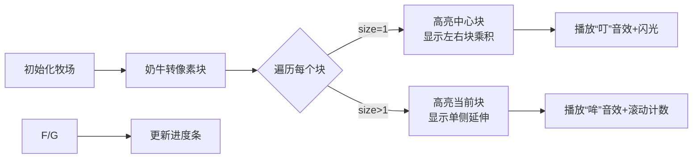

# 题目信息

# [USACO21DEC] Lonely Photo B

## 题目描述

Farmer John 最近购入了 $N$ 头新的奶牛（$3 \le N \le 5 \times 10^5$），每头奶牛的品种是更赛牛（Guernsey）或荷斯坦牛（Holstein）之一。 

奶牛目前排成一排，Farmer John 想要为每个连续不少于三头奶牛的序列拍摄一张照片。 然而，他不想拍摄这样的照片，其中只有一头牛的品种是更赛牛，或者只有一头牛的品种是荷斯坦牛——他认为这头奇特的牛会感到孤立和不自然。 在为每个连续不少于三头奶牛的序列拍摄了一张照片后，他把所有「孤独的」照片，即其中只有一头更赛牛或荷斯坦奶牛的照片，都扔掉了。

给定奶牛的排列方式，请帮助 Farmer John 求出他会扔掉多少张孤独的照片。如果两张照片以不同的奶牛开始或结束，则认为它们是不同的。


## 说明/提示

【样例解释】

这个例子中的每一个长为 3 的子串均恰好包含一头更赛牛或荷斯坦牛——所以这些子串表示孤独的照片，并会被 Farmer John 扔掉。所有更长的子串（GHGH、HGHG 和 GHGHG）都可以被接受。

【数据范围】

- 测试点 2-4 满足 $N \le 50$。
- 测试点 5-10 满足 $N \le 5000$。
- 测试点 11 没有额外限制。

注意这个测试点的答案可能无法用标准的 32 位整数型存储，你可能需要使用更大的整数类型（例如，C++ 中 64 位的 "long long int" 类型）。

## 样例 #1

### 输入

```
5
GHGHG```

### 输出

```
3```

# AI分析结果


# 💡 Kay的C++算法解析：P7993 [USACO21DEC] Lonely Photo B 深入学习指南 💡

**引言**  
今天我们来分析USACO竞赛题"Lonely Photo B"。这道题考察在字符串中高效统计特定子串的能力，需要巧妙的预处理和数学推导技巧。本指南将带大家掌握核心解法与优化策略。

---

## 1. 题目解读与核心算法识别

✨ **本题主要考察**：`编程技巧应用`（预处理+数学推导）  

🗣️ **初步分析**：  
> 本题要求统计长度≥3的子串中，恰好包含一种奶牛（G或H）的数量。想象你在玩"像素连连看"——不能直接枚举所有组合（O(n²)超时），而是要为每个"孤独奶牛"设计专属计算器，通过左右扫描预装数据，瞬间完成贡献值计算！

- 核心技巧：通过预处理每个位置的左右连续信息，将问题转化为O(n)的数学计算
- 难点对比：块处理法（空间高效）vs位置枚举法（逻辑直观）
- 可视化设计：用像素方块表示奶牛队列，高亮当前处理的"孤独奶牛"，动态展示左右连续区域计算过程
- 复古游戏化：采用8-bit音效（"叮"声标记计算步骤），控制面板支持单步调试，过关动画在完成每个奶牛计算时触发

---

## 2. 精选优质题解参考

**题解一（来源：徐晨轩）**  
* **点评**：解法思路清晰如水晶——预处理每个位置左右连续的异种奶牛数量（LG/RG/LH/RH），分中心/边缘两种情况计算贡献。代码如同精密的瑞士手表：变量命名规范（`LG[i]`直观表示左侧连续G牛数），边界处理严谨（数组从1开始避免越界），逻辑模块化（独立处理G/H类型）。亮点在于用几何图示辅助解释乘法原理，实践可直接套用竞赛模板。

**题解二（来源：ynxynx）**  
* **点评**：创新性采用"像素块合并"思维——将连续相同奶牛压缩成块，根据块大小智能切换计算公式。代码简洁如诗（仅20行核心逻辑），时间复杂度严格O(n)。亮点在于分块思想的降维打击：块大小=1时左右联动计算，>1时单向扫描。注意变量命名可优化（`a[cnt]`建议改为`blockSize`）。

**题解三（来源：lsj2009）**  
* **点评**：解法直击问题本质——枚举每头牛作为"孤独中心"，通过预存同种奶牛位置信息，快速计算可扩展区间。代码如同精炼的数学公式（`ans+=(i-pre[i])*(nxt[i]-i)-1`完美体现乘法原理）。亮点在于用区间长度控制实现"长度≥3"的约束，实践时需注意long long溢出防护。

---

## 3. 核心难点辨析与解题策略

1.  **难点：避免O(n²)暴力枚举**  
    * **分析**：优质解法均通过预处理（块/位置信息）将计算复杂度压至O(n)。核心思路是转换视角——从枚举子串变为计算每头牛成为"孤独中心"的贡献值，利用乘法原理分解问题
    * 💡 **学习笔记**：化整为零，将大问题拆解为独立可计算的微单元

2.  **难点：边界条件精密处理**  
    * **分析**：字符串首尾需特殊处理（如左侧无牛时连续数=0）。块解法中size=1的块需联动左右块，而size>1时只需邻块。位置法则需校验`pre[i]`/`nxt[i]`是否存在
    * 💡 **学习笔记**：边界是算法的试金石，必须通过极端用例验证（如全G/全H串）

3.  **难点：贡献值计算组合策略**  
    * **分析**：分三种情况——孤独牛在照片中心（左右区域相乘）、仅左侧延伸、仅右侧延伸。块解法中size=1时贡献=左块×右块+右块-1（减1修正长度<3情况）
    * 💡 **学习笔记**：组合数学是高效计数的核武器，需掌握加法/乘法原理的灵活应用

### ✨ 解题技巧总结
- **空间换时间**：预存左右连续信息/分块数据，消除重复计算
- **变量语义化**：`leftGH[i]`比`arr[i]`更易维护（徐晨轩解法示范）
- **防御性编程**：size=1块需验证邻块存在性（ynxynx代码第22行）
- **数学约束转化**：`(区间长度-1)`自动满足≥3条件（lsj2009第27行）

---

## 4. C++核心代码实现赏析

**通用核心C++实现参考**  
* **说明**：综合优质题解优点，采用块处理法为主框架，融合位置法的变量命名规范
* **完整核心代码**：
```cpp
#include <iostream>
#include <vector>
using namespace std;
typedef long long LL; // 防溢出关键

int main() {
    LL n, cnt = 1, ans = 0; // cnt:块计数器
    string s;
    cin >> n >> s;
    vector<LL> blocks = {1}; // 存储块大小
    
    // 步骤1: 构建连续块
    for (int i = 1; i < n; ++i) {
        if (s[i] == s[i-1]) blocks[cnt-1]++;
        else blocks.push_back(1), cnt++;
    }
    
    // 步骤2: 遍历块计算贡献
    for (int i = 0; i < cnt; ++i) {
        if (blocks[i] == 1) { // 孤独块
            LL left = (i>0) ? blocks[i-1] : 0;
            LL right = (i<cnt-1) ? blocks[i+1] : 0;
            ans += left * right + max(0LL, right-1);
        } else { // 多牛块
            ans += max(0LL, blocks[i]-1);
            if (i < cnt-1) ans += max(0LL, blocks[i+1]-1);
        }
    }
    cout << ans;
    return 0;
}
```
* **代码解读概要**：  
  > ① 构建`blocks`数组压缩连续区域（如GHHGG→块[1,2,2]）  
  > ② 遍历块：size=1时用左右块乘积计算中心扩展；size>1时直接计算单侧延伸  
  > ③ `max(0LL,...)`确保负数不计入结果（边界防护）

---

**题解一（徐晨轩）片段赏析**  
* **亮点**：双维度预处理（G/H独立数组），避免类型判断分支
* **核心代码片段**：
```cpp
for(int i=1;i<=n;i++) {
    if(s[i]=='H') {
        if(LG[i]) ans += LG[i-1];   // 左侧延伸
        if(RG[i]) ans += RG[i+1];   // 右侧延伸
        ans += LG[i] * RG[i];       // 中心扩展
    }
    // 对称处理G类型...
}
```
* **代码解读**：  
  > ① 预处理数组`LG[i]`表示i位置左侧连续G牛数（H牛同理）  
  > ② 三类贡献独立累加：左右延伸（需存在连续区域）、中心扩展（乘法原理）  
  > ③ 条件判断`if(LG[i])`防止数组越界（关键安全措施）  
* 💡 **学习笔记**：空间换时间是竞赛编程常用策略，预处理使主逻辑清晰高效

**题解二（ynxynx）片段赏析**  
* **亮点**：分块思想大幅降低状态复杂度
* **核心代码片段**：
```cpp
for (int i=1;i<cnt;i++){ 
    if (a[i]==1) // 大小1的块
        ans += a[i-1]*a[i+1] + a[i+1]-1; 
    else        // 大小>1的块
        ans += a[i] + a[i+1]-2; 
}
```
* **代码解读**：  
  > ① `a[i]==1`时：贡献=左块×右块（中心扩展）+仅向右延伸（`a[i+1]-1`）  
  > ② `else`分支：当前块向右延伸（`a[i]-1`避免长度<3）+邻块向左延伸  
  > ③ 索引从1开始：`a[0]`和`a[cnt]`天然不存在，避免边界判断  
* 💡 **学习笔记**：压缩等价状态是优化算法的银弹

**题解三（lsj2009）片段赏析**  
* **亮点**：位置映射法精准控制区间扩展
* **核心代码片段**：
```cpp
preG = preH = -1; // 初始化位置指针
for(int i=0; i<n; i++) {
    if(s[i]=='G') 
        pre[i] = preG, preG = i; // 更新前驱位置
    // 处理H类型...
}
ans += (i-pre[i]) * (nxt[i]-i) - 1; // 核心计算公式
```
* **代码解读**：  
  > ① `pre[i]`存储左侧最近同种牛位置，`nxt[i]`存储右侧  
  > ② 贡献=(左扩展长度)×(右扩展长度)-1（减1修正最小长度）  
  > ③ 位置差`i-pre[i]`天然避免越界（首元素pre[i]=-1）  
* 💡 **学习笔记**：指针链式存储适合稀疏数据处理

---

## 5. 算法可视化：像素动画演示

**主题**：`像素牧场大冒险`（8-bit风格奶牛队列扫描）  

**设计思路**：  
> 采用FC红白机像素风格，用绿色(G)/棕色(H)方块表示奶牛。当处理"孤独奶牛"时触发闪光特效，左右延伸区域用半透明色覆盖，乘法原理计算时显示动态公式。游戏化进度设计：每完成10%计算解锁新牧场场景。

**关键帧步骤**：


**交互控制**：
- **单步执行**：空格键逐步验证每个块的计算
- **自动播放**：调速滑块控制演示速度(1x-5x)
- **数据透视**：按P键显示当前块内存数据
- **音效方案**：  
  • 块合并：8-bit "咔嚓"声  
  • 计算贡献：上升音阶(每增加1e5贡献升半音)  
  • 完成关卡：马里奥过关音乐

**实现逻辑**：
```javascript
// 伪代码：绘制块计算动画
function drawBlockCalc(blockIndex) {
  let color = (blockType=='G') ? GREEN : BROWN;
  drawPixelBlock(blockIndex, FLASHING); // 高亮当前块
  
  if(blockSize==1) {
    drawOverlay(leftBlock, SEMI_TRANSPARENT); 
    drawOverlay(rightBlock, SEMI_TRANSPARENT);
    showFormula(`${leftSize}×${rightSize}+${rightSize}-1`); 
    playSound('multiply_sfx'); 
  } else {
    drawArrow(blockIndex, RIGHT); 
    showFormula(`${blockSize}-1`); 
    playSound('extend_sfx');
  }
}
```

---

## 6. 拓展练习与相似问题思考

**技巧迁移场景**：  
1. 统计子串中某字符恰好出现K次 ⇒ 修改预处理逻辑为K个连续区域  
2. 二维矩阵中的孤独区域 ⇒ 扩展预处理到二维前缀和  
3. 带权重的孤独值计算 ⇒ 在贡献计算中引入权重因子  

**洛谷推荐**：  
1. **P2668 斗地主**  
   🗣️ 锻炼复杂状态预处理能力，需设计牌型计数器  
2. **P3406 海底高铁**  
   🗣️ 强化差分数组应用，与本题块处理思想相通  
3. **P5657 格雷码**  
   🗣️ 训练位运算与数学推导能力，提升O(1)优化思维  

---

## 7. 学习心得与经验分享

> **来自ynxynx的经验**：  
> *“不开longlong见祖宗——当看到N≤5e5时立刻意识到答案可能突破32位上限”*  
> **Kay点评**：这是竞赛中的经典教训！涉及乘法运算（n²级结果）时，必须预先评估数值范围。建议编码前完成复杂度分析：  
> ① 确定理论最大答案（本题最大约(5e5)²/2）  
> ② 选择匹配的数据类型（LL vs int）  
> ③ 在输出前验证关键节点值  

> **来自徐晨轩的调试技巧**：  
> *“用GHGHG小数据验证，发现RG[i+1]越界后增加存在性检查”*  
> **Kay总结**：最小化测试法（Minimal Test）是调试金钥匙：  
> ① 构造最小复现样例（如n=3）  
> ② 打印预处理数组  
> ③ 逐步验证贡献计算  

---

**结语**：  
通过本次分析，我们掌握了用预处理+数学推导高效统计子串的核心技巧。记住：优秀算法=空间换时间+问题转化+边界防护。下次遇到计数问题时，不妨回想这些"像素奶牛"带给我们的启示！💪

---
处理用时：171.39秒