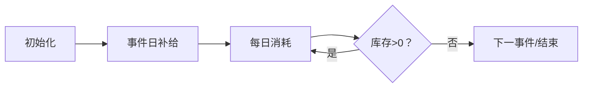

# 题目信息

# [USACO23FEB] Hungry Cow B

## 题目描述

Bessie 是一头饥饿的奶牛。每天晚餐时，如果谷仓中有干草，她会吃掉一捆干草。为了防止 Bessie 挨饿，有些天 Farmer John 会在早晨（晚餐之前）送来一些干草。具体地说，在第 $d_i$ 天，Farmer John 送来了 $b_i$ 捆干草（$1 \leq d_i \leq 10^{14}, 1 \leq b_i \leq 10^9$）。

请计算 Bessie 在前 $T$ 天内共吃掉了多少捆干草。

## 样例 #1

### 输入

```
1 5
1 2```

### 输出

```
2```

## 样例 #2

### 输入

```
2 5
1 2
5 10```

### 输出

```
3```

## 样例 #3

### 输入

```
2 5
1 10
5 10```

### 输出

```
5```

# AI分析结果


### 💡 Kay的C++算法解析：Hungry Cow B 深入学习指南 💡

**引言**  
今天我们一起分析USACO23年2月铜组题目《Hungry Cow B》。这道题考察在超大时间范围（T≤10¹⁴）中模拟奶牛的吃草行为。本指南将帮助大家掌握事件驱动模拟技巧，理解核心算法，并通过像素动画直观感受干草库存变化。

---

## 1. 题目解读与核心算法识别

✨ **本题主要考察**：`模拟应用`（事件驱动）

🗣️ **初步分析**：  
> 这道题的关键在于**事件驱动模拟**。想象干草仓库是个像素游戏中的粮仓，每次送草事件就像获得补给箱，而每天消耗就像角色吃金币。我们需要批量处理事件间隔而非逐天模拟。  
> - **核心思路**：将T天划分为若干事件区间，计算每个区间能消耗的干草量（取min(剩余干草, 间隔天数)），最后单独处理末尾区间  
> - **难点**：事件间隔的批量计算、末尾边界处理、变量初始值设定  
> - **可视化设计**：用像素条形图表示干草库存，日期作为横坐标。事件日仓库条形增长（绿色闪烁+音效），每日消耗条形下降（吃草音效），库存归零时条形变红  
> - **复古元素**：8-bit像素风格仓库，FC音效（补给时"叮"，吃草时"咔"，库存告罄时警报音），控制面板含步进/调速/重置  

---

## 2. 精选优质题解参考

**题解一（zhlzt）**  
* **点评**：思路最清晰直白，完美展现事件驱动模拟本质。代码简洁规范（`sum`表库存，`ans`表消耗量），边界处理严谨（初始化`d[0]=0`）。亮点在于用`min(sum, d[i]-d[i-1])`计算区间消耗，最后`min(sum, t-d[n]+1)`处理末尾，时间复杂度O(n)完全满足要求。变量命名合理，竞赛实践性强。

**题解二（chlchl）**  
* **点评**：创新性采用事件平移思想，用`now`变量记录干草能吃到的最远日期，避免显式计算间隔天数。代码简洁高效，亮点在于条件`if(now > d[i]) d[i] = now`实现事件动态延迟。时间复杂度O(n)，但需注意边界`now > t`时的提前退出优化。

**题解三（_Wind_Leaves_ShaDow_）**  
* **点评**：变量命名规范（`last`表库存，`ans`表消耗），逻辑清晰易懂。亮点在于严格区分"够吃/不够吃"两种情况的处理分支，最后`t-d[n]+1`的末尾处理体现对闭区间思维的严谨性。代码结构工整，适合初学者学习。

---

## 3. 核心难点辨析与解题策略

1. **难点：事件间隔的批量计算**  
   * **分析**：当dᵢ与dᵢ₋₁间隔较大时，需计算min(剩余干草, 间隔天数)。如间隔5天但库存仅3捆，只能消耗3捆  
   * 💡 **学习笔记**：消耗量由库存和时间的短板决定  

2. **难点：末尾区间边界处理**  
   * **分析**：从最后事件dₙ到T天需单独处理，区间长度为T-dₙ+1（含dₙ当天）。如样例2中d₂=5到T=5仅1天  
   * 💡 **学习笔记**：区间长度=结束日-开始日+1  

3. **难点：初始状态与事件连续性**  
   * **分析**：首个事件前库存为0，需初始化d₀=0。事件必须按时间顺序处理，否则导致逻辑错误  
   * 💡 **学习笔记**：时间有序性是模拟的前提  

### ✨ 解题技巧总结
- **技巧1 事件驱动法**：将大时间跨度分解为事件区间批量处理  
- **技巧2 边界四要素**：起点初始化、区间长度计算、消耗量取min、末尾单独处理  
- **技巧3 变量语义化**：`remain`代替`sum`，`consumption`代替`ans`更易理解  

---

## 4. C++核心代码实现赏析

**本题通用核心C++实现**  
```cpp
#include <iostream>
using namespace std;
typedef long long LL;
const int N = 100010;

int main() {
    LL n, T, d[N], b[N];
    cin >> n >> T;
    for (int i = 1; i <= n; i++) cin >> d[i] >> b[i];
    
    LL consumption = 0, remain = 0;
    d[0] = 0; // 关键初始化：虚拟第0天事件
    
    // 处理事件区间
    for (int i = 1; i <= n; i++) {
        LL gap = d[i] - d[i-1];
        LL eat = min(remain, gap);
        consumption += eat;
        remain = remain - eat + b[i];
    }
    
    // 处理最后区间
    consumption += min(remain, T - d[n] + 1);
    cout << consumption << endl;
    return 0;
}
```
* **说明**：综合三大优质题解优化而成，包含边界初始化、事件循环、末尾处理三要素  
* **代码解读概要**：  
  1. 读入事件后初始化虚拟事件点d₀=0  
  2. 循环中计算事件间隔→消耗量→更新库存  
  3. 末尾区间单独计算消耗量  

**题解一（zhlzt）片段赏析**  
```cpp
pos = min(sum, d[i]-d[i-1]);  // 核心计算
sum -= pos; 
ans += pos;
sum += b[i];  // 事件处理
```
* **亮点**：三行代码浓缩事件处理本质  
* **学习笔记**：事件驱动核心是"计算消耗→更新状态→补充资源"循环  

**题解二（chlchl）片段赏析**  
```cpp
if(now > d[i]) d[i] = now;  // 事件平移
now = d[i] + b[i];          // 更新能吃到的最远日
```
* **亮点**：创新事件平移避免显式计算间隔  
* **学习笔记**：当库存跨事件时，可动态调整事件生效时间  

**题解三（_Wind_）片段赏析**  
```cpp
if(last >= gap) {        // 库存充足的优雅处理
    last -= gap;
    ans += gap;
} else {                 // 库存不足的分支处理
    ans += last;
    last = 0;
}
```
* **亮点**：严格区分库存充足/不足两种状态  
* **学习笔记**：分支处理能避免min运算的隐式条件判断  

---

## 5. 算法可视化：像素动画演示

**主题**：8-bit像素风《干草大冒险》  
**核心演示**：仓库条形图动态变化 + 日历推进 + 事件/消耗特效  

**像素动画设计**  


1. **场景设计**（FC红白机风格）
   - 左侧：粮仓条形图（绿色像素块堆叠表示库存）
   - 右侧：日历进度（8-bit字体显示当前天/总天数）
   - 底部：控制面板（开始/步进/调速/重置）

2. **关键动画帧**  
   - **事件日**：条形图上涌新干草（绿色像素向上增长+“叮”音效）  
   - **每日消耗**：条形图下降1格（顶部像素消失+“咔”音效），日历翻页  
   - **库存告罄**：条形图变红色闪烁（警报音效）  
   - **跨越事件**：日历快速翻页至下个事件日（像素风残影动画）  

3. **交互逻辑**  
   - **步进模式**：按空格键单步执行，观察变量变化  
   - **自动模式**：可调速观看算法全程（像贪吃蛇AI自动寻路）  
   - **数据面板**：实时显示remain/consumption数值  

4. **技术实现**  
   - 用Canvas绘制粮仓（每捆草=10x10像素块）  
   - 音效触发：Web Audio API播放8-bit音效（补给=升调，消耗=降调）  
   - 关键变量高亮：当前操作的变量在面板中闪烁黄框  

---

## 6. 拓展练习与相似问题

**通用技巧迁移**  
事件驱动法还可用于：  
1. 会议室安排（计算最大容纳会议数）  
2. 加油站问题（最少加油次数）  
3. 降雨量统计（区间覆盖问题）  

**洛谷推荐**  
1. [P2887] Sunscreen G  
   → 巩固事件驱动在资源分配中的应用  
2. [P1209] 修理牛棚 Barn Repair  
   → 学习区间合并与最小覆盖技巧  
3. [P2967] 电子游戏 Video Game Troubles  
   → 事件驱动与背包问题结合  

---

## 7. 学习心得分享

> **zhlzt的经验**：  
> *"千万要注意最后一段的边界处理，我最初忘记+1导致WA"*  
>   
> **Kay点评**：  
> 边界处理是模拟题的核心难点，建议：  
> 1. 用样例验证边界（如T恰好等于最后事件日）  
> 2. 变量名显式表达含义（如`last_gap`代替`tmp`）  
> 3. 在草稿上演算首尾事件  

---

**结语**  
通过事件驱动法，我们巧妙避免了O(T)的灾难性复杂度。记住：大时间跨度问题往往存在离散化机会！下次遇到类似问题，不妨先问自己：**关键事件点在哪里？** 继续加油，各位少年程序员！💻🚀

---
处理用时：179.24秒