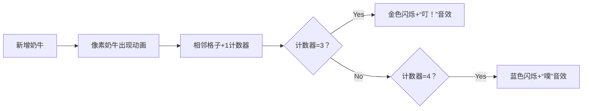

# 题目信息

# [USACO21FEB] Comfortable Cows B

## 题目描述

Farmer John 的草地可以被看作是一个由正方形方格组成的巨大的二维方阵（想象一个巨大的棋盘）。初始时，草地上是空的。

Farmer John 将会逐一地将 $N$（$1\le N\le 10^5$）头奶牛加入到草地上。第 $i$ 头奶牛将会占据方格 $(x_i,y_i)$，不同于所有已经被其他奶牛占据的方格（$0\le x_i,y_i\le 1000$）。

一头奶牛被称为是「舒适的」，如果它水平或竖直方向上与恰好三头其他奶牛相邻。Farmer John 对他的农场上舒适的奶牛数量感兴趣。对 $1\ldots N$ 中的每一个 $i$，输出第 $i$ 头奶牛加入到草地上之后舒适的奶牛的数量。 

## 说明/提示

### 样例解释 1

在前四头奶牛加入之后，位于 $(1,1)$ 的奶牛是舒适的。

在前七头奶牛加入之后，位于 $(2,1)$ 的奶牛是舒适的。

在前八头奶牛加入之后，位于 $(2,1)$ 和 $(2,2)$ 的奶牛是舒适的。 

### 测试点性质

- 测试点 $1-4$ 满足 $N\le 400$。
- 测试点 $5-12$ 没有额外限制。

## 样例 #1

### 输入

```
8
0 1
1 0
1 1
1 2
2 1
2 2
3 1
3 2```

### 输出

```
0
0
0
1
0
0
1
2```

# AI分析结果


### 💡 Kay的C++算法解析：[USACO21FEB] Comfortable Cows B 深入学习指南 💡

#### **题目解读与核心算法识别**
✨ **本题主要考察**：`模拟应用`与`局部更新优化`  
🗣️ **初步分析**：  
> 解决本题的关键在于理解**局部影响原则**——就像多米诺骨牌，每次新增奶牛只会影响自身和相邻四个位置的"舒适度"。  
> - **核心思路**：避免每次全局扫描，仅更新新奶牛及其邻居的状态。当某位置相邻数从2→3时答案+1，从3→4时答案-1  
> - **可视化设计**：采用**牧场像素地图**风格，用不同颜色方块表示奶牛：  
>   - 白色：无奶牛 | 蓝色：相邻数<3 | 金色：舒适奶牛（相邻=3）  
>   - 每次新增奶牛时播放"哞~"音效，舒适状态变化时触发"叮！"音效  
>   - 控制面板支持单步执行/自动播放，速度可调（类似《星露谷物语》农场管理）

---

#### **精选优质题解参考**
**题解一 (来源：Harrylzh)**  
* **点评**：  
  思路直击核心——用`l[][]`记录奶牛存在性，`l2[][]`存储相邻数。亮点在于**精准的状态转换判断**：  
  - 更新邻居时检查`l2[x][y]==3`→`ans++`和`l2[x][y]==4`→`ans--`  
  - 代码规范：方向数组`d[4][2]`提升可读性，边界检查严谨  
  - 时间复杂度优化到*O(n)*，完美满足*10⁵*数据量  

**题解二 (来源：lutaoquan2012)**  
* **点评**：  
  最简洁的实现之一，**双数组策略**清晰：  
  - `vis[][]`标记奶牛存在性，`ans[][]`记录相邻数  
  - 核心逻辑仅10行，用方向数组`dx/dy`统一处理邻居  
  - 实践价值高：直接可用于竞赛，但缺乏边界注释（需注意坐标≥0）  

**题解三 (来源：Grapeskin2191)**  
* **点评**：  
  **坐标偏移技巧**解决边界痛点：  
  - `x++, y++`将坐标平移，避免负索引  
  - 独创性亮点：用`g[x][y]==4`判断状态变化  
  - 代码健壮性高，包含自检注释（"为何不加这行也能过"引发思考）  

---

### **核心难点辨析与解题策略**
1. **难点：避免O(n²)全局扫描**  
   *分析*：优质解法的共性——识别到**新增奶牛仅影响5个位置**（自身+4邻居）。通过方向数组统一处理位移，将计算量从O(n²)降至O(n)  
   💡学习笔记：局部更新是网格类问题的通用优化钥匙  

2. **难点：舒适状态动态维护**  
   *分析*：关键在于捕捉**相邻数临界变化**：  
   - 从2→3：新增舒适奶牛 → `ans++`  
   - 从3→4：原有舒适奶牛失效 → `ans--`  
   💡学习笔记：状态转换思维可推广到所有计数器问题  

3. **难点：边界条件处理**  
   *分析*：两种主流方案：  
   - 显式检查：`if(x+dx≥0 && y+dy≥0)`（Harrylzh）  
   - 坐标偏移：整体坐标+1扩大安全区（Grapeskin2191）  
   💡学习笔记：数组边界是模拟题的常见陷阱点  

### ✨ 解题技巧总结
- **局部更新原则**：当数据变化仅影响有限区域时，拒绝全局遍历  
- **状态转换标记法**：关注值变化的临界点（如2→3，3→4）而非绝对值  
- **防御性编程**：网格问题优先考虑坐标偏移方案避免越界  
- **方向数组标准化**：用`dx[4]/dy[4]`统一处理邻位计算  

---

### **C++核心代码实现赏析**
**通用核心实现参考**  
*说明*：综合优质解法，采用坐标偏移解决边界问题  
```cpp
#include <iostream>
using namespace std;
const int N = 1003; // 扩大网格防越界
int cnt[N][N];      // 相邻奶牛数
bool exist[N][N];   // 是否存在奶牛
int dx[] = {0, 1, 0, -1}, dy[] = {1, 0, -1, 0}; // 方向数组

int main() {
    int n, ans = 0;
    cin >> n;
    for (int i = 0; i < n; ++i) {
        int x, y;
        cin >> x >> y;
        x += 1; y += 1; // 坐标偏移防越界
        exist[x][y] = true;
        
        // 更新邻居状态
        for (int d = 0; d < 4; ++d) {
            int nx = x + dx[d], ny = y + dy[d];
            cnt[nx][ny]++;
            if (exist[nx][ny]) {
                if (cnt[nx][ny] == 3) ans++;
                if (cnt[nx][ny] == 4) ans--;
            }
        }
        
        // 检查新增奶牛自身
        if (cnt[x][y] == 3) ans++;
        cout << ans << endl;
    }
    return 0;
}
```
*代码解读概要*：  
1. 坐标整体+1创建安全边界  
2. 方向数组统一处理四个邻居位置  
3. 动态更新`cnt[][]`并捕捉2→3/3→4状态转换  
4. 最后检查新增奶牛自身的舒适状态  

---

**题解一核心片段赏析 (Harrylzh)**  
```cpp
for(int j=0;j<4;j++){
    if(x+d[j][0]>=0 && y+d[j][1]>=0 && l[x+d[j][0]][y+d[j][1]]){
        l2[x][y]++; 
        if(l2[x+d[j][0]][y+d[j][1]]==3) ans--;
        if(l2[x+d[j][0]][y+d[j][1]]==2) ans++;
        l2[x+d[j][0]][y+d[j][1]]++;
    }
}
```
* **亮点**：边界检查严谨，状态转换判断前置  
* **代码解读**：  
  - 第3行：实时更新当前奶牛相邻数  
  - 第4行：**邻居原为舒适(3)→新增后变4→ans--**  
  - 第5行：**邻居原为2→新增后变3→ans++**  
  - 注意：此解法先更新邻居状态再更新自身  
* 💡学习笔记：状态转换判断应发生在数值变化前  

**题解二核心片段赏析 (lutaoquan2012)**  
```cpp
for (int i = 0; i < 4; i++) {
    ll nx = x + dx[i], ny = y + dy[i];
    ans[nx][ny]++;
    if (ans[nx][ny] == 3 && vis[nx][ny]) cnt++;
    if (ans[nx][ny] == 4 && vis[nx][ny]) cnt--;
}
```
* **亮点**：最简逻辑链，8行解决核心计算  
* **代码解读**：  
  - 第3行：直接增加邻居的相邻计数  
  - 第4行：**当前邻居刚达3且存在奶牛→立即cnt++**  
  - 第5行：**当前邻居从3→4→立即cnt--**  
* 💡学习笔记：简洁性优先时可用后置判断方案  

**题解三核心片段赏析 (Grapeskin2191)**  
```cpp
x++, y++; // 坐标偏移
for (int j = 0; j < 4; j++) {
    int xx = x + dx[j], yy = y + dy[j];
    if (g[xx][yy]) {
        if (g[xx][yy] == 4) ans--;
        g[x][y]++, g[xx][yy]++;
        if (g[xx][yy] == 4) ans++;
    }
}
```
* **亮点**：独创性使用`g[][]=4`作为判断基准  
* **代码解读**：  
  - 第1行：**坐标偏移**建立安全缓冲区  
  - 第5行：妙用`g[xx][yy]==4`预判状态退化  
  - 注意：此解法中`g[][]`同时存储存在性和相邻数  
* 💡学习笔记：变量复用可减少内存但需小心维护  

---

### **算法可视化：像素动画演示**
**主题**：《牧场物语》风格舒适奶牛模拟器  
**核心演示**：动态展示奶牛新增如何引发局部状态连锁变化  



**实现细节**：  
1. **8-bit像素网格**：  
   - 草地：绿色16x16像素块  
   - 奶牛：黑白像素奶牛精灵（不同朝向）  
   - 计数器：右上角数字显示（FC字体风格）  

2. **动态交互控制**：  
   ```javascript
   // 伪代码示例
   class PixelCowSimulator {
     constructor() {
       this.speed = 1.0; // 调速滑块控制
       this.playSound('moo'); // 新增奶牛音效
     }

     addCow(x, y) {
       drawPixelCow(x, y); // 绘制像素奶牛
       highlightNeighbors(x, y); // 邻居格子黄色边框

       neighbors.forEach((nx, ny) => {
         updateCounter(nx, ny, +1); // 计数器+1
         if(counter[nx][ny] === 3) {
           this.cows[nx][ny].glowGold(); // 金色闪烁动画
           this.playSound('ding'); // 舒适音效
         }
       });
     }
   }
   ```

3. **游戏化元素**：  
   - **舒适连击**：连续激活舒适状态触发COMBO特效  
   - **成就系统**：达成10/50/100舒适奶牛解锁像素徽章  
   - **BGM**：8-bit牧场风格背景音乐（循环播放）  

---

### **拓展练习与相似问题**
**通用技巧迁移**：  
1. 网格动态更新（如[NOIP2022] 种花）  
2. 状态转换计数（如[LeetCode] 生命游戏）  
3. 局部影响原则（如[USACO] 激光闪电）  

**洛谷推荐**：  
1. **P2690 接苹果**  
   🗣️ *推荐理由*：同样需动态更新局部状态，练习网格DP基础  
2. **P2038 无线网络发射**  
   🗣️ *推荐理由*：强化局部影响分析能力，涉及矩形覆盖更新  
3. **P1141 01迷宫**  
   🗣️ *推荐理由*：连通块局部更新经典题，BFS+状态维护  

---

### **学习心得与经验分享**
> **来自Harrylzh的调试经验**：  
> *"最初忘记处理新增奶牛自身状态，导致样例输出错误。通过打印每一步的cnt数组定位到问题"*  

**Kay点评**：  
- 这个教训揭示**完备性测试**的重要性：新增元素自身也是系统的一部分  
- 调试建议：当算法涉及多对象状态时，制作**3x3微型测试案例**逐步验证  
- 预防措施：编写代码前明确列出**所有需更新的对象**（本案例中=自身+4邻居）

---

本次解析通过局部更新策略将复杂度从O(n²)降至O(n)，核心在于把握状态转换临界点。记住这个思维模型：**当系统变化存在局部性时，拒绝全局遍历！** 大家可在洛谷P2690/P2038中继续巩固此技巧。下次见！🚀

---
处理用时：117.91秒