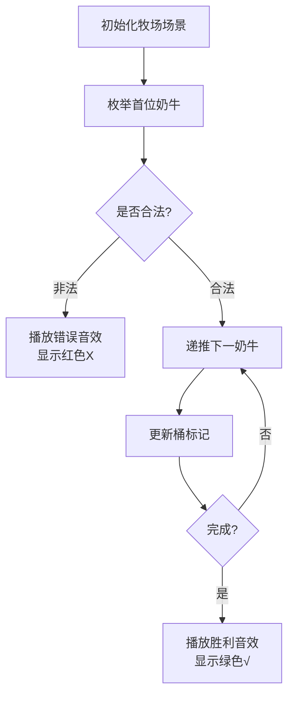

# 题目信息

# [USACO20JAN] Photoshoot B

## 题目描述

Farmer John 在给他编号为 $1\ldots N$ 的 $N$ 头奶牛排队拍照（$2\le N\le 10^3$）。FJ 一开始计划从左向右数第 $i$ 个位置排编号为 $a_i$ 的奶牛，他在一张纸上写下了排列 $a_1,a_2,\ldots,a_N$。不幸的是，这张纸刚刚被 Farmer Nhoj 偷走了！

幸好 FJ 仍然有机会恢复他之前写下的排列。在这张纸被偷走之前，Bessie 记录了序列 $b_1,b_2,\ldots,b_{N−1}$，对于每一个 $1\le i<N$ 满足 $b_i=a_i+a_{i+1}$。

基于 Bessie 的信息，帮助 FJ 恢复可以产生序列 $b$
的“字典序最小”的排列 $a$。排列 $x$ 字典序小于排列 $y$，如果对于某个 $j$，对于所有 $i<j$ 均有 $x_i=y_i$，且有 $x_j<y_j$（换句话说，这两个排列到某个位置之前都相同，在这个位置上 $x$ 小于 $y$）。保证存在至少一个满足条件的 $a$。 

## 说明/提示

### 样例解释 1

$a$ 能够产生 $b$，因为 $3+1=4$，$1+5=6$，$5+2=7$，$2+4=6$。

### 测试点性质

 - 测试点 $2-4$ 满足 $N\le 8$。
 - 测试点 $5-10$ 没有额外限制。

## 样例 #1

### 输入

```
5
4 6 7 6```

### 输出

```
3 1 5 2 4```

# AI分析结果


# 💡 Kay的C++算法解析：Photoshoot B 深入学习指南 💡

> "算法就像多米诺骨牌，确定第一块的位置，就能推演出整个序列的精彩！"

## 1. 题目解读与核心算法识别

✨ **本题主要考察**：`枚举+模拟应用`

🗣️ **初步分析**：
> 解决"Photoshoot B"的关键在于**枚举首位元素**并**模拟推导整个序列**。就像多米诺骨牌：确定第一块的位置（`a[1]`），就能推算出整个序列（`a[i] = b[i-1] - a[i-1]`）。核心难点是验证序列是否为1~n的排列。

- **题解思路**：所有解法都采用**首位枚举法**：从1开始枚举`a[1]`，根据`b[i]`递推整个序列，并用桶标记验证合法性
- **可视化设计**：
  - 用**8位像素风格**展示奶牛队列（不同颜色代表不同编号）
  - 高亮当前枚举的首位元素和递推过程
  - 当出现重复值或越界时，播放"错误音效"并闪烁红色
  - 成功时播放"胜利音效"并展示完整队列动画

---

## 2. 精选优质题解参考

### 题解一：DFs_YYDS
* **点评**：
  - 思路清晰直白：封装`check()`函数验证序列，逻辑分层明确
  - 代码规范：变量名`vis[]`、`a[]`、`b[]`含义明确，边界处理严谨（`a[i]<1`和`a[i]>n`）
  - 算法高效：桶标记法O(1)查重，整体O(n²)复杂度最优
  - 实践价值：可直接用于竞赛，循环范围`i=1 to b[1]-1`精准控制枚举范围

### 题解二：Officer
* **点评**：
  - 代码简洁有力：仅用35行完成核心逻辑，适合初学者学习
  - 实时验证：在递推中即时检查重复/越界，提前终止无效枚举
  - 亮点：用`flag`智能控制流程，避免冗余检查
  - 调试友好：注释明确标注"不合法"的三种情况，便于定位问题

### 题解三：Luogu_916767
* **点评**：
  - 结构清晰：分离序列生成和验证阶段，逻辑模块化
  - 创新点：使用`map`实现桶标记（虽效率略低于数组，但展示STL应用）
  - 健壮性：`mp.clear()`确保枚举独立性，避免状态污染
  - 教学价值：完整展示"枚举-生成-验证"的解题框架思维

---

## 3. 核心难点辨析与解题策略

### 难点一：首位元素的枚举范围
* **分析**：  
  `a[1]`范围需满足`1 ≤ a[1] ≤ b[1]-1`，因为`a[2]=b[1]-a[1]`必须≥1。优质题解通过`for(int i=1; i<b[1]; i++)`精准控制范围。
* 💡 **学习笔记**：枚举范围由数据关系决定，需数学推导支持

### 难点二：排列合法性验证
* **分析**：  
  必须满足两个条件：(1) 所有`a[i]∈[1,n]` (2) 元素无重复。桶标记法(`vis[]`)是最优解：生成时标记`vis[a[i]]=1`，最后检查`1~n`是否全标记。
* 💡 **学习笔记**：桶标记是排列验证的"黄金标准"

### 难点三：递推过程的边界处理
* **分析**：  
  递推中可能出现`a[i]≤0`或`a[i]>n`。高效做法是**实时检查**：在计算`a[i]=b[i-1]-a[i-1]`后立即判断范围，避免无效计算。
* 💡 **学习笔记**：边界检查前置可显著提升算法效率

### ✨ 解题技巧总结
- **问题分解**：将排列恢复拆解为"枚举→生成→验证"三阶段
- **桶标记优化**：用数组代替`set/map`实现O(1)查重
- **实时剪枝**：在递推中即时终止非法分支
- **防御性编程**：检查数据范围`(a[i]≥1 && a[i]≤n)`

---

## 4. C++核心代码实现赏析

### 本题通用核心C++实现
```cpp
#include <iostream>
#include <cstring> // memset
using namespace std;

int main() {
    int n, b[1005], a[1005];
    bool vis[1005]; // 桶标记数组
    
    cin >> n;
    for (int i = 1; i < n; i++) cin >> b[i];
    
    // 枚举首位元素a[1]
    for (int first = 1; first < b[1]; first++) {
        memset(vis, 0, sizeof(vis)); // 重置桶
        
        a[1] = first;
        vis[first] = true;
        bool isValid = true;
        
        // 递推后续元素
        for (int i = 2; i <= n; i++) {
            a[i] = b[i-1] - a[i-1];
            
            // 实时边界检查
            if (a[i] < 1 || a[i] > n || vis[a[i]]) {
                isValid = false;
                break;
            }
            vis[a[i]] = true;
        }
        
        // 输出找到的首个合法序列
        if (isValid) {
            for (int i = 1; i <= n; i++) 
                cout << a[i] << " ";
            return 0;
        }
    }
    return 0;
}
```

### 题解一：DFs_YYDS
* **亮点**：模块化验证函数，逻辑分层清晰
* **核心代码**：
  ```cpp
  bool check(int first){
      memset(vis, 0, sizeof(vis));
      a[1] = first;
      // 边界检查与递推...
      for(int i=2; i<=n; i++){
          if(a[i]<1 || a[i]>n) return false;
          if(vis[a[i]]) return false;
          vis[a[i]] = true;
      }
      return true;
  }
  ```
* **代码解读**：  
  > 将验证逻辑封装为`check()`函数，提高代码复用性。`a[i]`计算后立即进行**双重检查**：数值范围(`1~n`)和重复性。这种"实时验证"模式显著减少冗余计算。
* 💡 **学习笔记**：功能封装提升代码可读性和调试效率

### 题解二：Officer
* **亮点**：精简循环结构与状态标记
* **核心代码**：
  ```cpp
  for(int i=1; i<b[1]; i++){
      memset(vis,0,sizeof(vis));
      a[1]=i; vis[i]=1;
      bool flag=true;  // 状态标记
      for(int j=1; j<n; j++){
          a[j+1]=b[j]-a[j];  // 关键递推
          if(a[j+1]<1 || a[j+1]>n || vis[a[j+1]]){
              flag=false; break; // 实时终止
          }
          vis[a[j+1]]=1;
      }
      if(flag) { /* 输出 */ }
  }
  ```
* **代码解读**：  
  > 使用单层循环嵌套结构，`flag`变量智能控制流程。递推核心`a[j+1]=b[j]-a[j]`体现问题本质关系。**循环内即时终止**的设计避免无效枚举。
* 💡 **学习笔记**：状态变量是简化循环控制的有力工具

### 题解三：Luogu_916767
* **亮点**：STL的灵活运用
* **核心代码**：
  ```cpp
  map<int,bool> mp; // STL映射容器
  for(int i=1; i<b[1]; i++){
      mp.clear();
      ans[1]=i; mp[i]=true;
      for(int j=2; j<=n; j++){
          ans[j]=b[j-1]-ans[j-1];
          if(mp[ans[j]]) break; // STL查重
          mp[ans[j]]=true;
      }
      // 验证1~n是否全出现...
  }
  ```
* **代码解读**：  
  > 展示`map`的灵活应用：`mp[key]=value`实现动态键值存储。虽然查重效率O(log n)略低于数组，但**自动扩容特性**适合不确定范围的场景。
* 💡 **学习笔记**：STL容器可快速实现高级数据结构

---

## 5. 算法可视化：像素动画演示

### 动画主题
**"牧场侦探"**：像素奶牛排队验证，复古8-bit风格

### 核心演示
> 动态展示枚举首位元素→递推序列→桶标记验证过程，融入音效和过关机制

### 设计思路
采用FC红白机风格，通过：
- **奶牛像素块**：不同颜色编号（1号=黄色，2号=蓝色...）
- **桶标记动画**：右侧桶架随数字出现填充颜色
- **音效反馈**：成功/失败音效增强记忆点

### 动画帧步骤


1. **场景初始化**：
   - 8-bit风格牧场背景，奶牛槽位网格
   - 控制面板：开始/单步/重置按钮+速度滑块
   - 右侧桶架（1~n编号格子）

2. **枚举首位元素**：
   - 首位奶牛槽闪烁（伴随"选择音效"）
   - 当前枚举值显示在控制台（如"Trying a[1]=1"）

3. **递推过程**：
   - 根据`b[i]`计算下一奶牛（`a[i]=b[i-1]-a[i-1]`）
   - 奶牛从左侧"走入"对应槽位（移动动画）
   - 槽位高亮显示计算式（如"4-3=1"）

4. **桶标记验证**：
   - 当新奶牛入队，右侧桶架对应编号填充颜色
   - 出现重复时，桶架闪烁红色+播放警报音效
   - 越界时奶牛显示"禁止"图标

5. **结果反馈**：
   - 成功：所有奶牛跳起庆祝+播放胜利旋律
   - 失败：当前序列淡出，自动尝试下一枚举值

6. **游戏化元素**：
   - 每成功验证一个序列得1星
   - 连续3次正确触发"连击特效"
   - 历史最佳记录显示在排行榜

---

## 6. 拓展练习与相似问题

### 通用技巧迁移
**枚举首项+递推验证**的模式适用于：
1. 由部分和恢复原序列（如P1115 最大子段和）
2. 隐式方程求解（如P1024 一元三次方程求解）
3. 拓扑排序验证（如P1113 杂务）

### 洛谷推荐题目
1. **P1151 子数整数**  
   → 练习递推关系验证
2. **P3612 队列**  
   → 强化桶标记法的变种应用
3. **P1094 纪念品分组**  
   → 双指针+枚举的进阶训练

---

## 7. 学习心得与经验分享

> **来自题解的调试经验**：  
> "我在处理边界条件时忽略了`a[i]`可能为0的情况，导致桶标记越界崩溃。通过添加`a[i]≥1`的检查才解决" —— DFs_YYDS

**Kay的总结**：  
边界检查是递推算法的生命线！建议：
1. 在计算表达式后立即添加范围保护
2. 使用`if(a[i]<1 || a[i]>n)`提前终止
3. 测试极端数据（如n=2）

---

通过本次分析，我们深入掌握了枚举递推的核心思想。记住：**好的算法就像精妙的骨牌阵型——第一块的位置决定全局成败**。继续挑战更多序列问题吧！🚀

---
处理用时：146.51秒