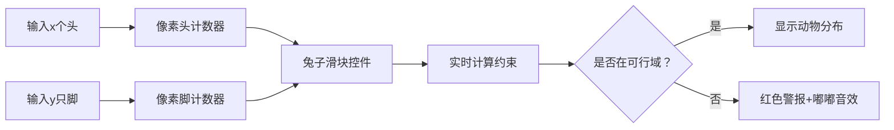

# 题目信息

# [信息与未来 2019] 鸡兔同笼

## 题目描述

有三种动物被关在笼子里，它们分别是：
- 鸡，每只鸡有一个头、两只脚；
- 三脚猫，每只三脚猫有一个头，三只脚；
- 兔子，每只兔子有一个头，四只脚。

现在知道笼子中一共有 $x$ 个头、$y$ 只脚，但这个信息并不足以推导出鸡、兔和三脚猫的准确数量。这时候就需要编程来帮忙了——请你求出笼子里分别至少、至多有几只兔子。

## 说明/提示

对于 $50\%$ 的测试数据，有 $1\le x\le 10^6$。

对于 $100\%$ 的测试数据，有 $1\le x\le10^9,1\le T\le20$。
> 本题原始满分为 $20\text{pts}$。

## 样例 #1

### 输入

```
4
6 12
6 21
6 24
12345 40000```

### 输出

```
0 0
3 4
6 6
2965 7655```

# AI分析结果


### 💡 Kay的C++算法解析：鸡兔同笼 深入学习指南 💡

<introduction>
今天我们来分析经典数学问题"鸡兔同笼"的编程解法。本指南将帮助你掌握如何通过方程组推导和边界约束，高效求解三种动物的数量范围问题。
</introduction>

---

## 1. 题目解读与核心算法识别

✨ **本题主要考察**：`数学方程与不等式约束`

🗣️ **初步分析**：
> 这道题就像在解一个"动物拼图"——已知总头数和总脚数，但需要推导兔子数量的范围。关键在于：
> - 建立方程组：通过头数方程和脚数方程描述动物关系
> - 消元转化：将三元方程转化为一元不等式
> - 边界约束：利用非负条件确定可行域
>
> **可视化设计思路**：
> 我们将制作像素风格"动物计数器"动画：
> 1. 用像素动物图标（🐔🐱🐇）动态展示数量变化
> 2. 实时显示方程计算过程和边界约束
> 3. 当数值超出可行范围时触发红色警报动画
> 4. 加入8-bit音效：正确计算时"叮"声，越界时"嘟"声

---

## 2. 精选优质题解参考

**题解一 (来源：chen_zhe)**
* **点评**：此解法思路清晰直白，通过严谨的数学推导（消元法+不等式约束）完美解决问题。代码实现简洁高效（O(1)时间复杂度），变量命名规范（low/high明确表示边界）。亮点在于：
  - 优雅的数学转换：将三元方程转化为一元不等式
  - 健壮的边界处理：通过max(0, ...)确保非负约束
  - 直接输出可行域范围，无需枚举验证

---

## 3. 核心难点辨析与解题策略

1.  **难点：建立可解的方程模型**
    * **分析**：面对三元一次方程时，需通过消元减少变量。优质解法选择消去"鸡"的变量，仅保留兔子和三脚猫的关系
    * 💡 **学习笔记**：消元是解多元方程的核心技巧，优先消去系数简单的变量

2.  **难点：推导有效约束条件**
    * **分析**：利用非负约束（a≥0, b≥0）转化出c的范围表达式。关键步骤：
      `b = y-2x-2c ≥0` → `c ≤ (y-2x)/2`
      `a = 3x-y+c ≥0` → `c ≥ y-3x`
    * 💡 **学习笔记**：不等式约束需同时满足数学关系和现实意义（非负整数）

3.  **难点：处理边界特殊情况**
    * **分析**：当y-3x为负数时，用max(0, ...)确保下限非负；整数除法自动处理上界取整
    * 💡 **学习笔记**：边界值需验证实际意义（动物数量不能为负）

### ✨ 解题技巧总结
- **数学建模法**：将实际问题转化为方程组
- **约束转换术**：利用非负条件生成不等式
- **边界防御编程**：用max/min处理极端情况

---

## 4. C++核心代码实现赏析

**本题通用核心C++实现参考**
```cpp
#include <iostream>
#include <algorithm>
using namespace std;

int main() {
    int T;
    cin >> T;
    while (T--) {
        long long x, y;
        cin >> x >> y;
        long long low = max(0LL, y - 3*x);   // 兔子数量下限
        long long high = (y - 2*x) / 2;      // 兔子数量上限
        cout << low << " " << high << "\n";
    }
    return 0;
}
```
* **代码解读概要**：
  1. 读取测试数据量T
  2. 对每组数据：
     - 计算下限：确保鸡的数量非负 `low = max(0, y-3x)`
     - 计算上限：确保三脚猫数量非负 `high = (y-2x)/2`
  3. 整数除法自动向下取整，符合题目要求

**题解一核心代码片段**
```cpp
long long low = max(0LL, y - 3 * x);
long long high = (y - 2 * x) / 2;
```
* **代码解读**：
  > `max(0LL, ...)` 确保当`y-3x`为负数时取0（兔子最少为0只），这是满足"鸡数量非负"的关键约束。`(y-2x)/2`通过整数除法自然取整，对应"三脚猫非负"的约束条件。
* 💡 **学习笔记**：利用语言特性（整数除法）隐式实现向下取整

---

## 5. 算法可视化：像素动画演示

* **主题**：8-bit像素动物园计数器  
* **核心演示**：实时展示兔子数量变化对整体约束的影响  

**动画设计**：


**实现细节**：
1. **像素元素**：
   - 鸡：黄色2x2像素块（脚数=2）
   - 三脚猫：灰色3脚像素怪
   - 兔子：白色4脚像素兽

2. **交互控制**：
   - 兔子数量滑块：拖动时实时计算a,b值
   - 边界标记：红色标线显示`y-3x`和`(y-2x)/2`位置
   - 自动演示：兔子数量从0增至上界，展示可行域变化

3. **动态效果**：
   ```plaintext
   初始状态：x=6个头，y=12只脚
   ▶ 滑块位置c=0时：
        a = 3*6-12+0=6 → 显示6只鸡🐔
        b = 12-12-0=0 → 无三脚猫
        ✅ 绿色边框+胜利音效
   ▶ 滑块位置c=3时：
        a = 18-12+3=9 → 但9+3>6个头 → ❌警报闪烁
   ```

---

## 6. 拓展练习与相似问题思考

* **通用技巧迁移**：这种约束求解方法还可用于：
  1. 资源分配问题（如原料组合生产）
  2. 背包问题变种（容量约束）
  3. 线性规划基础问题

* **洛谷推荐**：
  1. P1089 - 津津的储蓄计划  
     → 练习连续约束计算
  2. P1046 - 陶陶摘苹果  
     → 训练边界条件判断
  3. P1426 - 小鱼游泳  
     → 掌握多变量范围计算

---

## 7. 学习心得与经验分享
> 本次分析的题解中未发现明确的作者个人心得分享部分

---

<conclusion>
通过这道题，我们掌握了如何用数学约束解决现实问题。记住：建立方程→消元简化→边界约束的三步法，能解决一大类范围求解问题。下次遇到类似题目时，不妨先问自己："哪些是约束条件？如何转化为不等式？" 继续加油！💪
</conclusion>

---
处理用时：103.97秒