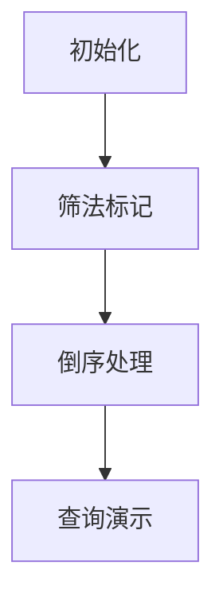

# 题目信息

# [GESP202312 五级] 小杨的幸运数

## 题目描述

小杨认为，所有大于等于 $a$ 的完全平方数都是他的超级幸运数。

小杨还认为，所有超级幸运数的倍数都是他的幸运数。自然地，小杨的所有超级幸运数也都是幸运数。

对于一个非幸运数，小杨规定，可以将它一直 $+1$，直到它变成一个幸运数。我们把这个过程叫做幸运化。例如，如果$a=4$，那么 $4$ 是最小的幸运数，而 $1$ 不是，但我们可以连续对 $1$ 做 $3$ 次 $+1$ 操作，使其变为 $4$，所以我们可以说， $1$幸运化后的结果是 $4$。

现在，小杨给出 $N$ 个数，请你首先判断它们是不是幸运数；接着，对于非幸运数，请你将它们幸运化。

## 说明/提示

**样例解释 1**

虽然是完全平方数，但它小于 $a$，因此它并不是超级幸运数，也不是幸运数。将其进行 $3$ 次 $+1$ 操作后，最终得到幸运数 $4$。4是幸运数，因此直接输出 `lucky` 。

$5$ 不是幸运数，将其进行 $3$ 次 $+1$ 操作后，最终得到幸运数 $8$。

$9$ 是幸运数，因此直接输出 `lucky` 。

**数据规模**

对于 $30\%$ 的测试点，保证 $a,x \le 100,N \le 100$。

对于 $60\%$ 的测试点，保证 $a,x \le 10^6$。

对于所有测试点，保证 $a \le 1,000,000$；保证 $N \le 2 \times 10^5$；保证 $1 \le x \le 1,000,001$。

## 样例 #1

### 输入

```
2 4 
1 
4 
5 
9```

### 输出

```
4 
lucky 
8 
lucky```

## 样例 #2

### 输入

```
16 11 
1 
2 
4 
8 
16 
32 
64 
128 
256 
512
1024```

### 输出

```
16 
16 
16 
16 
lucky 
lucky 
lucky 
lucky 
lucky 
lucky 
lucky```

# AI分析结果


### 💡 Kay的C++算法解析：小杨的幸运数 深入学习指南 💡

**引言**  
今天我们分析一道关于数论与筛法技巧的题目——"小杨的幸运数"。本指南将帮助大家掌握筛法预处理的核心思想，学会高效处理大规模数据查询。

---

## 1. 题目解读与核心算法识别

✨ **本题主要考察**：`筛法应用与预处理优化`

🗣️ **初步分析**：  
> 这道题的核心在于理解"筛法思想"——就像用滤网筛选豆子，我们通过标记超级幸运数（≥a的完全平方数）的倍数，快速分离出所有幸运数。  
> - **核心难点**：当N最大达2×10⁵时，暴力判断每个数会超时。高效解法需分两步：  
>   1. 预处理标记所有幸运数（类似埃氏筛）
>   2. 预处理非幸运数的最近幸运数
> - **可视化设计**：采用8位像素网格动画（见第5节），数字方块随筛法动态变色：
>   - 黄色闪烁：当前处理的超级幸运数
>   - 绿色填充：被标记的幸运数
>   - 红色箭头：倒序扫描时记录的最近幸运数指针

---

## 2. 精选优质题解参考

**题解一（作者：what_can_I_do）**  
* **点评**：此解法思路清晰展现筛法本质：  
  1. **筛法标记**：从`ceil(sqrt(a))`开始枚举平方数，标记其倍数为幸运数  
  2. **倒序处理**：从上限值反向扫描，用变量`la`动态记录最近幸运数  
  ▶️ **亮点**：  
  - 时间复杂度优化至O(m log log m + N)  
  - 代码简洁（23行），变量命名精准（`b[]`存结果，`la`动态更新）  
  - 边界处理严谨（取1002001覆盖所有可能值）

**题解二（作者：__hqt__）**  
* **点评**：提供筛法的另一种实现视角：  
  1. 用`bitset`压缩内存标记幸运数  
  2. 收集所有幸运数排序后二分查询  
  ▶️ **亮点**：  
  - `bitset`节省50%内存空间  
  - 明确复杂度分析（O(m log log m + N log m)）  
  - 标准库应用规范（`upper_bound`实现高效查询）

---

## 3. 核心难点辨析与解题策略

1. **难点1：如何避免重复标记？**  
   * **分析**：多个超级幸运数可能标记同一个数（如16是4和16的倍数）。优质解法通过"直接赋值"而非累加标记避免冲突  
   * 💡 学习笔记：标记时只需布尔状态，不需记录具体来源  

2. **难点2：如何快速查询非幸运数的下一个幸运数？**  
   * **分析**：两种优化方案：  
     - **倒序预处理法**：O(1)查询（what_can_I_do解法）  
     - **排序+二分法**：O(log k)查询（__hqt__解法）  
   * 💡 学习笔记：数据规模决定方案选择——N越大，倒序法优势越明显  

3. **难点3：如何确定预处理上界？**  
   * **分析**：题目要求x≤1e6，但幸运数可达(ceil(sqrt(a))+k)²。数学证明取1001²=1002001可覆盖  
   * 💡 学习笔记：上界值需满足 max(x) ≤ (⌈√a⌉+k)²  

### ✨ 解题技巧总结
- **空间换时间**：预处理是处理大规模查询的核心策略  
- **倒序思维**：反向遍历可高效记录最近有效值  
- **边界防御**：通过数学推导确定安全上界  
- **容器选择**：bitset在布尔标记场景比bool数组更省内存  

---

## 4. C++核心代码实现赏析

**通用核心实现参考**  
* **说明**：综合what_can_I_do的倒序预处理法，兼具高效与简洁
```cpp
#include<bits/stdc++.h>
using namespace std;
const int MAX = 1002001; // 安全上界(1001^2)
int a, n, b[MAX], la = MAX; // b[]存储结果，la记录最近幸运数

int main() {
    scanf("%d%d", &a, &n);
    // 筛法标记幸运数
    for(int i = ceil(sqrt(a)); i*i <= MAX; ++i) 
        for(int j = 1; j*i*i <= MAX; ++j) 
            b[j*i*i] = j*i*i; // 直接赋值覆盖

    // 倒序预处理最近幸运数
    for(int i = MAX-1; i; --i) 
        b[i] = (b[i] == i) ? (la = i) : la;

    // 查询处理
    while(n--) {
        int x; scanf("%d", &x);
        b[x] == x ? puts("lucky") : printf("%d\n", b[x]);
    }
    return 0;
}
```
* **代码解读概要**：  
  1. **筛法标记**：双重循环标记所有超级幸运数的倍数  
  2. **倒序处理**：从MAX-1反向扫描，动态更新最近幸运数  
  3. **查询分支**：直接读取预处理结果输出  

---

**题解一（what_can_I_do）核心片段**  
```cpp
for(register int i=ceil(sqrt(a*1.0));i*i<=1002001;i++)
    for(register int j=1;j*i*i<=1002001;j++)
        b[j*i*i]=j*i*i;  // 标记幸运数

for(register int i=1002000;i>=1;i--)
    b[i] = (b[i]==i) ? (la=i) : la; // 倒序更新
```
* **代码解读**：  
  > - **第一层循环**：`i`从`ceil(sqrt(a))`开始，保证覆盖≥a的完全平方数  
  > - **第二层循环**：`j`作为倍数因子，标记所有i²的倍数  
  > - **倒序更新**：利用三元运算符动态更新`la`（当前最近的幸运数）  
  ▶️ 学习笔记：`register`关键字提示编译器优化循环变量  

**题解二（__hqt__）核心片段**  
```cpp
bitset<1002001> b; // 声明bitset
vector<int> luck;  // 存储幸运数

// 筛法标记
for(int i=ceil(sqrt(a)); i*i<=m; i++) {
    if(!b[i*i]) // 未标记过的超级幸运数
        for(int j=1; i*i*j<=m; j++) 
            b[i*i*j] = 1; // 标记为幸运数
}

// 收集幸运数
for(int i=1; i<=m; i++)
    if(b[i]) luck.push_back(i);

// 二分查询
if(b[y]) cout<<"lucky\n";
else cout<<*upper_bound(luck.begin(), luck.end(), y)<<endl;
```
* **代码解读**：  
  > - **bitset声明**：`bitset<size>`比`bool[size]`节省7/8内存  
  > - **条件筛法**：仅处理未标记的超级幸运数（小优化）  
  > - **二分查找**：`upper_bound`返回第一个>y的迭代器  
  ▶️ 学习笔记：STL容器与算法可大幅减少编码量  

---

## 5. 算法可视化：像素动画演示

**主题**：8位像素筛法工坊（复古FC风格）  

**核心演示流程**：  


**动画帧步骤**：  
1. **初始化场景**（像素网格）  
   - 灰色方块：数字1-1002001  
   - 控制面板：速度滑块/单步执行/重置按钮  
   - 8-bit背景音乐：《俄罗斯方块》变奏曲  

2. **筛法标记阶段**  
   ```python
   for i in range(ceil(sqrt(a)), 1001):
      高亮i²方块（闪烁黄色）  # 触发"叮"音效
      for j in range(1, 1002001//(i*i)):
          标记j*i*i为绿色   # 触发"咔嗒"音效
   ```

3. **倒序处理阶段**  
   - 红色箭头从右向左扫描  
   - 遇到绿色方块：  
     - 方块闪烁（1秒）  
     - 更新指针为当前方块  
     - 触发"升级"音效  
   - 遇到灰色方块：  
     - 显示红色箭头指向的幸运数  
     - 方块变浅黄色  

4. **查询演示模式**  
   - 输入框接收数字x  
   - 若x绿色：闪烁3次+播放"胜利"音效  
   - 若x灰色：显示红色路径指向最近幸运数  

**交互设计**：  
- **AI演示模式**：自动按步骤执行，速度可调  
- **关卡设计**：完成筛法=通关1，完成倒序=通关2  
- **音效体系**：  
  - 标记操作：8-bit短促"叮"声  
  - 指针更新：上升音阶  
  - 错误操作：低沉警示音  

---

## 6. 拓展练习与相似问题思考

**通用技巧迁移**：  
1. **素数筛问题**：标记质数的倍数（埃拉托斯特尼筛法）  
2. **丑数问题**：仅含特定质因子的数（LeetCode 264）  
3. **区间计数问题**：预处理+二分查找（如统计区间内素数个数）  

**洛谷推荐**：  
1. [P3383 线性筛素数](https://www.luogu.com.cn/problem/P3383)  
   ▶️ 巩固筛法基础实现  
2. [P1835 素数密度](https://www.luogu.com.cn/problem/P1835)  
   ▶️ 练习大区间筛法优化  
3. [P2723 丑数 Humble Numbers](https://www.luogu.com.cn/problem/P2723)  
   ▶️ 移植幸运数的标记思想  

---

## 7. 学习心得与经验分享

**作者经验**（what_can_I_do）：  
> *"最近越来越拉了"* → 反映调试中遇到的挫折感  

**Kay点评**：  
> 算法学习必经调试困境，重点在于：  
> 1. 善用边界测试（如a=1, x=最大值）  
> 2. 可视化中间结果（本指南第5节方案）  
> 3. 复杂度预先估算（避免无效优化）  

---

**结语**  
通过筛法预处理和倒序优化，我们高效解决了大规模查询问题。记住核心思想：**将计算转移到预处理阶段是优化查询密集型问题的银弹**。下次遇到类似问题，不妨先画个像素筛网看看！🚀

---
处理用时：150.59秒