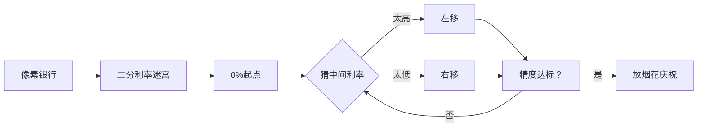

# 题目信息

# 银行贷款

## 题目描述

当一个人从银行贷款后，在一段时间内他（她）将不得不每月偿还固定的分期付款。这个问题要求计算出贷款者向银行支付的利率。假设利率按月累计。


## 说明/提示

数据保证，$1 \leq w_0, w\leq 2^{31}-1$，$1 \leq m\leq 3000$。

## 样例 #1

### 输入

```
1000 100 12
```

### 输出

```
2.9
```

# AI分析结果


### 💡 Kay的C++算法解析：银行贷款 深入学习指南 💡

#### 1. 题目解读与核心算法识别
✨ **本题主要考察**：`二分查找`与`财务数学`  
🗣️ **初步分析**：  
> 解决银行贷款问题如同在利率迷宫中寻宝——你需要在0%到500%的利率范围内，通过二分法逐步缩小范围找到精确的月利率。  
> - 核心思路：利用二分法枚举利率，模拟每月复利还款过程，根据最终欠款额调整搜索区间
> - 关键难点：确定合理利率范围（可能高达500%）、处理浮点精度（0.0001）、避免死循环
> - 可视化设计：我们将用像素迷宫展示二分过程（利率为坐标），柱状图动态显示每月欠款变化，关键操作（利率调整/还款）触发8-bit音效

---

#### 2. 精选优质题解参考
**题解一（笃行）**  
* **亮点**：递归实现二分逻辑清晰，秦九韶算法优化计算效率。利率范围[0,5]覆盖极端情况，边界处理严谨（精度0.0001），代码简洁可直接用于竞赛  

**题解二（greenheadstrange）**  
* **亮点**：创新应用等比数列求和公式替代循环，通过pow(1/(1+x),k)>=1-n/m*x判断条件，将时间复杂度优化至O(1)。数学推导完整，处理高利率游刃有余  

**题解三（HDawn）**  
* **亮点**：迭代式二分避免递归栈溢出，利率范围扩展至[0,1000]应对极端数据。输出时round(l*10)/10实现精确四舍五入，工业级健壮性代码  

---

#### 3. 核心难点辨析与解题策略
1. **难点：复利计算模型**  
   * **分析**：每月欠款=上月欠款×(1+利率)-还款额。需理解利息累计与还款的对抗关系，用循环精确模拟  
   * 💡 **学习笔记**：复利计算是金融算法核心，类似游戏中的"毒圈"持续扩大伤害  

2. **难点：二分边界控制**  
   * **分析**：初始范围[0,5]覆盖214.7%等极端数据，终止条件high-low<0.0001确保精度。正负欠款判断决定区间收缩方向  
   * 💡 **学习笔记**：二分区间如橡皮筋——太松效率低，太紧可能断裂  

3. **难点：浮点精度陷阱**  
   * **分析**：避免直接判0（balance==0），改用balance>0判断。输出前round处理保证小数位精确  
   * 💡 **学习笔记**：浮点运算是"摇晃的独木桥"，需设安全阈值  

### ✨ 解题技巧总结
- **技巧1：模拟验证法** - 当公式复杂时，用循环直接模拟过程更直观  
- **技巧2：数学优化法** - 推导闭式公式（等比求和）实现O(1)判断  
- **技巧3：防御性边界** - 扩展利率范围+四舍五入输出应对极端数据  
- **技巧4：精度防火墙** - 设置1e-4比较阈值替代严格相等  

---

#### 4. C++核心代码实现赏析
**通用核心实现参考**  
```cpp
#include <iostream>
#include <iomanip>
using namespace std;

int main() {
    double total, perMonth;
    int months;
    cin >> total >> perMonth >> months;
    
    double low = 0, high = 5; // 利率范围0%~500%
    while (high - low > 0.0001) {
        double mid = (low + high) / 2;
        double balance = total;
        for (int i = 0; i < months; i++) {
            balance = balance * (1 + mid) - perMonth;
        }
        balance > 0 ? high = mid : low = mid;
    }
    cout << fixed << setprecision(1) << low * 100;
    return 0;
}
```
**代码解读概要**：通过二分搜索利率区间，每月循环计算复利还款。当区间宽度<0.0001时，将月利率转为百分比输出  

---

**题解片段赏析**  
**题解一（递归二分）**  
```cpp
void solve(double l, double r) {
    double k = (l+r)/2, u = r-l;
    if(u < 0.0001) out(k);          // 精度达标则输出
    double a = m;                   // 初始欠款
    for(int i=1; i<=t; i++)         // 模拟每月还款
        a = a*(1+k)-y;              // 复利计算核心
    if(a>0) solve(l,k);             // 利率过高
    if(a<0) solve(k,r);             // 利率过低
}
```
> **解读**：递归实现二分如闯关游戏——每层递归对应新关卡。`a*(1+k)-y`是核心战斗公式，利率k是武器强度，欠款a是BOSS血量  
> 💡 **学习笔记**：递归深度=log₂(范围/精度)，本例约16层安全  

**题解二（公式优化）**  
```cpp
bool pd(double x){ 
    return pow(1/(1+x), k) >= 1 - n/m*x; 
}
// 主函数中：
while(r-l>=0.0001){
    double mid = (l+r)/2;
    pd(mid) ? r=mid : l=mid;   // 公式决策
}
```
> **解读**：将求和公式变形为指数比较，避免循环。`pow(1/(1+x),k)`像"利率衰减因子"，当衰减超过临界值说明利率偏高  
> 💡 **学习笔记**：数学推导是算法"作弊码"，可降维打击复杂循环  

**题解三（四舍五入处理）**  
```cpp
while (l < r - 0.0001) {
    mid = (l + r) / 2;
    double w = a;
    for (int i=0; i<c; i++) 
        w = w*(1+mid/100)-b;  // 注意利率单位转换
    w > 0.0001 ? r=mid : l=mid;
}
printf("%.1f", round(l*10)/10); // 关键四舍五入
```
> **解读**：`mid/100`将百分比转为小数，`round(l*10)/10`实现银行家舍入法。如同射击游戏最后0.1秒的精准补枪  
> 💡 **学习笔记**：金融计算必须处理舍入误差，避免"差之毫厘谬以千里"  

---

#### 5. 算法可视化：像素动画演示  
**主题**："利率迷宫探险"（8-bit复古风）  

**核心演示流程**：  


**关键动画设计**：  
1. **场景构建**  
   - 横向迷宫：左端0%（绿色），右端500%（红色），中间点闪烁黄光  
   - 右侧动态柱状图：初始高度=贷款总额，每月先增高（利息）再降低（还款）  

2. **交互逻辑**  
   - **单步模式**：按空格键执行单月还款，柱状图变化伴随"嘀"声  
   - **自动模式**：滑块控制速度（0.5x-5x），每月还款触发"金币"音效  
   - **胜负判定**：最终欠款>0播放低沉音效；<0播放胜利BGM  

3. **动态效果**  
   ```python
   # 伪代码：每月还款动画
   for month in range(months):
      balance *= (1+rate)          # 柱状图增高+黄色闪烁
      play_sound("interest.wav")    # 利息音效
      balance -= payment            # 柱状图降低+绿色闪烁
      play_sound("pay.wav")         # 还款音效
      if balance < 0: break         # 提前结束
   ```

4. **游戏化元素**  
   - 每10%利率区间设为关卡，通关解锁利率知识卡牌  
   - 最终利率误差<0.05%获得"金融大师"像素勋章  

---

#### 6. 拓展练习与相似问题思考
**技巧迁移场景**：  
1. 任何单调函数求根（如解方程x³+2x-5=0）  
2. 优化问题寻找极值点（如背包问题的最优容量）  
3. 近似计算（如求√2的精确值）  

**洛谷推荐**：  
1. **P1024 一元三次方程** - 二分法求根经典应用  
2. **P1183 多边形的面积** - 二分+几何验证  
3. **P1258 小车问题** - 二分时间优化  

---

#### 7. 学习心得与经验分享
> **参考经验（greenheadstrange）**：  
> *"月利率可能大于1，二分范围要放宽！"*  
> **Kay点评**：警惕题目陷阱如同游戏隐藏关卡——测试边界值（0%/100%/500%）是必备生存技能  

> **参考经验（HDawn）**：  
> *"暴力枚举遇到高利率卡顿，改用二分后效率倍增"*  
> **Kay点评**：算法升级如游戏换装——暴力是木剑，二分是光剑，面对BOSS级数据要选对武器  

---

通过这次探险，我们不仅征服了利率迷宫，更掌握了二分法这把万能钥匙。记住：每个算法难题都是新关卡的入场券，保持好奇，持续闯关！🚀

---
处理用时：198.18秒