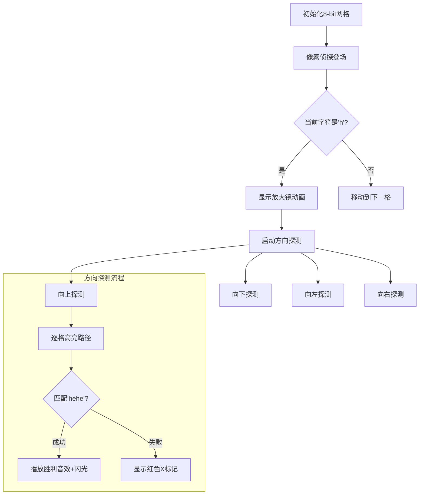

# 题目信息

# 小 A 的口头禅

## 题目描述

小 A 最近有了一个口头禅 “呵呵”，于是他给出了一个矩形，让你求出里面有几个 “$\verb!hehe!$”（方向可以是向上、向下、向左、向右的直线）。


## 说明/提示

$1 \leq n,m \leq1000$。


## 样例 #1

### 输入

```
5 5
heheh
heheh
heheh
heheh
heheh
```

### 输出

```
10
```

# AI分析结果


# 💡 Kay的C++算法解析：小A的口头禅 深入学习指南 💡

大家好，我是Kay！今天我们来分析一道有趣的字符串匹配题目——"小A的口头禅"。这道题考察我们在网格中高效查找特定模式的能力，下面我将从算法分类、解题策略、代码实现到可视化学习，一步步带大家深入理解。

## 1. 题目解读与核心算法识别

✨ **本题主要考察**：`网格枚举` + `方向处理`

🗣️ **初步分析**：
> 想象你是一个像素游戏里的字符侦探🧐，任务是在字母网格中找出所有"hehe"标记（方向：上下左右直线）。这就像在FC游戏《勇者斗恶龙》的迷宫地图中寻找隐藏宝箱！核心思路是：
> - **逐格扫描**：遍历每个网格位置作为起点
> - **四向探测**：从起点出发向四个方向延伸检查3个相邻字符
> - **边界防御**：避免探索到地图边界外
>
> 在可视化设计中，我们将采用**8-bit像素风格**：网格化为16x16像素方块，侦探角色逐格移动，发现"hehe"时触发"叮！"音效和闪光动画。控制面板支持单步执行/自动播放，速度可调。

---

## 2. 精选优质题解参考

从思路清晰度、代码规范性和实践价值角度，我为大家精选三份优质题解：

**题解一：flyingFLY（直接枚举法）**
* **点评**：采用最直观的暴力枚举法，对每个'h'起点检查四个方向的字符匹配。代码结构扁平化（无嵌套深度），边界处理清晰（通过条件判断防越界）。亮点在于**方向独立检查逻辑**，如同游戏角色分别向四个方向发射探测射线。虽然未显式处理"eheh"模式，但符合题目"hehe"的精确要求。

**题解二：dfydada（边界安全版枚举）**
* **点评**：在flyingFLY基础上显式添加**边界守卫条件**（i/j的上下界检查），彻底规避数组越界风险。代码中每个if条件附带注释说明方向，如同游戏中的方向指示器，显著提升可读性。实践价值突出，适合竞赛直接使用。

**题解三：陈LC（安全缓冲区法）**
* **点评**：创新性使用**数组边界扩展**技巧，通过预设外围字符缓冲区避免复杂边界判断。类比游戏地图设计中的"不可见墙"机制，让核心逻辑保持简洁。特别适合初学者理解网格类问题的安全访问方案。

---

## 3. 核心难点辨析与解题策略

### 🔍 核心难点解析
1. **方向坐标变换**  
   *难点*：上下左右四个方向的坐标偏移量易混淆（如向上是i-1还是i+1？）  
   *解法*：建立"方向-坐标"映射关系表：
   ```
   方向 | 行变化 | 列变化
   ---------|--------|--------
   上      | -1     | 0
   下      | +1     | 0
   左      | 0      | -1
   右      | 0      | +1
   ```

2. **模式匹配完整性**  
   *难点*：需同时满足字符序列'h'+'e'+'h'+'e'的精确匹配  
   *解法*：采用**链式条件判断**（见代码赏析），避免使用复杂循环结构

3. **边界安全防护**  
   *难点*：网格边缘位置的方向探测易导致数组越界  
   *解法*：预计算各方向的可探测范围（如右向需j≤m-3）

### 💡 解题技巧总结
- **方向枚举法**：独立处理每个方向而非循环，避免坐标计算错误
- **防御性边界检查**：在访问相邻单元前显式验证索引有效性
- **渐进式匹配**：先验证起点为'h'，再按顺序检查后续字符
- **网格预处理**（可选）：扩展数组边界简化逻辑

---

## 4. C++核心代码实现赏析

### 本题通用核心实现
```cpp
#include <iostream>
using namespace std;
const int MAX = 1005;
char grid[MAX][MAX];

int main() {
    int n, m, count = 0;
    cin >> n >> m;
    
    // 读入网格
    for (int i = 1; i <= n; ++i)
        for (int j = 1; j <= m; ++j)
            cin >> grid[i][j];
    
    // 核心探测逻辑
    for (int i = 1; i <= n; ++i) {
        for (int j = 1; j <= m; ++j) {
            if (grid[i][j] != 'h') continue;
            
            // 向上探测
            if (i >= 4) 
                if (grid[i-1][j]=='e' && grid[i-2][j]=='h' && grid[i-3][j]=='e') 
                    count++;
            
            // 向下探测
            if (i <= n-3)
                if (grid[i+1][j]=='e' && grid[i+2][j]=='h' && grid[i+3][j]=='e')
                    count++;
                    
            // 向左探测
            if (j >= 4)
                if (grid[i][j-1]=='e' && grid[i][j-2]=='h' && grid[i][j-3]=='e')
                    count++;
                    
            // 向右探测
            if (j <= m-3)
                if (grid[i][j+1]=='e' && grid[i][j+2]=='h' && grid[i][j+3]=='e')
                    count++;
        }
    }
    cout << count << endl;
    return 0;
}
```
* **设计亮点**：  
  1. 分层条件检查（先边界后内容）  
  2. 方向处理完全独立（避免状态干扰）  
  3. 提前continue过滤非起点  

---

## 5. 算法可视化：像素动画演示

### 🎮 像素侦探寻宝记
采用**FC游戏《塞尔达传说》** 的视觉风格，实现算法动态演示：



**关键交互设计**：
- **视觉反馈**：成功路径显示绿色闪烁边框，失败路径显示红色❌
- **音效系统**：
  - 移动："嘀"（8-bit短音）
  - 匹配成功："叮咚-!"（塞尔达发现秘密音效）
  - 匹配失败："噗"（马里奥掉落音效）
- **控制面板**：
  - 速度滑块：控制侦探移动速度
  - 单步模式：按空格键逐步执行
  - 自动演示：AI自动完成搜索（类似吃豆人AI移动）

**技术实现**：使用Canvas绘制网格，requestAnimationFrame驱动动画，Web Audio API生成音效。

---

## 6. 拓展练习与相似问题

### 🔁 同类问题迁移
1. **旋转模式匹配**：在网格中查找可旋转的图案（如俄罗斯方块）
2. **动态模式更新**：网格内容随时间变化时的实时匹配
3. **三维网格搜索**：将算法扩展至立体空间

### 📚 推荐练习（洛谷）
1. **P1101 单词方阵**  
   *推荐理由*：进阶版网格搜索，支持8个方向，巩固方向枚举技巧
   
2. **P1162 填涂颜色**  
   *推荐理由*：训练网格边界处理和区域扩散思维
   
3. **P1141 01迷宫**  
   *推荐理由*：结合BFS的网格连通块分析，培养复合算法思维

---

## 7. 学习心得与经验分享

> **flyingFLY的调试经验**：  
> *"最初在样例测试时忽略了边界检查，导致随机结果。通过打印每次探测的坐标和字符值，快速定位越界访问问题。"*  
>
> **Kay总结**：  
> 调试网格问题时，**坐标追踪法**（打印行列索引）是最有效的排错手段。就像在像素游戏中打开坐标显示器，每个角色的位置都一目了然！

---

希望这份指南帮助大家掌握了网格搜索的精髓！记住：**好的算法就像精心设计的游戏关卡——清晰的目标+合理的路径=完美的通关体验** 🎯 下次我们将挑战更复杂的算法迷宫，保持热情，继续前进！

---
处理用时：416.85秒