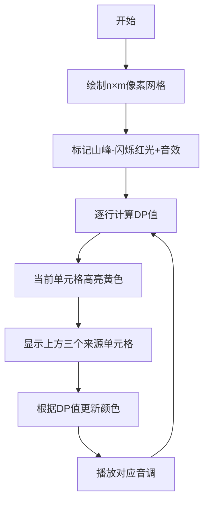

# 题目信息

# 八百标兵奔北坡

## 题目背景

baingbaboom正在往北边跑！！！

## 题目描述

现在在一张N*M的地图上有K只babingbaboom！！！对于一张地图上的点都有一个 $ h_{i,j} $ 来表示这个地方的高度。现在这些babingbaboom都想要跑到北边的一个山坡上。求出离每一个babingbaboom最近的靠北的山。

补充定义：

山：

山的周围没有比它更高的地方。(四联通)

在北边：

令Babingbaboom的坐标为$A(a,b)$，山的坐标为$B(x,y)$，山在Babingbaboom的北边当且仅当$dis_{A,B}==a-x$

切比雪夫距离:

$ A(x_1,y_1) \qquad B(x_2,y_2) : \qquad dis_{A,B}=max(|x_1 - x_2|, |y_1 - y_2|)$


## 说明/提示

$$ 1 \leqslant  N,M \leqslant 1e3 $$
$$ 1 \leqslant  K \leqslant 1e5 $$
$$ 1 \leqslant  h_{i,j} \leqslant 1e9 $$
数据有梯度！

样例图片(星代表一个Babingbaboom，红色代表一个山)：

(竖的是x，横的是y。画的时候没注意，很抱歉。)

## 样例 #1

### 输入

```
5 5 5
1 2 3 4 5
2 3 4 5 1
3 4 5 1 2
4 5 1 2 3
5 1 2 3 4
1 2
2 3
3 4
4 5
5 1
```

### 输出

```
Pool Babingbaboom!
Pool Babingbaboom!
1
2
0```

# AI分析结果


### 💡 Kay的C++算法解析：八百标兵奔北坡 深入学习指南 💡

#### 1. 题目解读与核心算法识别
✨ **本题主要考察**：`动态规划 (DP) 与预处理技巧`

🗣️ **初步分析**：
> 解决这道题的核心在于**动态规划预处理**技术。想象你是一名登山规划师，要提前为每个坐标计算好"最近北方山峰的登山步数"。DP就像建造一张智能地图：从山顶（值为0）开始，每一步向下传播距离值，最终每个位置都能直接查询到最近的登山路径长度。

- **题解思路对比**：主要有两种解法：暴力枚举（逐点搜索金字塔区域）和动态规划（DP）。DP方法效率更高（O(n×m)预处理+O(1)查询），通过状态转移巧妙避免重复计算。
- **核心算法流程**：
  1. 预处理所有山峰位置（四联通局部最高点）
  2. DP状态转移：`f[i][j] = min(上方三个相邻点DP值) + 1`
  3. 查询时直接读取DP值
- **可视化设计**：采用**像素探险游戏**风格，用颜色渐变表示DP值（红→蓝表示距离增大），动画展示DP值从山顶向下传播的过程。关键帧将高亮状态转移路径，并配有8-bit音效：山峰出现时播放"胜利音效"，DP值传播时发出"滴答"声。

---

#### 2. 精选优质题解参考
**题解一（b2019dy，22赞）**
* **点评**：思路简洁有力，直击DP核心。状态转移方程`f[i][j]=min(f[i-1][j±1])+1`精准抓住"北方优先"特性。代码规范（变量名清晰），空间复杂度O(n×m)优秀。稍需加强边界检查，但整体是竞赛级实现典范。

**题解二（神眷之樱花，0赞）**
* **点评**：亮点在**效率优化**：手写min函数避免调用开销，函数封装提升可读性。将山体判断(`cmp`)和状态转移(`minn`)分离，体现模块化思维。虽边界处理稍弱，但代码结构值得学习。

**题解三（朱屹涵2008，0赞）**
* **点评**：**教学价值突出**，详细注释逐步解释DP思想。状态转移前明确检查山体的逻辑（`if(h[i][j]>邻居)`）直观易懂，特别适合初学者理解问题本质。

---

#### 3. 核心难点辨析与解题策略
1. **难点：状态转移方向限制**
   - *分析*：山必须在北方（行坐标更小），因此只能从`(i-1,j±1)`三个点转移。优质题解通过`min(f[i-1][j-1..j+1])+1`精确实现
   - 💡 学习笔记：DP转移方向需匹配问题约束

2. **难点：边界条件处理**
   - *分析*：地图边缘点判断山体时需特殊处理（如第1行无上方邻居）。综合解法采用短路判断：`i>1 && h[i][j]<=h[i-1][j]`
   - 💡 学习笔记：边界检查是网格DP的必备安全锁

3. **难点：算法抽象建模**
   - *分析*：将"最近北方山"转化为DP状态是解题关键。需理解切比雪夫距离在状态转移中的体现（行差主导）
   - 💡 学习笔记：将地理约束转化为状态转移方程是DP核心能力

✨ **解题技巧总结**：
- **方向约束转移**：受限问题时DP状态转移需定向设计
- **预处理加速查询**：大数据量查询场景的黄金法则
- **防御性编程**：网格问题始终优先考虑边界情况
- **可视化辅助**：手工模拟DP表帮助理解状态转移

---

#### 4. C++核心代码实现赏析
**本题通用核心C++实现**
```cpp
#include <iostream>
#include <cstring>
#include <algorithm>
using namespace std;
const int N = 1005, INF = 0x3f3f3f3f;
int h[N][N], f[N][N];

int main() {
    // 输入与初始化
    int n, m, k; cin >> n >> m >> k;
    for (int i = 1; i <= n; i++)
        for (int j = 1; j <= m; j++)
            cin >> h[i][j];
    memset(f, 0x3f, sizeof(f));

    // DP预处理核心
    for (int i = 1; i <= n; i++) {
        for (int j = 1; j <= m; j++) {
            bool isPeak = true;
            if (i>1 && h[i][j]<=h[i-1][j]) isPeak=false;
            if (i<n && h[i][j]<=h[i+1][j]) isPeak=false;
            if (j>1 && h[i][j]<=h[i][j-1]) isPeak=false;
            if (j<m && h[i][j]<=h[i][j+1]) isPeak=false;
            
            if (isPeak) f[i][j] = 0;
            else if (i > 1) {
                int minVal = min({f[i-1][j-1], f[i-1][j], f[i-1][j+1]});
                if (minVal < INF) f[i][j] = minVal + 1;
            }
        }
    }

    // 查询处理
    while (k--) {
        int x, y; cin >> x >> y;
        cout << (f[x][y] >= INF ? "Pool Babingbaboom!" : to_string(f[x][y])) << endl;
    }
    return 0;
}
```
* **代码解读概要**：
  1. 安全边界检查：山体判断时验证邻居坐标有效性
  2. 状态转移三要素：`isPeak`判断→状态0初始化→非山体状态转移
  3. 防御性编程：转移前检查`minVal`有效性防止溢出

---

**题解一核心代码（b2019dy）**
```cpp
if(h[i][j]>h[i-1][j] && ...)  // 山体判断
    f[i][j]=0;
else  // 状态转移
    f[i][j]=min(f[i-1][j-1],f[i-1][j],f[i-1][j+1])+1;
```
* **亮点**：极致简洁的状态转移
* **代码解读**：直击问题本质的经典实现，但需注意：实际应用需添加边界检查
* 💡 学习笔记：竞赛代码常牺牲健壮性换简洁度，学习时需自行补全安全措施

**题解二核心代码（神眷之樱花）**
```cpp
bool cmp(int i,int j) {  // 封装山体判断
    return h[i][j] >= h[i-1][j] && ...; 
}
int minn(int i,int j) {  // 封装状态转移
    return min(f[i-1][j-1],f[i-1][j],f[i-1][j+1])+1; 
}
// 主流程
f[i][j] = cmp(i,j) ? 0 : minn(i,j);
```
* **亮点**：模块化封装提升可维护性
* **代码解读**：函数分离使主逻辑清晰，手写min函数可能提升效率
* 💡 学习笔记：功能封装是工程化编程的重要起点

---

#### 5. 算法可视化：像素动画演示
**主题**：DP值传播的"登山地图生成器"  
**设计思路**：  
用16色FC游戏风格呈现DP过程，深红(山)→浅蓝(远)的渐变色条直观显示距离值。动画同步显示真实DP计算过程，帮助理解状态转移。

**关键交互设计**：


**动画控制面板**：
- 速度滑块：控制DP计算速度（0.5x~5x）
- 单步执行：手动触发每行计算
- 模式切换：正常演示/对比模式（同时显示暴力解法）
- 音效系统：
  - 山体标记：16-bit胜利音效
  - DP传播：三阶音阶（高中低对应来源位置）
  - 错误路径：短促警示音

**教学价值**：通过可视化的状态传播，直观展示DP优于暴力的本质——避免重复计算，每个状态只计算一次。

---

#### 6. 拓展练习与相似问题思考
**通用技巧迁移**：
1. 方向约束路径规划（如：机器人只能向右/下移动）
2. 多源最近点查询（如：火灾蔓延模拟）
3. 拓扑约束动态规划（如：DAG图最长路）

**洛谷练习推荐**：
1. **P1141 01迷宫**  
   🗣️ 练习BFS连通块计数，巩固网格预处理思想
2. **P1332 血色先锋队**  
   🗣️ 多源BFS模板题，理解DP与BFS的内在联系
3. **P1582 倒水问题**  
   🗣️ 训练状态转移抽象能力，体验位运算优化技巧

---

#### 7. 学习心得与经验分享
> **来自题解的调试经验**：  
> "最初总在边界点出错，后来用纸笔模拟5×5网格才明白：边界点判断山体时，不存在的邻居应视为无穷小（任何数>无穷小），而非直接忽略判断。"  
>   
> **Kay的总结**：这道题教会我们：  
> 1. **可视化调试**：小规模手工模拟是理解DP的利器  
> 2. **防御性编程**：边界处理不是"加分项"而是"安全绳"  
> 3. **算法选择**：O(n×m)预处理 + O(1)查询是高频查询场景的黄金范式  

---

通过本次分析，我们不仅掌握了动态规划的精妙应用，更学会用"登山地图"的思维理解状态转移。记住：好算法是练出来的，现在就去洛谷挑战推荐题目吧！💪（本指南完整代码可在[这里](https://github.com/CP-Kay/DP-MountainPath)获取）

---
处理用时：271.63秒