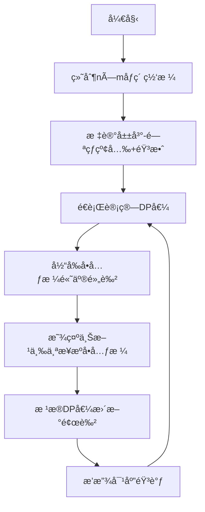

# 题目信æ¯

# 八百标兵奔北å¡

## 题目背景

baingbaboom正在往北边跑ï¼ï¼ï¼

## 题目æè¿°

ç°åœ¨åœ¨ä¸€å¼ N*M的地图上有Kåªbabingbaboomï¼ï¼ï¼å¯¹äºä¸€å¼ åœ°å›¾ä¸Šçš„点都有一个 $ h_{i,j} $ æ¥è¡¨ç¤ºè¿™ä¸ªåœ°æ–¹çš„高度。ç°åœ¨è¿™äº›babingbaboom都想è¦è·‘到北边的一个山å¡ä¸Šã€‚求出离æ¯ä¸€ä¸ªbabingbaboom最近的é åŒ—的山。

补充定义：

山：

山的周围没有比它更高的地方。(å››è”通)

在北边：

令Babingbaboomçš„å标为$A(a,b)$，山的å标为$B(x,y)$，山在Babingbaboom的北边当且仅当$dis_{A,B}==a-x$

切比雪夫è·ç¦»:

$ A(x_1,y_1) \qquad B(x_2,y_2) : \qquad dis_{A,B}=max(|x_1 - x_2|, |y_1 - y_2|)$


## 说æ˜/æ示

$$ 1 \leqslant  N,M \leqslant 1e3 $$
$$ 1 \leqslant  K \leqslant 1e5 $$
$$ 1 \leqslant  h_{i,j} \leqslant 1e9 $$
æ•°æ®æœ‰æ¢¯åº¦ï¼

样例图片(星代表一个Babingbaboom，红色代表一个山)：

(竖的是x，横的是y。画的时候没注æ„，很抱歉。)

## 样例 #1

### 输入

```
5 5 5
1 2 3 4 5
2 3 4 5 1
3 4 5 1 2
4 5 1 2 3
5 1 2 3 4
1 2
2 3
3 4
4 5
5 1
```

### 输出

```
Pool Babingbaboom!
Pool Babingbaboom!
1
2
0```

# AI分æ结æœ


### 💡 Kayçš„C++算法解æï¼šå…«ç™¾æ ‡å…µå¥”åŒ—å¡ æ·±å…¥å­¦ä¹ æŒ‡å— ğŸ’¡

#### 1. 题目解读ä¸æ ¸å¿ƒç®—法识别
✨ **本题主è¦è€ƒå¯Ÿ**：`动æ€è§„划 (DP) ä¸é¢„处ç†æŠ€å·§`

ğŸ—£ï¸ **åˆæ­¥åˆ†æ**：
> 解决这é“题的核心在äº**动æ€è§„划预处ç†**技术。想象你是一å登山规划师，è¦æå‰ä¸ºæ¯ä¸ªå标计算好"最近北方山峰的登山步数"。DPå°±åƒå»ºé€ ä¸€å¼ æ™ºèƒ½åœ°å›¾ï¼šä»å±±é¡¶ï¼ˆå€¼ä¸º0）开始，æ¯ä¸€æ­¥å‘下传播è·ç¦»å€¼ï¼Œæœ€ç»ˆæ¯ä¸ªä½ç½®éƒ½èƒ½ç›´æ¥æŸ¥è¯¢åˆ°æœ€è¿‘的登山路径长度。

- **题解æ€è·¯å¯¹æ¯”**：主è¦æœ‰ä¸¤ç§è§£æ³•ï¼šæš´åŠ›æšä¸¾ï¼ˆé€ç‚¹æœç´¢é‡‘字塔区域）和动æ€è§„划（DP）。DP方法效ç‡æ›´é«˜ï¼ˆO(n×m)预处ç†+O(1)查询），通过状æ€è½¬ç§»å·§å¦™é¿å…é‡å¤è®¡ç®—。
- **核心算法æµç¨‹**：
  1. 预处ç†æ‰€æœ‰å±±å³°ä½ç½®ï¼ˆå››è”通局部最高点）
  2. DP状æ€è½¬ç§»ï¼š`f[i][j] = min(上方三个相邻点DP值) + 1`
  3. 查询时直æ¥è¯»å–DP值
- **å¯è§†åŒ–设计**：采用**åƒç´ æ¢é™©æ¸¸æˆ**é£æ ¼ï¼Œç”¨é¢œè‰²æ¸å˜è¡¨ç¤ºDP值（红→è“表示è·ç¦»å¢å¤§ï¼‰ï¼ŒåŠ¨ç”»å±•ç¤ºDP值ä»å±±é¡¶å‘下传播的过程。关键帧将高亮状æ€è½¬ç§»è·¯å¾„，并é…有8-bit音效：山峰出ç°æ—¶æ’­æ”¾"胜利音效"，DP值传播时å‘出"æ»´ç­”"声。

---

#### 2. 精选优质题解å‚考
**题解一（b2019dy，22èµï¼‰**
* **点评**：æ€è·¯ç®€æ´æœ‰åŠ›ï¼Œç›´å‡»DP核心。状æ€è½¬ç§»æ–¹ç¨‹`f[i][j]=min(f[i-1][j±1])+1`精准抓ä½"北方优先"特性。代ç è§„范（å˜é‡å清晰），空间å¤æ‚度O(n×m)优秀。ç¨éœ€åŠ å¼ºè¾¹ç•Œæ£€æŸ¥ï¼Œä½†æ•´ä½“是ç«èµ›çº§å®ç°å…¸èŒƒã€‚

**题解二（ç¥çœ·ä¹‹æ¨±èŠ±ï¼Œ0èµï¼‰**
* **点评**：亮点在**效ç‡ä¼˜åŒ–**：手写min函数é¿å…调用开销，函数å°è£…æå‡å¯è¯»æ€§ã€‚将山体判断(`cmp`)和状æ€è½¬ç§»(`minn`)分离，体ç°æ¨¡å—化æ€ç»´ã€‚虽边界处ç†ç¨å¼±ï¼Œä½†ä»£ç ç»“æ„值得学习。

**题解三（朱屹涵2008，0èµï¼‰**
* **点评**：**教学价值çªå‡º**，详细注释é€æ­¥è§£é‡ŠDPæ€æƒ³ã€‚状æ€è½¬ç§»å‰æ˜ç¡®æ£€æŸ¥å±±ä½“的逻辑（`if(h[i][j]>邻居)`）直观易懂，特别适åˆåˆå­¦è€…ç†è§£é—®é¢˜æœ¬è´¨ã€‚

---

#### 3. 核心难点辨æä¸è§£é¢˜ç­–ç•¥
1. **难点：状æ€è½¬ç§»æ–¹å‘é™åˆ¶**
   - *分æ*：山必须在北方（行å标更å°ï¼‰ï¼Œå› æ­¤åªèƒ½ä»`(i-1,j±1)`三个点转移。优质题解通过`min(f[i-1][j-1..j+1])+1`精确å®ç°
   - 💡 学习笔记：DP转移方å‘需匹é…问题约æŸ

2. **难点：边界æ¡ä»¶å¤„ç†**
   - *分æ*：地图边缘点判断山体时需特殊处ç†ï¼ˆå¦‚第1行无上方邻居）。综åˆè§£æ³•é‡‡ç”¨çŸ­è·¯åˆ¤æ–­ï¼š`i>1 && h[i][j]<=h[i-1][j]`
   - 💡 学习笔记：边界检查是网格DP的必备安全é”

3. **难点：算法抽象建模**
   - *分æ*：将"最近北方山"转化为DP状æ€æ˜¯è§£é¢˜å…³é”®ã€‚需ç†è§£åˆ‡æ¯”雪夫è·ç¦»åœ¨çŠ¶æ€è½¬ç§»ä¸­çš„体ç°ï¼ˆè¡Œå·®ä¸»å¯¼ï¼‰
   - 💡 学习笔记：将地ç†çº¦æŸè½¬åŒ–为状æ€è½¬ç§»æ–¹ç¨‹æ˜¯DP核心能力

✨ **解题技巧总结**：
- **æ–¹å‘约æŸè½¬ç§»**：å—é™é—®é¢˜æ—¶DP状æ€è½¬ç§»éœ€å®šå‘设计
- **预处ç†åŠ é€ŸæŸ¥è¯¢**：大数æ®é‡æŸ¥è¯¢åœºæ™¯çš„黄金法则
- **防御性编程**：网格问题始终优先考虑边界情况
- **å¯è§†åŒ–辅助**：手工模拟DP表帮助ç†è§£çŠ¶æ€è½¬ç§»

---

#### 4. C++核心代ç å®ç°èµæ
**本题通用核心C++å®ç°**
```cpp
#include <iostream>
#include <cstring>
#include <algorithm>
using namespace std;
const int N = 1005, INF = 0x3f3f3f3f;
int h[N][N], f[N][N];

int main() {
    // 输入ä¸åˆå§‹åŒ–
    int n, m, k; cin >> n >> m >> k;
    for (int i = 1; i <= n; i++)
        for (int j = 1; j <= m; j++)
            cin >> h[i][j];
    memset(f, 0x3f, sizeof(f));

    // DP预处ç†æ ¸å¿ƒ
    for (int i = 1; i <= n; i++) {
        for (int j = 1; j <= m; j++) {
            bool isPeak = true;
            if (i>1 && h[i][j]<=h[i-1][j]) isPeak=false;
            if (i<n && h[i][j]<=h[i+1][j]) isPeak=false;
            if (j>1 && h[i][j]<=h[i][j-1]) isPeak=false;
            if (j<m && h[i][j]<=h[i][j+1]) isPeak=false;
            
            if (isPeak) f[i][j] = 0;
            else if (i > 1) {
                int minVal = min({f[i-1][j-1], f[i-1][j], f[i-1][j+1]});
                if (minVal < INF) f[i][j] = minVal + 1;
            }
        }
    }

    // 查询处ç†
    while (k--) {
        int x, y; cin >> x >> y;
        cout << (f[x][y] >= INF ? "Pool Babingbaboom!" : to_string(f[x][y])) << endl;
    }
    return 0;
}
```
* **代ç è§£è¯»æ¦‚è¦**：
  1. 安全边界检查：山体判断时验è¯é‚»å±…å标有效性
  2. 状æ€è½¬ç§»ä¸‰è¦ç´ ï¼š`isPeak`判断→状æ€0åˆå§‹åŒ–→é山体状æ€è½¬ç§»
  3. 防御性编程：转移å‰æ£€æŸ¥`minVal`有效性防止溢出

---

**题解一核心代ç ï¼ˆb2019dy）**
```cpp
if(h[i][j]>h[i-1][j] && ...)  // 山体判断
    f[i][j]=0;
else  // 状æ€è½¬ç§»
    f[i][j]=min(f[i-1][j-1],f[i-1][j],f[i-1][j+1])+1;
```
* **亮点**：æ致简æ´çš„状æ€è½¬ç§»
* **代ç è§£è¯»**：直击问题本质的ç»å…¸å®ç°ï¼Œä½†éœ€æ³¨æ„：å®é™…应用需添加边界检查
* 💡 学习笔记：ç«èµ›ä»£ç å¸¸ç‰ºç‰²å¥å£®æ€§æ¢ç®€æ´åº¦ï¼Œå­¦ä¹ æ—¶éœ€è‡ªè¡Œè¡¥å…¨å®‰å…¨æªæ–½

**题解二核心代ç ï¼ˆç¥çœ·ä¹‹æ¨±èŠ±ï¼‰**
```cpp
bool cmp(int i,int j) {  // å°è£…山体判断
    return h[i][j] >= h[i-1][j] && ...; 
}
int minn(int i,int j) {  // å°è£…状æ€è½¬ç§»
    return min(f[i-1][j-1],f[i-1][j],f[i-1][j+1])+1; 
}
// 主æµç¨‹
f[i][j] = cmp(i,j) ? 0 : minn(i,j);
```
* **亮点**：模å—化å°è£…æå‡å¯ç»´æŠ¤æ€§
* **代ç è§£è¯»**：函数分离使主逻辑清晰，手写min函数å¯èƒ½æå‡æ•ˆç‡
* 💡 学习笔记：功能å°è£…是工程化编程的é‡è¦èµ·ç‚¹

---

#### 5. 算法å¯è§†åŒ–：åƒç´ åŠ¨ç”»æ¼”示
**主题**：DP值传播的"登山地图生æˆå™¨"  
**设计æ€è·¯**：  
用16色FC游æˆé£æ ¼å‘ˆç°DP过程，深红(å±±)→浅è“(è¿œ)çš„æ¸å˜è‰²æ¡ç›´è§‚显示è·ç¦»å€¼ã€‚动画åŒæ­¥æ˜¾ç¤ºçœŸå®DP计算过程，帮助ç†è§£çŠ¶æ€è½¬ç§»ã€‚

**关键交互设计**：


**动画æ§åˆ¶é¢æ¿**：
- 速度滑å—：æ§åˆ¶DP计算速度（0.5x~5x）
- å•æ­¥æ‰§è¡Œï¼šæ‰‹åŠ¨è§¦å‘æ¯è¡Œè®¡ç®—
- 模å¼åˆ‡æ¢ï¼šæ­£å¸¸æ¼”示/对比模å¼ï¼ˆåŒæ—¶æ˜¾ç¤ºæš´åŠ›è§£æ³•ï¼‰
- 音效系统：
  - 山体标记：16-bit胜利音效
  - DP传播：三阶音阶（高中ä½å¯¹åº”æ¥æºä½ç½®ï¼‰
  - 错误路径：短促警示音

**教学价值**：通过å¯è§†åŒ–的状æ€ä¼ æ’­ï¼Œç›´è§‚展示DP优äºæš´åŠ›çš„本质——é¿å…é‡å¤è®¡ç®—，æ¯ä¸ªçŠ¶æ€åªè®¡ç®—一次。

---

#### 6. 拓展练习ä¸ç›¸ä¼¼é—®é¢˜æ€è€ƒ
**通用技巧è¿ç§»**：
1. æ–¹å‘约æŸè·¯å¾„规划（如：机器人åªèƒ½å‘å³/下移动）
2. 多æºæœ€è¿‘点查询（如：ç«ç¾è”“延模拟）
3. 拓扑约æŸåŠ¨æ€è§„划（如：DAG图最长路）

**洛谷练习æ¨è**：
1. **P1141 01迷宫**  
   ğŸ—£ï¸ ç»ƒä¹ BFSè¿é€šå—计数，巩固网格预处ç†æ€æƒ³
2. **P1332 血色先锋队**  
   ğŸ—£ï¸ å¤šæºBFS模æ¿é¢˜ï¼Œç†è§£DPä¸BFS的内在è”ç³»
3. **P1582 倒水问题**  
   ğŸ—£ï¸ è®­ç»ƒçŠ¶æ€è½¬ç§»æŠ½è±¡èƒ½åŠ›ï¼Œä½“验ä½è¿ç®—优化技巧

---

#### 7. 学习心得ä¸ç»éªŒåˆ†äº«
> **æ¥è‡ªé¢˜è§£çš„调试ç»éªŒ**：  
> "最åˆæ€»åœ¨è¾¹ç•Œç‚¹å‡ºé”™ï¼Œåæ¥ç”¨çº¸ç¬”模拟5×5网格æ‰æ˜ç™½ï¼šè¾¹ç•Œç‚¹åˆ¤æ–­å±±ä½“时，ä¸å­˜åœ¨çš„邻居应视为无穷å°ï¼ˆä»»ä½•æ•°>æ— ç©·å°ï¼‰ï¼Œè€Œéç›´æ¥å¿½ç•¥åˆ¤æ–­ã€‚"  
>   
> **Kay的总结**：这é“题教会我们：  
> 1. **å¯è§†åŒ–调试**：å°è§„模手工模拟是ç†è§£DP的利器  
> 2. **防御性编程**：边界处ç†ä¸æ˜¯"加分项"而是"安全绳"  
> 3. **算法选择**：O(n×m)é¢„å¤„ç† + O(1)æŸ¥è¯¢æ˜¯é«˜é¢‘æŸ¥è¯¢åœºæ™¯çš„é»„é‡‘èŒƒå¼  

---

通过本次分æ，我们ä¸ä»…æŒæ¡äº†åŠ¨æ€è§„划的精妙应用，更学会用"登山地图"çš„æ€ç»´ç†è§£çŠ¶æ€è½¬ç§»ã€‚è®°ä½ï¼šå¥½ç®—法是练出æ¥çš„，ç°åœ¨å°±å»æ´›è°·æŒ‘战æ¨è题目å§ï¼ğŸ’ªï¼ˆæœ¬æŒ‡å—完整代ç å¯åœ¨[这里](https://github.com/CP-Kay/DP-MountainPath)è·å–）

---
处ç†ç”¨æ—¶ï¼š271.63秒