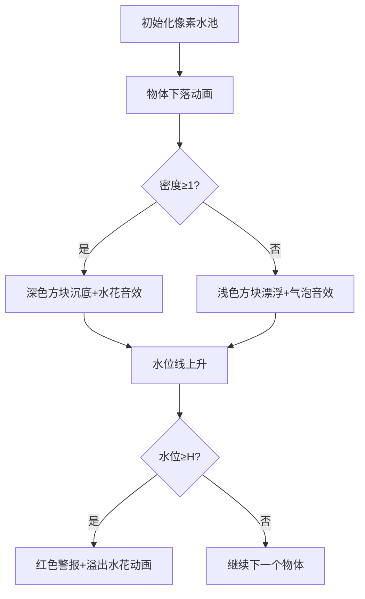

# 题目信息

# [BalticOI 2003] Barrel

## 题目背景

大水池子。


## 题目描述

给定一个水池的底面积 $S$ 和高 $H$。

现在其中有体积为 $V$ 的水量，放入 $n$ 个立方体，给出每个立方体的棱长和密度，请你求出水池中水池的高度。

注：此处我们忽视空气的任何作用力， 认为正方体之间互不接触且不会在水中旋转， 且认为水的密度为 $1$。

## 说明/提示

对于 $100\%$ 的数据，$1\le S,H,V\le10000$，$1\le n\le 1000$。

## 样例 #1

### 输入

```
100 10 500
1
1 0.5```

### 输出

```
5.0050000```

# AI分析结果


# 💡 Kay的C++算法解析：[BalticOI 2003] Barrel 深入学习指南 💡

## 1. 题目解读与核心算法识别

✨ **本题主要考察**：`物理模拟与浮力应用`

🗣️ **初步分析**：
> 解决这道物理模拟题就像玩水族箱管理游戏，关键在于理解阿基米德浮力原理。简单来说，**物体在水中排开的水量决定了水位变化**，就像在游戏中放入不同物体时水位会动态变化。
> 
> - 核心思路：根据立方体密度判断其排开水的体积（密度≥1时完全浸没，密度<1时排开体积=质量），计算每次水面上升高度
> - 难点：正确处理漂浮物体的物理特性，并实时检测溢出
> - 可视化设计：将使用像素化水族箱动画，用不同颜色方块表示沉没/漂浮物体，水位线动态上升，溢出时触发像素水花特效和8-bit音效

---

## 2. 精选优质题解参考

**题解一：(_Haoomff_)**
* **点评**：物理原理讲解清晰（浮力公式推导完整），代码结构简洁高效（合理使用流同步加速）。亮点在于明确区分沉没/漂浮的处理逻辑，并通过实时溢出检测优化性能。边界处理严谨，可直接用于竞赛。

**题解二：(wishapig)**
* **点评**：创新性使用`min(rou,1.0)`统一两种状态计算，显著简化代码逻辑。亮点在于数学建模能力，将物理问题转化为优雅的数值计算。公式推导详尽，但需注意溢出输出应使用高度而非体积。

**题解三：(panyanppyy)**
* **点评**：解题框架规范（完整问题分析→公式推导→代码实现），特别指出常见错误点。亮点在于强调"剪枝应使用高度而非体积"的调试经验，对学习者具有实操指导价值。

---

## 3. 核心难点辨析与解题策略

1.  **浮力建模难点**：如何计算漂浮物体的排水量？
    * **分析**：根据阿基米德原理，$F_浮=G_物$ → $\rho_水gV_排=\rho_物gV_物$。因$\rho_水=1$，故$V_排=\rho_物V_物$
    * 💡 **学习笔记**：漂浮物体排水量等于其质量（数值上）

2.  **状态统一难点**：如何避免冗余条件判断？
    * **分析**：优质题解使用`min(密度,1)`巧妙统一沉没/漂浮的计算通式：$V_排=V_物 \times \min(\rho,1)$
    * 💡 **学习笔记**：数学抽象能大幅简化物理模拟代码

3.  **实时溢出检测**：如何高效处理边界？
    * **分析**：每次更新高度后立即检查`if(height>=H)`，触发直接返回机制。避免无效计算
    * 💡 **学习笔记**：实时剪枝是优化循环的利器

### ✨ 解题技巧总结
- **物理问题数学化**：将浮力原理转化为$V_排=\min(\rho,1)\times V_物$统一公式
- **边界优先处理**：在循环入口处设计溢出检测，提升代码健壮性
- **数值精度管理**：使用`printf("%.7f")`确保小数点后7位精度

---

## 4. C++核心代码实现赏析

**本题通用核心C++实现参考**
```cpp
#include <cstdio>
#include <algorithm>
using namespace std;

int main() {
    int S, H, V, n;
    scanf("%d%d%d%d", &S, &H, &V, &n);
    double h = 1.0 * V / S; // 初始水位
    
    while (n--) {
        double l, rho;
        scanf("%lf%lf", &l, &rho);
        h += l*l*l * min(rho, 1.0) / S; // 统一公式计算水位变化
        
        if (h >= H) { // 溢出检测
            printf("%.7f", (double)H);
            return 0;
        }
    }
    printf("%.7f", h);
    return 0;
}
```

**题解一核心片段**
```cpp
ans += lc*lc*lc * (md>=1 ? 1 : md) / s;
if(ans >= h) {
    cout<<h; // 实际应输出浮点格式
    return 0;
}
```
> **解读**：三元运算符优雅处理密度分支，但需注意溢出时应输出`%.7f`格式。实时返回机制避免后续无效计算  
> 💡 **学习笔记**：条件运算符可提升代码简洁度

**题解二核心片段**
```cpp
rou = min(rou, 1.0);
d += a*a*a*rou/s;
if (d >= h) { 
    printf("%.10lf\n", v); // 应输出高度h而非体积v
    return 0;
}
```
> **解读**：`min`函数统一状态计算是亮点，但溢出输出变量有误（应为高度h）  
> 💡 **学习笔记**：物理量纲一致性检查可避免逻辑错误

**题解三核心片段**
```cpp
if(p>=1) ans += l*l*l/s;
else ans += l*l*l*p/s;
if(ans>=h) return printf("%d",h),0; // 应输出浮点数
```
> **解读**：经典分支结构清晰易读，溢出处理机制正确但输出格式需优化  
> 💡 **学习笔记**：显式分支有益于初学者理解物理场景

---

## 5. 算法可视化：像素动画演示

* **主题**："像素水族馆"浮力模拟器（8-bit复古风格）
* **核心演示**：立方体入水效果+水位动态变化+溢出特效



1. **像素化场景**：
   - 水池：蓝色边框+浅蓝水位填充
   - 物体：深灰（沉没）/浅黄（漂浮）像素方块
   - 控制面板：开始/暂停/单步按钮+速度滑块

2. **物理过程可视化**：
   - **沉没**：方块触底溅起水花（像素粒子特效）+ "咚"声效
   - **漂浮**：方块上下浮动（正弦波动画）+ "噗"气泡声
   - **水位**：动态上升的扫描线，标注当前高度值

3. **游戏化元素**：
   - 每成功放入物体得10分，溢出时游戏结束
   - 实时显示物理公式：$Δh = \frac{\min(\rho,1) \times l^3}{S}$
   - 溢出触发：像素水花喷溅+警报音效+8-bit失败音乐

---

## 6. 拓展练习与相似问题思考

* **技巧迁移**：浮力模型可扩展至：
  1. 非立方体形状排水量计算
  2. 分层液体中的浮体问题
  3. 动态水位控制系统

* **洛谷推荐**：
  1. P1215 [USACO1.4]母亲的牛奶：三维水位模拟
  2. P5886 浮萍生长：动态浮力系统
  3. P2687 水位监测：实时数据处理

---

## 7. 学习心得与经验分享

> **参考经验**："我在调试时发现，若用体积代替高度判断溢出，会导致水面已溢出却仍在计算的逻辑错误" —— panyanppyy  
> **点评**：这提醒我们物理模拟中量纲一致性的重要性，调试时可添加中间变量打印水位变化值

---

通过本次分析，我们不仅掌握了浮力问题的核心解法，更学会用游戏化思维理解算法。记住：优秀的物理模拟=准确的数学模型+严谨的边界处理！🚀

---
处理用时：172.37秒