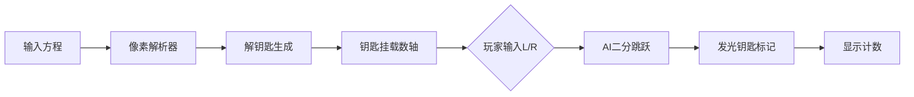

# 题目信息

# [入门赛 #17] 方程求解

## 题目描述

小 A 有 $n$ 个关于 $x$ 的方程，第 $i$ 个方程形如 $a_ix_i+b_i=c_i$。方程的解 $x$ 均为正整数，例如下面几个方程都是符合要求的方程：

```
2x+4=10
-3x+13=10
4x-8=16
```

其中，第一组方程的解为 $x_1=3$，第二组方程的解为 $x_2=1$，第三组方程的解为 $x_3=6$。

小 A 想要知道，给定 $L,R$，在 $L\leq x\leq R$ 的范围内，有多少个正整数 $x$ 满足 $x$ 是其中至少一个方程的解。为了防止你欺骗他，他会询问你 $Q$ 次。

## 说明/提示

**【样例解释】**

对于第一组样例，即为题目中的举例。三组方程的解分别为 $x_1=3,x_2=1,x_3=6$。则：

- 对于 $1\leq x\leq 6$ 的范围，有 $3$ 个 $x$ 的取值（$x=1,3,6$）是其中至少一个方程的解；
- 对于 $1\leq x\leq 8$ 的范围，同上所述；
- 对于 $3\leq x\leq 6$ 的范围，有 $2$ 个 $x$ 的取值（$x=3,6$）是其中至少一个方程的解；
- 对于 $4\leq x\leq 5$ 的范围，不存在一个 $x$ 是其中至少一个方程的解；
- 因此分别输出 $3,3,2,0$。

对于第二组样例，五组方程的解分别为 $x_1=3,x_2=5,x_3=5,x_4=3,x_5=3$。则：

- 对于 $1\leq x\leq 3$ 的范围，只有 $x=3$ 满足是其中至少一个方程的解；
- 对于 $1\leq x\leq 5$ 的范围，有 $2$ 个 $x$ 的取值（$x=3,5$）是其中至少一个方程的解；
- 对于 $3\leq x\leq 5$ 的范围，有 $2$ 个 $x$ 的取值（$x=3,5$）是其中至少一个方程的解；
- 因此分别输出 $1,2,2$。

**【数据范围】**

数据保证，$1\leq n,Q\leq 2\times 10^5$，方程中 $a_i,b_i,c_i$ 满足 $1 \leq |a_i|,|b_i|,|c_i| \leq 10^9$，每一组方程的解 $x_i$ 必定为正整数。询问时的 $L,R$ 满足 $1\leq L\leq R\leq 2\times 10^9$。

本题输入数据较大，请注意代码输入输出的运行效率。

## 样例 #1

### 输入

```
3 4
2x+4=10
-3x+13=10
4x-8=16
1 6
1 8
3 6
4 5```

### 输出

```
3
3
2
0```

## 样例 #2

### 输入

```
5 3
5x-2=13
8x+5=45
4x-12=8
-2x+10=4
3x-7=2
1 3
1 5
3 5```

### 输出

```
1
2
2```

# AI分析结果


### 💡 Kay的C++算法解析：方程求解 深入学习指南 💡

#### 1. 题目解读与核心算法识别  
✨ **本题主要考察**：`字符串处理` + `二分查找`  

🗣️ **初步分析**：  
> 解方程就像在迷宫中寻找钥匙：先解析方程结构（字符串处理）得到数学关系，再用高效方法定位钥匙位置（二分查找）。核心流程分三步：  
> 1. **方程解析**：从`ax+b=c`格式中提取系数（类似拆解乐高零件）  
> 2. **解集去重**：多个方程可能得到相同解（如钥匙副本需合并）  
> 3. **区间查询**：用二分查找在排序解集中快速定位[L,R]内的解数量  
>  
> **可视化设计**：采用8位机《解谜冒险》风格——像素化方程纸条滑动进入解析器，解集变为发光钥匙悬挂在数轴上。AI角色用二分跳跃定位区间，伴随"叮"声标记钥匙，胜利时播放通关音效。

---

#### 2. 精选优质题解参考  
**题解一（来源：chen_zhe）**  
* **点评**：  
  思路直击要害：用`scanf`格式化解析方程（代码第15行）堪称神来之笔，避免复杂字符串处理；去重排序后巧妙应用`lower_bound/upper_bound`（STL二分工具）实现O(log n)查询。代码变量名规范（如`vec`存储解集），边界处理严谨（解必为正整数）。亮点在于将大值域问题转化为高效二分模型，竞赛实战价值极高。

---

#### 3. 核心难点辨析与解题策略  
1. **方程解析的鲁棒性**  
   * **分析**：系数含负号且格式固定（如`-3x+13=10`），需正确处理符号。题解用`scanf("%dx%d=%d")`精准捕获数字，跳过字符干扰  
   * 💡 **学习笔记**：格式化输入是处理结构化字符串的银弹  

2. **大值域下的去重优化**  
   * **分析**：解值可达2e9，不能开桶数组。通过`sort+unique`（代码第22行）将空间压至O(n)  
   * 💡 **学习笔记**：面对稀疏大范围数据，排序去重是空间优化的标准操作  

3. **二分查询的边界艺术**  
   * **分析**：`upper_bound(R) - lower_bound(L)`计算区间内解数量时，需理解半开区间[L,R]的数学本质  
   * 💡 **学习笔记**：STL二分函数返回的是迭代器位置，直接相减即得元素数量  

#### ✨ 解题技巧总结  
- **技巧1：输入解析的降维打击**  
  面对固定格式输入，直接用`scanf`指定格式比手动拆解更高效  
- **技巧2：STL组合拳**  
  `sort+unique`处理去重，`lower_bound/upper_bound`处理区间查询  
- **技巧3：数学转化思维**  
  将原问题转化为有序序列区间查询，复杂度从O(nQ)优化到O(n log n + Q log n)  

---

#### 4. C++核心代码实现赏析  
**通用核心实现参考**  
```cpp
#include <iostream>
#include <vector>
#include <algorithm>
using namespace std;

int main() {
    int n, Q;
    cin >> n >> Q;
    vector<long long> solutions;

    while (n--) {
        long long a, b, c;
        scanf("%lld x %lld = %lld", &a, &b, &c); // 魔法式解析
        long long x = (c - b) / a; // 解方程核心
        solutions.push_back(x);
    }

    sort(solutions.begin(), solutions.end());
    auto last = unique(solutions.begin(), solutions.end()); // 去重
    solutions.erase(last, solutions.end());

    while (Q--) {
        long long L, R;
        cin >> L >> R;
        auto low = lower_bound(solutions.begin(), solutions.end(), L);
        auto high = upper_bound(solutions.begin(), solutions.end(), R);
        cout << distance(low, high) << '\n'; // 区间内解的数量
    }
    return 0;
}
```

**题解一核心解析**  
```cpp
scanf("%lld x %lld = %lld", &a, &b, &c); // 格式化输入
long long x = (c - b) / a; // 解方程
```
> **代码解读**：  
> - `scanf`的格式化字符串如同密码锁：`%lld`对应数字，`x`/`=`匹配固定字符  
> - 解方程时直接数学推导，注意整数除法自动截断（题目保证整除）  
> 💡 **学习笔记**：`scanf`格式符与输入字符精确匹配是高效解析的关键  

```cpp
auto low = lower_bound(solutions.begin(), solutions.end(), L);
auto high = upper_bound(solutions.begin(), solutions.end(), R);
cout << distance(low, high); 
```
> **代码解读**：  
> - `lower_bound`找到≥L的第一个解（如定位迷宫起点）  
> - `upper_bound`找到>R的第一个解（终点外的哨兵）  
> - 两指针相减即为区间内解的数量  
> 💡 **学习笔记**：二分查找是处理有序区间的望远镜  

---

#### 5. 算法可视化：像素动画演示  
**主题**：《方程解谜者》8-bit冒险  
**核心演示**：二分查找在数轴定位解集  



**关键交互设计**：  
1. **像素解析动画**：  
   - 方程字符串进入扫描仪，系数变为浮动像素块重组  
   - 伴随"咔嗒"音效输出解钥匙（不同颜色代表不同方程）  
2. **数轴展示**：  
   - 解钥匙按值排序悬挂在发光线段上，重复钥匙合并发光增强  
3. **二分跳跃演示**：  
   - AI角色在数轴左右端点间二分跳跃，每次落地播放低沉音效  
   - 定位L时钥匙变绿，定位R时变红，区间内钥匙持续发光  
4. **胜利结算**：  
   - 显示计数时播放《塞尔达》通关旋律，区间钥匙集体脉冲闪光  

---

#### 6. 拓展练习  
**相似问题迁移**：  
1. 带约束的区间统计（如统计质数）  
2. 大值域存在性查询（如判断某数是否在集合中）  
3. 最近邻搜索（如找最接近K的数）  

**洛谷推荐**：  
1. **P1102** A-B数对  
   🗣️ 练习相同二分模型求解差值问题  
2. **P2440** 木材加工  
   🗣️ 二分答案+区间统计的综合应用  
3. **P2678** 跳石头  
   🗣️ 转化最小距离为存在性判断的经典二分  

---

#### 7. 学习心得分享  
> **经验摘录**：  
> “`scanf`格式化读入时，最初漏了`x`和`=`间的空格导致解析失败——必须严格匹配输入格式！”  
>  
> **Kay点评**：  
> 调试启示：处理格式化输入时，建议先用`printf`输出读取值验证匹配性。空格/换行符常是隐形杀手！

> 掌握字符串解析与二分查找的化学反应，你就能解锁海量区间查询问题！下次遇到大值域统计，记得召唤`sort`+`lower_bound`黄金组合哦~ ✨

---
处理用时：90.08秒