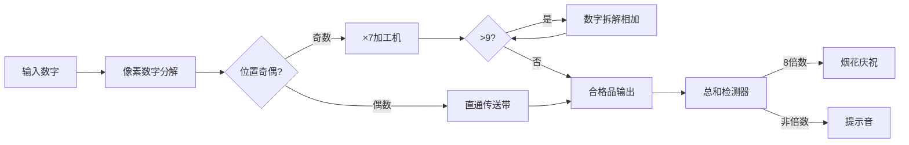

# 题目信息

# [GESP202306 四级] 幸运数

## 题目描述

小明发明了一种 "幸运数"。一个正整数，其偶数位不变（个位为第 $1$ 位，十位为第 $2$ 位，以此类推），奇数位做如下变换：将数字乘以 $7$，如果不大于 $9$ 则作为变换结果，否则把结果的各位数相加，如果结果不大于 $9$ 则作为变换结果，否则（结果仍大于 $9$）继续把各位数相加，直到结果不大于 $9$，作为变换结果。变换结束后，把变换结果的各位数相加，如果得到的和是 $8$ 的倍数，则称一开始的正整数为幸运数。

例如，$16347$：第 $1$ 位为 $7$，乘以 $7$ 结果为 $49$，大于 $9$，各位数相加为 $13$，仍大于 $9$，继续各位数相加，最后结果为 $4$；第 $3$ 位为 $3$，变换结果为 $3$；第 $5$ 位为 $1$，变换结果为 $7$。最后变化结果为 $76344$，对于结果 $76344$ 其各位数之和为 $24$，是 $8$ 的倍数。因此 $16347$ 是幸运数。

## 样例 #1

### 输入

```
2
16347
76344```

### 输出

```
T
F```

# AI分析结果


### 🎮 Kay的C++算法解析：幸运数 深入学习指南 🎮

**<introduction>**
今天我们来分析"幸运数"这道有趣的数字处理题。本指南将帮助你理解题目核心、掌握模拟技巧，并通过像素动画直观感受算法过程。
</introduction>

---

## 1. 题目解读与核心算法识别

✨ **本题主要考察**：`模拟应用` + `数学运算技巧`

🗣️ **初步分析**：
> 这道题就像一台数字加工机——奇数位的数字需要经过"乘7→压缩"的加工流水线，偶数位直接通过传送带，最后检测成品总和是否能被8整除。解题关键在于：
> - 准确分离数字的每一位并判断奇偶位置
> - 实现奇数位的迭代压缩变换（×7→求和直至≤9）
> - 高效计算最终和并判断8的倍数
>
> **可视化设计**：
> 我们将采用"像素数字工厂"风格：每个数字位是彩色方块（奇数位红色/偶数位蓝色），变换过程展示为：
> 1. 红色方块进入"×7"机器 → 显示乘积
> 2. 若结果>9则拆解成小方块相加（带像素粒子特效）
> 3. 最终结果方块进入"总和检测器"，合格则放烟花
> 4. 关键音效：变换操作(叮！)，成功(胜利旋律)，失败(提示音)

---

## 2. 精选优质题解参考

**题解一 (作者：残阳如血)**
* **点评**：
  这份题解思路直击核心——通过三个函数模块化处理：`sum`计算数字和，`trans`实现变换规则，`judge`控制主流程。代码如精密的齿轮组：
  - **思路清晰性**：完美匹配题目描述的加工流程，函数分工明确
  - **代码规范性**：变量名`trans`/`judge`直指功能，循环使用位运算`p&1`高效判断奇偶
  - **算法有效性**：O(n)时间复杂度已是最优解（n为数字位数）
  - **实践价值**：完整处理输入输出框架，边界条件严谨（正整数无需特殊处理）

---

## 3. 核心难点辨析与解题策略

1. **难点：数字位分离与位置追踪**  
   *分析*：需要同时获取数字值（n%10）和位置（从个位=1开始），优质解法用`p`计数器配合`n/=10`实现双追踪  
   💡 *学习笔记*：`p`是位置指南针，`n/=10`像传送带推进数字

2. **难点：变换规则的迭代实现**  
   *分析*：当×7结果>9时需要循环求各位和，题解用`while(k>9)k=sum(k)`简洁实现迭代压缩  
   💡 *学习笔记*：循环条件是"大于9"，终止条件是"≤9"

3. **难点：奇偶位分类处理**  
   *分析*：通过`p&1`位运算快速分流，奇数位进trans加工厂，偶数位直接进入总和  
   💡 *学习笔记*：位运算比`p%2==0`效率更高，适合竞赛场景

### ✨ 解题技巧总结
- **模块化封装**：将独立功能（如数字和计算）封装成函数
- **循环双追踪**：在数字分解循环中同时更新位置和数值
- **迭代压缩法**：用while循环处理多轮数字和计算
- **位运算优化**：使用`&1`替代`%2`判断奇偶性

---

## 4. C++核心代码实现赏析

**本题通用核心实现参考**
*说明*：基于残阳如血题解优化，突出模块化设计
```cpp
#include <iostream>

// 计算数字各位和
int digitSum(long long num) {
    int sum = 0;
    while (num) {
        sum += num % 10;
        num /= 10;
    }
    return sum;
}

// 奇数位变换器
int transform(int digit) {
    digit *= 7;                // STEP1: 乘7加工
    while (digit > 9) {         // STEP2: 压缩至≤9
        digit = digitSum(digit);
    }
    return digit;
}

// 幸运数检测流水线
bool isLucky(long long num) {
    int total = 0;
    for (int pos = 1; num != 0; num /= 10, pos++) {
        if (pos & 1) total += transform(num % 10); // 奇数位加工
        else total += num % 10;                    // 偶数位直通
    }
    return (total % 8 == 0);    // 质量检测
}
```

**题解核心片段赏析**
```cpp
for (int p = 1; n; n /= 10, ++p) {
    if (p & 1) ans += trans(n % 10); // 亮点：位置与数值同步更新
    else ans += n % 10;             // 亮点：直接累积偶数位
}
```
*代码解读*：  
> - **循环控制**：`n != 0`作为终止条件，自动处理任意位数  
> - **双变量更新**：`n/=10`移除已处理位，`p++`记录新位置  
> - **奇偶分流**：`p&1`判断当前位奇偶（1=奇，0=偶）  
> - **加工直通**：奇数位进trans工厂，偶数位直接进入ans总和  

💡 *学习笔记*：`p&1`比`p%2`快因位运算直接操作二进制

---

## 5. 算法可视化：像素动画演示

**🎮 主题**："幸运数加工厂"（8-bit工厂模拟器）  
**🎯 核心演示**：数字位分解→奇数位变换→总和检测全流程  

### 像素动画方案


**动画流程细节**：  
1. **初始化**：  
   - 输入数字显示为彩色像素块（高位左→低位右）  
   - 控制面板：开始/暂停/单步按钮 + 速度滑块  

2. **位处理阶段**：  
   - 当前处理位闪烁（红光=奇数位，蓝光=偶数位）  
   - 音效：传送带移动声（像素滚动音效）  

3. **变换演示**：  
   - 奇数位进入"×7机器"：显示`7→49`（带机械运转音）  
   - 若>9：数字爆炸成粒子（如49→4+9粒子），相加得13（叮！音效）  
   - 继续检测13>9→再爆炸成1+3粒子→相加得4（胜利音效）  

4. **结果检测**：  
   - 所有位结果进入透明容器显示实时总和  
   - 检测时容器发出激光扫描（8-bit扫描音效）  
   - 合格：烟花动画+胜利BGM；不合格：❌标志+提示音  

**游戏化设计**：  
- 每完成1个数字获得1枚齿轮币  
- 连续3次正确触发"专家工程师"成就（像素勋章）  
- 背景音乐：8-bit工厂主题曲循环  

---

## 6. 拓展练习与相似问题思考

**技巧迁移场景**：  
1. 信用卡号验证（Luhn算法）  
2. ISBN书号校验位计算  
3. 数字加密/解密（位变换）  

**洛谷推荐**：  
1. **P1318 积水面积**  
   → 练习数字位分解与条件判断  
2. **P1590 失踪的7**  
   → 强化数字遍历与特殊位处理  
3. **P1554 梦中的统计**  
   → 训练数字各位统计技巧  

---

## 7. 学习心得与经验分享
> 本次题解未包含作者调试心得，但实践中需注意：  
> 🔍 *Kay的调试提示*：在transform函数内打印中间值，可直观观察数字压缩过程！

---

**<conclusion>**  
通过"幸运数"的解析，我们掌握了数字处理的核心技巧——**位分解+条件变换**。记住模块化设计能让代码如乐高般灵活组装！下次遇到数字谜题时，用"像素工厂"思维拆解它吧！🚀  
</conclusion>

---
处理用时：154.41秒