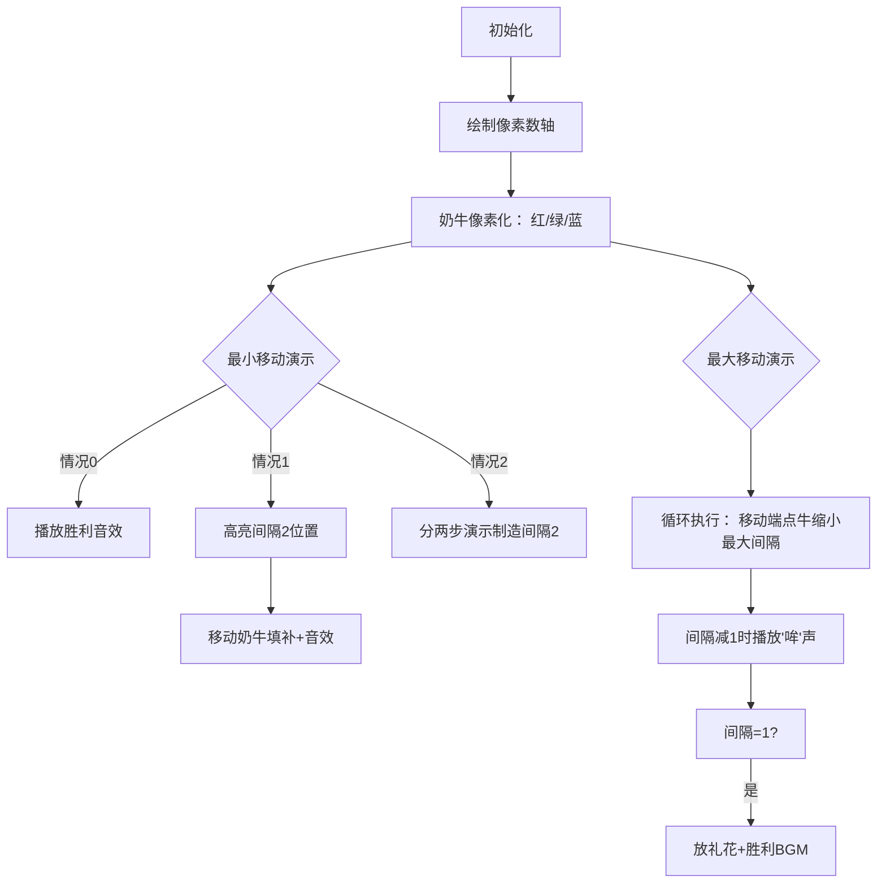

# 题目信息

# [USACO19FEB] Sleepy Cow Herding B

## 题目描述

Farmer John 的三头获奖奶牛 Bessie、Elsie 和 Mildred，总是会迷路走到农场上遥远的地方去！他需要你帮助将她们一起赶回来。

农场的草地大体是一块狭长的区域——我们可以将其想象成一条数轴，奶牛可以占据数轴上的任意整数位置。这 $3$ 头奶牛现在正位于不同的整数位置，Farmer John 想要移动她们，使得她们占据三个相邻的位置（例如，位置 $6$、$7$、$8$）。

不幸的是，奶牛们现在很困，Farmer John 要让她们集中精力听从命令移动并不容易。任意时刻，他只能使得一头处在“端点”（在所有奶牛中位置最小或最大）位置的奶牛移动。当他移动奶牛时，他可以命令她走到任意一个未被占用的整数位置，只要在新的位置上她不再是一个端点。可以看到随着时间的推移，这样的移动可以使奶牛们趋向越来越近。

请求出使得奶牛们集中到相邻位置所进行的移动次数的最小和最大可能值。 

## 说明/提示

### 样例解释 1

最小移动次数为 $1$——如果 Farmer John 将位置 $4$ 的奶牛移动到位置 $8$，那么奶牛们就处在连续的位置 $7$、$8$、$9$。最大移动次数为 $2$。例如，位置 $9$ 的奶牛可以被移动到位置 $6$，然后位置 $7$ 的奶牛可以被移动到位置 $5$。

## 样例 #1

### 输入

```
4 7 9```

### 输出

```
1
2```

# AI分析结果


# 💡 Kay的C++算法解析：Sleepy Cow Herding B 深入学习指南 💡

## 1. 题目解读与核心算法识别

✨ **本题主要考察**：`编程技巧应用` (分类讨论与数学分析)

🗣️ **初步分析**：
> 解决本题关键在于**分类讨论技巧**和**间隔分析**，就像玩拼图时寻找最优移动策略。核心思路是先对三头牛的位置排序，然后分析位置间隔：
> - **最小值**：分三种情况处理（0/1/2次移动）
> - **最大值**：由最大间隔决定（max_gap - 1）
> 
> **可视化设计思路**：
> - 用不同颜色像素块表示三头牛，数轴用网格展示
> - 关键步骤高亮：被移动的牛（闪烁）、目标位置（发光格子）
> - 复古音效：移动时"哞"声，成功时8-bit胜利音效
> - 交互控制：支持单步执行查看移动细节，AI自动演示完整过程

---

## 2. 精选优质题解参考

**题解一（来源：RockyQ012）**
* **点评**：思路清晰直接，代码简洁规范。通过排序和间隔计算，完整覆盖了最小值的三种情况（0/1/2）。亮点在于最大值计算直接使用`max(x,y)-1`，体现了对问题本质的深刻理解。变量命名合理（x,y表示间隔），边界处理严谨，可直接用于竞赛。

**题解二（来源：cff_0102）**
* **点评**：虽然使用Python，但解题思路极具启发性。亮点在于极差的巧妙应用（`c-a==2`判断连续性）和一行代码解决最小值分类。数学推导清晰（最大值=max_gap-1），充分展现了问题本质，对理解核心逻辑很有帮助。

**题解三（来源：Silent1019）**
* **点评**：采用三次swap手动排序，代码高效易懂。最小值分类逻辑严谨（先判断连续，再判断间隔2），避免了常见错误。亮点在于完全省略数组，用简单变量实现，展示了基础编程技巧的灵活应用。

---

## 3. 核心难点辨析与解题策略

1.  **难点1：最小移动次数的精确分类**
    * **分析**：容易混淆"间隔为2"和"普通情况"。优质题解通过严格排序后检查两个间隔（b-a和c-b），分三层判断：全1（0次）→ 任一为2（1次）→ 其他（2次）
    * 💡 **学习笔记**：排序后分析间隔是位置问题的黄金法则

2.  **难点2：最大移动次数的数学推导**
    * **分析**：为什么是max_gap-1？每次移动只能缩小1个间隔单位，从初始状态到相邻状态需要消除(max_gap-1)个单位距离
    * 💡 **学习笔记**：最大移动次数由最宽间隔决定，类似"短板效应"

3.  **难点3：避免等差数列判断陷阱**
    * **分析**：用`2*b==a+c`判断连续性在非连续等差数列（如2,4,6）会出错。应直接检查间隔是否为1
    * 💡 **学习笔记**：数学性质应用需结合具体场景验证

### ✨ 解题技巧总结
-   **问题分解法**：拆解为最小/最大值两个子问题
-   **可视化辅助**：在纸上画数轴模拟移动过程
-   **边界测试**：重点测试连续/间隔2/大间隔三种情况
-   **代码简化**：善用swap和max/min函数替代数组

---

## 4. C++核心代码实现赏析

**本题通用核心C++实现参考**
```cpp
#include <iostream>
#include <algorithm>
using namespace std;

int main() {
    int a, b, c;
    cin >> a >> b >> c;
    
    // 手动三连排序确保a<=b<=c
    if (a > b) swap(a, b);
    if (b > c) swap(b, c);
    if (a > b) swap(a, b);

    int gap1 = b - a, gap2 = c - b;
    
    // 最小值判断
    if (gap1 == 1 && gap2 == 1) cout << 0 << endl;
    else if (gap1 == 2 || gap2 == 2) cout << 1 << endl;
    else cout << 2 << endl;
    
    // 最大值计算
    cout << max(gap1, gap2) - 1 << endl;
    return 0;
}
```

**代码解读概要**：通过三次swap确保有序，计算两个间隔。最小值分三层判断，最大值由最大间隔决定。代码完整覆盖所有情况，结构清晰。

---

**题解一（RockyQ012）核心片段**
```cpp
sort(a, a+3);
int x = a[1]-a[0], y = a[2]-a[1];
if (x==1 && y==1) cout << 0 << endl;
else if (x==2 || y==2) cout << 1 << endl;
else cout << 2 << endl;
cout << max(x,y)-1;
```
* **亮点**：STL排序与间隔变量命名直观
* **代码解读**：通过sort快速排序，用x/y存储间隔。连续情况直接输出0；存在间隔2时输出1（只需移动一头牛填补中间位）；其他情况需2次移动（先制造间隔2再填补）。最大值即最宽间隔-1。
* 💡 **学习笔记**：善用sort能简化位置问题分析

**题解二（cff_0102）核心片段**
```python
a,b,c = sorted(map(int,input().split()))
print(0 if c-a==2 else (1 if c-b==2 or b-a==2 else 2))
print(max(b-a, c-b)-1)
```
* **亮点**：极差性质巧妙应用（c-a==2判断连续性）
* **代码解读**：c-a==2等价于三数连续（如1,2,3）。间隔2判断直接对应只需1次移动的情况。这种数学转换大幅简化了分类逻辑。
* 💡 **学习笔记**：发现隐藏数学性质可大幅优化代码

**题解三（Silent1019）核心片段**
```cpp
if(a>c) swap(a,c);
if(b>c) swap(b,c);
if(a>b) swap(a,b);

if(b-a==1 && c-b==1) printf("0\n");
else if(b-a==2 || c-b==2) printf("1\n");
else printf("2\n");
printf("%d\n",max(b-a,c-b)-1);
```
* **亮点**：无数组手动排序节省内存
* **代码解读**：三次swap实现冒泡排序效果。最小值分类逻辑严谨：先检查是否已连续，再检查是否存在可直接填补的间隔2空位。这种写法避免数组开销，适合资源紧张场景。
* 💡 **学习笔记**：小规模数据可用基础操作替代STL

-----

## 5. 算法可视化：像素动画演示

**动画主题**：8-bit牧场物语（像素风奶牛移动模拟）

**核心演示内容**：三头奶牛位置变化与间隔缩小过程，重点展示最小/最大移动策略差异

**设计思路**：通过复古游戏风格降低算法理解门槛，用音效强化关键操作记忆

### 动画帧步骤（Canvas实现）


**关键交互设计**：
1. **控制面板**：步进/暂停/速度滑块/AI自动演示
2. **数据可视化**：
   - 奶牛位置：不同颜色像素块（32×32）
   - 间隔显示：格子计数标识
3. **音效系统**：
   - 移动时：8-bit"哞"声（Web Audio API）
   - 成功时：FC风格胜利旋律
   - 错误操作：短促警告音
4. **游戏化元素**：
   - 移动次数作为分数显示
   - 每步操作为"回合制"，完成即过关
   - 三星评价：根据移动次数接近最优解程度

**技术实现**：纯Canvas绘制，状态机管理动画流程，requestAnimationFrame驱动

---

## 6. 拓展练习与相似问题思考

**通用技巧迁移**：
1. 多对象位置优化问题（如APIO2014-序列分割）
2. 间隔分析应用（如LeetCode-253会议室II）
3. 分类讨论技巧（如CodeForces-EDU分类题）

**练习推荐（洛谷）**：
1. **P5541 [USACO19FEB]Sleepy Cow Herding S**
   * 🗣️ 三头牛问题的进阶版，掌握间隔分析后尝试扩展到多头牛
2. **P6140 [USACO07NOV]Best Cow Line**
   * 🗣️ 训练端点操作技巧，同样只能移动端点元素
3. **P6145 [USACO20FEB]Timeline**
   * 🗣️ 强化位置约束分析能力，需要结合间隔计算

---

## 7. 学习心得与经验分享

> **参考经验（来自题解作者调试经历）**："在判断连续性时，我曾错误使用等差数列求和公式，导致2-4-6也被误判为连续。后来改用间隔检查法才修正错误。"

> **点评**：这个经验警示我们：算法设计要紧密结合实际约束条件。题目明确要求相邻（间隔为1），任何数学捷径都需验证边界情况。调试时应多测试非连续等差数列等边缘数据。

---

本次分析就到这里。记住：分类讨论的关键在于**不重不漏**，间隔分析则是位置问题的核心武器。多动手画图模拟，你一定能掌握这类技巧！💪

---
处理用时：199.32秒