# 题目信息

# [NICA #1] 序列

## 题目描述

小 A 有一个长度为 $n$ 的序列 $a_1,a_2,\dots a_n$。他希望支持两种操作：

- `1 k`，给序列中的每一个元素加上一个整数 $k$；
- `2`，查询序列中的最大子序列和。

子序列指的是从原序列中去除某些元素（也可以不去除），但不破坏余下元素的相对位置形成的新的序列。例如，对于序列 $\{2,3,4,5,6\}$，那么 $\{2,3,4\},\{2,4,6\}$ 都是它的子序列，而 $\{6,5,4\}$ 不是。子序列可以为空，此时子序列和为 $0$。

## 说明/提示

**【样例解释】**

- 第一次操作求序列中的最大子序列和，则为 $12+2+8=22$；
- 第二次操作让序列中每一个元素加上了 $3$。此时序列变为 $-2,15,-4,5,11$；
- 第三次操作求序列中的最大子序列和，则为 $15+5+11=31$；
- 第四次操作让序列中每一个元素加上了 $4$。此时序列变为 $2,19,0,9,15$；
- 第五次操作求序列中的最大子序列和，则为 $2+19+9+15=45$。

数据保证，$1 \leq n,m \leq 5\times 10^5$，$-5\times 10^5 \leq a_i,k \leq 5\times 10^5$，操作仅为 $1$ 或 $2$ 操作。

## 样例 #1

### 输入

```
5 5
-5 12 -7 2 8
2
1 3
2
1 4
2```

### 输出

```
22
31
45```

# AI分析结果


### 💡 Kay的C++算法解析：[NICA #1] 序列 深入学习指南 💡

**引言**  
今天我们一起分析洛谷B3799题《序列》。这道题要求高效处理序列的全局修改和查询操作，核心在于理解最大子序列和的本质是**所有非负数的和**。下面我将带大家梳理解题思路，剖析算法精髓，并通过像素动画直观展示算法过程。

---

## 1. 题目解读与核心算法识别

✨ **本题主要考察**：`排序与二分查找`（辅以桶排序变种）  

🗣️ **初步分析**：  
> 序列问题可以想象成学生按身高排队（排序），全局加操作相当于给所有人脚下垫同样高度的砖块（增量delta）。最大子序列和就是找出垫砖后头顶超过地面的学生（非负数），计算他们的总身高（原值+delta）。  
> - **核心思路**：预处理排序后，用二分快速定位非负数边界，结合后缀和/桶前缀和高效计算  
> - **算法流程**：排序 → 预处理前缀和/后缀和 → 维护全局delta → 二分查找边界 → 计算非负数和  
> - **可视化设计**：像素网格展示序列元素，高亮二分查找的指针移动（蓝/红指针），非负数区域用绿色闪烁，音效随比较结果变化（高音>0，低音≤0），控制台同步显示代码执行行  

---

## 2. 精选优质题解参考

**题解一：2011FYCCCTA（手写二分+后缀和）**  
* **点评**：思路清晰展示了排序+二分的完整推导，手写二分时特别注意边界初始化（`p=n+1`）。代码中后缀和预处理`sum[i]=a[i]+sum[i+1]`直接支持范围求和，变量命名规范（`add`表增量）。亮点在于对全负数情况的严谨处理，实践时可直接用于竞赛。  

**题解二：lrqlrq250（STL二分+后缀和）**  
* **点评**：用`lower_bound`替代手写二分，大幅简化代码。升序排序与后缀和的组合使非负数集中在序列尾部，逻辑直观。代码中`signed main()`和`stable_sort`体现C++特性，时间复杂度稳定在$O(m \log n)$，是工程实践的优秀范例。  

**题解三：Light_az（桶排序+值域前缀和）**  
* **点评**：创新性使用桶排序处理值域有限问题，将原始值映射到`[0,10^6]`区间。通过前缀和数组`cnt`/`sum`实现$O(1)$查询，针对delta的三种情况分类处理，空间换时间的典范。亮点是数学建模能力，适合拓展值域固定的类似问题。  

---

## 3. 核心难点辨析与解题策略

1. **难点1：如何避免每次查询的O(n)遍历？**  
   * **分析**：优质解法均通过预处理（排序/桶统计）将查询复杂度降至$O(\log n)$或$O(1)$。关键在于识别**全局加不改变序列有序性**，只需维护增量delta。  
   * 💡 **学习笔记**：预处理是优化多次查询的黄金法则。  

2. **难点2：如何高效计算非负数的和？**  
   * **分析**：升序排序后用二分定位首个≥-delta的位置`p`，则非负数和=`后缀和[p] + (n-p+1)*delta`。桶排序中则用值域前缀和快速计算区间和。  
   * 💡 **学习笔记**：后缀和/前缀和是范围求和的利剑。  

3. **难点3：如何正确处理边界条件？**  
   * **分析**：全负数时输出0（`p=n+1`），全非负数时直接整体求和。桶排序中需特殊处理delta超出值域的情况（如delta>5e5全正，delta<-5e5全负）。  
   * 💡 **学习笔记**：边界是代码健壮性的试金石。  

### ✨ 解题技巧总结
- **技巧1：问题转化艺术** - 最大子序列和→非负数和  
- **技巧2：预处理组合技** - 排序+二分/桶统计+前缀和  
- **技巧3：增量分离术** - 用delta统一处理全局加，避免修改原序列  

---

## 4. C++核心代码实现赏析

**通用核心实现（lrqlrq250优化版）**  
```cpp
#include <bits/stdc++.h>
#define ll long long
using namespace std;
const int N = 5e5+5;

ll n, m, a[N], sum[N], delta;

int main() {
    scanf("%d%d", &n, &m);
    for(int i=1; i<=n; ++i) scanf("%lld", &a[i]);
    sort(a+1, a+n+1);                          // 升序排序
    for(int i=n; i>=1; --i) sum[i]=a[i]+sum[i+1]; // 后缀和

    while(m--) {
        int op; scanf("%d", &op);
        if(op == 1) { 
            ll k; scanf("%lld", &k); 
            delta += k; 
        } else {
            int p = lower_bound(a+1, a+n+1, -delta) - a; // STL二分
            printf("%lld\n", (p<=n) ? sum[p] + (n-p+1)*delta : 0);
        }
    }
    return 0;
}
```
* **说明**：综合优质题解的最简实现，排序+后缀和+STL二分  
* **解读概要**：  
  1. 排序使序列单调，保证二分有效性  
  2. 后缀和`sum[i]`表示从i到n的元素和  
  3. `lower_bound`快速定位首个≥-delta的位置  
  4. 非负数和=后缀和[p] + 区间元素数*delta  

---

**题解一核心片段（2011FYCCCTA）**  
```cpp
int p = n+1, l=1, r=n;    // 难点：p初始化为n+1
while(l <= r) {
    int mid = (l+r)/2;
    if(a[mid]+add > 0) {   // 关键比较
        p = mid;           // 更新边界
        r = mid-1;         // 向左收缩
    } else l = mid+1;      // 向右收缩
}
ans = sum[p] + (n-p+1)*add;
```
* **亮点**：手写二分凸显算法本质  
* **解读**：  
  - `p=n+1`巧妙处理全负数情况  
  - 比较`a[mid]+add>0`动态计算当前值  
  - 收缩方向取决于比较结果  
* 💡 **学习笔记**：手写二分需注意等号处理与边界更新  

**题解三核心片段（Light_az桶排序）**  
```cpp
// 桶预处理（值域[-5e5,5e5]→[0,1e6]）
cnt[x+500000]++;           // 计数桶
sum[x+500000] += x;        // 值桶

// 查询操作
if(delta > 500000)  output = total_sum + delta*n;
else if(delta < -500000) output = 0;
else {
    int L = 500000 - delta; // 关键！计算原始值下限
    output = sum_range(L, 1e6) + delta * cnt_range(L, 1e6);
}
```
* **亮点**：值域映射+数学推导实现O(1)查询  
* **解读**：  
  - `x+500000`将负值转为非负索引  
  - `L=500000-delta`为当前非负数的原始值下限  
  - `sum_range`/`cnt_range`通过前缀和数组快速计算  
* 💡 **学习笔记**：桶排序是值域固定问题的神兵利器  

---

## 5. 算法可视化：像素动画演示

**主题**：像素二分寻宝大冒险（复古FC风格）  
**核心演示**：升序排列的序列→全局加砖块→二分查找非负数边界  

```mermaid
graph LR
  A[初始化] --> B[像素网格展示序列]
  B --> C[排序动画： 冒泡效果]
  C --> D[操作1： 全局加k<br>砖块上升动画]
  D --> E[操作2： 二分查找<br>蓝/红指针移动]
  E --> F[比较音效： 高音>0 低音≤0]
  F --> G[结果： 非负数区绿色闪烁]
```



**动画帧步骤**：  
1. **场景初始化**  
   - 8-bit像素网格（32×16），每格显示数值与高度条  
   - 控制面板：速度滑块/单步/播放/重置按钮  
   - 背景：复古芯片音乐循环  

2. **排序过程**  
   - 冒泡排序动画：相邻元素比较时黄色闪烁，交换时红色箭头+“哔”音效  

3. **全局加操作**  
   - 所有格子下方升起砖块（高度=k），数值实时更新  
   - 伴随“叮叮”连续音效  

4. **二分查找演示**  
   - 左指针（蓝色）/右指针（红色）在网格上方移动  
   - 中间指针（黄色）下落至mid位置，格子高亮闪烁  
   - 显示比较式：`a[mid]+delta` vs 0  
   - 结果>0：指针向左收缩，播放高音“叮~” 
   - 结果≤0：指针向右收缩，播放低音“咚~” 

5. **结果展示**  
   - 非负数区域绿色波浪闪烁+“胜利”音效  
   - 显示计算公式：`后缀和[p] + (n-p+1)*delta`  

**交互设计**：  
- AI自动演示：贪吃蛇式自动执行二分步骤  
- 关卡设计：每完成1次查询解锁新速度档位  
- 调试模式：显示变量delta/p的实时值  

---

## 6. 拓展练习与相似问题思考

**通用技巧迁移**：  
1. 全局修改+区间查询 → 树状数组/线段树  
2. 值域有限问题 → 桶排序+前缀和  
3. 二分边界查找 → 变种应用于最优解问题  

**洛谷推荐**：  
1. **P1908 逆序对**  
   🗣️ 巩固排序与分治思想，理解归并排序的经典应用  
2. **P3368 树状数组2**  
   🗣️ 学习区间修改的通用解法，对比本题差分技巧  
3. **P1271 选举学生会**  
   🗣️ 桶排序模板题，强化值域映射思维  

---

## 7. 学习心得与经验分享

> **参考经验 (来自优质题解)**：  
> - *2011FYCCCTA*：`p=n+1的初始化避免全负数情况遗漏，边界是二分的关键`  
> - *Light_az*：`桶排序中delta超界的分类讨论，数学建模决定代码分支`  
>
> **点评**：这些经验深刻揭示：算法核心不仅在于主流程，更在于边界和特例的严谨处理。调试时建议用`delta=±5e5`的极端数据验证。  

---

**结语**  
通过《序列》这道题，我们掌握了全局修改问题的两大解法框架：排序二分与桶排序。记住，优秀的算法既需要洞察问题本质的智慧，也需要严谨处理细节的耐心。下次我们将挑战更复杂的动态维护问题，继续前进吧！💪

---
处理用时：237.97秒