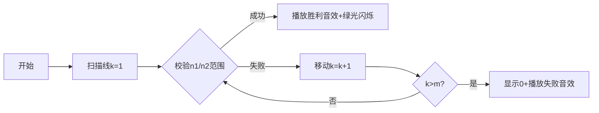

# 题目信息

# [海淀区小学组 2023] 分数线

## 题目背景

2023 年海淀区中小学生信息学竞赛小学组复赛题目，数据为洛谷自造。

为更好区分不同做法，本题时限下调到 500 毫秒。

## 题目描述

一次比赛中，所有参加比赛的选手都获得了一个分数 $ s $。已知有 $ c_1 $ 个同学得 $1$ 分，$ c_2 $ 个同学得 $2$ 分，……，$ c_m $ 个同学得 $ m $ 分。

请你划定一个分数线 $ k $，使得不低于分数线 $ k $ 的人数 $ n_1 $ 和低于分数线 $ k $ 的人数 $ n_2 $ 均在给定的一个范围 $[x, y]$ 之内，即 $ x \leq n_1 \leq y $，$ x \leq n_2 \leq y $。

保证 $ s $ 和 $ k $ 一定是整数，且 $ 1 \leq s \leq m $，$ 1 \leq k \leq m $。

## 说明/提示

### 样例解释

在样例 $1$ 中，如果把分数线划定为 $3$，则有 $7$ 个学生低于分数线，$6$ 个同学不低于分数线，人数都在 $[6,8]$ 范围内。在样例 $2$ 中，分数线划定为 $3$ 和 $4$ 都可以，但按照题目的要求应该输出更小的答案，应该是 $3$。

### 数据范围

对于 $50\%$ 的数据，$ 2 \leq m \leq 100 $，$ 0 \leq c_i \leq 100 $，$ 1 \leq x \leq y \leq 10000 $。

对于 $100\%$ 的数据，$ 2 \leq m \leq 10^5 $，$ 0 \leq c_i \leq 10^5 $，$ 1 \leq x \leq y \leq 10^9 $。


## 样例 #1

### 输入

```
5
3 4 3 2 1
6 8```

### 输出

```
3```

## 样例 #2

### 输入

```
5
0 3 3 4 2
3 10```

### 输出

```
3```

## 样例 #3

### 输入

```
2
2 5
3 6```

### 输出

```
0```

# AI分析结果


### 💡 Kay的C++算法解析：分数线 深入学习指南 💡

**引言**  
今天我们来分析"分数线"这道C++编程题。本指南将帮助你理解题目核心、掌握前缀和技巧，并通过生动可视化理解算法执行过程。

---

### 1. 题目解读与核心算法识别

✨ **本题主要考察**：`编程技巧应用`（前缀和算法）

🗣️ **初步分析**：  
> 解决分数线问题，关键在于运用**前缀和技巧**。想象你有一张成绩累计统计表（前缀和数组），能快速查询任意分数段的人数，就像超市收银台实时显示商品累计金额。  
> - **核心思路**：预处理前缀和数组后，枚举分数线k，用O(1)时间计算低于/不低于k的人数并校验范围  
> - **难点**：正确处理边界（k=1/k=m），注意数据范围（long long）  
> - **可视化设计**：用移动的分数线扫描像素化成绩柱状图，实时显示两侧人数（复古游戏音效提示校验结果）

---

### 2. 精选优质题解参考

**题解一：Sliarae（后缀和法）**  
* **点评**：  
  采用后缀和逆向预处理（s[i] = s[i+1] + c[i]），思路新颖且完整覆盖k=1~m。代码规范（sync_with_stdio加速），循环边界处理严谨。亮点在于用总人数s[1]-s[k]计算低于人数，避免额外数组，空间效率优。

**题解二：liwanxian（前缀和法）**  
* **点评**：  
  经典前缀和解法（prefix[i]=prefix[i-1]+c[i]），枚举k=1~m全面无遗漏。变量命名qzh清晰，但tmp/tmp1可读性稍弱。实践价值高，完整处理了k=1时prefix[0]=0的边界情况。

**题解三：Lyx8058（前缀和法）**  
* **点评**：  
  与题解二思路一致但代码更简洁。明确定义d数组为前缀和，n1/n2变量名增强可读性。严格处理数据范围（#define long long），对青少年学习是优秀范例。

---

### 3. 核心难点辨析与解题策略

1. **难点：边界条件处理（k=1/m）**  
   * **分析**：当k=1时低于人数=0；k=m时不低于人数=c[m]。优质题解通过完整枚举1~m并设计prefix[0]=0解决  
   * 💡 **学习笔记**：枚举范围必须包含理论极值点

2. **难点：数据范围溢出**  
   * **分析**：总人数最大10^10，int会溢出。所有优质题解均使用long long  
   * 💡 **学习笔记**：看到10^5数量级相乘要警惕溢出

3. **难点：快速计算分段人数**  
   * **分析**：暴力计算O(n^2)超时，前缀和/后缀和将查询优化至O(1)  
   * 💡 **学习笔记**：区间统计问题优先考虑前缀和

#### ✨ 解题技巧总结
- **技巧1 预处理加速**：前缀和/后缀和是区间统计问题的"瑞士军刀"
- **技巧2 完备性检验**：枚举范围需覆盖所有理论可能性
- **技巧3 防御性编程**：大数量级运算主动使用long long
- **技巧4 变量语义化**：用n1/n2替代tmp增强可读性

---

### 4. C++核心代码实现赏析

**本题通用核心实现（前缀和法）**  
```cpp
#include <iostream>
using namespace std;
const int N = 1e5 + 10;

int main() {
    long long m, c[N], prefix[N] = {0}, x, y;
    cin >> m;
    for (int i = 1; i <= m; i++) {
        cin >> c[i];
        prefix[i] = prefix[i-1] + c[i]; // 前缀和预处理
    }
    cin >> x >> y;
    
    for (int k = 1; k <= m; k++) {
        long long n2 = prefix[k-1];       // 低于k的人数
        long long n1 = prefix[m] - n2;    // 不低于k的人数
        if (n1 >= x && n1 <= y && n2 >= x && n2 <= y) {
            cout << k;
            return 0;
        }
    }
    cout << 0;
}
```
**代码解读概要**：  
> 1. 读入分数分布表c[i]并计算前缀和prefix  
> 2. 枚举分数线k（1~m），用prefix[k-1]获取低于人数  
> 3. 总人数减prefix[k-1]得不低于人数  
> 4. 校验两者均在[x,y]区间则输出k  

---

**题解片段赏析**  

**Sliarae（后缀和）**  
```cpp
for (int i = n; i; --i) s[i] += s[i + 1]; // 后缀和预处理
for (int i = 1; i <= n; ++i) // 枚举分数线i
    if (x <= s[i] && s[i] <= y && x <= s[1]-s[i] && s[1]-s[i] <= y)
        return cout << i, 0;
```
> **亮点**：逆向思维减少变量  
> **解读**：s[i]表示≥i分的人数，s[1]-s[i]自然就是<i分的人数，省去额外存储  
> 💡 **学习笔记**：后缀和是前缀和的"镜像技巧"，适用逆向统计  

**liwanxian（边界处理）**  
```cpp
for (long long i = 1; i <= m; i++) { 
    long long tmp = qzh[i-1];          // 低于人数
    long long tmp1 = qzh[m] - qzh[i-1];// 不低于人数
    if (tmp >= x && tmp <= y && tmp1 >= x && tmp1 <= y) {
        cout << i; return 0;
    }
}
```
> **亮点**：完备枚举k=1~m  
> **解读**：当i=1时qzh[0]=0，自然处理边界  
> 💡 **学习笔记**：数组默认初始化是处理边界的利器  

**Lyx8058（防御性编程）**  
```cpp
#define int long long // 防御溢出
int d[N] = {0}; // 显式初始化
for (int i = 1; i <= m; i++) {
    int n2 = d[i-1], n1 = d[m] - d[i-1];
    if (n1 >= x && n1 <= y && n2 >= x && n2 <= y) {
        cout << i; return 0;
    }
}
```
> **亮点**：变量命名提升可读性  
> **解读**：n1/n2比tmp更清晰，显式初始化避免未定义行为  
> 💡 **学习笔记**：语义化变量名是优质代码的标配  

---

### 5. 算法可视化：像素动画演示

**主题**：复古成绩扫描仪（8-bit像素风）  

**核心演示内容**：  
- 像素化成绩柱状图（不同颜色块表示分数段人数）  
- 红色扫描线从左至右移动（分数线k）  
- 实时显示两侧人数（左侧：蓝字；右侧：绿字）  
- 校验成功时播放"胜利音效"并高亮分数线  

**交互设计**：  


**实现细节**：  
1. **像素渲染**：Canvas绘制16色柱状图，每柱代表c[i]  
2. **扫描动画**：红线以5px/帧右移，触边反弹音效  
3. **实时显示**：  
   ```javascript
   function updateCounters(k) {
       n2 = prefix[k-1]; // 左侧蓝字
       n1 = total - n2;  // 右侧绿字
       if(n1>=x && n1<=y && n2>=x && n2<=y) {
           playSound('victory.wav'); // 8-bit胜利音效
           highlight(k); // 绿光闪烁
       }
   }
   ```
4. **游戏化元素**：  
   - 成功时显示"LEVEL CLEAR!"像素字体  
   - 连续找到多个解触发COMBO特效  
   - 背景循环FC风格BGM  

---

### 6. 拓展练习与相似问题思考

**技巧迁移场景**：  
1. 区间统计问题（如学生成绩分布）  
2. 快速范围查询（如商品价格区间计数）  
3. 数据分桶校验（如负载均衡阈值检测）  

**洛谷推荐**：  
1. **P1115 最大子段和**  
   🗣️ 巩固前缀和极值应用，学习DP思想雏形  
2. **P3406 海底高铁**  
   🗣️ 差分数组+前缀和的经典结合，掌握区间批量更新  
3. **P1719 最大加权矩形**  
   🗣️ 二维前缀和挑战，从线性到平面思维的跃迁  

---

### 7. 学习心得与经验分享

> **参考经验**：  
> 多位作者强调："未用long long得70分"、"k=1总是被遗忘"  
>   
> **Kay点评**：  
> 这些教训揭示算法竞赛两大核心：  
> 1. **数据敏感**：10^5量级运算必想long long  
> 2. **边界思维**：极值点（起点/终点）必须单独验证  

---

**结语**  
通过本次分析，相信大家已掌握前缀和解决区间统计问题的精髓。记住：好代码=正确算法+严谨边界+防御性编程。下次遇到类似问题，不妨先画个像素动画辅助思考哦！🚀

---
处理用时：221.34秒