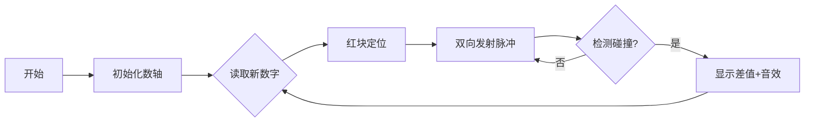

# 题目信息

# [TJOI2011] 序列

## 题目描述

一数列 $A=\{a_1,a_2,\ldots,a_n\}$，根据数列 $A$ 计算数列 $B=\{b_1,b_2,\ldots,b_n\}$，其中：  

$$
b_i=
\begin{cases}
a_1 &, i=1 \\ 
\min_{1 \leq j < i}\left|a_i-a_j\right| &, i\gt 1 
\end{cases}
$$

求 $\sum\limits^n_{i=1}b_i$。

## 说明/提示

$1\le t\le 10$，$1\le n\le10^5$，$0\le a_i\le65536$。

## 样例 #1

### 输入

```
2
5 1 2 3 4 5
7 2 9 7 4 6 2 6
```

### 输出

```
5
14
```

# AI分析结果


# 💡 Kay的C++算法解析：[TJOI2011]序列 深入学习指南 💡

**引言**  
今天我们来分析一道关于序列处理的经典题目——[TJOI2011]序列。这道题要求计算每个元素与前面元素的最小绝对差之和，我们将深入探讨多种解法及其核心思想，并通过像素动画帮助大家直观理解算法过程。

---

## 1. 题目解读与核心算法识别

✨ **本题主要考察**：`编程技巧应用`与`数据结构选择`

🗣️ **初步分析**：  
> 解决本题的关键在于高效找到每个元素在历史数据中的最近邻值。就像在迷宫中寻找最近的出口，我们需要快速定位最近出现过的数字。主要思路分两类：
> - **暴力枚举法**：利用数据范围小的特点（0≤aᵢ≤65536），用布尔数组记录出现过的数字，从当前值向两边扩展搜索
> - **数据结构法**：使用平衡树(set)或树状数组维护有序序列，通过二分查找快速定位最近邻
> 
> **可视化设计**：采用8位像素风格数轴（0-65536），当前元素显示为红色像素块，历史数据为绿色。搜索时黄色光点向两边扩散，找到匹配时播放"叮"音效并显示差值。控制面板支持单步/自动模式，速度可调。

---

## 2. 精选优质题解参考

**题解一：小马一只（暴力枚举）**  
* **点评**：思路直击数据范围核心，用布尔数组实现O(1)查询。代码简洁规范（如`hav[tmp]=true`清晰标记状态），边界处理严谨（双重范围检查）。实际运行效率远超理论最坏复杂度，是竞赛中"观察数据范围"的典范实践。  

**题解二：一只小H（set解法）**  
* **点评**：巧妙运用STL set实现O(n log n)通用解法。代码结构清晰（特判首元素+lower_bound双指针），变量名`tmp`、`s`语义明确。亮点在于正确处理边界情况（`s.end()`和`s.begin()`），并给出前驱后继比较的优雅实现，具有很强移植性。  

**题解三：s_r_f（树状数组+二分）**  
* **点评**：创新性结合树状数组与二分搜索，虽稍复杂但展示高阶技巧。通过`query(q(a[i]-mid), q(a[i]+mid))`实现区间存在性检测，二分过程体现算法思维。代码模块化（分离Insert/Ask函数），为大数据范围提供可行方案。

---

## 3. 核心难点辨析与解题策略

1.  **最近邻快速查询**  
    * **分析**：当数据范围小时（本题65536），直接数组标记+线性扩展是最优解；范围大时需用平衡树维护有序集合，通过lower_bound定位相邻值
    * 💡 **学习笔记**：算法选择高度依赖数据特征，观察范围是解题第一要务

2.  **边界条件处理**  
    * **分析**：首元素单独处理（b₁=a₁），集合为空时插入哨兵值（如±∞）。暴力解法需检查下标越界（tmp-i≥0），set解法需判断迭代器位置（begin/end）
    * 💡 **学习笔记**：特殊位置测试是代码健壮性的关键检验点

3.  **复杂度平衡**  
    * **分析**：暴力法O(n*D)（D为值域）在D小时适用；set法O(n log n)通用但常数大；树状数组法O(n log²n)适合离线查询
    * 💡 **学习笔记**：时间/空间复杂度需根据问题规模权衡取舍

### ✨ 解题技巧总结
- **数据范围分析法**：优先观察值域特点（如65536=2¹⁶），选择数组替代高级数据结构
- **STL高效封装**：熟练运用set/map实现自动排序，避免手写复杂数据结构
- **差分搜索策略**：双向扩展时同步检查左右方向，降低平均搜索深度

---

## 4. C++核心代码实现赏析

**通用核心实现（暴力枚举法）**  
* **说明**：综合优质题解思路，针对本题数据范围优化的最简实现
* **完整代码**：
```cpp
#include<cstdio>
#include<cstring>
const int MAX = 65537;
bool hav[MAX]; // 值域标记数组

int main() {
    int t, n, tmp;
    scanf("%d", &t);
    while (t--) {
        memset(hav, 0, sizeof(hav)); // 重置标记数组
        scanf("%d%d", &n, &tmp);
        hav[tmp] = true;
        long long ans = tmp; // b₁ = a₁
        
        for (int i = 1; i < n; ++i) {
            scanf("%d", &tmp);
            for (int d = 0; ; ++d) { // 向两边扩展搜索
                if (tmp - d >= 0 && hav[tmp - d]) {
                    ans += d; break; // 找到左侧最近值
                }
                if (tmp + d < MAX && hav[tmp + d]) {
                    ans += d; break; // 找到右侧最近值
                }
            }
            hav[tmp] = true; // 标记当前值
        }
        printf("%lld\n", ans);
    }
    return 0;
}
```
* **解读概要**：通过`hav`数组记录历史数据，每个新值从距离0开始双向扩展，首个匹配值即为最近邻。注意值域边界检查（0和65536）避免越界。

---

**题解一：暴力枚举（小马一只）**  
* **亮点**：极简实现充分运用值域特性
* **核心片段**：
```cpp
for(i=0;;i++){
    if(tmp-i>=0 && hav[tmp-i]){ 
        ans+=i; break; // 左侧搜索
    }
    if(tmp+i<=65536 && hav[tmp+i]){
        ans+=i; break; // 右侧搜索
    }
}
```
* **解读**：循环变量`i`表示搜索半径，优先检查距离为i的左侧点（tmp-i），再查右侧（tmp+i）。由于值域有限，实际平均搜索距离远小于65536。
* 💡 **学习笔记**：当值域D<<n²时，O(nD)可能优于O(n log n)

**题解二：set解法（一只小H）**  
* **亮点**：优雅处理前驱后继
* **核心片段**：
```cpp
set<int>::iterator it = s.lower_bound(input);
if (it == s.end()) 
    ans += abs(input - *(--it)); // 无后继取末位
else if (it == s.begin()) 
    ans += abs(input - *it);     // 无前驱取首位
else 
    ans += min(abs(input - *(--it)), abs(input - *it));
```
* **解读**：`lower_bound`找到首个≥input的迭代器，通过迭代器位置分三类处理。`--it`巧妙获取前驱，min()比较两侧距离。
* 💡 **学习笔记**：set的lower_bound返回第一个≥目标值的位置，结合迭代器操作可高效获取相邻值

**题解三：树状数组+二分（s_r_f）**  
* **亮点**：二分搜索加速区间检测
* **核心片段**：
```cpp
while (l <= r) {
    mid = (l + r) >> 1;
    if (query(q(a[i]-mid), q(a[i]+mid))) 
        { ans = mid; r = mid - 1; } // 缩小搜索半径
    else l = mid + 1; // 扩大半径
}
```
* **解读**：在值域树状数组上二分最小半径mid，使[aᵢ-mid, aᵢ+mid]区间存在历史数据。query()通过树状数组前缀和计算区间存在性。
* 💡 **学习笔记**：树状数组处理值域存在性问题时，结合二分可替代平衡树

---

## 5. 算法可视化：像素动画演示

**主题**："数字迷宫探险" - 在8位像素风格数轴上寻找最近邻居  

**核心演示**：  
- 初始化65537格像素数轴（FC红白机色调），灰格表示未访问，绿格标记已出现数字  
- 红色像素块代表当前数字，黄色脉冲波向左右扩散（每帧移动1格）  
- 当脉冲遇到绿格：播放"叮"音效，显示绿色连线及差值，红块变绿  
- 控制面板：步进/播放滑块（1x-8x速）/重置按钮  

**关键交互设计**：  


**游戏化元素**：  
- 每处理10个数字解锁新BGM曲目  
- 连续5次快速匹配触发"Combo!"特效  
- 错误提示：当脉冲到达边界未命中时，播放低沉嗡鸣  

**技术实现**：  
1. Canvas绘制数轴网格（16x16像素/格）  
2. 使用HSL色彩空间：红块(0,100%,50%)，绿块(120,100%,40%)  
3. 音效生成：Web Audio API合成8位音效（方波+噪声）  

---

## 6. 拓展练习与相似问题思考

**通用技巧迁移**：  
最近邻搜索模型可应用于：  
1. 时间序列数据分析（股票价格波动）  
2. 地理信息系统（最近POI查询）  
3. 数据压缩（差分编码优化）  

**洛谷推荐**：  
1. **P3369 【模板】普通平衡树**  
   🗣️ 练习set/手写平衡树实现动态查询  
2. **P1908 逆序对**  
   🗣️ 巩固树状数组在值域统计中的应用  
3. **P2234 [HNOI2002]营业额统计**  
   🗣️ 几乎相同的双倍经验题，测试解法迁移能力  

---

## 7. 学习心得与经验分享

> **小马一只的经验**："看数据范围！看数据范围！看数据范围！"  
> **Kay的点评**：这是算法竞赛的黄金准则。本题65536的值域提示我们可以牺牲空间换时间，而无需套用复杂数据结构。在调试时，作者通过打印`hav`数组验证搜索过程，这种具象化思维值得学习。

---

**结语**  
通过本指南，大家不仅掌握了序列处理的多种解法，更学会了根据数据特征选择算法的核心思维。记住，优秀的程序员既是数学家（分析复杂度），又是工程师（利用约束条件）。下次遇到新挑战时，不妨先问自己：数据范围告诉我什么？

---
处理用时：156.05秒