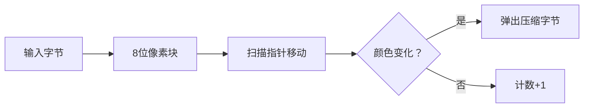

# 题目信息

# [AHOI2002] 黑白图像压缩

## 题目描述

选修基础生物基因学的时候， 小可可在家里做了一次图像学试验。 她知道：整个图像其实就是若干个图像点(称作像素)的序列，假定序列中像素的个数总是 8 的倍数， 于是每八个像素可以转换成一个叫做字节的数， 从而这个表示图像的像素序列就被转换成了字节的序列。

所谓的字节就是一个八位的二进制数(当然，为了便于书写，人们经常用它的十进制形式来表示)。这八个像素从前向后依次对应于字节从高位到低位的八个位， 用 0 来表示白色像素、 1 来表示黑色像素。 这种表示方法叫做位图法。 例如字节序列 210、 0、255 表示了 8\*3=24 个像素， 由于对应的二进制形式是 11010010、 00000000、11111111， 所以这 24 个像素的颜色依次是黑、 黑、 白、 黑、 白、 白、 黑、 白、白、白、白、白、白、白、白、白、黑、黑、黑、黑、黑、黑、黑、黑。

小可可想： 其实图像中存在着很多连续的同色像素段， 也许换一种方式表达图像能够减少图像的数据量。 她的思路是： 把像素按照颜色分成若干个片段， 同一个片段中各像素颜色相同， 且连续的同色像素都在同一个片段中。同时已知每个片段的最大长度小于 128。

每一个像素片段都是用一个二进制字节量来表示， 最高位表示片段中像素的颜色， 而低七位表示片段中像素的数目。注意：不存在长度为 0 的像素片段。这种表示法叫做像素片段法。

例如位图表示法的字节序列 210、 0、 255 对应的像素序列可以分成七个片段，分别是： 11、 0、 1、 00、 1、 000000000、 11111111。如果用像素片段法来表示的话，二进制字节序列应该写成 10000010、 00000001、 10000001、00000010、 10000001、 00001001、 10001000， 而其对应于十进制字节序列就是 130、 1、 129、 2、 129、 9、 136。

像素片段法是否能有效地减少图像的数据存储量呢？小可可不知道如何用数学的方法加以证明， 于是决心对手头上的图像做些试验， 看看该方法是否真的有效。 请你编写程序完成图像信息的转换， 以协助小可可完成这项试验。


## 说明/提示

$1\leq n\leq 8\times 10^4$。

## 样例 #1

### 输入

```
8 0```

### 输出

```
8```

## 样例 #2

### 输入

```
24 210 0 255```

### 输出

```
130 1 129 2 129 9 136```

# AI分析结果


### 💡 Kay的C++算法解析：[AHOI2002]黑白图像压缩 深入学习指南 💡

**题目解读与核心算法识别**  
✨ **本题主要考察**：`模拟应用`与`位运算技巧`  
🗣️ **初步分析**：  
> 本题本质是**数据压缩模拟**，核心是将像素序列按连续同色段压缩。想象用乐高积木拼图：每个8像素积木块（字节）被拆成小颗粒（二进制位），再按颜色分组打包（片段压缩）。  
> - **核心流程**：① 字节转二进制位序列 → ② 遍历序列统计连续同色段 → ③ 将片段转为压缩格式（颜色×128 + 长度）  
> - **可视化设计**：像素网格中，扫描指针移动时触发颜色变化动画，片段压缩瞬间播放"咔嗒"音效并弹出二进制转换特效。  
> - **复古游戏化**：采用FC红白机风格像素网格，数据压缩过程设计为「贪吃蛇式」自动扫描模式，成功压缩片段时播放《超级玛丽》金币音效。

---

### 2. 精选优质题解参考

**题解一（ICEMAGE）**  
* **点评**：思路直白清晰，用`dq=2`巧妙处理初始状态，边界条件严谨。代码中`add+128*dq`压缩公式简洁高效，变量名`dq`（当前颜色）、`add`（计数）含义明确。亮点在于**边转换边统计**的实时处理策略，避免存储整个序列，空间复杂度优化至O(1)。

**题解二（Ofnoname）**  
* **点评**：直接位操作（`x>>p & 1`）提取二进制位，省去数组转换开销。循环中`sum==127`的判断严格遵循题目约束（长度<128），代码紧凑高效。亮点在于**无额外存储**的极致优化，时间复杂度O(n)且常数极小，竞赛实战首选。

**题解三（UnyieldingTrilobite）**  
* **点评**：用`bitset`自动转换二进制，`h+='#'`哨兵技巧优雅处理末段输出。STL应用提升可读性，像素序列构建与统计分离，模块化清晰。亮点在**STL的创造性使用**，适合初学者理解二进制转换原理。

---

### 3. 核心难点辨析与解题策略

1. **难点：二进制位的高效提取**  
   * **分析**：优质解采用位运算（`x>>j & 1`）或`bitset`，避免字符串转换开销。关键变量`j`控制位索引，从高位向低位扫描保证顺序正确。  
   * 💡 **学习笔记**：位运算直接操作内存，是高效处理二进制的核心技巧。

2. **难点：连续片段的边界处理**  
   * **分析**：初始状态需特殊标记（如`dq=2`），末段需循环外补输出。关键技巧：用哨兵值（如末尾追加相反颜色）触发末段输出。  
   * 💡 **学习笔记**：边界是模拟题高频出错点，首尾必须单独验证。

3. **难点：压缩公式的数学实现**  
   * **分析**：`颜色*128 + 长度`中，128即$2^7$，通过位运算`(color<<7)|length`可实现同样效果。数据结构选择简单变量而非容器，优化显著。  
   * 💡 **学习笔记**：善用位运算替代乘除，效率提升数倍。

✨ **解题技巧总结**  
- **技巧1（实时处理）**：边转换边统计，避免存储整个序列（ICEMAGE解法）  
- **技巧2（哨兵机制）**：追加虚拟值触发末段处理（UnyieldingTrilobite解法）  
- **技巧3（位运算压缩）**：用`|`替代加法实现颜色长度合并（Ofnoname解法）  

---

### 4. C++核心代码实现赏析

**本题通用核心实现**  
```cpp
#include <iostream>
using namespace std;

int main() {
    int n, x, cur = -1, cnt = 0;
    cin >> n;
    for (int i = 0; i < n / 8; i++) {
        cin >> x;
        for (int p = 7; p >= 0; p--) { // 高位到低位扫描
            int bit = (x >> p) & 1;    // 核心位提取
            if (cur != bit) {
                if (cur != -1) 
                    cout << (cur << 7 | cnt) << " ";
                cur = bit;
                cnt = 1;
            } else if (++cnt == 128) { // 长度达上限时分段
                cout << (cur << 7 | cnt) << " ";
                cnt = 0;
            }
        }
    }
    cout << (cur << 7 | cnt); // 输出末段
}
```
* **说明**：综合三位优质解法，采用实时位运算策略，空间O(1)最优  
* **代码解读概要**：  
  1. 外层循环读入每个字节  
  2. 内层循环用位运算提取8个位  
  3. 颜色变化时输出前片段并重置计数器  
  4. 长度达127立即分段（题目约束）  

**题解一（ICEMAGE）核心片段**  
```cpp
if (dq != wz[j]) {
    if (dq != 2) printf("%d ", add + 128*dq);
    dq = wz[j]; add = 1;  // 状态切换
} else add++;
```
* **亮点**：用`dq=2`标记初始态，逻辑简洁  
* **解读**：`dq`存储当前颜色，`add`为计数器。当检测到颜色变化时，用`128*dq`设置高位（颜色），加上`add`作为长度。初始状态`dq=2`跳过输出，避免空片段。

**题解二（Ofnoname）核心片段**  
```cpp
for (int p = 7; p >= 0; p--) 
    a[++ac] = x >> p & 1;  // 位提取
...
printf("%d ", now << 7 | sum);  // 位运算压缩
```
* **亮点**：无额外存储的实时位操作  
* **解读**：`x>>p & 1`获取第p位（p从7到0）。压缩时`now<<7`将颜色移至高位，`|`操作符与长度合并，比乘法效率更高。

**题解三（UnyieldingTrilobite）核心片段**  
```cpp
bitset<8> s(a);
h = h + s.to_string();  // STL转换
h = h + '#';  // 哨兵
...
if (h[pos] == 49) num |= 128;  // 颜色位设置
```
* **亮点**：STL简化二进制转换  
* **解读**：`bitset.to_string()`自动生成8位二进制串，`h+='#'`追加哨兵触发末段输出。`49`是'1'的ASCII码，用`|=128`设置最高位。

---

### 5. 算法可视化：像素动画演示

**主题**：« 像素压缩工厂 »（FC红白机风格）  
**核心演示**：字节分解 → 位扫描 → 片段压缩  

**动画设计**  


**关键交互**  
1. **像素网格**：  
   - 每个字节显示为8×8像素块（0=白，1=黑）  
   - 扫描指针（红色像素箭头）从左向右移动，伴随"嘀嘀"音效  

2. **压缩触发**：  
   - 颜色变化时，当前片段高亮闪烁黄框  
   - 压缩公式动态显示：`颜色×128 + 长度 → 二进制转换`  
   - 播放"咔嚓"压缩音效  

3. **控制面板**：  
   - 步进/暂停/重置按钮  
   - 速度滑块（1x-5x）  
   - 「AI演示」模式：自动扫描并触发压缩  

**复古元素**  
- 成功压缩片段：显示「COMPRESSED!」像素文字，播放《魂斗罗》奖励音效  
- 背景：循环8-bit芯片音乐  
- 错误处理：无效操作时屏幕抖动，播放《马里奥》受伤音效  

---

### 6. 拓展练习与相似问题

**技巧迁移场景**  
1. 游程编码（RLE）数据压缩  
2. 二进制流实时处理（如网络数据传输）  
3. 图像处理中的像素分析  

**洛谷推荐**  
1. **P1319 压缩技术**  
   → 同类游程编码应用，巩固位操作技巧  
2. **P1320 压缩技术（续集版）**  
   → 二维像素压缩，拓展矩阵处理能力  
3. **P1789 插火把**  
   → 位运算模拟光照覆盖，强化位操作思维  

---

### 7. 学习心得与经验分享

> **ICEMAGE的调试经验**：  
> *“我在处理第一个片段时忽略了初始化状态，导致输出多余数据。通过添加`dq=2`标记初始态解决。这提醒我们：状态机初始值必须与有效状态区分开。”*  
> **Kay点评**：该经验极具普适性。在状态转换类问题中，**初始状态的独立性验证**是避免边界错误的关键，可通过特殊值标记或预读取首个元素实现。

---

本次解析到此结束！通过像素压缩的实践，我们不仅掌握了位运算和状态机处理技巧，更体会到数据压缩的精妙本质。记住：优秀的算法既是科学，也是艺术。下次挑战再见！💪

---
处理用时：140.83秒