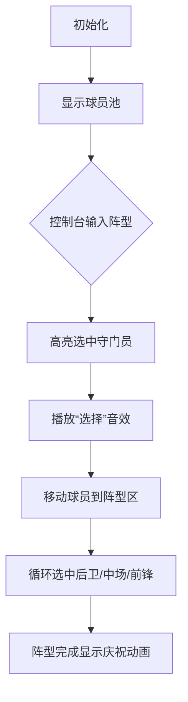

# 题目信息

# [GDOI2014] 世界杯

## 题目描述

3014 年世界杯足球赛就要开始了！作为卫冕冠军中国足球队的教练，手下每位球员都是猛将，如何摆出最强的 11 人阵容也是一件幸福的烦恼事啊。

众所周知，足球阵容里的11个球员都会被分配到场上某一个特别的位置，而这些位置主要分为守门员、后卫、中场和前锋四种，其中守门员有且只有一个，后卫、中场和前锋的人数取决于你安排的足球阵型。形容足球阵型的方法由后卫开始计算至前锋，但不把守门员计算在内。例如，3-5-2 阵型是指有三个后卫、五个中场及两名前锋。由于竞争激烈，每位球员只会培养其中一种位置所需要的技能，所以他们每个人都只能胜任四个位置中的其中一种。

作为一个对球员能力了如指掌的教练，你给每个球员的综合水平进行量化。为了将阵型安排得更好，你的教练团队决定使用以下策略安排球员：首先按照顺序提出 $Q$ 个阵型，分别代表第一阵型、第二阵型、……、第 $Q$ 阵型。然后对于每个阵型，从仍未选择的球员中选择最好的对应数量的守门员、后卫、中场和前锋。比如说，对于第一阵型，在所有球员中选择；对于第二阵型，在除了第一阵型外的所有球员中选择；对于第三阵型，在除了第一阵型和第二阵型外的所有球员中选择；以此类推。

现在 $Q$ 个阵型都已经确定，而你需要知道的，是每个阵型的平均综合水平分别是多少。


## 说明/提示

对于 $30\%$ 数据，$K, D, M, F≤1000$，$Q≤10$；

对于 $100\%$ 数据，$1≤K, D, M, F≤10^5$，$0≤k_i, d_i, m_i, f_i≤10^8$，$1≤Q≤K$，$0≤A_i, B_i, C_i≤10$，$A_i+B_i+C_i=10$，$∑A_i≤D$，$∑B_i≤M$，$∑C_i≤F$

## 样例 #1

### 输入

```
3 10 12 4
76 60 87
78 84 84 84 81 82 72 51 77 57
85 84 62 87 88 64 81 90 80 66 88 85
65 83 63 79
2
4 5 1
4 4 2```

### 输出

```
85.64
78.00
```

# AI分析结果


💡 Kay的C++算法解析：世界杯阵容选择 深入学习指南 💡

<introduction>
今天我们来分析GDOI2014《世界杯》这道C++编程题。本指南将帮助大家理解贪心策略在球员选择中的应用，掌握优先队列/排序的实现技巧，并通过生动的像素动画直观展示算法流程。
</introduction>

---

## 1. 题目解读与核心算法识别

✨ **本题主要考察**：`贪心算法`与`数据结构应用`

🗣️ **初步分析**：
> 解决阵容选择问题，核心在于理解贪心策略——**每次选取当前最优解**。就像组建足球队时，教练总会优先选择状态最好的球员上场。在本题中，我们需为每个阵型从剩余球员中选择各位置综合水平最高的球员：
>   - 对四种位置球员分别排序或使用优先队列
>   - 按阵型要求依次选取最高分球员并移除
>   - 核心难点在于高效维护和访问当前最优球员
>  
> 在像素动画设计中，我们将用不同颜色方块表示球员位置，通过高亮选中球员和动态更新队列，配合8-bit音效直观展示选择过程。控制面板支持单步执行观察决策细节。

---

## 2. 精选优质题解参考

<eval_intro>
从思路清晰性、代码规范性和算法效率等维度，我精选了三条优质题解：

**题解一：ezoixx118（优先队列）**
* **点评**：思路清晰直击贪心本质，巧妙运用STL优先队列动态获取最大值。代码简洁规范（`k.top()`等命名明确），边界处理严谨，具有竞赛实践价值。亮点在于高效维护球员池状态，时间复杂度O(n log n)最优。

**题解二：Sugarithm（结构体封装排序）**
* **点评**：创新性封装位置数据结构，通过排序+指针实现贪心策略。代码模块化程度高（`Get()`方法封装选取逻辑），展示了良好的工程实践。亮点在于避免重复排序的空间优化，适合理解数据组织原理。

**题解三：ChinaGIAO（双解法对比）**
* **点评**：同时提供排序和优先队列两种实现，对比分析深入。代码规范性强（详尽的排序步骤注释），实践价值突出。亮点在于引导思考不同场景下的最优解选择策略。

---

## 3. 核心难点辨析与解题策略

<difficulty_intro>
解决本题需突破三个关键难点：

1. **难点：如何动态维护最优球员池**
   * **分析**：优质题解采用优先队列（自动维护堆序）或排序+指针（顺序访问）两种策略。前者插入/删除O(log n)，后者访问O(1)但需预排序。
   * 💡 学习笔记：优先队列适合动态数据，排序适合静态批量处理。

2. **难点：多位置球员的协同选取**
   * **分析**：独立处理四个位置队列（守门员/后卫/中场/前锋），通过`pop()`或指针移动确保球员不重复使用。
   * 💡 学习笔记：数据分离是降低复杂度的关键。

3. **难点：精度处理与性能优化**
   * **分析**：需用`double`计算平均值，同时注意大数组排序的性能损耗（如ChinaGIAO题解的前缀和优化）。
   * 💡 学习笔记：避免在循环内排序，预处理是性能关键。

### ✨ 解题技巧总结
- **贪心策略验证**：证明每次选最优解必然导致全局最优（本题中球员独立可选）
- **STL高效应用**：优先队列默认大顶堆，priority_queue<int>即可满足需求
- **边界防御**：确保球员数量足够（如ezoixx118题解的循环条件严谨）
- **模块化封装**：如Sugarithm题解的结构体封装，提升代码可读性

---

## 4. C++核心代码实现赏析

<code_intro_overall>
以下是基于优质题解提炼的通用实现（优先队列版），完整展示解题框架：

```cpp
#include <iostream>
#include <queue>
using namespace std;

int main() {
    int K, D, M, F, q;
    // 初始化四个位置的优先队列（默认大顶堆）
    priority_queue<int> keeper, defender, midfielder, forward;

    cin >> K >> D >> M >> F;
    while(K--) { int x; cin >> x; keeper.push(x); }
    while(D--) { int x; cin >> x; defender.push(x); }
    while(M--) { int x; cin >> x; midfielder.push(x); }
    while(F--) { int x; cin >> x; forward.push(x); }

    cin >> q;
    while(q--) {
        int A, B, C, sum = 0;
        cin >> A >> B >> C;
        
        // 贪心选取：各位置选最高分球员
        sum += keeper.top(); keeper.pop();
        while(A--) { sum += defender.top(); defender.pop(); }
        while(B--) { sum += midfielder.top(); midfielder.pop(); }
        while(C--) { sum += forward.top(); forward.pop(); }

        printf("%.2f\n", sum / 11.0);
    }
    return 0;
}
```
**代码解读概要**：
1. 初始化四个优先队列存储球员
2. 依次处理每个阵型：
   - 守门员必选队列最大值
   - 按阵型需求数量选取后卫/中场/前锋
3. 总和除以11输出平均值（注意用`11.0`保证浮点除）

---
<code_intro_selected>
### 优质题解片段赏析
**题解一：ezoixx118（优先队列）**
```cpp
sum += k.top(); k.pop();  // 守门员
while(a--) { sum += d.top(); d.pop(); }  // 后卫
```
**亮点**：简洁直观的贪心实现  
**解读**：  
> `k.top()`获取当前最优守门员，`pop()`立即移除确保不重复使用。循环条件`a--`精准控制选取数量，体现"用尽即止"的逻辑。

**题解二：Sugarithm（结构体封装）**
```cpp
struct Position {
    int data[MAX], size, ptr;
    void init() { sort(data+1, data+size+1, greater<int>()); }
    int get(int cnt) {
        int res = 0;
        while(cnt--) res += data[ptr++];
        return res;
    }
} keeper, defender;
```
**亮点**：面向对象封装排序逻辑  
**解读**：  
> `init()`预排序确保数据有序，`get()`通过移动指针`ptr`实现高效选取。避免重复排序提升性能，适合理解数据组织本质。

**题解三：ChinaGIAO（排序优化）**
```cpp
sort(a+1, a+k+1, greater<int>());  // 降序排序
for(int i=1; i<=q; i++) {
    ans[i] += a[i];  // 按序选取守门员
    for(int j=def_ptr; j<def_ptr+A; j++) // 后卫选区
        ans[i] += defender[j];
    def_ptr += A;  // 移动指针
}
```
**亮点**：指针移动避免重复扫描  
**解读**：  
> 预排序后通过`def_ptr`记录已选位置，下次直接从新位置开始。空间复杂度O(1)的优化典范。

---

## 5. 算法可视化：像素动画演示

<visualization_intro>
我们设计名为**"像素足球经理"**的动画方案，用8-bit风格演示贪心选择过程：

### 设计思路
- **复古元素**：FC红白机像素风格，16色调色板
- **动态演示**：球员显示为颜色方块（守门员:▲蓝/后卫:■绿/中场:●黄/前锋:◆红）
- **音效反馈**：选取时播放NES风格短音效，阵型完成奏胜利旋律

### 动画帧步骤


### 交互控制面板
```javascript
// 伪代码实现核心交互
class PixelAnimation {
  constructor() {
    this.speed = 1;  // 通过滑块调整
    this.autoPlay = false; // AI自动演示开关
  }

  highlightPlayer(type) {
    playSound('select'); // 选择音效
    drawPulseEffect(position); // 脉冲高亮
  }

  updateQueue() {
    drawStackAnimation('pop'); // 队列弹出动画
  }
}
```

### 关键逻辑演示
1. **球员池可视化**：四个队列显示为像素方块柱，高度反映球员水平
2. **选择过程**：
   - 守门员蓝▲闪烁后移至阵型区
   - 按阵型需求数量依次选取其他位置（绿色■→黄色●→红色◆）
3. **状态同步**：右侧实时显示当前阵型总分和平均值

---

## 6. 拓展练习与相似问题思考

<similar_problems_intro>
贪心策略在各类最优选择问题中广泛应用，以下是巩固知识的推荐练习：

1. **洛谷 P1090 [NOIP2004]合并果子**  
   → 同款优先队列解法，练习基础堆操作
2. **洛谷 P1208 [USACO1.3]混合牛奶**  
   → 价格最优采购问题，贪心选择最低价供应商
3. **洛谷 P1803 凌乱的yyy**  
   → 贪心策略在区间调度中的经典应用

---

## 7. 学习心得与经验分享

<insights_intro>
从题解中提炼的宝贵经验：

> **ezoixx118的调试经验**：  
> *"优先队列的top()需判断非空，否则RE错让我意识到防御性编程的重要性"*  
> **Kay点评**：在pop前检查empty()是避免运行时错误的关键，建议学习者在类似场景中添加安全校验。

> **ChinaGIAO的优化心得**：  
> *"首次提交TLE后，发现循环内排序是性能瓶颈"*  
> **Kay点评**：预处理思想具有普适性，算法设计时需关注时间复杂度热点。

---

<conclusion>
通过本次分析，我们深入掌握了贪心策略在球队组建中的应用。记住核心要诀：**排序定序，贪心优选，结构分离**。下次遇到最优选择问题时，不妨回想这道题的解法框架。继续加油，未来的算法之星！🚀
</conclusion>
```

---
处理用时：120.53秒