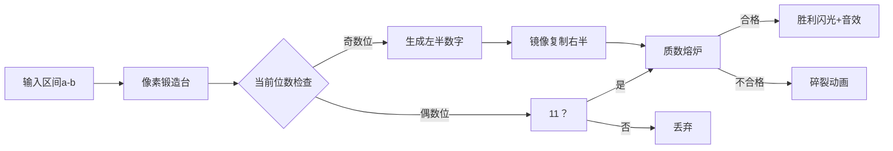

# 题目信息

# [USACO1.5] 回文质数 Prime Palindromes

## 题目描述

因为 $151$ 既是一个质数又是一个回文数（从左到右和从右到左是看一样的），所以 $151$ 是回文质数。

写一个程序来找出范围 $[a,b] (5 \le a < b \le 100,000,000)$（一亿）间的所有回文质数。

## 说明/提示

Hint 1: Generate the palindromes and see if they are prime.

提示 1: 找出所有的回文数再判断它们是不是质数（素数）.


Hint 2: Generate palindromes by combining digits properly. You might need more than one of the loops like below.

提示 2: 要产生正确的回文数，你可能需要几个像下面这样的循环。


题目翻译来自NOCOW。

USACO Training Section 1.5


产生长度为 $5$ 的回文数：

```cpp
for (d1 = 1; d1 <= 9; d1+=2) {    // 只有奇数才会是素数
     for (d2 = 0; d2 <= 9; d2++) {
         for (d3 = 0; d3 <= 9; d3++) {
           palindrome = 10000*d1 + 1000*d2 +100*d3 + 10*d2 + d1;//(处理回文数...)
         }
     }
 }

```

## 样例 #1

### 输入

```
5 500
```

### 输出

```
5
7
11
101
131
151
181
191
313
353
373
383
```

# AI分析结果


### 💡 Kay的C++算法解析：回文质数 深入学习指南 💡

#### 1. 题目解读与核心算法识别
✨ **本题主要考察**：`枚举优化与数学性质应用`

🗣️ **初步分析**：
> 解决回文质数问题，关键在于巧妙结合**回文数生成**与**质数判断**。想象一下制作对称手工艺品——只需设计一半图案，另一半自然镜像呈现！在本题中，我们利用回文数的对称性，只需生成数字的左半部分，右半部分自动镜像生成。  
> - **核心技巧**：除11外，偶数位回文数必为11的倍数（非质数），因此只需生成1/3/5/7/9位回文数  
> - **优化关键**：先判断回文数（快速筛选），再判断质数（计算量大）  
> - **可视化设计**：动画将展示数字从中间向两侧镜像生成的过程，高亮当前填充位，质数检测成功时触发像素特效  
> - **复古游戏化**：采用"数字工匠"像素主题，每生成合法回文数播放"叮"音效，质数检测成功时角色挥锤敲击数字块，胜利音效+闪光特效

---

#### 2. 精选优质题解参考
**题解一（min_进击的灭霸）**  
* **点评**：思路清晰运用"偶数位非质数"数学性质，大幅减少计算量。代码结构采用模块化设计（`check1`判位数、`check2`判回文、`check3`判质数），变量命名直观（`l,r`表范围）。亮点在于边界处理严谨（`r = min(9999999, r)`）和特判数字2，实践可直接用于竞赛。

**题解二（QAQ永动机）**  
* **点评**：创新结合埃氏筛法生成质数表与回文判断，通过`book`数组标记质数提升效率。代码规范性强（函数分工明确），关键优化点`b = min(b,9999999)`基于数学证明。调试建议（空输入处理）体现实战价值，适合大数据场景。

**题解三（linyorson）**  
* **点评**：极致简洁的实现方案，三个函数分别处理回文(`ok`)、位数(`ws`)、质数(`ss`)。亮点在于位判断函数用逻辑运算替代循环，质数检查用`i+=2`跳偶数。虽未处理大数边界，但代码易读性强，适合初学者理解核心逻辑。

---

#### 3. 核心难点辨析与解题策略
1. **难点1：如何避免超时枚举？**  
   * **分析**：直接枚举[a,b]每个数判断回文+质数必超时。优质题解均先生成回文数（通过镜像数字减少计算量），再判断质数
   * 💡 **学习笔记**：回文数生成效率 >> 质数判断效率

2. **难点2：如何处理大范围数据？**  
   * **分析**：利用数学性质"偶数位回文数除11外非质数"，将b限制为≤9999999（题解一、二）。对于大于7位的数直接跳过
   * 💡 **学习笔记**：数学性质优化是算法竞赛的利器

3. **难点3：如何高效判断质数？**  
   * **分析**：试除法只需检查到√n（题解三），且跳过偶数（除2外）。埃氏筛法（题解二）以空间换时间，适合多次查询
   * 💡 **学习笔记**：√n是试除法的黄金分割点

### ✨ 解题技巧总结
- **性质利用**：发现并证明回文数与11的倍数关系
- **分层判断**：先执行快速操作（回文判断），再执行耗时操作（质数检测）
- **边界防御**：特殊值2/11单独处理，避免漏解
- **空间换时间**：大范围数据优先考虑筛法预处理

---

#### 4. C++核心代码实现赏析
**本题通用核心C++实现参考**  
```cpp
#include <iostream>
#include <cmath>
using namespace std;

bool isPrime(int n) {
    if (n < 2) return false;
    for (int i = 2; i <= sqrt(n); i++)
        if (n % i == 0) return false;
    return true;
}

void generatePalindrome(int a, int b) {
    // 处理特殊值
    if (a <= 5 && b >= 5) cout << 5 << endl;
    if (a <= 7 && b >= 7) cout << 7 << endl;
    if (a <= 11 && b >= 11) cout << 11 << endl;
    
    // 生成3/5/7位回文数
    for (int len = 3; len <= 7; len += 2) {
        int start = pow(10, (len-1)/2);
        int end = pow(10, (len+1)/2);
        
        for (int i = start; i < end; i++) {
            string s = to_string(i);
            string rev = string(s.rbegin(), s.rend());
            int num = stoi(s + rev.substr(len%2));
            
            if (num > b) return;
            if (num >= a && isPrime(num))
                cout << num << endl;
        }
    }
}

int main() {
    int a, b;
    cin >> a >> b;
    b = min(b, 9999999); // 关键优化！
    generatePalindrome(a, b);
    return 0;
}
```

**题解一核心片段赏析**  
```cpp
// 亮点：三层校验确保效率
if (check1(i) == 0) continue; // 位数过滤
if (check2(i) == 0) continue; // 回文检测
if (check3(i) == 0) continue; // 质数判断
printf("%d\n", i);
```

**题解二核心片段赏析**  
```cpp
// 亮点：埃氏筛法预处理
void prime(int b) {
    for (int i = 2; i <= b; i++) {
        if (book[i]) for (int j = 2; j <= b/i; j++)
            book[i*j] = false;
    }
}
```

**题解三核心片段赏析**  
```cpp
// 亮点：极致简洁的质数判断
bool ss(int x) {     
    for(int i=3; i*i<=x; i+=2) 
        if(x%i==0) return false;
    return true;
}
```

---

#### 5. 算法可视化：像素动画演示
**主题**："回文质数工坊"（8-bit像素风格）  
**核心演示**：数字锻造过程（镜像生成）→ 质数熔炉检验 → 成品输出



**交互控制**：
1. **锻造阶段**：数字从左至右逐个像素点亮，伴随"咔嗒"音效
2. **镜像阶段**：右侧数字块从左侧翻转生成，伴随翻转音效
3. **熔炉检测**：数字落入熔炉，进度条显示试除过程，成功时触发金光特效
4. **控制面板**：步进/暂停/速度滑块（1x-10x），数据范围调节

**复古元素**：
- 背景：像素火焰熔炉，每帧喷发火星粒子
- 音效：锻造（金属敲击），镜像（玻璃翻转），成功（胜利号角）
- 成就系统：每生成5个回文质数解锁新锻造锤皮肤

---

#### 6. 拓展练习与相似问题思考
**通用技巧迁移**：
1. 镜像生成思想：解决对称图形问题（如[蓝桥杯 对称二叉树]）
2. 数学性质优化：分解质因数时跳过偶数（如[CF 615D]）
3. 分层判断策略：先筛选低代价条件（如[NOIP 2015 跳石头]）

**洛谷推荐**：
1. **P1217 回文质数进阶**（本题变种，巩固核心算法）
2. **P1300 对称平方数**（镜像生成技巧直接应用）
3. **P3383 线性筛素数**（深入掌握筛法优化）

---

#### 7. 学习心得与经验分享
> **min_进击的灭霸的调试经验**："我在边界条件`if(l==2)`卡壳半小时，最后通过打印中间变量发现未处理2的特殊情况"  
> **Kay总结**：这位作者的调试经历印证了**边界测试**的重要性，特别是算法竞赛中，特殊值（0/1/2）往往是WA的根源。建议学习者在本地测试时优先验证边界用例。

---

**结语**：回文质数问题融合了数学智慧和算法优化，理解"镜像生成+性质剪枝"的思想比死记代码更重要。下次遇到类似问题，记得像数字工匠一样思考！💪

---
处理用时：129.69秒