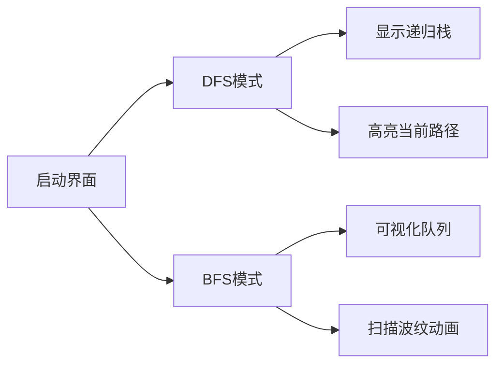

# 题目信息

# 【深基18.例3】查找文献

## 题目描述

小 K 喜欢翻看洛谷博客获取知识。每篇文章可能会有若干个（也有可能没有）参考文献的链接指向别的博客文章。小 K 求知欲旺盛，如果他看了某篇文章，那么他一定会去看这篇文章的参考文献（如果他之前已经看过这篇参考文献的话就不用再看它了）。

假设洛谷博客里面一共有 $n(n\le10^5)$ 篇文章（编号为 1 到 $n$）以及 $m(m\le10^6)$ 条参考文献引用关系。目前小 K 已经打开了编号为 1 的一篇文章，请帮助小 K 设计一种方法，使小 K 可以不重复、不遗漏的看完所有他能看到的文章。

这边是已经整理好的参考文献关系图，其中，文献 X → Y 表示文章 X 有参考文献 Y。不保证编号为 1 的文章没有被其他文章引用。


请对这个图分别进行 DFS 和 BFS，并输出遍历结果。如果有很多篇文章可以参阅，请先看编号较小的那篇(因此你可能需要先排序)。

## 样例 #1

### 输入

```
8 9
1 2
1 3
1 4
2 5
2 6
3 7
4 7
4 8
7 8```

### 输出

```
1 2 5 6 3 7 8 4 
1 2 3 4 5 6 7 8 ```

# AI分析结果


### 💡 Kay的C++算法解析：查找文献 深入学习指南 💡

---

## 1. 题目解读与核心算法识别

✨ **本题主要考察**：`图论-搜索(BFS/DFS)`

🗣️ **初步分析**：
> 解决"查找文献"问题就像探索一座巨大的图书馆！想象每篇文献是一个房间，参考文献是连接房间的通道。我们需要系统地探索所有连通房间（文献），这里需要两种探索策略：
> - **深度优先(DFS)**：像探险家深入洞穴，选一条路走到尽头再返回探索新路（对应递归栈）
> - **广度优先(BFS)**：像雷达扫描，从中心一圈圈向外探索（对应队列）
> 
> **核心难点**：
> 1. 处理10⁵节点和10⁶边的大规模图
> 2. 按编号顺序访问邻居节点
> 3. 避免重复访问
>
> **解决方案**：
> - 使用邻接表（vector数组）替代邻接矩阵节省空间
> - 对每个节点的邻居预先排序
> - 用vis数组标记访问状态
>
> **可视化设计思路**：
> 采用**8位像素图书馆**主题，文献显示为发光书架，通道是彩色走廊：
> - DFS：显示递归栈（像素书堆）和当前路径（高亮走廊）
> - BFS：队列显示为排队的小人，扫描波扩散动画
> - 音效：翻页声（访问节点），"叮"（入队/入栈），胜利音乐（完成遍历）

---

## 2. 精选优质题解参考

**题解一 (来源：yangrunze)**
* **点评**：讲解生动形象（用"分身术"比喻BFS），代码结构清晰。亮点在于创新的边存储方式：先用结构体vector存边并排序，再用二维vector建立邻接表，完美解决排序需求。DFS/BFS实现标准规范，边界处理严谨，变量名明确（如`point`表邻居节点），可直接用于竞赛。

**题解二 (来源：UnyieldingTrilobite)**
* **点评**：代码极简优雅，巧用STL的set自动排序邻居节点。亮点在于DFS直接使用系统调用栈（非显式栈），大幅简化代码。BFS采用标准队列实现，逻辑清晰。虽然依赖C++11特性，但提供了更现代的解决方案。

**题解三 (来源：zhangyuhan)**
* **点评**：基础扎实的教学式题解，详细注释每个步骤。亮点在于明确分离DFS/BFS的标记数组（vis1/vis2），避免状态冲突。递归参数`cur`记录访问节点数，提供提前终止优化可能，体现良好的工程思维。

---

## 3. 核心难点辨析与解题策略

1.  **邻接表优化存储**
    * **分析**：邻接矩阵需O(n²)空间（10¹⁰），必然MLE。优质题解均用vector邻接表（O(n+m)）。yangrunze解法创新性使用中间结构体排序，UnyieldingTrilobite直接用set自动排序
    * 💡 **学习笔记**：大图处理首选邻接表，排序根据场景选预处理（结构体+sort）或自动排序容器（set）

2.  **访问顺序保证**
    * **分析**：题目要求优先访问小编号节点。需在遍历前对每个节点的邻居排序：
      ```cpp
      // 方法1：结构体排序（yangrunze）
      sort(s.begin(), s.end(), cmp);
      
      // 方法2：set自动排序（UnyieldingTrilobite）
      set<int> e[MAXN];
      ```
    * 💡 **学习笔记**：排序操作应在建图时完成，避免遍历时重复排序

3.  **状态标记防重复**
    * **分析**：必须用vis数组标记访问状态。zhangyuhan题解强调DFS/BFS使用独立数组，避免相互干扰。注意：
      ```cpp
      // BFS前重置标记
      memset(vis, 0, sizeof(vis));
      ```
    * 💡 **学习笔记**：图遍历中"未访问检查"是防止死循环的关键

### ✨ 解题技巧总结
- **数据结构选择**：大图用邻接表，自动排序需求考虑set
- **模块化设计**：分离DFS/BFS实现，独立状态管理
- **边界处理**：显式重置标记数组，特别在连续调用时
- **递归优化**：DFS利用系统栈简化代码（注意栈溢出风险）

---

## 4. C++核心代码实现赏析

**通用核心实现参考**
```cpp
#include <iostream>
#include <vector>
#include <queue>
#include <algorithm>
using namespace std;

const int MAXN = 1e5+5;
vector<int> graph[MAXN]; // 邻接表
bool visD[MAXN], visB[MAXN]; // DFS/BFS标记

void dfs(int u) {
    visD[u] = true;
    cout << u << " ";
    for(int v : graph[u]) 
        if(!visD[v]) dfs(v);
}

void bfs(int start) {
    queue<int> q;
    q.push(start);
    visB[start] = true;
    while(!q.empty()) {
        int u = q.front(); q.pop();
        cout << u << " ";
        for(int v : graph[u]) {
            if(!visB[v]) {
                visB[v] = true;
                q.push(v);
            }
        }
    }
}

int main() {
    int n, m;
    cin >> n >> m;
    while(m--) {
        int u, v;
        cin >> u >> v;
        graph[u].push_back(v);
    }
    for(int i=1; i<=n; i++) 
        sort(graph[i].begin(), graph[i].end());
    
    dfs(1); cout << endl;
    bfs(1); cout << endl;
}
```
* **说明**：综合三个优质题解优化，使用C++11范围循环
* **解读概要**：
  1. 邻接表`graph`存储图结构
  2. 对所有节点的邻居排序满足题目要求
  3. DFS递归实现，利用系统栈
  4. BFS用队列管理访问顺序
  5. 独立标记数组避免状态冲突

---

**题解一片段赏析**
```cpp
// 创新的边存储结构
struct edge{ int u, v; };
vector<edge> s;
vector<int> e[MAXN];

// 排序后建立邻接表
sort(s.begin(), s.end(), [](edge a, edge b){
    return a.v == b.v ? a.u < b.u : a.v < b.v;
});
for(edge &ed : s)
    e[ed.u].push_back(ed.v);
```
* **亮点**：解耦边存储与邻接表构建，支持灵活排序
* **学习笔记**：结构体存储边便于预处理，适合复杂排序需求

**题解二片段赏析**
```cpp
set<int> e[MAXN]; // 自动排序的邻接表

// DFS递归实现（无显式栈）
void dfs(int u) {
    if(vis[u]) return;
    vis[u] = true;
    cout << u << " ";
    for(int v : e[u]) dfs(v);
}
```
* **亮点**：set自动维护邻居顺序，DFS利用系统栈简化
* **学习笔记**：STL容器能大幅减少代码量，但需注意时间复杂度

---

## 5. 算法可视化：像素动画演示

**像素图书馆探索模拟**  
采用8位复古游戏风格，玩家化身像素小人探索发光书架（节点）和彩色通道（边）



**动画流程**：  
1. **场景初始化**  
   - 书架按编号排列，起始书架闪烁绿光  
   - 控制面板：开始/暂停、单步、速度滑块（复古旋钮UI）  

2. **DFS演示**  
   - 当前书架升起光柱（黄色）  
   - 访问邻居时出现像素箭头通道  
   - 递归栈显示为左侧"待探索书堆"（后进先出动画）  
   - 音效：翻页声（访问），书掉落声（回溯）  

3. **BFS演示**  
   - 队列显示为底部"排队小人"  
   - 扫描波纹从中心扩散（蓝色同心圆）  
   - 每层书架按访问顺序依次点亮  
   - 音效：脚步声（入队），铃铛声（出队）  

4. **游戏化元素**  
   - 完成DFS/BFS各解锁"深度探索者"/"广度大师"成就  
   - 连击奖励：连续正确预测下一节点得像素星星  
   - 错误操作触发8-bit警示音  

**技术实现**：  
- Canvas绘制书架（矩形）+ 通道（贝塞尔曲线）  
- 状态机管理动画流程：`IDLE → VISITING → BACKTRACKING`  
- 音效触发：`playSound('page_turn')`访问节点时调用  

---

## 6. 拓展练习与相似问题思考

**通用技巧迁移**  
图遍历技巧适用于：
1. 社交网络好友推荐（六度空间）
2. 迷宫路径搜索
3. 依赖关系解析（如编译顺序）

**洛谷推荐**  
1. **P3916** 图的遍历  
   *理由*：反向建图+BFS，巩固遍历技巧的变形应用  
2. **P1332** 血色先锋队  
   *理由*：多源BFS实战，理解队列扩展的本质  
3. **P1219** 八皇后  
   *理由*：DFS经典应用，学习回溯思想  

---

## 7. 学习心得与经验分享

**来自 yangrunze 的调试经验**：  
> "最初忘记对邻接表排序，导致访问顺序错误。通过打印每个节点的邻居列表才发现问题"

**Kay的总结**：  
> 邻接表排序是本题关键陷阱！调试时应该：
> 1. 输出前5个节点的邻居列表验证排序
> 2. 用小规模数据（如样例）单步跟踪
> 3. 使用`assert(graph[1][0]==2)`等检查点

---

通过本指南，大家不仅掌握了图遍历的实现技巧，更理解了算法背后的探索思想。记住：好的算法如同精心设计的探险路线，既要深入细节（DFS），也要把握全局（BFS）。继续用代码探索世界吧！🚀

---
处理用时：97.47秒