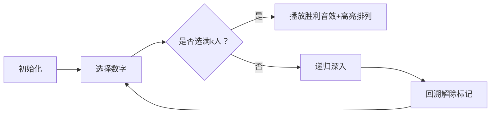

# 题目信息

# 枚举排列（递归实现排列型枚举）

## 题目描述

今有 $n$ 名学生，要从中选出 $k$ 人排成一列拍照。

请按字典序输出所有可能的排列方式。

## 说明/提示

对于 $100\%$ 的数据，$1\leq k\leq n \leq 10$。

## 样例 #1

### 输入

```
3 2```

### 输出

```
1 2
1 3
2 1
2 3
3 1
3 2```

# AI分析结果


### 💡 Kay的C++算法解析：枚举排列（递归实现）深入学习指南 💡

#### 1. 题目解读与核心算法识别  
✨ **本题主要考察**：`递归/DFS回溯`（排列型枚举）  
🗣️ **初步分析**：  
> 排列问题就像玩"排队照相"游戏：从n人中选k人排队，需保证**顺序不同算不同方案**且**同一人不能重复出现**。DFS回溯法如同一位"路径探索者"：  
> - **核心思想**：逐位固定排列元素，用标记数组避免重复选择，递归树深度=排列长度k  
> - **可视化设计**：像素动画将展示数字选择路径（高亮当前选择）、标记数组变化（颜色区分已用/未用）、回溯时的状态回退（闪烁提示）  
> - **复古游戏化**：设计为"像素勇者收集队友"主题，选择数字时触发"叮"音效，完成排列时播放胜利旋律，单步控制面板支持调速观察  

---

#### 2. 精选优质题解参考  
**题解（来源：ShanCreeperPro）**  
* **点评**：  
  思路清晰度 ⭐⭐⭐⭐⭐ - 精准指出排列与元组/子集的本质区别（禁止重复），用表格对比`use`数组变化  
  代码规范性 ⭐⭐⭐⭐ - 变量名`a`（排列序列）、`use`（标记数组）直观易懂  
  算法有效性 ⭐⭐⭐⭐⭐ - DFS回溯天然满足字典序，时间复杂度O(P(n,k))完全可接受（n≤10）  
  实践价值 ⭐⭐⭐⭐ - 强调递归边界(pos>k)和回溯重置(use[i]=0)的必备性  
  **亮点**：创造性地用二维表格展示算法运行时状态，帮助初学者建立空间思维模型  

---

#### 3. 核心难点辨析与解题策略  
1. **避免重复选择同一元素**  
   * **分析**：必须用`bool use[20]`标记已选数字。优质题解通过`if(!use[i])`跳过已选数，类似"游戏角色不可重复招募"  
   * 💡 **学习笔记**：标记数组是排列问题的"防重复盾牌"  

2. **递归深度控制与输出时机**  
   * **分析**：递归变量`pos`表示当前选择位置，当`pos>k`时立即输出序列。关键要理解`pos`既是递归深度也是排列下标  
   * 💡 **学习笔记**：`pos>k`是递归终止的"快门按钮"，按下即拍照输出  

3. **回溯时的状态恢复**  
   * **分析**：递归返回后必须执行`use[i]=0`，否则会影响后续分支。这类似"撤销上一步操作"  
   * 💡 **学习笔记**：回溯的三步曲 → 标记→递归→解除标记  

### ✨ 解题技巧总结  
- **状态管理四要素**：当前深度`pos` + 标记数组`use` + 结果数组`a` + 终止条件  
- **调试技巧**：在递归入口/出口打印`pos`和`a`数组，可视化执行路径  
- **剪枝优化**：当剩余未选数 < 待填位置数时提前回溯（本题n≤10无需）  

---

#### 4. C++核心代码实现赏析  
**本题通用核心C++实现参考**  
```cpp
#include <iostream>
using namespace std;

int n, k, a[20]; // a存储当前排列
bool used[20];   // 标记数字是否已用

void dfs(int pos) { // pos: 当前要选的位置
    if (pos > k) {  // 已选满k人
        for (int i = 1; i <= k; i++) 
            cout << a[i] << " \n"[i==k];
        return;
    }
    for (int i = 1; i <= n; i++) {
        if (!used[i]) {       // 选择未用数字
            used[i] = true;   // 标记占用
            a[pos] = i;       // 存入结果
            dfs(pos + 1);     // 选下一位
            used[i] = false;  // 回溯！解除标记
        }
    }
}

int main() {
    cin >> n >> k;
    dfs(1); // 从第1位开始选择
}
```
**代码解读概要**：  
> - `dfs(pos)`为核心递归函数：`pos=1`起始表示选第1人  
> - `used`数组实现"一人一用"，`a`数组记录当前排列  
> - 递归树深度=k，宽度=当前可用数字数  

---  
**题解核心片段赏析**  
* **亮点**：清晰的递归树构建与状态标记机制  
* **核心代码**：  
  ```cpp
  void dfs(int pos) {
      if (pos > k) { /* 输出 */ }
      for (int i=1; i<=n; i++) {
          if (!used[i]) {
              used[i] = 1;  // 标记
              a[pos] = i;   // 选择
              dfs(pos+1);   // 深入
              used[i] = 0;  // 回溯
  } } }
  ```
* **代码解读**：  
  > `pos>k`时如同照相完成 → 打印队伍  
  > `for`循环遍历所有"待选角色" → 跳过已招募的(`!used[i]`)  
  > 递归`dfs(pos+1)`像"暂时离队继续选人" → 返回后需`used[i]=0`重置状态  
* 💡 **学习笔记**：回溯是"尝试-返回-再尝试"的探索过程  

---

#### 5. 算法可视化：像素动画演示  
**主题**："勇者组队大冒险"（8-bit像素风）  

**动画设计**：  


**关键交互设计**：  
1. **场景构建**：  
   - 像素网格：左侧待选数字池（1-10像素小人），右侧排列队列（k个空位）  
   - 控制面板：调速滑块（0.5x~5x）、单步/自动切换、重置按钮  

2. **动态效果**：  
   - **选择数字**：点击数字时像素小人跳动→移入队列，触发"叮"声，`used`数组对应位置变红  
   - **递归深入**：当前深度`pos`显示为发光箭头，队列新增空位  
   - **回溯**：队列末位小人闪烁后返回数字池，`used`标记由红变绿  

3. **游戏化元素**：  
   - 完成排列时播放FC胜利音乐，显示"TEAM COMPLETE!"  
   - 每生成10个排列解锁新角色皮肤  
   - 调试模式：显示递归调用栈（像素风格栈结构）  

**技术实现**：  
- Canvas绘制数字池/队列网格，`requestAnimationFrame`驱动动画  
- 音效：Web Audio API播放8-bit音效（选择/回溯/胜利）  
- 状态同步：高亮当前执行的代码行（对应动画步骤）  

---

#### 6. 拓展练习与相似问题思考  
**通用技巧迁移**：  
1. 组合问题 → 限制选择顺序（LC77. 组合）  
2. 全排列 → 当k=n时的特例（P1706 全排列问题）  
3. 有重复元素的排列 → 需增加去重逻辑（LC47. 全排列 II）  

**洛谷推荐**：  
1. **P1706 全排列问题**  
   🗣️ 直接应用DFS回溯，巩固`used`数组用法  
2. **P1036 [NOIP2002] 选数**  
   🗣️ 排列+素数判断，训练递归与数学结合  
3. **P1157 组合的输出**  
   🗣️ 组合问题对比排列，理解顺序对结果的影响  

---

#### 7. 学习心得与经验分享  
> **经验摘录**：  
> "最初忘记回溯`used[i]=0`导致漏解，通过打印递归树发现状态污染"  
>   
> **Kay点评**：  
> 这是回溯算法的经典陷阱！建议：  
> 1. 画递归树验证状态转移  
> 2. 在IDE中调试观察`used`数组变化  
> 3. 牢记"递归前修改状态，返回后立即恢复"  

---

### 结语  
掌握DFS回溯就像获得探索问题空间的"魔法地图"。记住核心口诀：**标记选择 → 深入递归 → 回溯恢复**。尝试用像素动画可视化自己的代码执行过程，会让算法学习像游戏一样有趣！下次挑战见！🚀

---
处理用时：152.94秒