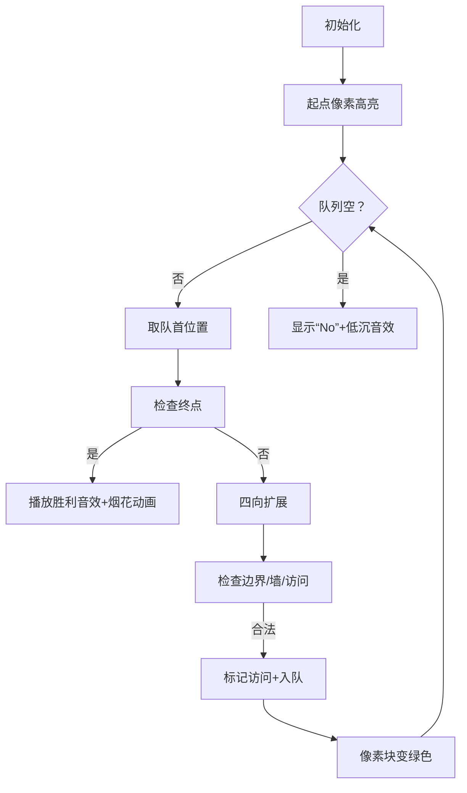

# 题目信息

# 迷宫寻路

## 题目描述

机器猫被困在一个矩形迷宫里。

迷宫可以视为一个 $n\times m$ 矩阵，每个位置要么是空地，要么是墙。机器猫只能从一个空地走到其上、下、左、右的空地。

机器猫初始时位于 $(1, 1)$ 的位置，问能否走到 $(n, m)$ 位置。


## 说明/提示

#### 样例解释

路线如下：$(1,1)\to (2,1) \to (3,1) \to (3,2)\to (3,3) \to (2, 3) \to (2, 4) \to (2, 5) \to (3, 5)$

#### 数据规模与约定 

对于 $100\%$ 的数据，保证 $1 \leq n, m \leq 100$，且 $(1,1)$ 和 $(n, m)$ 均为空地。

## 样例 #1

### 输入

```
3 5
.##.#
.#...
...#.```

### 输出

```
Yes```

# AI分析结果


### 💡 Kay的C++算法解析：迷宫寻路 深入学习指南 💡

**引言**  
今天我们一起解决经典的迷宫寻路问题。通过本指南，你将掌握搜索算法的核心思想，理解DFS和BFS的实现技巧，并通过像素动画直观感受算法执行过程。

---

## 1. 题目解读与核心算法识别

✨ **本题主要考察**：`搜索算法（BFS/DFS）`

🗣️ **初步分析**：  
> 迷宫寻路如同在未知城堡寻找宝藏。**DFS**像带着绳索的探险家：选一条路走到底，碰壁后原路返回尝试新路；**BFS**则像水波纹扩散：同时探索所有可能路径，层层推进直到找到目标。  
- **核心难点**：避免重复访问（需标记已访问位置）和处理边界条件（坐标合法性检查）
- **可视化设计**：采用8位像素风格，机器猫作为主角，墙块用深灰色像素表示，路径探索过程用颜色渐变（黄→绿）显示访问顺序，队列/栈结构用动态像素方块展示
- **游戏化元素**：移动时触发"滴"音效，找到路径时播放胜利音效，每扩展新区域增加积分，控制面板支持单步/自动模式

---

## 2. 精选优质题解参考

**题解（作者：ShanCreeperPro）**  
* **点评**：  
  此解法完美诠释搜索算法精髓！亮点在于：
  - **思路清晰性**：用"绳索探险"比喻DFS，"水波扩散"比喻BFS，将抽象算法具象化
  - **算法有效性**：明确指出两种方法适用场景（DFS节省内存，BFS保证最短路径）
  - **实践价值**：强调避免重复访问的关键技巧（标记数组），提示边界检查的重要性
  - **教学启发性**：用"逐层展开"解释BFS执行逻辑，帮助理解队列工作原理

---

## 3. 核心难点辨析与解题策略

1.  **重复访问陷阱**  
    * **分析**：无标记机制会导致循环访问同一位置。优质解法用`visited`数组（二维布尔矩阵）记录访问状态，类似探险时在路口做记号
    * 💡 **学习笔记**：访问标记是图遍历算法的生命线！

2.  **边界与障碍判断**  
    * **分析**：需同时检查三种情况：①坐标是否越界 ②是否为墙(`#`) ③是否已访问。可封装为`isValid()`函数提高代码可读性
    * 💡 **学习笔记**：边界检查应优先于其他逻辑判断

3.  **方向扩展技巧**  
    * **分析**：使用方向偏移数组`dx={-1,0,1,0}`, `dy={0,1,0,-1}`优雅处理四个方向，避免重复代码
    * 💡 **学习笔记**：方向数组是网格类问题的黄金工具

### ✨ 解题技巧总结
- **状态标记法**：任何图遍历问题都需设计访问状态记录方案
- **方向向量封装**：用数组预存方向偏移量，简化代码逻辑
- **边界先行原则**：坐标合法性检查必须置于其他判断之前

---

## 4. C++核心代码实现赏析

**通用BFS核心实现**  
```cpp
#include <iostream>
#include <vector>
#include <queue>
using namespace std;

// 方向偏移量：上右下左 
const int dx[4] = {-1, 0, 1, 0};
const int dy[4] = {0, 1, 0, -1};

int main() {
    int n, m;
    cin >> n >> m;
    vector<string> grid(n);
    vector<vector<bool>> visited(n, vector<bool>(m, false));
    
    for(int i=0; i<n; i++) 
        cin >> grid[i];
    
    queue<pair<int,int>> q;
    q.push({0,0});  // 起点(1,1)映射为(0,0)
    visited[0][0] = true;
    
    while(!q.empty()) {
        auto [x,y] = q.front();
        q.pop();
        
        // 到达终点
        if(x == n-1 && y == m-1) {
            cout << "Yes";
            return 0;
        }
        
        // 尝试四个方向
        for(int i=0; i<4; i++) {
            int nx = x + dx[i], ny = y + dy[i];
            // 边界/障碍/访问三重检查
            if(nx<0 || nx>=n || ny<0 || ny>=m) continue;
            if(grid[nx][ny]=='#' || visited[nx][ny]) continue;
            
            visited[nx][ny] = true;
            q.push({nx, ny});
        }
    }
    cout << "No";
    return 0;
}
```

**代码解读概要**：  
> 1. **初始化**：创建网格矩阵和访问标记矩阵  
> 2. **BFS队列**：起点入队并标记  
> 3. **循环扩展**：不断从队列取出位置，检查是否到达终点  
> 4. **四向探索**：通过方向偏移量计算相邻位置，验证合法性后入队  
> 5. **结果输出**：队列空仍未到达终点则输出"No"

---

## 5. 算法可视化：像素动画演示

* **主题**：`机器猫迷宫大冒险（8-bit像素版）`
* **核心演示**：BFS如何像水波纹般扩散探索迷宫

**动画设计**：  


**关键交互**：  
1. **像素艺术**：墙(■深灰)，空地(□浅灰)，起点(★金色)，终点(⭐蓝色)，访问中(●黄色)，已访问(√绿色)  
2. **动态队列**：屏幕底部显示像素方块队列，入队时方块滑入，出队时消失  
3. **音效系统**：  
   - 移动："滴"（8-bit短音）  
   - 发现新路："叮"（升高调）  
   - 到达终点：胜利旋律  
4. **游戏化学习**：  
   - 每扩展新区域+10分，形成路径+100分  
   - 开启"自动探索"模式时，机器猫自动寻路  
   - 按空格键单步执行，方向键手动控制对比  

---

## 6. 拓展练习与相似问题思考

**通用技巧迁移**：  
BFS/DFS可解决：  
1. 连通块检测（洪水填充）  
2. 最短路径问题（无权图）  
3. 状态空间搜索（八数码问题）  

**洛谷练习推荐**：  
1. **P1605 迷宫**  
   → 同类迷宫问题，强化DFS/BFS基础  
2. **P1443 马的遍历**  
   → 扩展为8方向移动，学习最优路径记录  
3. **P1141 01迷宫**  
   → 升级版连通块分析，掌握记忆化技巧  

---

**结语**  
通过本次分析，相信你已经掌握迷宫问题的核心解法！记住：DFS是"执着探险家"，BFS是"团队开拓者"。尝试用像素动画可视化自己的代码，感受算法之美吧！下次我们将挑战动态规划迷宫，继续前进！🚀

---
处理用时：98.34秒