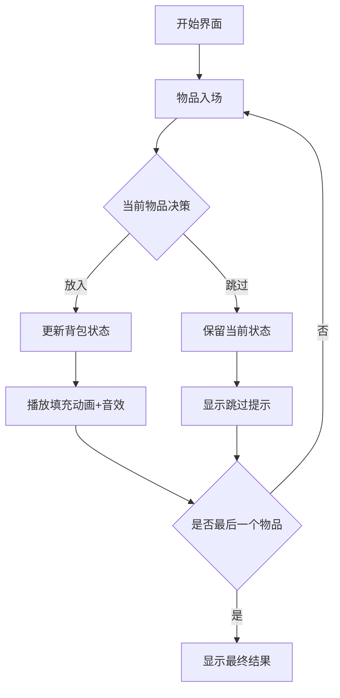

# 题目信息

# [NOIP 2001 普及组] 装箱问题

## 题目描述

有一个箱子容量为 $V$，同时有 $n$ 个物品，每个物品有一个体积。


现在从 $n$ 个物品中，任取若干个装入箱内（也可以不取），使箱子的剩余空间最小。输出这个最小值。

## 说明/提示

对于 $100\%$ 数据，满足 $0<n \le 30$，$1 \le V \le 20000$。

**【题目来源】**

NOIP 2001 普及组第四题

## 样例 #1

### 输入

```
24
6
8
3
12
7
9
7
```

### 输出

```
0
```

# AI分析结果


# 💡 Kay的C++算法解析：装箱问题 深入学习指南 💡

> 我是Kay，一位专注于算法教学的引导者。今天我们将一起探索经典的装箱问题，通过背包算法和动态规划思维，解决这个看似简单却充满技巧的挑战！

## 1. 题目解读与核心算法识别

✨ **本题主要考察**：动态规划（01背包应用）

🗣️ **初步分析**：
> 想象你有一个容量为V的箱子，需要选择性地放入不同体积的方块（物品）。我们的目标是让**箱子剩余空间最小**——这相当于**最大化已用空间**！就像玩俄罗斯方块，我们需要用不同形状的方块尽可能填满容器。
>
> - **核心思路转换**：将物品体积同时视为"价值"，用01背包求最大可装体积，最后用`V - max_value`得到答案
> - **关键难点**：理解背包状态转移中**倒序遍历容量**的原因（避免重复放入物品）
> - **可视化设计**：我们将用像素方块动态演示背包容量填充过程，高亮物品选择时的状态变化。复古游戏界面中将显示实时容量条，背包填充时播放8-bit音效，关键决策点弹出提示框

---

## 2. 精选优质题解参考

### 题解一：vegetabird (一维DP解法)
* **点评**：
  这份题解完美展示了01背包的核心思想，将最小空间问题转化为最大价值问题。代码简洁高效（空间复杂度O(V)），特别强调了**倒序更新**的关键细节，并通过具体案例说明正序遍历的错误。变量命名清晰（`f[j]`表示容量j的最大值），边界处理严谨，可直接用于竞赛

### 题解二：MuelsyseU (二维DP解法)
* **点评**：
  采用二维DP详细演示状态转移过程，深入剖析了初学者容易忽略的**状态初始化问题**。通过对比错误/正确代码，生动展示了二维DP中必须复制上一行状态的原因。虽然空间效率不如一维，但对理解DP本质极具教学价值

---

## 3. 核心难点辨析与解题策略

1.  **问题转化技巧**  
    * **分析**：题目要求最小剩余空间，本质上等价于求最大可装体积。优质题解都通过`最小空间 = V - 最大可装体积`完成问题转换
    * 💡 **学习笔记**：复杂问题常需转化为已知模型求解

2.  **状态转移方向**  
    * **分析**：一维DP必须**倒序**更新容量（从V到w[i]），否则会导致物品重复放入。vegetabird的样例清晰展示了正序产生的错误
    * 💡 **学习笔记**：背包问题"由后向前"更新是避免状态污染的关键

3.  **状态初始化**  
    * **分析**：二维DP中若直接跳过`j < w[i]`的情况会导致状态丢失。MuelsyseU通过先复制`f[i][j] = f[i-1][j]`确保状态连续性
    * 💡 **学习笔记**：DP初始化必须覆盖所有可能状态

### ✨ 解题技巧总结
-   **模型转换**：将陌生问题映射到经典算法框架（如背包问题）
-   **滚动数组优化**：用一维数组代替二维DP矩阵，大幅节省空间
-   **边界测试**：特别验证`j=w[i]`和`w[i]>V`的边界情况
-   **可视化调试**：打印DP表中间状态辅助理解

---

## 4. C++核心代码实现赏析

**本题通用核心C++实现参考**
* **说明**：综合优质题解优化的一维DP实现，空间效率最优
* **完整核心代码**：
    ```cpp
    #include <iostream>
    #include <cstring>
    using namespace std;
    
    int main() {
        int V, n;
        cin >> V >> n;
        int* w = new int[n+1]; 
        int* dp = new int[V+1];
        memset(dp, 0, (V+1)*sizeof(int));
    
        for (int i = 1; i <= n; i++)
            cin >> w[i];
    
        // 核心DP部分
        for (int i = 1; i <= n; i++)
            for (int j = V; j >= w[i]; j--)  // 注意倒序更新
                if (dp[j] < dp[j - w[i]] + w[i])
                    dp[j] = dp[j - w[i]] + w[i];
    
        cout << V - dp[V] << endl;
        delete[] w; delete[] dp;
        return 0;
    }
    ```
* **代码解读概要**：
    > 1. 初始化`dp`数组记录各容量最大可装值  
    > 2. 外层遍历物品：决定是否放入当前物品  
    > 3. 内层倒序遍历容量：更新放入后的状态  
    > 4. 最终输出`V - dp[V]`得到最小剩余空间

### 优质题解片段赏析

**题解一：vegetabird (一维DP)**
* **亮点**：完美实现一维DP，强调倒序更新原理
* **核心代码片段**：
    ```cpp
    for(i=1;i<=n;i++){
        for(j=m;j>=w[i];j--){   // 关键倒序循环
            if(f[j]<f[j-w[i]]+w[i]){
                f[j]=f[j-w[i]]+w[i]; // 状态更新
            }
        }
    }
    ```
* **代码解读**：
    > 内层循环为何从`m`递减？假设当前物品体积=1：  
    > - 正序更新时，`j=1`更新后，`j=2`会基于已污染的`j=1`状态  
    > - 倒序更新则保证`dp[j-w[i]]`始终基于**未考虑当前物品**的纯净状态  
* 💡 **学习笔记**：背包问题中，状态更新顺序决定解法正确性

**题解二：MuelsyseU (二维DP)**
* **亮点**：揭示二维DP初始化陷阱
* **核心代码片段**：
    ```cpp
    for(int i=1;i<=n;i++){
        cin>>x;
        for(int j=0;j<=m;j++)  // 先复制上一行状态
            f[i][j]=f[i-1][j];
        for(int j=m;j>=x;j--)  // 再更新可放入状态
            f[i][j]=max(f[i-1][j],f[i-1][j-x]+x);
    }
    ```
* **代码解读**：
    > 第一个内层循环确保所有容量状态继承自`i-1`，即使`j<x`也正确初始化  
    > 第二个循环处理可放入物品的情况，避免直接跳过导致状态丢失  
* 💡 **学习笔记**：二维DP需显式处理状态转移的连续性

-----

## 5. 算法可视化：像素动画演示 (核心部分)

* **动画主题**：*背包填充大冒险*（8-bit像素风格）
* **核心演示**：动态展现背包容量填充过程与状态转移

### 交互式演示框架


### 关键动画设计
1. **像素元素设计**：
   - 背包：200×20像素长条（容量V时自动缩放）
   - 物品：随机颜色方块（尺寸映射体积）
   - 状态面板：显示当前dp[j]值的8-bit数字矩阵

2. **动态过程演示**：
   ```python
   # 伪代码逻辑
   for item in items:
       显示物品入场动画(像素方块从顶部掉落)
       for capacity from V downto item.size:
           if 当前背包[capacity] < 背包[capacity-item.size] + item.size:
              播放“放置音效”
              背包[capacity]区域填充item.color
              更新状态面板数字颜色
           else:
              显示“跳过”提示气泡
       播放“物品完成”音效
   ```

3. **游戏化功能**：
   - 控制面板：单步执行/自动播放（可调速）
   - 音效系统：物品放置(叮！)、状态更新(滴！)、完成(胜利旋律)
   - 成就系统：完美填充时解锁"空间大师"勋章

4. **教学提示**：
   - 关键步骤弹出Tips："倒序更新防止重复放入！"
   - 背包容量条用颜色区分：已用空间(绿色)、剩余空间(红色)

---

## 6. 拓展练习与相似问题思考

### 同类问题延伸
1. **分割等和子集**：给定数字集合，能否分成和相等的两个子集？（01背包判断可行性）
2. **目标和**：给数字添加±号使结果等于目标值（背包问题变种）
3. **硬币找零**：用最少的硬币凑出指定金额（完全背包问题）

### 洛谷习题推荐
1. **P1048 采药**  
   → 基础01背包应用，时间替代背包容量
2. **P1060 开心的金明**  
   → 背包问题结合价值计算（价格×重要度）
3. **P1164 小A点菜**  
   → 求恰好装满背包的方案数（DP状态转移变种）

---

## 7. 学习心得与经验分享

> **经验摘录 (vegetabird)**：  
> "内层循环必须从大到小遍历，否则会出现一个物品被多次放入的错误。通过`V=5, items=[1,1]`的测试用例可以清晰验证"

> **Kay的点评**：  
> 这个调试经验极具价值！通过设计**极小化测试用例**验证边界条件，是DP调试的核心技巧。建议学习时先手动模拟n=3的DP表，再写代码

---

通过本次分析，我们掌握了如何用背包思想解决空间优化问题。记住：**算法本质在于问题转化，而调试关键在于边界验证**。下次遇到类似问题，记得先问自己："这能否转化为背包模型？" 不断练习，你将成为空间优化大师！🚀

---
处理用时：234.71秒