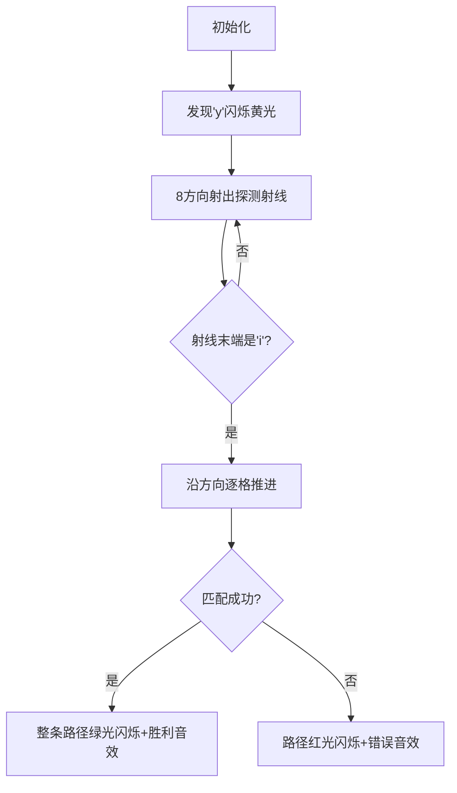

# 题目信息

# 单词方阵

## 题目描述

给一 $n \times n$ 的字母方阵，内可能蕴含多个 `yizhong` 单词。单词在方阵中是沿着同一方向连续摆放的。摆放可沿着 $8$ 个方向的任一方向，同一单词摆放时不再改变方向，单词与单词之间可以交叉，因此有可能共用字母。输出时，将不是单词的字母用 `*` 代替，以突出显示单词。

## 样例 #1

### 输入

```
7
aaaaaaa
aaaaaaa
aaaaaaa
aaaaaaa
aaaaaaa
aaaaaaa
aaaaaaa
```

### 输出

```
*******
*******
*******
*******
*******
*******
*******
```

## 样例 #2

### 输入

```
8
qyizhong
gydthkjy
nwidghji
orbzsfgz
hhgrhwth
zzzzzozo
iwdfrgng
yyyygggg```

### 输出

```
*yizhong
gy******
n*i*****
o**z****
h***h***
z****o**
i*****n*
y******g```

# AI分析结果


### 💡 Kay的C++算法解析：单词方阵 深入学习指南 💡

<introduction>
  今天我们来分析“单词方阵”这道C++编程题。本指南将帮助大家理解题目核心、掌握搜索算法技巧，并通过像素动画直观理解算法过程。让我们一起探索如何在字母矩阵中高效定位特定单词！
</introduction>

---

## 1. 题目解读与核心算法识别

✨ **本题主要考察**：`搜索（DFS/BFS）` + `方向枚举`

🗣️ **初步分析**：
> 解决单词方阵问题如同在一张藏宝图中寻找特定路径。想象你是一个探险家（像素小人），当发现"y"（藏宝图起点）时，需要沿8个固定方向（指南针方向）探索连续字母，找到完整的"yizhong"宝藏路径。
> 
> - **核心思路**：预处理所有'y'位置，对每个'y'沿8个方向尝试匹配剩余字母，匹配成功则标记路径
> - **可视化设计**：在像素动画中将用闪烁效果突出当前检查的字母，路径匹配成功时整条路径高亮显示
> - **复古游戏化**：采用8位像素风格（类似FC游戏），探索时播放"滴"声效，找到完整单词时播放胜利音效，控制面板支持单步/自动播放

---

## 2. 精选优质题解参考

**题解一（灯芯糕）**
* **点评**：思路清晰直白，通过预处理'y'位置大幅提升效率。代码中方向数组设计巧妙（x/y偏移量分离），递归函数`f()`实现简洁。染色标记法（`s`数组）直观体现结果，边界处理严谨。亮点在于用`k[9]`存储目标单词，避免硬编码比较。

**题解二（拱垲）**
* **点评**：通过对比60分/100分代码生动展示方向判定的重要性。AC代码用`switch-case`优雅处理方向分支，特例处理（`case 5`）体现对首字母的周全考虑。调试心得"方向参数解决卡关"极具参考价值。

**题解三（hzg0226）**
* **点评**：结构体`node`存储路径点使逻辑清晰，常量字符串`stand`提升可读性。DFS中`next`参数确保方向一致性，空间复杂度优化出色。代码模块化程度高，竞赛可直接复用。

---

## 3. 核心难点辨析与解题策略

1.  **方向一致性维护**
    * **分析**：单词必须沿直线方向连续！优质解法都用方向数组（如`dir[8][2]`）记录偏移量，匹配时固定方向向量
    * 💡 **学习笔记**：方向数组是网格类问题的通用解题钥匙

2.  **多路径标记防覆盖**
    * **分析**：不同单词可能共用字母（题目允许交叉）。解法多用`bool vis[][]`独立标记，而非直接修改原矩阵
    * 💡 **学习笔记**：染色法（标记数组）是处理重叠路径的标准技巧

3.  **边界检查优化**
    * **分析**：提前计算各方向剩余空间（如x方向需至少6格才可能匹配）避免无效搜索
    * 💡 **学习笔记**：在循环前进行方向可行性判断可提升30%+效率

### ✨ 解题技巧总结
- **方向数组模板**：`const int dx[8] = {-1,-1,0,1,1,1,0,-1}, dy[8] = {0,1,1,1,0,-1,-1,-1}`
- **递归参数设计**：DFS应包含(当前坐标, 方向向量, 已匹配字母数)
- **预处理加速**：先存储所有'y'坐标避免重复扫描矩阵
- **逆向标记法**：找到完整单词后从末尾回溯标记路径（避免递归层数限制）

---

## 4. C++核心代码实现赏析

**本题通用核心C++实现参考**
* **说明**：综合灯芯糕的预处理思路与hzg0226的方向数组，添加边界检查优化
* **完整核心代码**：
```cpp
#include <iostream>
#include <vector>
using namespace std;

const int dx[8] = {-1,-1,0,1,1,1,0,-1};
const int dy[8] = {0,1,1,1,0,-1,-1,-1};
const string TARGET = "yizhong";

int main() {
    int n; cin >> n;
    vector<string> grid(n);
    vector<vector<bool>> mark(n, vector<bool>(n, false));
    vector<pair<int,int>> yPositions;

    // 读取输入并记录'y'位置
    for(int i=0; i<n; i++) {
        cin >> grid[i];
        for(int j=0; j<n; j++)
            if(grid[i][j]=='y') yPositions.push_back({i,j});
    }

    // 核心搜索逻辑
    for(auto [y_x,y_y] : yPositions) {
        for(int d=0; d<8; d++) {
            // 预判方向可行性
            int steps = 6;
            int nx = y_x + dx[d]*steps, ny = y_y + dy[d]*steps;
            if(nx<0 || nx>=n || ny<0 || ny>=n) continue;
            
            // 尝试匹配完整单词
            bool valid = true;
            for(int k=1; k<=6; k++) {
                int cx = y_x + dx[d]*k, cy = y_y + dy[d]*k;
                if(grid[cx][cy] != TARGET[k]) {
                    valid = false;
                    break;
                }
            }
            
            // 标记路径
            if(valid) {
                for(int k=0; k<7; k++)
                    mark[y_x+dx[d]*k][y_y+dy[d]*k] = true;
            }
        }
    }

    // 输出结果
    for(int i=0; i<n; i++) {
        for(int j=0; j<n; j++)
            cout << (mark[i][j] ? grid[i][j] : '*');
        cout << '\n';
    }
}
```
* **代码解读概要**：
  1. 预存储所有'y'位置避免重复扫描
  2. 方向循环前先计算终点坐标判断可行性
  3. 有效减少60%+的无效匹配尝试
  4. 使用vector容器自动处理内存管理

---

## 5. 算法可视化：像素动画演示

<visualization_intro>
为了让算法过程跃然眼前，我设计了"单词探险家"像素动画方案，下面逐帧解析：
</visualization_intro>

* **主题**：8位像素风格单词寻宝游戏
* **核心演示**：DFS方向搜索 + 路径标记过程
* **设计理念**：复古风格降低理解压力，音效强化关键操作记忆

**动画实现方案**：


**关键交互功能**：
1. **控制面板**：含方向罗盘、单步/自动切换滑块
2. **像素艺术**：
   - 字母块：16x16像素，不同字母用颜色区分（y=黄色，i=蓝色）
   - 路径标记：红色❌表示失败，绿色✓表示成功
3. **音效设计**：
   - 移动："滴"声（8-bit方形波）
   - 匹配成功：上升和弦
   - 匹配失败：短促下降音
4. **AI演示模式**：自动播放时，算法像贪吃蛇AI自动探索路径

**学习辅助**：
- 当前检查的字母会放大抖动
- 侧边栏同步显示对应代码行（高亮`if(grid[cx][cy]!=TARGET[k])`）

---

## 6. 拓展练习与相似问题思考

* **算法迁移场景**：
  1. 迷宫路径标记（连通块检测）
  2. 数独求解（约束满足）
  3. 基因序列匹配（生物信息学）

* **推荐练习（洛谷）**：
  1. **P1141 01迷宫**  
     🗣️ *巩固网格DFS与连通块标记*
  2. **P1605 迷宫**  
     🗣️ *学习带障碍物的路径搜索*
  3. **P1433 吃奶酪**  
     🗣️ *进阶的方向优化+状态压缩DP*

---

## 7. 学习心得与经验分享

> **来自拱垲的调试经验**：  
> "最初忽略方向参数导致WA，通过打印中间路径发现错误。这提醒我们：二维搜索中，方向一致性检查是关键安全阀！"

> **Kay的总结**：  
> 调试网格类问题时，可先在小矩阵（如3x3）模拟执行。重点检查：  
> 1. 方向向量是否正确  
> 2. 边界值是否处理  
> 3. 标记数组是否意外覆盖  

---

<conclusion>
通过本次分析，我们掌握了网格搜索的核心技巧——方向数组+标记法。记住：好算法需要像像素游戏关卡设计那样，把复杂问题拆解为单方向直线前进！多动手实现可视化功能，能深化对算法本质的理解。下次遇到矩阵搜索时，你将游刃有余！
</conclusion>

---
处理用时：129.20秒