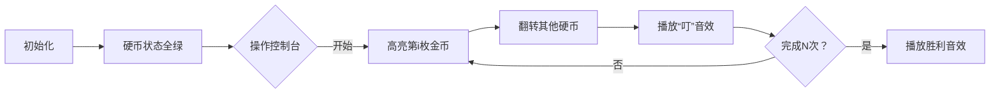

# 题目信息

# 硬币翻转

## 题目描述

在桌面上有一排硬币，共 $N$ 枚，每一枚硬币均为正面朝上。现在要把所有的硬币翻转成反面朝上，规则是每次可翻转任意 $N-1$ 枚硬币（正面向上的被翻转为反面向上，反之亦然）。求一个最短的操作序列（将每次翻转 $N-1$ 枚硬币成为一次操作）。

## 样例 #1

### 输入

```
4```

### 输出

```
4
0111
1100
0001
1111
```

# AI分析结果


# 💡 Kay的C++算法解析：硬币翻转 深入学习指南 💡

## 1. 题目解读与核心算法识别

✨ **本题主要考察**：`数学构造`与`模拟应用`

🗣️ **初步分析**：
> 解决硬币翻转问题的核心在于**逆向思维**的数学构造。想象一排灯泡，每次操作相当于你只按下一个开关（其他开关都被按下），但实际效果是除了这个开关对应的灯泡，其他灯泡状态都改变。经过N次这样的操作（每次选择不同的开关不按），每个灯泡都被改变了奇数次，从而全部熄灭。
> 
> - **核心思路**：每次翻转除第i枚硬币外的所有硬币，共操作N次。这种构造保证每枚硬币被翻转N-1次（奇数），且N是最小操作次数。
> - **可视化设计**：我们将用8位像素风格展示硬币状态（绿色=正面，红色=反面）。每次操作时，高亮当前"被忽略"的硬币（金色边框），其他硬币翻转时播放"叮"音效。操作序列用控制面板（开始/暂停/单步）管理，完成时播放胜利音效。

---

## 2. 精选优质题解参考

**题解一（子谦。）**
* **点评**：思路直击本质（操作等价于翻一枚硬币），代码简洁规范。变量`a[j]`明确表示硬币状态，循环边界处理严谨。亮点在于用布尔数组和`!`运算符简化翻转逻辑，实践价值高（可直接用于竞赛）。

**题解二（ytxytx）**
* **点评**：数学证明严谨（奇偶性分析+操作必要性），算法有效性突出。位运算优化输出（`putchar(48|i&1)`）是亮点，但需基础理解。实践时注意：位运算版需处理下标偏移，初学者建议参考基础实现。

**题解三（「已注销」）**
* **点评**：创新性使用`bitset`简化状态翻转，代码极简（仅10行）。亮点：`b.flip()`全翻转与`b.flip(i)`局部翻转的配合，实践时需注意`substr`截取输出范围。适合学习STL应用。

---

## 3. 核心难点辨析与解题策略

1.  **难点：操作等价性理解**
    * **分析**：翻转N-1枚硬币 ≡ 翻转整个序列再翻转一枚硬币。由于序列翻转偶数次抵消，实质等效于只翻一枚（见题解二数学证明）。
    * 💡 **学习笔记**：复杂操作可分解为原子操作+对称性分析。

2.  **难点：操作序列构造**
    * **分析**：必须确保每枚硬币被翻奇数次。优质题解均采用"第i次忽略第i枚硬币"的构造法，使每枚硬币恰被翻N-1次（奇数）。
    * 💡 **学习笔记**：构造法解题时，优先考虑对称性和均匀覆盖。

3.  **难点：输出字典序最小**
    * **分析**：当i较小时先输出0（如`0111`而非`1110`）。实现时需按顺序处理硬币，避免后置未翻转硬币。
    * 💡 **学习笔记**：字典序问题常通过"从左到右优先处理"解决。

### ✨ 解题技巧总结
- **逆向思维转换**：将"翻N-1枚"转化为"翻1枚+全局翻转"（题解三）
- **数学归纳验证**：通过小规模样例（n=2,4,6）找规律（题解八）
- **状态压缩优化**：使用位运算（题解二）或`bitset`（题解三）减少循环

---

## 4. C++核心代码实现赏析

**本题通用核心C++实现参考**
```cpp
#include <iostream>
using namespace std;

int main() {
    int n;
    cin >> n;
    cout << n << endl; // 操作次数=硬币数
    
    bool coins[101] = {0}; // 初始全0（正面）
    for (int i = 1; i <= n; ++i) {
        for (int j = 1; j <= n; ++j) {
            if (j != i) coins[j] = !coins[j]; // 翻转除i外的硬币
            cout << coins[j]; 
        }
        cout << endl;
    }
    return 0;
}
```
* **代码解读概要**：  
  1. 读取硬币数`n`  
  2. 初始化布尔数组`coins`（默认全0=正面）  
  3. 双层循环：外层遍历操作次数，内层遍历硬币  
  4. 核心逻辑：当`j≠i`时翻转硬币并输出状态  

### 精选题解片段赏析

**题解一（子谦。）核心代码**
```cpp
for(int i=1;i<=n;i++){
    for(int j=1;j<=n;j++){
        if(j!=i) a[j] = !a[j]; // 布尔翻转
        cout<<a[j];
    }
    cout<<endl;
}
```
* **亮点**：直观体现"忽略当前硬币"思想
* **代码解读**：  
  - `i`循环控制操作次数，`j`循环遍历硬币  
  - `j!=i`时执行翻转：`a[j] = !a[j]`利用布尔特性  
  - 实时输出状态，符合题目的序列要求  
* 💡 **学习笔记**：布尔值直接取反是状态翻转的最佳实践

**题解二（ytxytx）位运算优化**
```cpp
for (int i=1;i<=n;i++){
    for (int j=1;j<=i;j++) 
        putchar(48|~i&1); // 生成0/1
    for (int j=i+1;j<=n;j++) 
        putchar(48|i&1); 
}
```
* **亮点**：避免状态数组，直接计算输出
* **代码解读**：  
  - `48`是'0'的ASCII码  
  - `i&1`判断奇偶：奇数行前i位0，偶数行前i位1  
  - `~i&1`取反实现交替输出  
* 💡 **学习笔记**：位运算可提升性能，但需权衡可读性

---

## 5. 算法可视化：像素动画演示

### 像素化硬币翻转模拟器
* **主题**：复古游戏《金币历险记》风格  
* **核心演示**：8-bit像素硬币的翻转过程+操作计数  



**动画关键帧**：  
1. **场景初始化**  
   - 像素网格（16x16硬币/格）  
   - 控制面板：8-bit风格按钮（开始/暂停/速度滑块）  
   - 背景音乐：FC游戏《超级玛丽》地下关BGM  

2. **单步操作演示**  
   - **步骤1**：当前忽略的硬币显示金色边框（伴随"滴"声）  
   - **步骤2**：其他硬币翻转时：  
     * 绿色（正）→ 红色（反）旋转动画  
     * 每次翻转触发"叮"声（Web Audio API）  
   - **步骤3**：右侧信息板同步显示伪代码：  
     ```python
     for j in range(n):
         if j != i: 
             coins[j] = !coins[j]
     ```  

3. **游戏化元素**  
   - 每完成1次操作，进度条+1并显示"Stage i/6"  
   - 全部完成后：硬币爆炸特效（像素粒子）+ 8-bit胜利音乐  

**技术实现**：  
- Canvas绘制硬币状态矩阵  
- 音效触发：`flipSound.play()`当`j != i`时  
- 自动演示模式：`setInterval(step, 500/speed)`  

---

## 6. 拓展练习与相似问题思考

**通用技巧迁移**  
- 奇偶性分析 → P1226 快速幂（指数奇偶处理）  
- 状态翻转构造 → P2845 开关问题（网格翻转）  

**洛谷推荐**  
1. **P1226 【模板】快速幂**  
   → 巩固奇偶性分析与位运算应用  
2. **P1443 马的遍历**  
   → 练习状态转换的BFS实现  
3. **P2899 Cell Phone Network**  
   → 类似构造思维（覆盖问题）  

---

## 7. 学习心得与经验分享

> **经验摘录（ytxytx）**  
> "最初纠结于操作必要性证明，后通过小规模枚举（n=2,4）发现规律：操作次数必为n且每枚硬币被翻n-1次。"

> **Kay点评**：  
> 通过枚举小规模案例寻找规律是破解构造型问题的利器。本题中，观察n=2和n=4的样例输出（01/11和0111/1100），能快速验证"忽略第i枚"的操作有效性。调试时可打印中间状态辅助理解。

---

通过本次分析，我们深入理解了硬币翻转的数学本质与构造技巧。记住：将复杂操作分解为原子步骤+利用对称性，是解决此类问题的钥匙！下次挑战见！🚀

---
处理用时：118.31秒