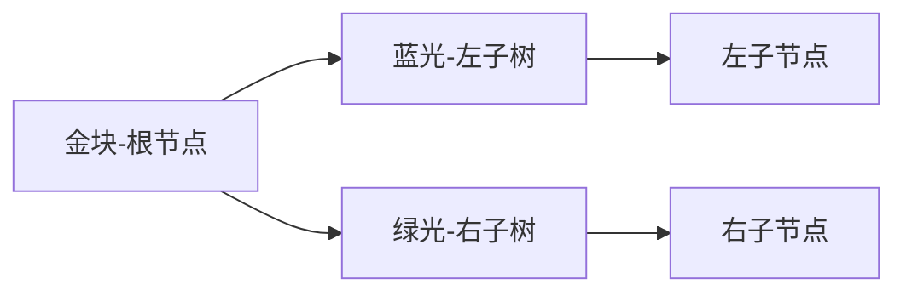

# 题目信息

# 新二叉树

## 题目描述

输入一串二叉树，输出其前序遍历。


## 样例 #1

### 输入

```
6
abc
bdi
cj*
d**
i**
j**```

### 输出

```
abdicj```

# AI分析结果


# 💡 Kay的C++算法解析：新二叉树 深入学习指南 💡

**引言**  
今天我们一起分析"新二叉树"这道C++编程题。本指南将帮助大家掌握二叉树前序遍历的核心思想，理解多种解题技巧，并通过像素动画直观感受算法执行过程。

## 1. 题目解读与核心算法识别

✨ **本题主要考察**：`二叉树遍历` + `数据结构构建`  

🗣️ **初步分析**：  
> 解决本题的关键在于理解**二叉树前序遍历**（根→左→右）和**高效构建树结构**。想象你是一位迷宫探险家：从根节点出发，每到新房间（节点）就记录位置（输出值），先探索左侧通道（左子树），再探索右侧通道（右子树）。  

- **题解思路对比**：  
  - **数组映射法**（主流解法）：用字符ASCII码作为数组下标直接存储子节点（如`lt['a']`存储a的子节点），空间效率O(1)  
  - **动态建树法**：通过指针动态创建节点，更贴近数据结构理论但实现稍复杂  
  - **免建树法**：直接递归搜索输入数据，依赖特定输入顺序（首行为根）  

- **可视化设计要点**：  
  采用**8位像素迷宫探险**风格，每个节点化为发光方块（根=金色，左子树=蓝光，右子树=绿光）。动画演示时：  
  1. 当前访问节点闪烁+播放"叮"声  
  2. 向左子树移动时显示蓝色箭头路径  
  3. 遇到"*"时播放低沉音效示意死路  

---

## 2. 精选优质题解参考

**题解一（scholar20551）**  
* **亮点**：  
  - 思路直击本质：用字符ASCII码作为数组索引（`lt[x].lc`直接访问x的左子）  
  - 代码简洁高效（20行核心代码）  
  - 边界处理严谨（`if(x=='*') return` 完美处理空节点）  
  > 学习价值：**化字符为数字索引**是处理字母二叉树的经典技巧  

**题解二（javalyc）**  
* **亮点**：  
  - 免建树设计：直接遍历输入数据二维数组  
  - 极致简洁（15行代码）  
  - 实践价值高：适合竞赛快速解题  
  > 注意点：依赖"首行为根"的数据特性，通用性稍弱  

**题解三（wuhao1027）**  
* **亮点**：  
  - 完备的父节点记录（`tree[c].fa`）  
  - 通用性强：通过`while(tree[root].fa)`查找真实根节点  
  - 结构体封装清晰（`struct node{ lc,rc,fa }`）  
  > 学习价值：**分离数据结构与算法**的优雅实现范例  

---

## 3. 核心难点辨析与解题策略

1. **难点：根节点定位**  
   * **分析**：  
     部分题解假设首行即根（数据弱），但通用解法应记录父节点。优质题解通过`fa`数组标记，最后寻找无父节点的元素作为根  
   * 💡 **学习笔记**：树根=无父节点的元素，这是二叉树的核心性质  

2. **难点：空节点处理**  
   * **分析**：  
     '*'需特殊处理，否则递归会越界。两种处理范式：  
     - 递归前判断：`if(child != '*') dfs(child)`  
     - 递归中判断：`if(x=='*') return`（更简洁）  
   * 💡 **学习笔记**：递归边界处理是算法鲁棒性的关键  

3. **难点：数据结构选择**  
   * **分析**：  
     - 小写字母树：**数组映射法**最优（`tree[256]`利用ASCII直接寻址）  
     - 通用字符树：**指针建树法**更灵活（如题解3的`struct Tree*`）  
   * 💡 **学习笔记**：根据数据范围选择数据结构是优化关键  

### ✨ 解题技巧总结
- **技巧A 索引转换**：`char → int`映射（`index = ch - 'a'`）提升访问效率  
- **技巧B 递归模板**：前序遍历固定模式：  
  ```cpp
  void dfs(Node* u) {
      操作(u);      // 先处理根
      dfs(u->left);  // 再左
      dfs(u->right); // 后右
  }
  ```
- **技巧C 输入防御**：用`scanf(" %c")`过滤换行符（Windows/Linux差异）  

---

## 4. C++核心代码实现赏析

**本题通用核心C++实现**  
```cpp
#include <iostream>
using namespace std;

struct Node { char lc, rc; };  // 子节点存储结构
Node tree[256];               // ASCII直接寻址

void dfs(char x) {
    if(x == '*') return;      // 边界：空节点
    cout << x;                // 先访问根
    dfs(tree[x].lc);          // 再左子树
    dfs(tree[x].rc);          // 后右子树
}

int main() {
    int n; cin >> n;
    char root = 0, a, l, r;
    for(int i=0; i<n; ++i) {
        cin >> a >> l >> r;
        tree[a] = {l, r};     // 存储子节点
        if(!i) root = a;      // 首行为根（数据特性）
    }
    dfs(root);
}
```
* **代码解读概要**：  
  - 利用字符ASCII码实现`O(1)`节点访问  
  - 递归前序模板清晰分离"访问"与"遍历"  
  - 默认首行为根（根据题意），通用解法可添加父节点记录  

---

**优质题解片段赏析**  
1. **scholar20551的索引魔法**  
   ```cpp
   void sm(char x) {
       if(x=='*') return;
       cout << x;              // 先根
       sm(lt[x].lc);           // ASCII索引访问左子
       sm(lt[x].rc);           // ASCII索引访问右子
   }
   ```
   > **学习笔记**：字符直接作数组下标是**空间换时间**的典范  

2. **wuhao1027的父节点追踪**  
   ```cpp
   // 建树后追溯根节点
   while(tree[root].fa != '*') 
       root = tree[root].fa;
   dfs(root);
   ```
   > **学习笔记**：通过`fa`指针解耦根节点定位与遍历逻辑  

3. **javalyc的免建树递归**  
   ```cpp
   void f(char x) {
       cout << x;
       for(int i=1; i<=n; i++)
           if(a[i][0]==x) {   // 搜索匹配节点
               f(a[i][1]);    // 递归左子
               f(a[i][2]);    // 递归右子
           }
   }
   ```
   > **学习笔记**：**牺牲时间复杂度(O(n²))换取编码简洁度**的典型取舍  

---

## 5. 算法可视化：像素动画演示

**主题**：`8位迷宫探险家前序遍历`  

**核心演示流程**：  


**动画实现方案**：  
1. **像素场景**：  
   - 节点：16x16像素方块（根=金色，左子树=蓝色渐变，右子树=绿色渐变）  
   - 路径：箭头连接线（向左=蓝色虚线，向右=绿色实线）  

2. **交互控制面板**：  
   ```html
   <canvas id="treeCanvas"></canvas>
   <div class="control">
     <button onclick="step()">▶️ 单步执行</button>
     <input type="range" id="speed" min="1" max="10"> 
     <button onclick="reset()">🔄 重置</button>
   </div>
   ```

3. **关键帧逻辑**：  
   | 步骤 | 画面表现                     | 音效         | 对应代码           |
   |------|------------------------------|--------------|--------------------|
   | 1    | 根节点闪烁（金色脉冲光）     | 清脆"叮"声   | `cout << root;`    |
   | 2    | 向左箭头延伸+左子节点蓝光亮起 | 电子滑动音   | `dfs(leftChild)`  |
   | 3    | 遇"*"显示红色❌             | 低沉错误音   | `if(x=='*')return`|
   | 4    | 完成遍历播放胜利动画         | 8-bit胜利曲  | 递归结束           |

4. **AI演示模式**：  
   - 自动按前序顺序遍历，速度可调  
   - 每步显示当前代码行高亮（同步伪代码）  

---

## 6. 拓展练习与相似问题思考

**通用技巧迁移**：  
1. **二叉树变种**：中序/后序遍历（只需调整操作顺序）  
2. **图论应用**：树的遍历是图DFS/BFS的基础形态  
3. **数据压缩**：二叉树结构在哈夫曼编码中的核心应用  

**洛谷推荐练习**：  
1. **P1030 求后序遍历**  
   🗣️ 巩固二叉树遍历转换，理解递归分解子问题  
2. **P1229 遍历问题**  
   🗣️ 训练通过两种遍历反推树结构的能力  
3. **P1305 新二叉树（本题）**  
   🗣️ 尝试用非递归方法实现前序遍历（栈应用）  

---

## 7. 学习心得与经验分享

> **经验摘录（scholar20551）**：  
> “通过字符ASCII直接索引数组，避免了复杂的指针操作，调试时注意空节点'*'的边界判断”  
>   
> **Kay点评**：  
> 这个技巧揭示了**问题特征转化**的重要性——当数据范围有限（如固定小写字母）时，用数组代替动态内存能大幅降低实现复杂度。建议学习者尝试在P1030中应用类似技巧处理数字二叉树。

---

**结语**  
通过本次分析，我们掌握了二叉树前序遍历的核心思想、多种实现范式及优化技巧。记住：理解递归本质比记忆代码更重要！下次我们将探索二叉树非递归遍历的栈实现技巧，继续挑战吧！💪

---
处理用时：129.10秒