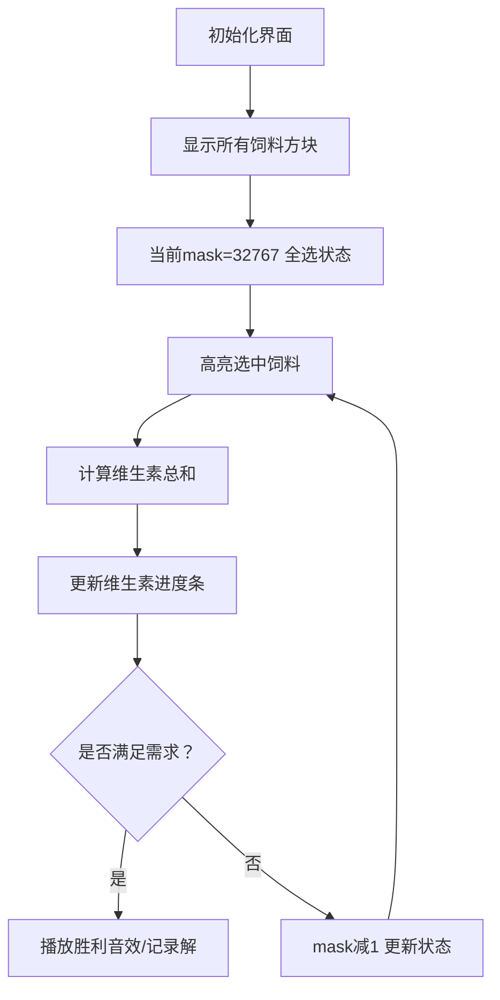

# 题目信息

# [USACO2.1] 健康的荷斯坦奶牛 Healthy Holsteins

## 题目描述

农民 John 以拥有世界上最健康的奶牛为傲。他知道每种饲料中所包含的牛所需的最低的维他命量是多少。请你帮助农夫喂养他的牛，以保持它们的健康，使喂给牛的饲料的种数最少。

给出牛所需的最低的维他命量，输出喂给牛需要哪些种类的饲料，且所需的饲料剂量最少。

维他命量以整数表示，每种饲料最多只能对牛使用一次，数据保证存在解。


## 说明/提示

【数据范围】  
对于 $100\%$ 的数据，$1\le v \le 25$，$1\le g \le 15$。  
输入的所有整数在 $[1,1000]$ 范围内。

USACO 2.1

翻译来自NOCOW


## 样例 #1

### 输入

```
4
100 200 300 400
3
50  50  50  50
200 300 200 300
900 150 389 399```

### 输出

```
2 1 3
```

# AI分析结果


# 💡 Kay的C++算法解析：健康的荷斯坦奶牛 深入学习指南 💡

## 1. 题目解读与核心算法识别

✨ **本题主要考察**：枚举/搜索 (DFS/BFS/状态压缩)

🗣️ **初步分析**：
> 解决"健康的荷斯坦奶牛"这道题，关键在于运用**枚举思想**。就像在迷宫中寻找最短路径一样，我们需要尝试不同的饲料组合（路径），找到满足维生素需求且使用饲料种类最少（路径最短）的方案。在本题中，枚举主要用于探索所有可能的饲料组合，通过计算每种组合的总维生素量来判断是否满足需求。

- **核心思路**：题目要求最小化饲料种类数，数据规模较小（g≤15），适合使用DFS/BFS或二进制枚举。DFS按顺序探索选/不选每种饲料；二进制枚举则用整数位表示选择状态。
- **算法流程**：初始化需求→生成组合→计算维生素总和→验证需求→更新最优解。可视化可高亮当前选择的饲料、维生素累积量及需求满足情况。
- **可视化设计**：采用8位像素风格（类似FC游戏），展示饲料编号网格。选中饲料时播放"叮"音效，维生素进度条动态增长，满足需求时播放胜利音效。控制面板支持步进/自动播放，速度可调。

---

## 2. 精选优质题解参考

**题解一：06ray (DFS)**
* **点评**：此解法采用经典DFS框架，思路清晰直白。函数`search(t, s)`中`t`表示当前饲料，`s`表示已选数量，逻辑分层明确。代码中`pd()`函数独立验证需求，模块化设计合理。亮点在于回溯处理简洁（`c[s+1]=0`），变量命名易懂（`minn`存最小种类数）。虽无复杂优化，但完整展示了DFS在组合问题中的应用范式，实践价值高。

**题解二：ouuan (二进制枚举)**
* **点评**：利用二进制状态压缩高效枚举子集，算法设计巧妙。核心亮点在于通过从大到小枚举二进制数（`mask=(1<<g)-1`到`0`），自然保证先找到字典序最小的解。代码中`count()`函数计算选中的饲料数，`jud()`验证需求，结构清晰。实践价值在于展示了状态压缩在小型组合问题中的优势，适合竞赛直接应用。

**题解三：Youngsc (迭代加深)**
* **点评**：采用迭代加深DFS，逐步增加搜索深度（饲料数）。亮点在于优先搜索饲料数少的组合，通过`dfs(0,0,i)`的`i`控制深度，避免DFS盲目深入。剪枝逻辑（`n-x<num-sum`）进一步优化效率。代码中`exit(0)`找到解立即退出，体现竞赛思维，适合学习者理解启发式搜索。

---

## 3. 核心难点辨析与解题策略

1. **难点1：搜索空间优化**
   * **分析**：暴力枚举所有组合（2^15=32768）虽可行，但DFS/BFS需剪枝避免无效搜索。优质解法通过两个策略：(1) 记录当前最小饲料数`minn`，当已选数≥`minn`时剪枝；(2) 按顺序选择饲料，避免重复组合（如1,2和2,1）。
   * 💡 **学习笔记**：最优性剪枝是搜索算法的核心优化手段。

2. **难点2：字典序处理**
   * **分析**：题目要求输出最小字典序解。DFS解法通过**固定选择顺序**（从小编号开始选）自然保证；二进制枚举则通过**高位对应小编号饲料**，从大到小枚举保证先找到字典序小的解。
   * 💡 **学习笔记**：搜索顺序决定解的输出顺序，合理设计顺序可避免额外排序。

3. **难点3：维生素验证效率**
   * **分析**：每次验证需累加所有选中饲料的维生素。DFS解法常用两种优化：(1) 维护当前维生素总和数组，选择饲料时增量更新，回溯时还原；(2) 预存储饲料数据避免重复计算。
   * 💡 **学习笔记**：增量更新比重新计算更高效，尤其适合回溯算法。

### ✨ 解题技巧总结
- **技巧1：问题分解** - 将"最小饲料组合"拆解为"枚举组合+验证需求"两个子问题
- **技巧2：状态压缩** - 当规模较小（n≤20）时，用整数二进制位表示组合状态
- **技巧3：剪枝优化** - 结合最优性剪枝（当前解劣于已知最优）和可行性剪枝（剩余饲料不足）
- **技巧4：调试技巧** - 输出中间状态（如当前选中的饲料编号和维生素总量）辅助定位逻辑错误

---

## 4. C++核心代码实现赏析

**本题通用核心C++实现参考**
```cpp
#include <iostream>
#include <vector>
using namespace std;

int main() {
    int v, g;
    cin >> v;
    vector<int> needs(v+1);
    for (int i = 1; i <= v; i++) cin >> needs[i];
    
    cin >> g;
    vector<vector<int>> feeds(g+1, vector<int>(v+1));
    for (int i = 1; i <= g; i++)
        for (int j = 1; j <= v; j++)
            cin >> feeds[i][j];

    // 二进制枚举解法
    int min_count = g+1;
    vector<int> best_ans;
    for (int mask = (1 << g) - 1; mask >= 0; mask--) {
        vector<int> total(v+1, 0);
        vector<int> choices;
        for (int i = 0; i < g; i++) {
            if (mask & (1 << i)) {
                choices.push_back(i+1);
                for (int j = 1; j <= v; j++)
                    total[j] += feeds[i+1][j];
            }
        }
        bool valid = true;
        for (int j = 1; j <= v; j++) {
            if (total[j] < needs[j]) {
                valid = false;
                break;
            }
        }
        if (valid && choices.size() < min_count) {
            min_count = choices.size();
            best_ans = choices;
        }
    }

    cout << min_count << " ";
    for (int choice : best_ans) cout << choice << " ";
    return 0;
}
```
**代码解读概要**：
1. 读入维生素需求`needs`和饲料数据`feeds`
2. 从全选状态`(1<<g)-1`开始枚举二进制掩码`mask`
3. 对每个`mask`计算选中饲料的维生素总和`total`
4. 验证`total`是否满足`needs`，若满足且饲料数更少则更新最优解
5. 输出最小饲料数和具体组合

---

**题解一：06ray (DFS)**
```cpp
void search(int t, int s) {
    if (t > g) {
        if (check(s)) {        // 验证当前组合
            if (s < minn) {    // 发现更优解
                minn = s;
                for (int i = 1; i <= s; i++) ans[i] = c[i];
            }
        }
        return;
    }
    c[s+1] = t;          // 选择饲料t
    search(t+1, s+1);    // 探索下一饲料
    c[s+1] = 0;          // 回溯（不选t）
    search(t+1, s);      // 探索不选t的情况
}
```
**亮点**：清晰展示DFS回溯框架  
**代码解读**：  
- `t > g`为递归边界，表示已考虑所有饲料
- `check(s)`验证当前选中的s种饲料是否满足需求
- 选择饲料t时：存入数组`c`，递归探索t+1
- 回溯操作：将`c[s+1]`置0，模拟"取消选择"  
💡 **学习笔记**：回溯时状态还原是DFS正确性的关键

**题解二：ouuan (二进制枚举)**
```cpp
for (int i = (1<<g)-1; i>=0; --i) {
    if (count(i) < minn) {   // 剪枝：当前饲料数≥已知最小值则跳过
        // 计算维生素总和并验证
        if (valid) {
            minn = count(i);
            ans = i;
        }
    }
}
```
**亮点**：逆向枚举保证字典序最小  
**代码解读**：  
- `i`从全1开始递减枚举，高位对应小编号饲料
- `count(i)`计算i的二进制表示中1的个数（饲料数）
- 仅当饲料数`count(i)`小于当前`minn`时才验证  
💡 **学习笔记**：二进制枚举时，位运算高效处理组合状态

**题解三：Youngsc (迭代加深)**
```cpp
void dfs(int x, int sum, int num) {
    if (sum == num) {          // 达到当前深度限制
        if (满足维生素需求) {
            cout << num << ' ';
            // 输出解并退出程序
            exit(0);
        }
        return;
    }
    for (int i = x+1; i <= g; i++) {
        // 选择饲料i，更新维生素状态
        dfs(i, sum+1, num);    // 继续搜索
        // 回溯还原状态
    }
}
// 调用：从深度1开始尝试
for (int depth = 1; depth <= g; depth++) 
    dfs(0, 0, depth);
```
**亮点**：深度受限搜索优先找小规模解  
**代码解读**：  
- `num`参数控制搜索深度（最多选num种饲料）
- `sum == num`时检查当前组合
- 外层循环逐步增加深度`depth`  
💡 **学习笔记**：迭代加深结合了BFS层序优势和DFS空间效率

---

## 5. 算法可视化：像素动画演示

**主题**：饲料组合探索者 (FeedQuest)  
**核心演示**：二进制枚举过程及维生素累积效果  

### 设计思路
采用8位像素风格，将饲料编号显示为16x16像素方块（1~15号），维生素需求显示为进度条。通过：
1. **视觉反馈**：选中的饲料高亮为绿色，未选灰色
2. **进度动画**：每种维生素单独进度条，累积量实时更新
3. **音效提示**：选中饲料时播放"选择音效"，满足需求时播放胜利音效

### 动画帧步骤


### 交互控制
- **控制面板**：开始/暂停、步进、速度滑块（1x~5x）
- **自动演示**：以设定速度遍历mask序列，找到解时暂停
- **游戏化元素**：
  - 每完成10%的枚举进度，播放鼓励音效
  - 找到解时显示"任务完成！"像素文字动画
  - 支持导出当前解对应的饲料组合序列

---

## 6. 拓展练习与相似问题思考

1. **子集和问题**（洛谷P1036）：给定n个数和目标和k，求有多少子集和为k
   - **关联**：同样需要枚举子集并验证条件

2. **组合优化**（洛谷P1048 采药）：在容量限制下选择物品使价值最大
   - **关联**：背包问题可视为带约束的组合优化

3. **覆盖问题**（洛谷P1219 八皇后）：用最少的皇后覆盖棋盘
   - **关联**：本质是寻找满足约束的最小规模解

**推荐练习**：
1. **洛谷 P1036** - 选数  
   🗣️ **推荐理由**：直接应用子集枚举技巧，巩固二进制表示和验证逻辑

2. **洛谷 P1048** - 采药  
   🗣️ **推荐理由**：在组合优化中引入价值约束，学习动态规划与枚举的联系

3. **洛谷 P1219** - 八皇后  
   🗣️ **推荐理由**：经典回溯问题，深化DFS剪枝和状态表示的理解

---

## 7. 学习心得与经验分享
题解中多位作者分享了调试经验：
> "我在解决回溯问题时，忘记在递归后还原维生素状态数组，导致结果错误。后来通过逐行打印中间状态才定位到问题" —— _Andrea的调试心得

**Kay的总结**：
1. **初始化重要性**：数组未初始化是常见错误源，尤其回溯问题中
2. **增量调试**：分步验证小规模实例（如g=3）比直接调试完整数据更高效
3. **边界检查**：特别注意递归边界（t>g）和维生素验证的边界条件

---

本次解析帮助你掌握了组合问题的枚举解法精髓。记住：清晰的算法框架+严谨的状态管理=高效解题！下次挑战再见！💪

---
处理用时：224.90秒