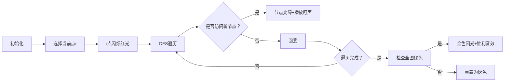

# 题目信息

# [USACO19OPEN] Milk Factory B

## 题目描述

牛奶生意正红红火火！Farmer John 的牛奶加工厂内有 $N$ 个加工站，编号为 $1\dots N$（$1\le N\le 100$），以及 $N−1$ 条通道，每条连接某两个加工站。（通道建设很昂贵，所以 Farmer John 选择使用了最小数量的通道，使得从每个加工站出发都可以到达所有其他加工站）。

为了创新和提升效率，Farmer John 在每条通道上安装了传送带。不幸的是，当他意识到传送带是单向的已经太晚了，现在每条通道只能沿着一个方向通行了！所以现在的情况不再是从每个加工站出发都能够到达其他加工站了。

然而，Farmer John 认为事情可能还不算完全失败，只要至少还存在一个加工站 $i$ 满足从其他每个加工站出发都可以到达加工站 $i$。注意从其他任意一个加工站 $j$ 前往加工站 $i$ 可能会经过 $i$ 和 $j$ 之间的一些中间站点。请帮助 Farmer John 求出是否存在这样的加工站 $i$。

## 样例 #1

### 输入

```
3
1 2
3 2```

### 输出

```
2```

# AI分析结果


### 💡 Kay的C++算法解析：Milk Factory B 深入学习指南 💡
**引言**  
今天我们一起分析USACO19OPEN的"Milk Factory B"这道图论题。题目要求在单向传送带的有向图中找到所有加工站都能到达的汇点。本指南将解析多种解法核心思想，并通过像素动画帮你直观理解算法流程。

---

## 1. 题目解读与核心算法识别
✨ **本题主要考察**：图论-有向图连通性分析  
🗣️ **初步分析**：  
> 这道题本质是寻找有向图中的**汇点**（所有节点都能到达的点）。就像在迷宫中寻找一个能被所有路径抵达的宝藏点。核心思路是通过遍历或传递闭包验证每个点的可达性。  

> - **题解思路对比**：  
>   - **正向DFS**：从每个点出发遍历，统计被访问次数（HasNoName解法）  
>   - **反向建图**：将"到达关系"转化为"出发关系"，更高效（yhx0322解法）  
>   - **传递闭包**：用Floyd算法计算全局连通性（gey666解法）  
>  
> - **可视化设计**：  
>   采用**8位像素风格**模拟工厂地图，用不同颜色方块表示加工站。演示DFS遍历时：  
>   - 当前访问点闪烁红光  
>   - 已访问点变绿并播放"叮"音效  
>   - 计数器更新时显示数字跳动动画  
>   - 找到汇点时触发胜利音效+金色闪光  

---

## 2. 精选优质题解参考
**题解一（作者：HasNoName）**  
* **点评**：思路清晰直白，通过DFS统计每个点被访问次数。代码规范性优秀：  
  - 链式前向星存图结构工整  
  - `w[]`数组记录访问次数的设计巧妙  
  - 严格重置`vis[]`数组避免状态污染  
  - 时间复杂度O(n²)完全满足n≤100的数据范围  

**题解二（作者：yhx0322）**  
* **点评**：反向建图解法展现算法优化艺术：  
  - 将原问题转化为"从汇点出发能否访问所有点"  
  - 避免额外计数变量，逻辑更简洁  
  - DFS前只需初始化`vis[]`，空间效率更高  
  - 同类问题中此技巧可推广性极强  

**题解三（作者：gey666）**  
* **点评**：Floyd传递闭包解法体现数学思维：  
  - 邻接矩阵存储直观易理解  
  - 三重循环实现全局连通性判断  
  - 虽时间复杂度O(n³)略高，但n较小时仍高效  
  - 学习图论基础算法的优秀范例  

---

## 3. 核心难点辨析与解题策略
1. **难点：验证全局可达性**  
   * **分析**：直接判断"所有点可达i"需遍历全图。优质解法通过：  
     - 反向建图转化问题（yhx0322）  
     - 统计访问次数（HasNoName）  
     - 或计算传递闭包（gey666）  
   * 💡 **学习笔记**：问题转化是图论解题核心思维  

2. **难点：避免重复访问死循环**  
   * **分析**：所有DFS解法都使用`vis[]`数组标记访问状态。关键细节：  
     - 每次DFS前必须重置标记  
     - 递归时即时更新标记位  
   * 💡 **学习笔记**：图遍历中状态管理是防死循环的生命线  

3. **难点：选择高效数据结构**  
   * **分析**：不同解法采用：  
     - 链式前向星（空间最优）  
     - 邻接表vector（代码简洁）  
     - 邻接矩阵（Floyd必备）  
   * 💡 **学习笔记**：根据算法特性选择数据结构事半功倍  

### ✨ 解题技巧总结
- **反向建图术**：将"能否到达"转化为"能否出发"  
- **访问计数器**：通过累加统计替代复杂判断  
- **状态标记重置**：DFS前必须初始化访问数组  
- **复杂度预估**：n≤100时O(n²)和O(n³)均可接受  

---

## 4. C++核心代码实现赏析
**通用核心实现（综合优化版）**  
```cpp
#include <iostream>
#include <vector>
#include <cstring>
using namespace std;
const int N = 105;
vector<int> g[N]; // 反向图
bool vis[N];

void dfs(int u) {
    for (int v : g[u]) {
        if (!vis[v]) {
            vis[v] = true;
            dfs(v);
        }
    }
}

int main() {
    int n; cin >> n;
    // 反向建图：原边a->b转为b->a
    for (int i = 1; i < n; ++i) {
        int a, b; cin >> a >> b;
        g[b].push_back(a); 
    }
    for (int i = 1; i <= n; ++i) {
        memset(vis, 0, sizeof vis);
        vis[i] = true;   // 自身可达
        dfs(i);          // 在反向图中从i出发
        bool valid = true;
        for (int j = 1; j <= n; ++j)
            if (!vis[j]) valid = false;
        if (valid) {
            cout << i;
            return 0;
        }
    }
    cout << -1;
}
```
**代码解读概要**：  
1. 反向建图：将原边方向逆转存储  
2. 枚举每个点进行DFS遍历  
3. 检查是否访问所有点（`vis[]`全为true）  
4. 找到第一个汇点立即输出  

---

**题解一（HasNoName）核心片段**  
```cpp
w[y]++;  // 访问计数器递增
dfs(y);
```
**亮点**：直观的访问统计  
**解读**：  
> 每次DFS从起点`i`出发时，遇到新节点`y`就增加`w[y]`的计数。最终若`w[i]=n-1`，说明其他所有点都能到达`i`。注意DFS前需重置`vis[]`数组。

**题解二（yhx0322）核心片段**  
```cpp
add(y, x); // 反向建边
dfs(i);    // 在反向图中从i出发
```
**亮点**：巧妙的建图转换  
**解读**：  
> 将原图边`a→b`存为`b→a`后，在反向图中从`i`出发能到达的点，正好对应原图中能到达`i`的点。这样只需检查从`i`出发能否遍历全图。

**题解三（gey666）核心片段**  
```cpp
if (d[i][k] && d[k][j]) 
    d[i][j] = 1;
```
**亮点**：Floyd传递闭包  
**解读**：  
> 通过三重循环更新邻接矩阵，`d[x][y]=1`表示存在`x→y`路径。最终检查对每个`j`，是否都有`d[j][i]=1`（所有点可达`i`）。

---

## 5. 算法可视化：像素动画演示
**主题**：像素工厂传送带大冒险  
**核心演示**：反向建图解法DFS过程  

### 动画设计（FC红白机风格）：


**实现细节**：  
1. **像素元素**：  
   - 工厂=16x16像素方块，编号居中显示  
   - 传送带=黄色箭头（反向图显示虚线箭头）  
   - 当前点=闪烁红色边框  
   - 已访问点=绿色填充  

2. **控制面板**：  
   - 速度滑块：调节DFS遍历速度  
   - 单步执行：按帧调试关键步骤  
   - 重置：所有点恢复灰色  

3. **音效系统**：  
   - 节点访问："叮"（8-bit短音）  
   - 发现汇点：超级玛丽过关音效  
   - 错误路径：俄罗斯方块消除音  

4. **AI演示模式**：  
   - 自动播放时显示"AI思考中..."像素气泡  
   - 每完成一个点检查，显示分数+1  
   - 找到解时弹出"LEVEL CLEAR!"  

---

## 6. 拓展练习与相似问题
**通用技巧迁移**：  
1. 反向建图适用于"所有点可达性"问题  
2. 访问统计可用于节点影响力分析  
3. 传递闭包处理全局连通性问题  

**洛谷推荐**：  
1. **P3916 图的遍历**  
   → 巩固反向建图技巧，要求输出每个点能到达的最大编号点  

2. **P2863 [USACO06JAN] The Cow Prom S**  
   → 学习强连通分量基础，用Kosaraju算法实现  

3. **P3387 【模板】缩点**  
   → 进阶练习，将强连通分量收缩后处理DAG  

---

## 7. 学习心得与经验分享
**作者经验（yhx0322）**：  
> "反向建图技巧能将复杂可达性问题转化为标准遍历问题，这在图论中非常实用"  

**Kay点评**：  
> 这个心得点出了算法本质。当遇到"所有点能否到达A"这类问题时，立即想到反向建图+DFS/BFS的标准解法，这是图论的重要思维模式。  

---

**结语**  
通过本指南，相信大家已掌握有向图汇点问题的核心解法与优化技巧。记住：图论解题的关键在于**问题转化**和**状态管理**。下次遇到类似问题时，不妨尝试用像素动画在脑中模拟流程哦！🚀

---
处理用时：223.93秒