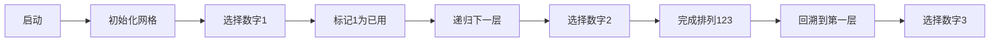

# 题目信息

# 全排列问题

## 题目描述

按照字典序输出自然数 $1$ 到 $n$ 所有不重复的排列，即 $n$ 的全排列，要求所产生的任一数字序列中不允许出现重复的数字。


## 说明/提示

$1 \leq n \leq 9$。

## 样例 #1

### 输入

```
3```

### 输出

```
    1    2    3
    1    3    2
    2    1    3
    2    3    1
    3    1    2
    3    2    1
```

# AI分析结果


### 💡 Kay的C++算法解析：全排列问题 深入学习指南 💡

#### 1. 题目解读与核心算法识别
✨ **本题主要考察**：`搜索（DFS）`  
🗣️ **初步分析**：
> 解决全排列问题的核心在于理解**DFS回溯算法**。想象你在玩一个数字拼图游戏，每次从1-n中选择一个未使用的数字放入当前格子，直到所有格子填满。DFS就像走迷宫：每次选择一个数字（路径分支），标记已用，递归填下一个格子；当无路可走时回溯（撤销选择），尝试其他分支。  
- **核心流程**：  
  1. 初始化标记数组`used`记录数字使用状态  
  2. 递归枚举每个位置：选择未用数字 → 标记 → 递归下一层 → 回溯时取消标记  
  3. 递归边界：当填满所有位置时输出排列  
- **可视化设计**：  
  采用**8位像素风格**（类似FC游戏）：  
  - 网格表示排列位置，不同颜色方块代表数字  
  - 高亮当前选择的数字（闪烁效果），已用数字变灰色  
  - 回溯时播放"撤回"音效，完成排列时播放胜利音效  

#### 2. 精选优质题解参考
**题解一：和泉正宗（DFS回溯）**  
* **点评**：  
  此解用**搜索树比喻**清晰展示DFS过程（如N=3的树形图）。代码规范：`pd`数组标记使用状态，`used`存储当前排列，递归边界处理严谨。亮点在于**图文结合的解释**，帮助初学者建立搜索树思维模型。实践价值高，直接适用于各类排列问题。

**题解二：Harry_Potter（DFS基础实现）**  
* **点评**：  
  最简洁的DFS实现之一，仅用`used`数组和`ans`数组。亮点在于**代码极简性**（23行核心逻辑），变量命名清晰（`used`/`ans`），完美演示回溯模板。特别适合初学者理解DFS框架，但缺乏优化技巧。

**题解三：shajjl（STL next_permutation）**  
* **点评**：  
  巧妙利用STL的`next_permutation`函数，通过**字典序生成**排列。代码简洁高效（10行核心），但依赖库函数。亮点在于**实践性**——展示C++标准库的强大功能，适合竞赛快速解题，但需注意初始数组必须有序。

#### 3. 核心难点辨析与解题策略
1. **避免重复使用数字**  
   * **分析**：通过`bool`标记数组（如`used`）记录数字使用状态，选择前检查`!used[i]`  
   * 💡 **学习笔记**：标记数组是排列问题的"数字账本"，必须与递归状态同步更新  

2. **保证字典序输出**  
   * **分析**：按顺序枚举数字（`for i=1 to n`），天然形成字典序，无需额外排序  
   * 💡 **学习笔记**：DFS的枚举顺序直接决定输出顺序，从小到大枚举即得字典序  

3. **实现回溯状态恢复**  
   * **分析**：递归返回后必须撤销标记（`used[i]=0`）和移除当前选择，否则影响后续分支  
   * 💡 **学习笔记**：回溯要遵循"借了东西要还"原则，状态修改必须成对出现  

✨ **解题技巧总结**  
- **状态记录法**：用标记数组避免重复，空间换时间  
- **递归模板化**：DFS固定框架（边界判断→枚举→递归→回溯）  
- **STL活用**：`next_permutation`可快速解决小规模排列问题  

#### 4. C++核心代码实现赏析
**通用核心实现（DFS回溯）**  
```cpp
#include <iostream>
using namespace std;

int n, a[10];       // a存储当前排列
bool used[10];      // 标记数字是否使用

void dfs(int step) {
    if (step > n) {                     // 边界：排列完成
        for (int i = 1; i <= n; i++) 
            printf("%5d", a[i]);        // 格式化输出
        cout << endl;
        return;
    }
    for (int i = 1; i <= n; i++) {      // 枚举所有数字
        if (!used[i]) {                 // 如果未使用
            used[i] = true;             // 标记已用
            a[step] = i;                // 存入当前排列
            dfs(step + 1);              // 递归下一层
            used[i] = false;            // 回溯：取消标记
        }
    }
}

int main() {
    cin >> n;
    dfs(1);
    return 0;
}
```
* **代码解读概要**：  
  - `used`数组实现数字去重  
  - 递归深度`step`控制排列位置  
  - 边界条件触发排列输出  

**题解一片段赏析**  
```cpp
if (!pd[i]) {          // 检查数字是否可用
    pd[i] = 1;         // 标记使用
    used[k+1] = i;     // 存储数字
    dfs(k+1);          // 递归下一层
    pd[i] = 0;         // 回溯取消标记
}
```
* **解读**：  
  > 经典回溯四步曲：检查可用性 → 标记占用 → 递归深入 → 释放标记。变量`pd`是"数字管家"，`used`是"排列记事本"  
* 💡 **学习笔记**：标记和释放必须严格对称，否则会导致状态污染  

**题解二片段赏析**  
```cpp
void dfs(int x) {
    if (x > n) { 
        print(); return;   // 边界输出
    }
    for (int i = 1; i <= n; i++) {
        if (!book[i]) {    // 检查可用性
            book[i] = 1;   // 标记
            ans[x] = i;    // 存储
            dfs(x + 1);    // 递归
            book[i] = 0;   // 回溯
        }
    }
}
```
* **解读**：  
  > 极简主义典范：去除所有非核心操作。`book`数组用`bool`类型节省空间，递归参数`x`直接对应排列位置  
* 💡 **学习笔记**：DFS参数设计可直观反映问题状态  

**题解三片段赏析**  
```cpp
do {
    for (int i = 1; i <= n; i++) 
        printf("%5d", a[i]);  // 输出当前排列
    cout << endl;
} while (next_permutation(a+1, a+1+n));  // 生成下一排列
```
* **解读**：  
  > STL神器：`next_permutation`自动按字典序重排数组。注意初始数组必须有序（如`1,2,3,...,n`）  
* 💡 **学习笔记**：库函数虽便捷，但需理解其时间复杂度为O(n)  

#### 5. 算法可视化：像素动画演示
**主题**：`像素探险家之全排列迷宫`  
**核心演示**：DFS生成排列的实时搜索树  

**动画设计**：  


1. **像素场景**  
   - 9x9网格（FC风格），绿色方块=可用数字，红色=当前选择，灰色=已用  
   - 控制面板：步进/暂停/速度滑块（调速范围1-5x）  

2. **关键动画**  
   - **分支展开**：选择数字时展开像素树枝，伴随"滴"声  
   - **回溯效果**：当前路径变暗，播放"啾"撤回音效  
   - **完成庆祝**：排列完成时网格闪烁金光，播放8-bit胜利音乐  

3. **交互设计**  
   - **AI演示模式**：自动播放DFS全过程（速度可调）  
   - **代码同步**：右侧显示实时C++代码（高亮执行行）  
   - **音效方案**：  
     * 选择数字：NES风格短"哔"声  
     * 回溯：低频"噗"声  
     * 完成：超级马里奥过关音乐  

#### 6. 拓展练习与相似问题
**通用迁移场景**：  
1. 组合问题（如P1157）：从n个数选k个  
2. 带限制排列（如P1036）：满足特定条件的排列  
3. 路径搜索（如P1605）：矩阵中走迷宫  

**洛谷推荐**：  
1. **P1157** 组合的输出  
   > 🗣️ 巩固组合生成技巧，与排列互补  
2. **P1036** 选数  
   > 🗣️ 引入素数判断，练习搜索剪枝  
3. **P1219** 八皇后  
   > 🗣️ 二维排列问题，深化DFS应用  

#### 7. 学习心得与经验分享
> **作者和泉正宗提到**："构造搜索树帮助理解DFS过程"  
> **Kay点评**：绘制搜索树是理解递归的黄金方法！尝试在纸上画出n=3的搜索树，每个节点标注当前选择，能直观看到回溯如何发生。  

> **调试技巧**：  
> 当DFS出错时，在递归入口/出口打印参数（如`step`和当前排列），可快速定位状态错误  

---  
通过本次分析，希望大家掌握DFS回溯的核心思想——像探险家一样系统探索所有路径，并善用标记数组管理状态。记住：优雅的回溯是算法的艺术！💪

---
处理用时：186.88秒