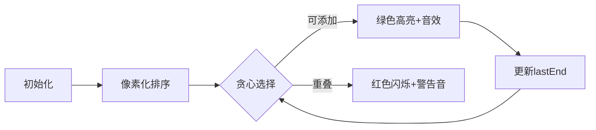

# 题目信息

# 凌乱的yyy / 线段覆盖

## 题目背景

**Python 用户可以尝试使用 pypy3 提交试题。**

快 noip 了，yyy 很紧张！


## 题目描述

现在各大 oj 上有 $n$ 个比赛，每个比赛的开始、结束的时间点是知道的。

yyy 认为，参加越多的比赛，noip 就能考的越好（假的）。

所以，他想知道他最多能参加几个比赛。

由于 yyy 是蒟蒻，如果要参加一个比赛必须善始善终，而且不能同时参加 $2$ 个及以上的比赛。

## 说明/提示

- 对于 $20\%$ 的数据，$n \le 10$；
- 对于 $50\%$ 的数据，$n \le 10^3$；
- 对于 $70\%$ 的数据，$n \le 10^{5}$；
- 对于 $100\%$ 的数据，$1\le n \le 10^{6}$，$0 \le a_{i} < b_{i} \le 10^6$。

## 样例 #1

### 输入

```
3
0 2
2 4
1 3
```

### 输出

```
2
```

# AI分析结果


### 💡 Kay的C++算法解析：凌乱的yyy / 线段覆盖 深入学习指南 💡

#### 1. 题目解读与核心算法识别
✨ **本题主要考察**：`贪心算法`

🗣️ **初步分析**：
> 解决"线段覆盖"问题，关键在于运用贪心算法。就像在时间轴上挑选巧克力——每次选结束最早的比赛（巧克力），才能吃最多而不撑肚子。贪心策略的核心是：**结束越早的线段，为后续预留的时间越多**。
> - 题解思路高度统一：按结束时间升序排序，遍历选择不重叠的线段。核心难点在于理解贪心策略的正确性（数学归纳法可证）和高效实现。
> - 算法流程可视化要点：
>   - **排序阶段**：用像素方块展示线段按结束时间"排队"过程
>   - **选择阶段**：高亮当前线段和已选线段结束时间，用颜色区分重叠判断
> - 复古游戏化设计：
>   - **8位像素风**：线段化为彩色像素条，时间轴仿FC游戏《超级玛丽》关卡
>   - **音效交互**：选择线段时"叮"声，错误重叠时"噗"声，通关时胜利BGM
>   - **AI演示模式**：自动步进展示贪心选择，速度可调

---

#### 2. 精选优质题解参考
**题解一（来源：chengni）**  
* **点评**：思路直击贪心本质，代码简洁有力。亮点在于：  
  - 用`结构体+sort`清晰分离数据与逻辑  
  - 变量`mi`精准记录最后结束时间，边界处理严谨  
  - 循环条件`x[j].a>=mi`完美体现贪心核心判断  
  - 实践价值高：代码可直接用于竞赛，复杂度O(nlogn)

**题解二（来源：MakerOne）**  
* **点评**：教学价值突出的工业级实现：  
  - `struct Match`命名明确体现问题领域  
  - 比较函数`compare`严格遵循STL规范  
  - 使用`pos`变量替代传统循环索引，可读性极佳  
  - 输入输出采用C风格，兼容性更强  

**题解三（来源：Running_Coder）**  
* **点评**：提供独特DP视角，拓宽解题思路：  
  - `f[i] = max(f[i-1],f[temp]+1)`状态转移巧妙  
  - 利用单调性将查找优化为O(1)  
  - 虽非最优解，但展现问题多解法特性  
  - 适合进阶学习者理解贪心与DP的抉择

---

#### 3. 核心难点辨析与解题策略
1. **贪心策略证明**  
   *分析*：为何选结束最早的线段最优？反证：若选结束晚的线段，必存在结束更早的可行解，矛盾  
   *💡学习笔记*：贪心问题常需用"替换法"或"归纳法"证明

2. **重叠判定陷阱**  
   *分析*：端点重合不算重叠（`a[i].start >= lastEnd`含等号）  
   *💡学习笔记*：题目说"不能同时参加"，端点重合是允许的！

3. **输入数据预处理**  
   *分析*：当`start > end`时需要交换，否则破坏排序有效性  
   *💡学习笔记*：永远假设输入数据可能不规范，添加保护逻辑

### ✨ 解题技巧总结
- **排序技巧**：优先按结束时间排序，同结束时间按开始时间降序  
- **循环优化**：用`lastEnd`替代额外数据结构，空间O(1)  
- **鲁棒性**：用`swap`处理非常规输入  
- **复杂度平衡**：贪心O(nlogn)碾压DP的O(n²)

---

#### 4. C++核心代码实现赏析
**通用核心实现**  
```cpp
#include <iostream>
#include <algorithm>
using namespace std;

struct Segment { int start, end; };

int main() {
    int n; cin >> n;
    Segment seg[1000005];
    for(int i=0; i<n; ++i) {
        cin >> seg[i].start >> seg[i].end;
        if(seg[i].start > seg[i].end) 
            swap(seg[i].start, seg[i].end);
    }
    
    sort(seg, seg+n, [](auto a, auto b) {
        return a.end < b.end; // 结束时间优先
    });
    
    int count = 1, lastEnd = seg[0].end;
    for(int i=1; i<n; ++i) {
        if(seg[i].start >= lastEnd) {
            count++;
            lastEnd = seg[i].end;
        }
    }
    cout << count;
}
```
* **代码解读概要**：  
  - 输入时预处理非常规数据  
  - Lambda表达式实现简洁比较器  
  - 贪心选择仅需单次遍历  

**题解一代码亮点**  
```cpp
// 排序函数：直击核心比较逻辑
bool cmp(px x,px y){ return x.b<y.b; } 

// 贪心选择：lastEnd思想具象化
if(x[j].a>=mi) { 
    sum++; 
    mi=x[j].b; // 更新最后结束时间
}
```
* **学习笔记**：用`mi`替代复杂数据结构是空间优化精髓

---

#### 5. 算法可视化：像素动画演示  
**设计蓝图**  


**关键帧实现**：  
1. **8-bit时间轴**：横向像素条（每像素=1单位时间）  
2. **线段表示**：  
   - 红色：未处理  
   - 绿色：已选择  
   - 黄色：当前判定  
3. **控制面板**：  
   - 步进按钮：手动控制选择节奏  
   - 速度滑块：0.5x~5x调节  
   - 模式切换：贪心vs DP对比演示  
4. **音效系统**：  
   - 选择：8-bit "叮"声（频率随选择次数升高）  
   - 错误：短促"哔"声  
   - 通关：FC《马里奥》过关音乐  

---

#### 6. 拓展练习与相似问题
- **相似问题本质**：区间调度问题的三种变体  
  1. **最少重叠覆盖**（P1250 种树）  
  2. **最大权重选择**（P1233 木棍加工）  
  3. **固定资源分配**（会场安排问题）  

- **洛谷推荐**：  
  1. P2949 - 工作调度（贪心+优先队列）  
  2. P1233 - 木棍加工（二维贪心）  
  3. P2240 - 部分背包问题（贪心入门）

---

> **Kay结语**：线段覆盖问题像时间管理艺术——每次选择最早结束，就是为未来创造更多可能。记住这个像素贪心小人：它教会我们，高效算法往往源于最朴素的观察 🌟

---
处理用时：127.96秒