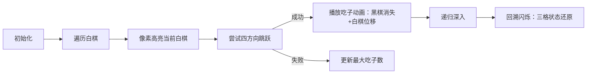

# 题目信息

# [CERC2013] Draughts

## 题目描述

国际跳棋（或称跳棋）是一种由两个对手在 $10 \times 10$ 的棋盘上进行的游戏。棋盘上的方块是黑色或白色的，就像经典的国际象棋棋盘一样。玩家一方控制黑棋，另一方控制白棋。棋子只能占据黑色的格子。棋手们交替走棋，各自移动自己的一个棋子。

最有趣的走法是吃掉：如果一个对角线相邻的格子里有对手的棋子，可以通过跳过它到紧挨着它的未被占领的格子来吃掉（并从游戏中删除被吃掉的这个棋子）。允许在一步棋中用一个棋子连续吃掉几个棋子。通过向前或向后的跳跃来吃子也是合法的。

你会得到一个棋子的位置。现在轮到白方了。计算他在下一步棋中能吃掉的最大可能的黑棋数量。

## 样例 #1

### 输入

```
2

.#.#.#.#.#
#.#.#.#.#.
.#.#.B.#.#
#.#.#.#.#.
.#.#.B.#.#
#.#.W.#.#.
.#.#.#.#.#
#.#.#.B.#.
.#.#.#.#.#
#.#.#.#.#.

.#.#.#.#.#
#.#.#.#.#.
.#.#.B.#.#
#.B.#.B.#.
.#.#.B.#.#
#.B.W.#.#.
.#.B.B.#.#
#.#.#.#.#.
.#.B.B.#.#
#.#.#.#.#.
```

### 输出

```
2
4
```

# AI分析结果


### 💡 Kay的C++算法解析：Draughts 深入学习指南 💡

#### 1. 题目解读与核心算法识别  
✨ **本题主要考察**：搜索（DFS）与回溯技巧  

🗣️ **初步分析**：  
> 这道国际跳棋题本质是**路径搜索问题**，就像在迷宫中寻找能吃掉最多敌人的路线。DFS是理想选择——每次跳跃相当于探索新路径，吃子计数如同收集金币。  
> - **核心思路**：遍历每个白棋位置，向四个对角线方向尝试跳跃吃子，递归搜索所有可能路径并记录最大值。  
> - **难点**：需精确处理棋盘状态变化（每次跳跃修改3个格子）并完整回溯。  
> - **可视化设计**：用像素棋盘高亮当前白棋，跳跃时显示"吃子动画"（黑棋消失+白棋位移），回溯时用闪烁效果还原状态。复古音效（跳跃声/吃子声）和关卡进度条（吃子数）可增强趣味性。

---

#### 2. 精选优质题解参考  
**题解一（David_yang）**  
* **点评**：逻辑清晰展现DFS核心框架，长条件判断虽显冗长但准确体现跳跃规则。亮点在于用`a[x][y]='#'`暂时移除白棋避免自我阻挡，以及严格的三格状态回溯（原位置/黑棋/新位置）。代码规范（`dx/dy`命名明确），实践性强但可读性可优化。  

**题解二（Tjaweiof）**  
* **点评**：简洁高效的代表，用`nextstep`数组分离中间黑棋和目标位置坐标计算。关键亮点是发现"移动后位置需非B/W"的边界条件（作者调试心得极具参考价值）。变量命名规范（`nx/ny`），但缺省初始化稍弱。  

**题解三（Genshin_ZFYX）**  
* **点评**：创新性用数字编码（0/1/2/3）替代字符判断，提升比较效率。亮点是`vis`数组标记已吃黑棋避免重复，虽因回溯特性未采用但启发数据结构优化思路。注释幽默但逻辑推导稍简略。  

---

#### 3. 核心难点辨析与解题策略  
1. **棋盘状态回溯**  
   * **分析**：每次跳跃需同时修改原白棋位、黑棋位、新白棋位（3格），回溯时需精准还原。优质题解通过分离操作步骤（如Tjaweiof的`nextstep`）降低出错率。  
   * 💡 **学习笔记**：回溯类问题建议先写状态修改代码，立刻补全对称回溯代码。  

2. **跳跃边界判定**  
   * **分析**：除坐标越界外，必须检查：①中间格为黑棋 ②目标格为空（非B/W）。David_yang用长条件合并判断，nsty_iridescent则拆解为独立函数。  
   * 💡 **学习笔记**：复杂条件封装成`canJump(x,y,direction)`函数提升可读性。  

3. **多白棋处理策略**  
   * **分析**：每个白棋独立搜索，需暂置当前位置为空（避免阻碍自身）。abensyl的`col[i][j]=0`和fangminding的`s[i][j]=0`均体现此技巧。  
   * 💡 **学习笔记**：状态修改仅限于当前搜索的白棋，全局需维护原始棋盘。  

### ✨ 解题技巧总结  
- **状态快照法**：执行递归前保存涉及格子的状态，回溯时直接还原（避免遗漏）。  
- **增量方向数组**：用`dx/dy`预计算位移（如`dx[4]={-2,-2,2,2}`），比硬编码更易维护。  
- **吃子计数优化**：传递`step`参数而非全局变量，避免多线程搜索干扰。  

---

#### 4. C++核心代码实现赏析  
**本题通用核心实现参考**  
* **说明**：综合David_yang和Tjaweiof思路，突出状态回溯与边界检查。  
* **完整核心代码**：  
```cpp
#include <iostream>
using namespace std;
const int dx[] = {-2, -2, 2, 2}, dy[] = {-2, 2, 2, -2}; // 目标位置偏移
const int mx[] = {-1, -1, 1, 1}, my[] = {-1, 1, 1, -1}; // 黑棋位置偏移
char board[11][11];
int maxEaten;

void dfs(int x, int y, int eaten) {
    bool canJump = false;
    for (int i = 0; i < 4; i++) {
        int nx = x + dx[i], ny = y + dy[i]; // 目标位置
        int tx = x + mx[i], ty = y + my[i]; // 黑棋位置

        if (nx < 1 || nx > 10 || ny < 1 || ny > 10) continue;
        if (board[tx][ty] != 'B' || board[nx][ny] != '#') continue;

        // 修改状态：移除白棋->吃黑棋->移动白棋
        board[x][y] = '#';
        board[tx][ty] = '#';
        board[nx][ny] = 'W';
        
        canJump = true;
        dfs(nx, ny, eaten + 1);  // 递归搜索
        
        // 回溯：还原三格状态
        board[x][y] = 'W';
        board[tx][ty] = 'B';
        board[nx][ny] = '#';
    }
    if (!canJump) maxEaten = max(maxEaten, eaten); // 更新最大值
}

int main() {
    int T; cin >> T;
    while (T--) {
        maxEaten = 0;
        for (int i = 1; i <= 10; i++)
            for (int j = 1; j <= 10; j++)
                cin >> board[i][j];

        for (int i = 1; i <= 10; i++)
            for (int j = 1; j <= 10; j++)
                if (board[i][j] == 'W') {
                    board[i][j] = '#';  // 临时移除白棋
                    dfs(i, j, 0);
                    board[i][j] = 'W';  // 恢复
                }
        cout << maxEaten << endl;
    }
    return 0;
}
```
* **代码解读概要**：  
  1. 方向数组分离目标位置(dx/dy)和黑棋位置(mx/my)偏移量  
  2. DFS前暂置白棋为空，避免自我阻挡  
  3. 递归后严格还原三格状态（白棋原位/黑棋/新位）  
  4. 终止条件：当无跳跃可能时更新全局最大值  

---

#### 5. 算法可视化：像素动画演示  
* **主题**："骑士吃子大冒险"（复古8-bit风格）  
* **核心演示**：DFS跳跃路径探索与状态回溯过程  



**关键交互设计**：  
1. **棋盘渲染**：  
   - 10x10像素网格（棕黑间隔），白棋=蓝色像素块，黑棋=红色像素块  
   - 当前操作白棋闪烁绿边，可跳跃方向显示黄色箭头  

2. **跳跃动画**：  
   - 吃子时黑棋碎裂动画+8-bit碎裂音效  
   - 白棋沿对角线滑行至新位置，轨迹显示白色粒子  

3. **回溯提示**：  
   - 递归返回时三格（原白棋/黑棋/新位）同步闪烁红光  
   - 显示文字气泡："状态还原！"  

4. **游戏化元素**：  
   - 进度条显示当前吃子数/历史最大值  
   - 每吃掉一子播放上升音阶音效  
   - 打破记录时触发烟花动画+胜利BGM  

---

#### 6. 拓展练习与相似问题思考  
* **技巧迁移**：回溯型DFS适用于：  
  1. 棋盘路径搜索（八皇后）  
  2. 图状态遍历（哈密顿回路）  
  3. 组合优化（子集和问题）  

* **洛谷推荐**：  
  1. **P1219 八皇后**：练习回溯与状态标记  
  2. **P1433 吃奶酪**：二维坐标DFS+最优解记录  
  3. **P1120 关路灯**：动态规划与状态回溯结合  

---

#### 7. 学习心得与经验分享  
> **Tjaweiof的调试经验**："移动后位置需非B/W"的边界条件调试了3页提交记录，最终通过打印中间状态发现错误。  
> **Kay点评**：这凸显了**边界条件验证**的重要性。建议：  
> 1. 对每个条件分支编写测试用例  
> 2. 使用`cerr`输出关键状态  
> 3. 先小规模验证再扩展  

---

掌握回溯型DFS的关键在于**状态修改与还原的对称性**，就像下棋时记录每一步才能悔棋。通过本题的像素化演绎，相信大家能更直观理解搜索与回溯的精髓！

---
处理用时：113.49秒