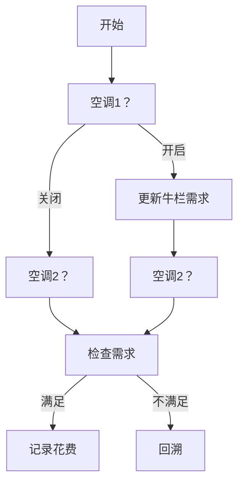

# 题目信息

# [USACO23JAN] Air Cownditioning II B

## 题目描述

农夫约翰的 $N$ 头奶牛 $(1≤N≤20)$ 住在一个谷仓里，谷仓里有连续的牛栏，编号为 $1-100$ 。 奶牛 $i$ 占据了编号 $[s_i,t_i]$ 的牛栏。 不同奶牛占据的牛栏范围是互不相交的。 奶牛有不同的冷却要求，奶牛 $i$ 占用的每个牛栏的温度必须至少降低 $c_i$ 单位。

谷仓包含 $M$ 台空调，标记为 $1-M$ $(1\le M\le10)$。第 $i$ 台空调需要花费 $m_i$ 单位的金钱来运行 $(1\le m_i \le 1000)$ ，如果运行，第 $i$ 台空调将牛栏 $[a_i,b_i]$ 所有牛栏的温度降低 $p_i$（$1\le p_i\le10^6）$。 空调覆盖的牛栏范围可能会重叠。

请帮助农夫约翰求出满足所有奶牛需求要花费的最少金钱。

## 说明/提示

### 样例解释 1

一种花费最少的可能解决方案是选择那些冷却区间为 $[2,9]$ 、$[1,2]$ 和 $[6,9]$ 的空调，成本为 $ 3+2+5=10$ .


对于 $100\%$ 的数据，$1 \le N \le 20$， $1 \le M \le 10$, $ 1 \le a_i, b_i, s_i, t_i \le 100$, $1 \le c_i, p_i \le 10^6$， $1 \le m_i \le 1000$。

## 样例 #1

### 输入

```
2 4
1 5 2
7 9 3
2 9 2 3
1 6 2 8
1 2 4 2
6 9 1 5```

### 输出

```
10```

# AI分析结果


### 💡 Kay的C++算法解析：Air Cownditioning II B 深入学习指南 💡

**引言**  
今天我们一起分析USACO铜组题目《Air Cownditioning II B》。这道题考察在限定条件下的最优选择策略，我们将通过DFS枚举和状态回溯技巧高效解决。指南将帮助大家掌握核心算法逻辑和实现细节。

---

### 1. 题目解读与核心算法识别
✨ **本题主要考察**：`枚举子集`（DFS回溯法）  
🗣️ **初步分析**：  
> 就像在复古游戏《塞尔达传说》中探索所有宝箱组合寻找最优装备一样，本题需枚举所有空调组合（选/不选），通过DFS回溯尝试每种可能。核心在于：
> - 用桶数组`req[]`记录每个牛栏的降温需求
> - DFS递归枚举空调选择，选则覆盖区间减温并累加花费
> - 回溯时恢复状态，确保搜索空间完整
> - 叶节点检查所有牛栏需求≤0，更新最小花费
>  
> **可视化设计**：采用8-bit像素风格，空调显示为不同颜色开关（红/蓝），牛栏用绿色/红色像素块表示需求满足状态。选中空调时播放"滴"音效，需求达标时播放《超级玛丽》过关音效，回溯时像素块闪烁提示状态恢复。

---

### 2. 精选优质题解参考
**题解一（来源：Jorisy）**  
* **点评**：  
思路直击本质——用桶数组记录需求，DFS选空调时直接修改桶值并回溯恢复。亮点在于：  
1. 变量命名清晰（`cw`需求数组，`v`空调花费）  
2. 回溯逻辑简洁（选后立即恢复状态）  
3. 边界处理严谨（通过`k`记录最大牛栏位置）  
4. 时间复杂度O(2ᴹ×M×100)完全可接受（M≤10）

**题解二（来源：doumingze）**  
* **点评**：  
采用状态标记数组`st[]`管理空调选择，亮点在于：  
1. 模块化设计（分离`judge()`检查函数）  
2. 独立需求数组`tp[]`和降温数组`jtp[]`避免干扰  
3. 鲁棒性强（显式初始化数组）  
可优化点：检查函数每次重置`jtp[]`效率稍低

**题解三（来源：DreamLand_zcb）**  
* **点评**：  
创新性使用差分数组管理降温效果：  
1. 差分标记`d[]`+前缀和实现区间快速更新  
2. 检查逻辑分层（先验证牛再验证栏）  
3. 结构体封装数据提升可读性  
注意：实际需求计算可简化（题目已明确区间不重叠）

---

### 3. 核心难点辨析与解题策略
1. **需求数组的初始化**  
   *分析*：由于奶牛区间互不重叠，可直接遍历每个牛栏区间设置需求值`req[i]=c_i`。若重叠需差分前缀和（本题不需要）  
   💡 **学习笔记**：题目约束是简化关键，审题时注意条件限制

2. **DFS回溯的状态管理**  
   *分析*：选择空调后需修改需求数组，返回父节点前必须精确恢复状态。优质题解均采用"修改-递归-恢复"三段式结构  
   💡 **学习笔记**：回溯法如同走迷宫时撒面包屑，离开时必须捡回

3. **剪枝与效率优化**  
   *分析*：当当前花费已超过历史最优解时立即返回（Jorisy解法中`ans`的实时更新）  
   💡 **学习笔记**：最优性剪枝是暴力搜索提速的灵魂

#### ✨ 解题技巧总结
- **空间换时间**：用桶数组替代区间循环检查（Jorisy）  
- **模块化验证**：分离状态检查函数提升可读性（doumingze）  
- **差分魔法**：O(1)完成区间修改（DreamLand_zcb）  
- **实时剪枝**：`if(pay>ans) return` 避免无效搜索  

---

### 4. C++核心代码实现赏析
**本题通用核心实现**  
```cpp
#include <iostream>
#include <algorithm>
using namespace std;

int n, m, ans=1e9;
int req[105]; // 牛栏需求数组
struct AC { int a, b, p, cost; } ac[15]; // 空调结构体

bool check() {
    for(int i=1; i<=100; i++)
        if(req[i] > 0) return false;
    return true;
}

void dfs(int id, int total) {
    if(total >= ans) return; // 最优性剪枝
    if(id > m) {
        if(check()) ans = total;
        return;
    }
    
    // 不选当前空调
    dfs(id+1, total); 
    
    // 选当前空调
    for(int i=ac[id].a; i<=ac[id].b; i++) 
        req[i] -= ac[id].p;
    dfs(id+1, total + ac[id].cost);
    
    // 回溯恢复
    for(int i=ac[id].a; i<=ac[id].b; i++)
        req[i] += ac[id].p;
}

int main() {
    cin >> n >> m;
    for(int i=0; i<n; i++) {
        int s, t, c; cin >> s >> t >> c;
        for(int j=s; j<=t; j++) req[j] = c; // 初始化需求
    }
    for(int i=1; i<=m; i++)
        cin >> ac[i].a >> ac[i].b >> ac[i].p >> ac[i].cost;
    dfs(1, 0);
    cout << ans;
}
```

**代码解读概要**：  
1. 桶数组`req[]`精确记录每个牛栏的降温需求  
2. DFS递归枚举空调（选/不选），通过`total`累计花费  
3. 选择空调时修改覆盖区间需求值并回溯恢复  
4. 叶节点检查所有牛栏需求是否达标  

---

### 5. 算法可视化：像素动画演示  
**主题**：8-bit空调调度大作战！  
**核心演示**：DFS决策树生成 + 牛栏需求实时变化  



**交互设计**：
1. **像素元素**：
   - 空调：红色开关（关闭）/蓝色（开启）
   - 牛栏：绿色像素（需求≤0）/红色（需求>0）
   - 当前决策点：闪烁黄色边框
2. **音效系统**：
   - 决策：8-bit "滴"声
   - 需求达标：《超级玛丽》过关音效
   - 回溯：复古错误提示音
3. **控制面板**：
   - 单步执行：按方向键逐步决策
   - 自动演示：AI自动完成DFS（速度可调）
   - 路径对比：同时显示最优/当前路径
4. **动态效果**：
   - 选中空调时覆盖牛栏像素块渐变变浅
   - 回溯时像素块脉冲式闪烁恢复
   - 找到最优解时触发烟花特效

---

### 6. 拓展练习与相似问题
**通用技巧迁移**：  
DFS回溯法适用于所有"组合优化"问题，特别是：
1. 子集选择（如：从集合选元素满足条件）
2. 排列生成（如：路径规划）
3. 约束满足（如：八皇后）

**洛谷推荐**：  
1. [P1157 组合的输出](https://www.luogu.com.cn/problem/P1157)  
   → 掌握DFS生成组合的标准框架  
2. [P1219 八皇后](https://www.luogu.com.cn/problem/P1219)  
   → 学习回溯法在经典问题中的应用  
3. [P2392 kkksc03考前临时抱佛脚](https://www.luogu.com.cn/problem/P2392)  
   → 强化子集划分的决策思维  

---

### 7. 学习心得与经验分享
> **作者Jorisy的调试经验**：  
> *"回溯时一定要精确恢复状态，我曾因漏掉一个牛栏的恢复操作调试半小时"*  
>  
> **Kay点评**：  
> 这是回溯法的核心陷阱！建议：  
> 1. 将状态修改/恢复代码放在相邻行  
> 2. 用`#ifdef DEBUG`打印中间状态  
> 3. 小规模数据手工模拟验证  

---

**结语**  
通过DFS回溯法，我们高效解决了空调调度问题。关键要掌握：状态表示 + 决策枚举 + 精确回溯。记住，好的回溯如同优雅的舞蹈——前进时改变世界，后退时恢复原状。下次遇到组合优化问题，不妨像素化想象决策过程吧！🚀

---
处理用时：158.56秒