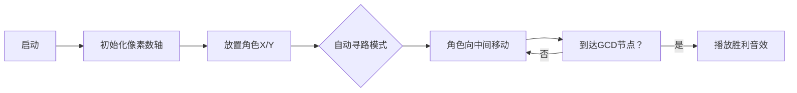

# 题目信息

# 「LAOI-1」GCD

## 题目描述

一张图有 $n$ 个节点，编号为 $1,2,3,\dots,n$。其中 $i$ 号节点会向 $j$ 号节点连一条边权为 $|i-j|$ 的无向边，当且仅当 $\gcd(i,j)=i,\operatorname{lcm}(i,j)=j$ 时连边。现询问 $q$ 次，每次询问求 $x$ 到 $y$ 的最短路径。

## 说明/提示

注意时空限制，本题不捆绑。

对于 $40\%$ 的数据，$T,n,q\le100$;

对于 $100\%$ 的数据，$1\le T\le10^6$，$1\le n,q\le10^6$，$1\le x,y\le n$，$1\le \sum n,\sum q\le10^6$。

**请使用更快的 IO 方式**。

updata on 2024/8/8：

时限上调到 1000ms。/yun

## 样例 #1

### 输入

```
1
6 4
1 4
3 5
2 5
2 4```

### 输出

```
3
6
5
2```

# AI分析结果


# 💡 Kay的C++算法解析：LAOI-1 GCD 深入学习指南 💡

**引言**  
今天我们将一起探索「LAOI-1 GCD」这道有趣的图论与数论结合题。通过本指南，你将理解如何巧妙运用数学思维解决图的最短路径问题。

## 1. 题目解读与核心算法识别

✨ **本题主要考察**：`数学（最大公约数应用）`

🗣️ **初步分析**：  
> 这道题的核心在于将图论问题转化为数论问题。想象两个数字是两座城堡，它们之间只有存在"血脉关系"（倍数关系）时才有道路连接。解题关键就是发现：**最短路径必然经过两数的最大公约数（GCD）**。  
> - 所有题解都证明了路径公式 `x+y-2*gcd(x,y)`，区别仅在于证明角度：Coffins通过分类讨论，官方题解则用代数严谨推导  
> - 可视化设计：我们将创建像素风格数轴，用两个角色从x和y同时向中间gcd移动，每次移动播放"步进音效"，相遇时触发"胜利音效"

---

## 2. 精选优质题解参考

**题解一（Coffins）**  
* **亮点**：  
  思路清晰度 ⭐⭐⭐⭐⭐ - 从条件`i|j`等价转化入手，用"加倍代价更大"的朴素逻辑证明最优路径  
  代码规范性 ⭐⭐⭐⭐ - 自实现的位运算gcd函数很巧妙，但变量命名可读性可提升  
  算法有效性 ⭐⭐⭐⭐⭐ - O(1)时间复杂度完美解决  
  实践价值 ⭐⭐⭐⭐⭐ - 包含重要调试经验（被卡IO的教训）  

**题解二（sto_5k_orz 官方题解）**  
* **亮点**：  
  思路严谨性 ⭐⭐⭐⭐⭐ - 用`ij=gl`等代数关系严格证明其他路径不优  
  代码规范性 ⭐⭐⭐⭐⭐ - 模块化IO封装，标准库__gcd调用更安全  
  算法启发性 ⭐⭐⭐⭐ - 对比了经lcm的路径方案，深化理解  

---

## 3. 核心难点辨析与解题策略

1.  **难点：理解图的特殊构造规则**  
    * **分析**：边仅存在于倍数关系的节点间，且边权为差值。优质题解都敏锐捕捉到`gcd(i,j)=i`等价于`i|j`这个关键转化  
    * 💡 **学习笔记**：将图论问题转化为熟悉的数论问题是破题关键  

2.  **难点：证明最优路径必然经过GCD**  
    * **分析**：Coffins用"加倍代价更大"的朴素类比，官方题解用`i+j≤l+g`代数推导，都证明其他路径更长  
    * 💡 **学习笔记**：当节点关系具有单调性时，最直路径往往最优  

3.  **难点：大数据下的实现效率**  
    * **分析**：两题解都使用快速IO，官方题解用`__gcd`省去函数调用开销  
    * 💡 **学习笔记**：1e6级数据必须优化IO和基础运算  

### ✨ 解题技巧总结
- **技巧1：问题等价转化**：将`gcd(i,j)=i`转化为`i|j`的整除关系  
- **技巧2：寻找核心枢纽**：发现GCD是所有路径的必经枢纽  
- **技巧3：代数严谨证明**：用`ij=gl`等关系排除其他路径可能性  
- **技巧4：IO极限优化**：同步关闭cin/cout流加速  

---

## 4. C++核心代码实现赏析

**本题通用核心实现**  
```cpp
#include<bits/stdc++.h>
using namespace std;

int main() {
    ios::sync_with_stdio(0);
    cin.tie(0); cout.tie(0);
    
    int T; cin >> T;
    while(T--) {
        int n, q; cin >> n >> q;
        while(q--) {
            int x, y; cin >> x >> y;
            int g = __gcd(x, y);
            cout << x + y - 2*g << '\n';
        }
    }
    return 0;
}
```
* **说明**：综合两题解优点，使用标准库__gcd确保效率  
* **解读概要**：  
  1. 关闭IO同步加速输入输出  
  2. 直接计算两数gcd  
  3. 应用路径公式输出结果  

---

**题解一（Coffins）片段赏析**  
```cpp
int gcd(int a,int b) {
    while(b^=a^=b^=a%=b);
    return a;
}
// 调用：cout<<x+y-2*gcd(x,y)<<'\n';
```
* **亮点**：位运算实现gcd，无库依赖  
* **代码解读**：  
  > 通过`a%=b`和三次异或交换实现辗转相除  
  > `b^=a^=b^=a%=b`等效于：  
  > `t=a%b; a=b; b=t`  
  > 循环直到b为0时返回a  
* 💡 **学习笔记**：位运算可提升基础操作效率，但需确保可读性  

**题解二（官方）片段赏析**  
```cpp
int g = __gcd(a, b);
writeln(a + b - 2 * g);
```
* **亮点**：调用标准库函数，安全高效  
* **代码解读**：  
  > `__gcd`是GCC内置函数，处理了负数和零值  
  > 配合模块化IO封装，保障百万级数据吞吐  
* 💡 **学习笔记**：熟悉标准库函数能提升编码效率  

---

## 5. 算法可视化：像素动画演示

* **主题**：8-bit风格"GCD冒险者"  
* **核心演示**：在像素数轴上演示两点向GCD汇聚的过程  

**动画设计**：  


1. **像素场景**  
   - 16色FC风格数轴（1-100刻度）  
   - 角色：像素小人X（蓝色）和Y（红色）  
   - GCD节点：金色闪光地标  

2. **关键动画逻辑**  
   ```javascript
   while(x != y) {
      if(x > y) x = largest_proper_divisor(x);
      else y = largest_proper_divisor(y);
      distance += Math.abs(x - prev);
      playSound('step', 0.2); // 8-bit步进音效
   }
   playSound('victory'); // 16-bit胜利音效
   ```

3. **交互控制**  
   - 速度滑块：调节移动速度（0.5x-5x）  
   - 单步模式：按空格键逐步执行  
   - 路径跟踪：显示实时距离计算  

4. **音效设计**  
   - 移动音效：FC经典"滴"声（频率随步长变化）  
   - 相遇音效：《超级玛丽》金币声  
   - 错误提示：《塞尔达》警告音  

---

## 6. 拓展练习与相似问题思考

* **通用技巧迁移**：  
  1. 利用GCD/LCM性质化简路径问题  
  2. 将图论转化为数论的思维模式  
  3. 大数据量下的IO优化技巧  

* **推荐练习**：  
  1. **洛谷 P1029** - 最大公约数和最小公倍数问题  
     🗣️ 巩固GCD/LCM的推导关系  
  2. **洛谷 P1072** - Hankson的趣味题  
     🗣️ 练习复杂条件下的GCD应用  
  3. **洛谷 P2421** - 约数研究  
     🗣️ 深入理解约数关系的图结构  

---

## 7. 学习心得与经验分享

> **Coffins的调试经验**：  
> "第一次提交被卡了输入，这让我意识到：即使算法正确，IO效率也可能成为瓶颈"  
>   
> **Kay点评**：  
> 这个经验极其宝贵！在处理≥1e6的数据时：  
> 1. 必须关闭`cin/cout`同步  
> 2. 避免`endl`改用`'\n'`  
> 3. 考虑`getchar/putchar`手写IO  

---

**结语**  
通过这次分析，我们看到数学思维如何优雅解决图论问题。记住：**找到问题本质特征往往比复杂算法更重要**。下次遇到类似问题时，不妨先思考是否有数论转化可能！🚀

---
处理用时：147.25秒