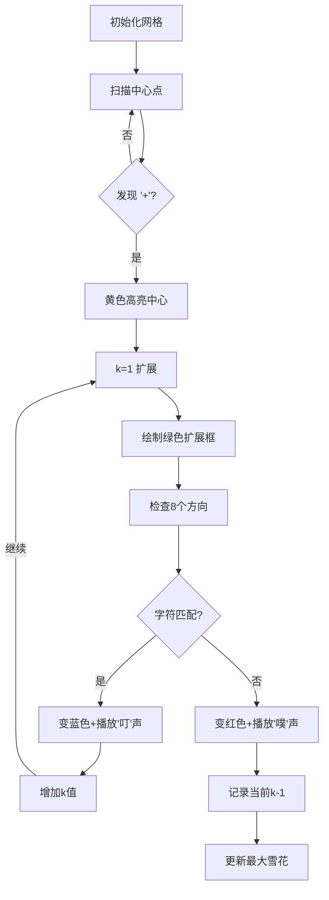

# 题目信息

# [COCI 2023/2024 #2] Pahuljice

## 题目描述

Lana 喜欢画雪花。如下定义一个大小为 $x$ 的雪花：

+ 雪花的中间是一个 $\texttt{'+'}$。
+ 在 $\texttt{'+'}$ 的上方和下方各有 $x$ 个 $\texttt{'|'}$。
+ 在 $\texttt{'+'}$ 的左方和右方各有 $x$ 个 $\texttt{'-'}$。
+ 在 $\texttt{'+'}$ 的左上方和右下方各有 $x$ 个 $\texttt{'\textbackslash'}$。
+ 在 $\texttt{'+'}$ 的左下方和右上方各有 $x$ 个 $\texttt{'/'}$。

雪花之间可以重叠。如下是雪花的几个例子：


三张图分别含有一个大小为 $1$ 的雪花，重叠的两个大小分别为 $2$ 和 $1$ 的雪花，一个大小为 $1$ 的雪花（作为大小为 $2$ 的雪花不完整）。

给定一个 $n\times m$ 的字符矩阵，请找出其中最大的雪花的大小。
 

## 说明/提示

### 数据范围
|$\text{Subtask}$|分值|特殊性质|
|:-:|:-:|:-:|
|$1$|$11$|最大的雪花大小是 $1$，或者没有任何雪花|
|$2$|$11$|矩阵中至多只有一个 $\texttt{'+'}$|
|$3$|$28$|无|

对于所有数据，$1\le n,m\le 50$。

## 样例 #1

### 输入

```
5 6
\.\|/.
---+--
/./|\.
./.|.\
/..|..```

### 输出

```
1
```

## 样例 #2

### 输入

```
7 7
\.|./..
.\|/...
--+--..
./|\...
/.|.\|/
....-+-
..../|\```

### 输出

```
2```

## 样例 #3

### 输入

```
7 7
\|/|\|/
-+-|-+-
/|\|/|\
---+---
\|/|\|/
-+-|-+-
/|\|/|\
```

### 输出

```
1```

# AI分析结果


# 💡 Kay的C++算法解析：Pahuljice 深入学习指南 💡

欢迎各位年轻的编程爱好者！今天我们将一起探索 **[COCI 2023/2024 #2] Pahuljice** 这道有趣的题目。本指南将帮助大家理解题目核心思路，掌握解题技巧，并通过独特的像素动画直观感受算法执行过程。

---

## 1. 题目解读与核心算法识别

✨ **本题主要考察**：`枚举与模拟`  

🗣️ **初步分析**：
> 这道题就像在雪地中寻找最完美的雪花图案。想象你是一位雪花猎人，手持放大镜在字符网格中扫描。当你发现"+"符号时，就开始以它为中心向外逐层检查花瓣（八个方向的字符）是否符合雪花的对称结构。

- **核心思路**：遍历网格中每个"+"位置，以偏移量k=1开始向外扩展，检查八个方向上的字符是否符合雪花定义（上下是'|'，左右是'-'，对角是'/'和'\'）。若某一层不满足条件，则当前k-1即为该雪花大小。
- **算法流程**：  
  1. 遍历网格寻找"+"中心点  
  2. 对每个中心点，k从1开始递增  
  3. 检查八个方向上的字符和边界  
  4. 更新最大雪花尺寸
- **可视化设计**：采用8位像素风格（类似FC游戏），中心点用黄色高亮，每层扩展用绿色边框标记，匹配的字符变为蓝色，不匹配的变为红色并触发音效。用户可通过控制面板调整速度，观察雪花生长过程。

---

## 2. 精选优质题解参考

以下是综合思路清晰度、代码规范性和算法效率筛选的优质题解：

**题解一：(来源：gaoyangyang)**
* **点评**：思路清晰地将解题过程分为"读题-简化-实现"三阶段，代码结构工整。亮点在于使用`while(1)`循环逐层扩展，通过边界检查提前终止无效计算。变量命名简洁（如偏移量`p`），实践价值高，可直接用于竞赛。

**题解二：(来源：xuan_gong_dong)**
* **点评**：创新性地使用方向数组`nxt[8][2]`和字符检查数组`check[8]`统一处理八个方向，大幅减少代码冗余。亮点是通过数学计算避免重复判断，算法效率高且扩展性强，适合作为模板代码学习。

**题解三：(来源：Mason123456)**
* **点评**：采用分方向独立计算的策略，通过`INT_MAX`初始化和`min()`求极值确保正确性。亮点是严谨的边界处理（显式检查每个方向边界），对初学者理解雪花结构很有帮助，调试信息输出设计也很实用。

---

## 3. 核心难点辨析与解题策略

### 关键难点分析：
1. **多层雪花重叠处理**  
   * **分析**：雪花可能重叠（如大小2的雪花包含大小1的雪花），解决方案是逐层扩展而非整体判断。优质题解都采用k从1递增直到失败的设计，确保检测最大完整雪花。
   * 💡 **学习笔记**：雪花大小由其完整的最外层决定，内层必然满足条件。

2. **边界条件与越界处理**  
   * **分析**：扩展时需同时检查网格边界和字符匹配。高效做法是将边界判断与字符检查合并（如gaoyangyang的`if (i+p>=m or ...)`），避免单独处理坐标。
   * 💡 **学习笔记**：坐标检查应放在字符检查前，防止访问非法内存。

3. **特殊字符转义处理**  
   * **分析**：反斜杠`\`在C++中需转义为`\\`或用ASCII码92表示。优质解法均采用`char(92)`或`'\\\\'`，既保证正确性又提升可读性。
   * 💡 **学习笔记**：特殊字符处理是竞赛常见陷阱，建议建立常用字符常量表。

### ✨ 解题技巧总结
- **方向向量标准化**：像xuan_gong_dong那样定义`dx/dy`数组，避免重复计算坐标
- **极值初始化技巧**：使用`INT_MIN/INT_MAX`（需`<climits>`）初始化极值变量
- **循环优化**：将最可能失败的检查放在前面（如先检查边界再查字符）
- **调试辅助**：在关键位置添加临时输出，如`cout << "Checking layer:" << k;`

---

## 4. C++核心代码实现赏析

### 通用核心实现参考
```cpp
#include <iostream>
#include <algorithm>
using namespace std;

int main() {
    int n, m, max_size = 0;
    char grid[55][55];
    
    cin >> n >> m;
    for (int i = 0; i < n; i++)
        for (int j = 0; j < m; j++)
            cin >> grid[i][j];

    for (int i = 0; i < n; i++) {
        for (int j = 0; j < m; j++) {
            if (grid[i][j] != '+') continue;
            
            int cur_size = 0;
            for (int k = 1; ; k++) {
                // 边界检查：确保八个方向坐标有效
                if (i-k < 0 || i+k >= n || j-k < 0 || j+k >= m) break;
                
                // 字符匹配检查（注意反斜杠转义）
                if (grid[i-k][j] != '|' || grid[i+k][j] != '|') break;
                if (grid[i][j-k] != '-' || grid[i][j+k] != '-') break;
                if (grid[i-k][j-k] != '\\' || grid[i+k][j+k] != '\\') break;
                if (grid[i-k][j+k] != '/' || grid[i+k][j-k] != '/') break;
                
                cur_size = k;  // 当前层验证通过
            }
            max_size = max(max_size, cur_size);
        }
    }
    cout << max_size;
    return 0;
}
```
* **代码解读概要**：  
  1. 输入网格尺寸和内容  
  2. 遍历每个网格单元，检测"+"中心  
  3. 对每个中心点，k从1开始扩展  
  4. 边界检查防止越界  
  5. 八个方向字符匹配检查  
  6. 更新并输出最大雪花尺寸

### 优质题解片段赏析

**题解一：(gaoyangyang)**
```cpp
if (a[i][j]=='+') {
    int p=1;
    while(1) {
        if (i+p>=m or i-p<0 or j+p>=n or j-p<0) break;
        if (a[i+p][j]!='|' or a[i-p][j]!='|') break;
        if (a[i][j+p]!='-' or a[i][j-p]!='-') break;
        if (a[i+p][j+p]!='\\' or a[i-p][j-p]!='\\') break;
        if (a[i-p][j+p]!='/' or a[i+p][j-p]!='/') break;
        max_=max(p, max_);
        p++;
    }
}
```
* **亮点**：简洁的逐层扩展结构，边界检查与字符验证合并
* **解读**：  
  > 1. `p`从1开始递增表示当前检查的层数  
  > 2. 先检查坐标是否越界（`i+p>=m`等）  
  > 3. 再顺序检查四个对称方向（上下/左右/左上右下/左下右上）  
  > 4. 所有检查通过则更新最大值`max_`并进入下一层
* 💡 **学习笔记**：通过`while(1)`和`break`实现"扩展直到失败"的逻辑，避免不必要的循环变量

**题解二：(xuan_gong_dong)**
```cpp
int nxt[8][2]={{0,1},{1,0},{0,-1},{-1,0},{1,1},{1,-1},{-1,1},{-1,-1}};
char check[8]={'-','|','-','|','\\','/','/','\\'};

for (int k=0; k<8; k++) {
    int tx=i, ty=j;
    int tmp=1;
    while(grid[tx+tmp*nxt[k][0]][ty+tmp*nxt[k][1]]==check[k])
        tmp++;
    Min=min(Min,tmp-1);
}
```
* **亮点**：方向向量统一处理，减少代码重复
* **解读**：  
  > 1. `nxt`数组存储八个方向的坐标偏移量  
  > 2. `check`数组存储对应方向应有的字符  
  > 3. 对每个方向独立计算最大延伸长度`tmp`  
  > 4. 取所有方向的最小值作为雪花尺寸
* 💡 **学习笔记**：方向向量法适合处理网格遍历问题，扩展性强

---

## 5. 算法可视化：像素动画演示

### 像素风格雪花检测模拟
**设计思路**：采用经典8位机风格（类似FC《超级玛丽》），用不同颜色区分状态变化，通过音效强化关键操作记忆。

**动画流程**：


**关键交互**：
1. **控制面板**：  
   - 速度滑块：调整自动扩展速度（50-500ms/步）  
   - 单步执行：手动控制每步扩展  
   - 重置/暂停：重新开始演示
   
2. **视觉设计**：
   - 中心点：黄色闪烁像素块
   - 扩展层：绿色半透明边框
   - 匹配字符：蓝色实心块
   - 不匹配字符：红色闪烁块

3. **音效系统**：
   - 发现中心：短促"滴"声
   - 字符匹配：清脆"叮"声（频率随k值升高）
   - 匹配失败：低沉"噗"声
   - 更新记录：胜利小调片段

**技术实现**：使用Canvas API绘制网格，每个字符用10x10像素块表示。通过requestAnimationFrame实现平滑动画，Web Audio API控制音效。

---

## 6. 拓展练习与相似问题思考

### 相似问题模式
1. **矩阵模式检测**：在网格中寻找特定图案（如十字形、菱形）
2. **分层扩展问题**：从中心点按规则向外扩散
3. **方向向量应用**：处理八邻域/四邻域的网格遍历

### 洛谷题目推荐
1. **P1506 拯救oibh总部**  
   🗣️ 练习洪水填充算法，巩固方向向量应用
   
2. **P1162 填涂颜色**  
   🗣️ 学习边界扩展技巧，与本题雪花检测异曲同工
   
3. **P1141 01迷宫**  
   🗣️ 掌握连通块计数，培养网格遍历思维

---

## 7. 学习心得与经验分享

> **来自gaoyangyang的经验**：  
> "解其题，必先知其题——把复杂问题分解为多个简单小问题，然后逐一解决"

> **Kay的总结**：  
> 这道题教会我们三个重要技能：  
> 1. **问题分解**：将复杂模式检测拆解为中心检测+分层验证  
> 2. **边界艺术**：坐标检查与字符验证的协同处理  
> 3. **调试技巧**：在扩展循环中加入临时输出，观察失败层级  
> 
> 记住：当遇到网格类问题时，先思考方向向量和分层扩展！

---

通过本次分析，相信大家不仅掌握了雪花检测的算法，更学会了如何系统化解决矩阵模式识别问题。编程如雪，每一片雪花都是独特的，但检测它们的原理相通。继续在算法的雪原上探索吧，少年们！❄️

---
处理用时：166.74秒