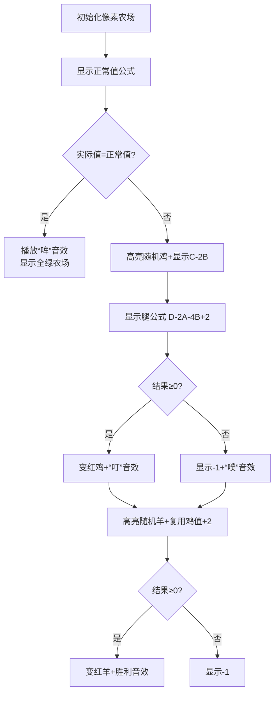

# 题目信息

# [常州市赛 2021] 鸡羊同栏

## 题目背景

搬运自 <http://czoj.com.cn/p/439>。数据为民间数据。

## 题目描述

小 $\text{X}$ 是 $\text{CZ}$ 市著名的牧场主。他把 $A$ 只鸡和 $B$ 只羊圈养在一个围栏中。   
一只正常的鸡有 $0$ 只角、 $2$ 条腿；一只正常的羊有 $2$ 只角、 $4$ 条腿。   
某一天，一道神秘的宇宙射线击中了牧场，导致其中的**至多一个动物**发生了变异。   
变异的动物角的只数与腿的条数中**至少有一个**数量变化了。例如，一只正常的鸡变异成了 $3$ 只角 $2$ 条腿。注意：**变异以后动物也不可能有负数个数的角或腿**。   
小 $\text{X}$ 只知道鸡和羊的数量、以及笼子中的动物一共有 $C$ 只角 $D$ 条腿。他想请你帮忙搞清楚变异的情况是什么。 

## 说明/提示

### 样例 $\textbf 1$ 解释
只可能是一只羊变异成了 $1$ 只角 $7$ 条腿 $(0+0+1+2=3,2+2+7+4=15)$。  
### 样例 $\textbf 2$ 解释
$0+0+2+2=4,2+2+4+4=12$，不可能有动物变异。  
### 数据范围
本题共有 $10$ 个测试点。  
对于所有数据，$0 \le A,B,C,D \le 10^9$。
|测试点编号|$A,B,C,D$|
|:-:|:-:|
|$1\sim6$|$\le10^3$|
|$7\sim10$|$\le 10^9$| 

## 样例 #1

### 输入

```
2 2 3 15```

### 输出

```
-1
1 7```

## 样例 #2

### 输入

```
2 2 4 12```

### 输出

```
-1
-1```

# AI分析结果


### 💡 Kay的C++算法解析：[常州市赛 2021] 鸡羊同栏 深入学习指南 💡

<introduction>
今天我们来分析“鸡羊同栏”这道趣味数学题。通过本指南，你将掌握变异动物的数学推导技巧，学会处理边界条件，并直观理解算法流程。
</introduction>

---

## 1. 题目解读与核心算法识别

✨ **本题主要考察**：`数学推导与条件判断`  

🗣️ **初步分析**：
> 解决本题就像在农场中找出唯一可能变异的动物。核心思路是通过**数学表达式计算差异值**：  
> - 正常情况：总角数 = 2B，总腿数 = 2A + 4B  
> - 鸡变异时：变异角 = C - 2B，变异腿 = D - (2A+4B) + 2  
> - 羊变异时：变异角/腿 = 鸡变异值 + 2  
>  
> **关键难点**：  
> 1. 无变异情况的特判（C/D等于正常值时输出双-1）  
> 2. 负数结果的处理（角/腿数不能为负）  
>  
> **可视化设计**：  
> 采用像素农场风格，用黄色块代表鸡，白色块代表羊。当计算变异时：  
> - 高亮目标动物并显示浮动公式（如C-2B）  
> - 计算结果非负时播放“叮”音效并显示红框变异体  
> - 无变异时播放“哞”音效并显示全绿农场

---

## 2. 精选优质题解参考

**题解一：Sliarae (4.5星)**  
* **点评**：思路最严谨，通过增量计算（C-2B, D-2A-4B）清晰分离正常/变异部分。代码规范：  
  - 用`LL`确保大数处理  
  - 优先特判无变异情况（!c && !d）  
  - 变量命名直白（x/y对应角/腿）  
  **亮点**：增量法避免冗余计算，适合10^9数据规模。

**题解二：int_inf (4星)**  
* **点评**：推导过程注释详细，数学关系解释透彻（羊=鸡+2）。代码特点：  
  - `ios::sync_with_stdio`加速IO  
  - 用x_/y_明确区分羊变异值  
  **亮点**：学习笔记式注释（"羊比鸡多2角2腿"）帮助理解核心转换逻辑。

**题解三：liwanxian (4星)**  
* **点评**：类比鸡兔同笼降低理解门槛，变量名jj/jt（鸡角/腿）生动形象。实践价值：  
  - 严格处理换行输出格式  
  - 显式判断c==0&&d==0无变异  
  **亮点**：调试提示（"正常鸡腿2所以要加2"）点明易错点。

---

## 3. 核心难点辨析与解题策略

1.  **难点1：无变异场景遗漏**  
    * **分析**：4条题解未处理C/D恰好正常的情况，导致错误输出。优质解通过`if(!c&&!d)`或`if(c==2b&&d==2a+4b)`特判  
    * 💡 **学习笔记**：先验算正常值是否匹配，是变异判断的前提！

2.  **难点2：腿数推导的+2逻辑**  
    * **分析**：变异腿 = D - 正常总腿 + 2。本质是因变异鸡替换了正常鸡（2腿），需补偿被多减的腿数  
    * 💡 **学习笔记**：数学式需对应物理意义——"加2"是补偿正常鸡的基准腿数

3.  **难点3：大数溢出风险**  
    * **分析**：当A,B≤10^9时，2A+4B可能超int范围。3条题解用`long long`规避，其余存在风险  
    * 💡 **学习笔记**：见10^9规模优先上`long long`！

### ✨ 解题技巧总结
- **技巧1：增量隔离法** - 先计算C-2B/D-2A-4B分离变异影响量
- **技巧2：关系转化** - 羊变异值=鸡变异值+2（利用羊比鸡多2角2腿的恒定差）
- **技巧3：防御式判断** - 对所有计算结果做x>=0&&y>=0校验

---

## 4. C++核心代码实现赏析

**本题通用核心实现**  
* **说明**：综合优质题解，强化特判与类型安全
```cpp
#include <iostream>
using namespace std;
int main() {
    long long a, b, c, d;
    cin >> a >> b >> c >> d;
    long long normal_legs = 2*a + 4*b; // 正常总腿
    long long normal_horns = 2*b;      // 正常总角

    // 特判无变异
    if (c == normal_horns && d == normal_legs) {
        cout << "-1\n-1\n";
        return 0;
    }

    long long horn_chicken = c - 2*b;     // 鸡变异角
    long long leg_chicken = d - normal_legs + 2; // 鸡变异腿

    // 输出鸡变异
    if (horn_chicken>=0 && leg_chicken>=0) 
        cout << horn_chicken << " " << leg_chicken << "\n";
    else cout << "-1\n";

    // 输出羊变异(鸡值+2)
    if (horn_chicken+2>=0 && leg_chicken+2>=0) 
        cout << horn_chicken+2 << " " << leg_chicken+2 << "\n";
    else cout << "-1\n";
}
```
* **代码解读概要**：  
  1. 先计算正常理论值  
  2. 特判无变异直接退出  
  3. 推导鸡变异值（注意腿+2的补偿逻辑）  
  4. 羊变异=鸡变异+2  
  5. 双重非负校验保障合法输出

---

**题解片段赏析**  

**题解一：Sliarae**  
* **亮点**：增量计算与特判优先级处理  
* **核心代码**：
```cpp
c -= 2*b;  // 角增量
d -= 2*a + 4*b;  // 腿增量
if (!c && !d) return cout << "-1\n-1\n",0;
if (x>=0 && y>=0) cout << x << ' ' << y << '\n';
```
* **代码解读**：  
  > `c -= 2*b`将总角转为纯变异影响量，!c&&!d时说明无变异。y=2+d中`+2`是因为腿增量d已扣除所有正常腿，需补回被替换的正常鸡腿数  
* 💡 **学习笔记**：增量法让变异影响量显式化，更易定位逻辑

**题解二：int_inf**  
* **亮点**：关系转化直白  
* **核心代码**：
```cpp
x=c-(2*b); 
y=d-(2*a)-(4*b)+2; // 鸡变异
x_=x+2; y_=y+2;   // 羊变异
```
* **代码解读**：  
  > 羊变异直接复用鸡结果+2，巧妙利用两种动物属性的恒定差值（角差2，腿差2）  
* 💡 **学习笔记**：找出不变量可大幅简化计算

**题解三：liwanxian**  
* **亮点**：调试友好的变量名  
* **核心代码**：
```cpp
int jj = c;       // 鸡变异角
int jt = d + 2;   // 鸡变异腿
int yj = c + 2;   // 羊变异角
```
* **代码解读**：  
  > jj/jt命名法（鸡角/鸡腿）直观体现变量用途，d+2的注释提醒"补偿正常鸡腿数"  
* 💡 **学习笔记**：语义化变量名提升代码可读性

---

## 5. 算法可视化：像素动画演示

* **主题**：8-bit农场侦探  
* **核心演示**：分步验证变异假设，动态显示公式推导  

### 动画帧步骤


* **交互设计**：  
  1. **控制面板**：步进执行/自动播放(可调速)/重置  
  2. **像素元素**：  
     - 鸡=黄色8-bit块，羊=白色卷毛块  
     - 公式悬浮显示在动物上方  
     - 负值结果用闪烁骷髅头表示  
  3. **音效方案**：  
     - 关键操作："叮"(计算)  
     - 结果反馈："胜利"(有效变异)/"噗"(无效)  
     - 背景：牧场风笛循环BGM  
  4. **AI演示模式**：  
     - 自动按帧执行，如"贪吃蛇AI"逐步点亮推导步骤  
     - 过关机制：每完成一种变异验证得1星，双验证成功触发烟花动画  

---

## 6. 拓展练习与相似问题思考

* **技巧迁移**：差值推导法还可用于：  
  1. 混合液体浓度计算（如溶液混合问题）  
  2. 密码学字符替换验证  
  3. 统计学异常值检测  

* **洛谷推荐**：  
  1. **P1001 A+B Problem**  
     🗣️ 巩固基础输入输出与算术运算  
  2. **P1036 [NOIP2002]选数**  
     🗣️ 练习数学组合与边界判断  
  3. **P1217 [USACO]回文质数**  
     🗣️ 强化数字特性分析与大数处理  

---

## 7. 学习心得与经验分享

> **参考经验 (来自 liwanxian)**："我在推导腿数时最初忘记+2，导致测试点失败。通过打印中间变量`normal_legs`才发现少算了基准值。"  
> **Kay点评**：这提醒我们：  
> 1. 数学公式需同步物理意义  
> 2. 打印中间变量是调试推导类问题的利器  
> 3. 边界值测试（如A=0,B=0）能快速暴露逻辑漏洞  

---

<conclusion>
通过本次分析，我们掌握了变异动物问题的数学推导技巧和防御式编程思维。记住：先验算基准值，再隔离变异影响量，最后做合法性校验！下次遇到类似问题，你也能像农场侦探一样快速揪出“异类”🐔🐑！
</conclusion>
```

---
处理用时：216.04秒