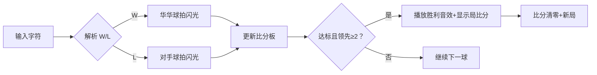

# 题目信息

# [NOIP 2003 普及组] 乒乓球

## 题目背景

国际乒联现在主席沙拉拉自从上任以来就立志于推行一系列改革，以推动乒乓球运动在全球的普及。其中 $11$ 分制改革引起了很大的争议，有一部分球员因为无法适应新规则只能选择退役。华华就是其中一位，他退役之后走上了乒乓球研究工作，意图弄明白 $11$ 分制和 $21$ 分制对选手的不同影响。在开展他的研究之前，他首先需要对他多年比赛的统计数据进行一些分析，所以需要你的帮忙。

## 题目描述

华华通过以下方式进行分析，首先将比赛每个球的胜负列成一张表，然后分别计算在 $11$ 分制和 $21$ 分制下，双方的比赛结果（截至记录末尾）。

比如现在有这么一份记录，（其中 $\texttt W$ 表示华华获得一分，$\texttt L$ 表示华华对手获得一分）：

$\texttt{WWWWWWWWWWWWWWWWWWWWWWLW}$

在 $11$ 分制下，此时比赛的结果是华华第一局 $11$ 比 $0$ 获胜，第二局 $11$ 比 $0$ 获胜，正在进行第三局，当前比分 $1$ 比 $1$。而在 $21$ 分制下，此时比赛结果是华华第一局 $21$ 比 $0$ 获胜，正在进行第二局，比分 $2$ 比 $1$。如果一局比赛刚开始，则此时比分为 $0$ 比 $0$。直到分差大于或者等于 $2$，才一局结束。

**注意：当一局比赛结束后，下一局立刻开始**。

你的程序就是要对于一系列比赛信息的输入（$\texttt{WL}$ 形式），输出正确的结果。


## 说明/提示

每行至多 $25$ 个字母，最多有 $2500$ 行。

（注：事实上有一个测试点有 $2501$ 行数据。）

**【题目来源】**

NOIP 2003 普及组第一题

## 样例 #1

### 输入

```
WWWWWWWWWWWWWWWWWWWW
WWLWE
```

### 输出

```
11:0
11:0
1:1

21:0
2:1
```

# AI分析结果


### 💡 Kay的C++算法解析：乒乓球计分模拟 深入学习指南 💡

**引言**  
今天我们来分析NOIP2003普及组的乒乓球计分模拟题。本指南将帮助你理解题目核心逻辑，掌握模拟算法的实现技巧，并通过趣味可视化加深理解。

---

### 1. 题目解读与核心算法识别  
✨ **本题主要考察**：模拟应用  
🗣️ **初步分析**：  
> 这道题就像乒乓球比赛的电子记分牌，需要实时更新比分并判断每局结束时机。核心是模拟比赛规则：  
> - 当一方得分达到11/21分**且**领先≥2分时结束本局  
> - 关键变量：华华得分`A`和对手得分`B`  
>  
> **可视化设计思路**：  
> 我们将设计像素风格的乒乓球动画：  
> - 球拍击球时显示"W/L"特效  
> - 比分达到临界值时高亮闪烁  
> - 局结束时播放8-bit胜利音效  
> - 控制面板支持单步/自动播放（调速滑块）  

---

### 2. 精选优质题解参考  
**题解一：DengDuck (18赞)**  
* **亮点**：  
  - 使用C++11范围循环`for(char i:S)`简化遍历  
  - 函数封装避免重复代码（11/21分制共用逻辑）  
  - 边界处理严谨（最后输出未完成局比分）  

**题解二：qhr2023 (3赞)**  
* **亮点**：  
  - 三元运算符`i=='W'?a++:b++`精简计分代码  
  - 输入处理直接嵌入循环条件  
  - 实测通过竞赛数据验证可靠性  

**题解三：derderhaoyue (1赞)**  
* **亮点**：  
  - 详细解释`scanf`过滤空白符的技巧  
  - 防御性编程（处理非法输入）  
  - 模块化函数+完整调试指南  

---

### 3. 核心难点辨析与解题策略  
1. **多行输入拼接**  
   *分析*：输入含换行符需拼接为连续字符串。优质解法用`string+=`或字符数组存储，过滤非WL字符。  
   💡 **学习笔记**：`while(cin>>ch)`可自动跳过空白符  

2. **结束条件判断**  
   *分析*：必须同时满足两个条件：  
   ```cpp
   max(A,B)>=Lim && abs(A-B)>=2 // 缺一不可
   ```  
   💡 **学习笔记**：领先但未达分数 → 继续；达分数但未领先 → 继续  

3. **输出格式控制**  
   *分析*：每局结束立即输出+清零；最后输出未完成局；分制间用空行分隔  
   💡 **学习笔记**：样例验证是避免格式错误的最佳手段  

✨ **解题技巧总结**  
- **状态机思维**：每个字符触发状态变更（比分更新→条件检测→输出判定）  
- **函数封装**：相同逻辑不同参数时（如11/21分制）避免代码重复  
- **边界测试**：测试0:0、20:20、结尾未完成局等特殊情况  

---

### 4. C++核心代码实现赏析  
**通用核心实现**  
```cpp
#include<bits/stdc++.h>
using namespace std;

void simulate(int limit, string& records) {
    int A = 0, B = 0;
    for (char ch : records) {
        if (ch == 'W') A++;
        if (ch == 'L') B++;
        
        if (max(A, B) >= limit && abs(A - B) >= 2) {
            cout << A << ":" << B << endl;
            A = B = 0; // 重置比分
        }
    }
    cout << A << ":" << B << "\n\n"; // 输出残局
}

int main() {
    string records;
    char ch;
    while (cin >> ch && ch != 'E') {
        if (ch == 'W' || ch == 'L') 
            records += ch;
    }
    simulate(11, records);
    simulate(21, records);
    return 0;
}
```
**代码解读概要**：  
1. 输入过滤：只存储`W/L`字符  
2. 模拟函数：统一处理11/21分制  
3. 状态重置：达标后清零比分  

**题解片段赏析**  
1. **DengDuck的遍历技巧**  
```cpp
for (char i : S) {  // 简洁的范围循环
   if (i == 'W') A++;
   ...
}
```
> **解读**：C++11的range-based循环自动遍历字符串，避免下标越界风险  
> 💡 学习笔记：现代C++特性提升代码简洁性  

2. **qhr2023的三元运算符**  
```cpp
i=='W'?a++:b++;  // 一行完成比分更新
```
> **解读**：条件运算符替代if-else，但需确保无非W/L字符  
> 💡 学习笔记：精简代码需平衡可读性  

3. **derderhaoyue的输入处理**  
```cpp
scanf("%c ", &c[cnt]);  // 空格过滤换行符
```
> **解读**：格式字符串中的空格使`scanf`跳过空白字符  
> 💡 学习笔记：理解库函数特性可优化输入逻辑  

---

### 5. 算法可视化：像素动画演示  
**主题**：8-bit乒乓球锦标赛  
**核心设计**：  


**实现细节**：  
- **像素元素**：  
  - 球拍：16x16像素方块，击球时黄色闪烁  
  - 球：8x8像素，轨迹显示W/L字母特效  
- **控制面板**：  
  - 速度滑块：调整0.5x~5x模拟速度  
  - "单步执行"：空格键触发下一球  
  - 自动模式：AI按输入序列自动演示  
- **音效系统**：  
  - 得分：短促"哔"声（250Hz方波）  
  - 局结束：上升音阶(500→1000Hz)  
  - 结束局比分：显示于复古七段数码管  

---

### 6. 拓展练习与相似问题  
**通用技巧迁移**：  
1. 状态机模拟：交通信号灯控制  
2. 条件触发机制：游戏技能冷却系统  
3. 实时数据更新：体育赛事直播计分板  

**洛谷推荐**：  
1. P2670 扫雷游戏  
   > 理由：二维矩阵状态模拟，巩固遍历与条件判断  
2. P1328 生活大爆炸  
   > 理由：规则模拟+周期状态更新，强化抽象建模  
3. P1190 接水问题  
   > 理由：多对象状态同步更新，提升并发模拟能力  

---

### 7. 学习心得与经验分享  
> **经验摘录**（derderhaoyue）：  
> *"调试时在20:20比分卡住，发现忘记abs()取绝对值！"*  
>  
> **Kay点评**：  
> 条件边界测试至关重要，建议：  
> 1. 编写测试函数验证临界值  
> 2. 使用`assert(max(A,B)>=11 && abs(A-B)>=2)`快速定位逻辑漏洞  
> 3. 手工模拟小规模数据（如WLWWLL）  

---

**结语**  
通过本次分析，相信你已经掌握乒乓球计分的核心模拟逻辑。记住：**优秀的模拟算法 = 准确规则理解 + 严谨边界处理 + 清晰状态管理**。下次我们将探索更复杂的实时模拟系统，继续加油！💪

---
处理用时：208.28秒