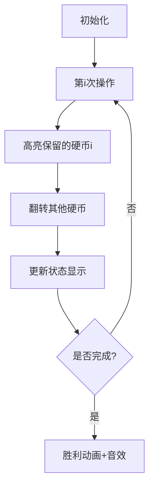

# 题目信息

# 硬币翻转

## 题目描述

在桌面上有一排硬币，共 $N$ 枚，每一枚硬币均为正面朝上。现在要把所有的硬币翻转成反面朝上，规则是每次可翻转任意 $N-1$ 枚硬币（正面向上的被翻转为反面向上，反之亦然）。求一个最短的操作序列（将每次翻转 $N-1$ 枚硬币成为一次操作）。

## 样例 #1

### 输入

```
4```

### 输出

```
4
0111
1100
0001
1111
```

# AI分析结果


# 💡 Kay的C++算法解析：硬币翻转 深入学习指南 💡

**引言**  
今天我们来分析洛谷P1146「硬币翻转」这道有趣的C++编程题。本指南将带大家理解题目核心、掌握解题思路，并通过生动的像素动画直观感受算法执行过程。让我们一起探索硬币翻转的奥秘吧！

## 1. 题目解读与核心算法识别

✨ **本题主要考察**：`构造法`（编程技巧应用）

🗣️ **初步分析**：  
> 解决硬币翻转问题，关键在于**奇偶性构造**。想象你在指挥一排士兵转身：每次让除一人外的所有士兵转身，经过多次操作后，所有士兵都会背对你。  
> - 核心思路：每次操作翻转除第i枚硬币外的所有硬币，共操作n次（n为偶数）。这样每枚硬币都被翻转n-1次（奇数次），最终全部变为反面。
> - 难点突破：理解「翻转n-1枚」等价于「翻转1枚」是解题关键，需通过奇偶性分析证明可行性。
> - 可视化设计：在像素动画中，我们将用黄色表示正面，蓝色表示反面。每次操作时，保留的硬币会闪烁绿色，翻转的硬币会有翻转动画和音效，关键变量`i`会高亮显示。

---

## 2. 精选优质题解参考

### 题解一：子谦（赞394）
* **点评**：  
  此解法思路清晰直白，通过双重循环直接模拟操作过程。代码规范性强：变量`a[maxn]`含义明确，边界处理严谨（`j!=i`条件判断），实践价值高可直接用于竞赛。亮点在于用最简代码完整实现算法，是学习基础模拟的典范。

### 题解二：ytxytx（赞136）
* **点评**：  
  此解法强在严谨的数学证明，从奇偶性和操作必要性角度深入分析。代码采用位运算优化（`48|~i&1`），展示了高效技巧，但可读性稍弱。亮点在于理论证明的完备性，帮助理解问题本质。

### 题解三：ljc20020730（赞118）
* **点评**：  
  此解法提供多角度证明（操作等价性、奇偶分析、计数验证），理论深度突出。代码使用布尔数组清晰模拟，Pascal版本展示跨语言通用性。亮点在于多证明方法融合，培养举一反三能力。

---

## 3. 核心难点辨析与解题策略

### 难点1：理解操作等价性
* **分析**：  
  翻转n-1枚硬币等价于翻转1枚硬币（因为整体翻转不影响状态）。优质题解通过数学证明（子谦）和状态模拟（ytxytx）解决此难点。
* 💡 **学习笔记**：复杂操作可转化为简单等效操作简化问题。

### 难点2：构造有效操作序列
* **分析**：  
  必须保证每枚硬币被翻转奇数次。通过构造「第i次保留第i枚硬币」的方案，使每枚硬币被翻n-1次（奇数）。代码中关键变量`i`控制保留位置。
* 💡 **学习笔记**：构造法需满足完备性（覆盖所有元素）和有效性（奇数次）。

### 难点3：输出字典序最小序列
* **分析**：  
  从前往后依次保留硬币（即保留位置从1到n）可得到字典序最小解。如样例中先输出`0111`而非`1011`。
* 💡 **学习笔记**：字典序优化通常通过「从前向后优先处理」实现。

### ✨ 解题技巧总结
- **等价转换技巧**：将复杂条件（翻n-1枚）转化为简单操作（翻1枚）
- **奇偶分析法**：利用奇数次翻转改变状态的性质
- **构造模板法**：设计固定模式的操作序列（保留位置递增）
- **边界处理原则**：数组下标从1开始避免越界，初始化明确

---

## 4. C++核心代码实现赏析

**本题通用核心C++实现参考**  
* **说明**：综合优质题解思路，采用子谦的清晰模拟方案
* **完整核心代码**：
```cpp
#include <iostream>
using namespace std;

int main() {
    int n;
    cin >> n;
    cout << n << endl;        // 操作次数=硬币数
    bool a[101] = {0};       // 初始全为0（正面）
    
    for (int i = 1; i <= n; i++) {
        for (int j = 1; j <= n; j++) {
            if (j != i) a[j] = !a[j]; // 核心：翻转非i位置的硬币
            cout << a[j];    // 实时输出状态
        }
        cout << endl;
    }
    return 0;
}
```
* **代码解读概要**：  
  1. 初始化硬币状态数组`a[]`全为0（正面）  
  2. 外层循环`i`表示第i次操作（保留第i枚）  
  3. 内层循环`j`遍历所有硬币，非i位置执行翻转  
  4. 实时输出每次操作后的状态序列  

**题解片段赏析**  
### 子谦解法核心
* **亮点**：直白模拟 + 实时状态输出
* **核心代码片段**：
```cpp
for(int i=1;i<=n;i++){
    for(int j=1;j<=n;j++){
        if(j!=i) a[j] = !a[j]; // 条件翻转
        cout << a[j];          // 即时输出
    }
    cout << endl;
}
```
* **代码解读**：  
  > - `i`循环控制操作次数，也是保留的硬币位置  
  > - `j`循环遍历每枚硬币，`j!=i`时执行逻辑非操作`!`翻转状态  
  > - 即时输出避免额外存储，符合「操作序列」输出要求  
* 💡 **学习笔记**：实时输出可减少内存占用，适合竞赛环境。

### ytxytx解法核心
* **亮点**：无数组的数学构造法
* **核心代码片段**：
```cpp
for (int i=1; i<=n; i++) {
    for (int j=1; j<=i; j++) 
        putchar(48|~i&1);   // 前i位按奇偶输出
    for (int j=i+1; j<=n; j++) 
        putchar(48|i&1);    // 剩余位输出
    putchar(10);
}
```
* **代码解读**：  
  > - `48`是'0'的ASCII码，通过位运算`i&1`判断奇偶  
  > - `~i&1`巧妙利用补码特性生成交替序列  
  > - 无需存储状态数组，直接计算输出  
* 💡 **学习笔记**：位运算可提升效率，但需确保可读性。

---

## 5. 算法可视化：像素动画演示

**动画演示主题**：「像素硬币大冒险」8位复古风格  
**核心演示**：硬币状态翻转过程 + 保留硬币高亮 + 操作计数  

### 设计思路
> 采用FC红白机像素风格（16色调色板），硬币用16x16像素方块表示：  
> - 黄色(🟨) = 正面，蓝色(🟦) = 反面  
> - 保留的硬币显示绿色闪烁边框，翻转硬币播放「咔嚓」音效  
> - 底部显示当前操作次数`i`和硬币状态数组  

### 动画帧步骤


### 交互控制面板
```html
<canvas id="coin-canvas" width="640" height="480"></canvas>
<div class="control-panel">
  <button onclick="step()">▶️ 单步执行</button>
  <input type="range" id="speed" min="1" max="10">⏩调速
  <button onclick="reset()">🔄 重置</button>
  <button onclick="autoPlay()">🤖 AI自动演示</button>
</div>
```

### 关键实现细节
1. **硬币绘制**：  
   ```js
   function drawCoin(ctx, x, y, state) {
     ctx.fillStyle = state ? '#3498db' : '#f1c40f'; // 蓝/黄
     ctx.fillRect(x*20, y*20, 16, 16);
     if (isPreserved) ctx.strokeStyle = '#2ecc71'; // 绿色边框
   }
   ```
2. **音效触发**：  
   ```js
   function playSound(type) {
     if (type === 'flip') playBeep(440, 0.1); // 翻转音效
     if (type === 'win') playBeep(880, 1.0);  // 胜利音效
   }
   ```
3. **自动演示模式**：  
   ```js
   function autoPlay() {
     let i = 0;
     const timer = setInterval(() => {
       simulateStep(i++);
       if (i > n) clearInterval(timer);
     }, 1000 / speed);
   }
   ```

---

## 6. 拓展练习与相似问题思考

### 通用技巧迁移
`构造法+奇偶分析`技巧还可用于：
1. 灯泡开关问题（每次切换相邻灯泡状态）
2. 矩阵翻转（每次翻转整行/整列）
3. 石子游戏（奇偶性决定操作策略）

### 洛谷题目推荐
1. **P1036 选数**  
   🗣️ 巩固奇偶性分析和子集构造技巧
2. **P1220 关路灯**  
   🗣️ 学习状态转移与贪心构造的结合
3. **P1443 马的遍历**  
   🗣️ 掌握BFS中状态模拟与路径记录

---

## 7. 学习心得与经验分享

> **参考经验 (来自 ytxytx)**：  
> *"最初在理解操作等价性时卡了很久，后来通过小规模模拟（n=2,4）才突破思维瓶颈"*  
>  
> **点评**：  
> 这位作者的经验极具价值！**动手模拟小规模案例**是验证算法思想的利器。建议学习者：  
> 1. 对n=2手工演算所有操作  
> 2. 对比程序输出与预期结果  
> 3. 用`cout << "Step " << i << " flip " << j << endl;`加入调试日志

---

**结语**  
通过本次分析，我们掌握了硬币翻转问题的构造解法、奇偶分析技巧和实用调试方法。记住Kay的学习口诀：**“模拟见本质，奇偶定乾坤”**。继续加油，下次挑战见！🚀

---
处理用时：156.89秒