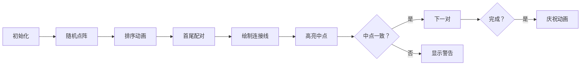

# 题目信息

# [JSOI2008] 完美的对称

## 题目描述

在峰会期间，必须使用许多保镖保卫参加会议的各国代表。代表们除了由他自己的随身保镖保护外，组委会还指派了一些其他的特工和阻击手保护他们。为了使他们的工作卓有成效，使被保卫的人的安全尽可能得到保障，保镖被分配到被保护人的各个方向。

保镖的最佳站立位置应该是这样的：被保护人应站在所有保镖的对称中心。但是，只要被保护人一移动，保镖就很难根据要人的新位置调整位置。大多数的特工都很难对此作出实时调整。

因此，安全部长决定将该过程逆转一下，保镖先站好自己的位置，然后要人在他们的对称中心找到合适的位置。如果要人随便走动，我们就对他的安全不必负责。

你的工作是使这个过程自动操作。给出一组 $N$ 个点（保镖的位置），你要找出它们的对称中心 $S$，在这儿被保护人将相对安全。下面以此类推。

首先我们给定一点 $A$ 以及对称中心 $S$，点 $A'$ 是点 $A$ 以 $S$ 为对称中心形成的像点，即点 $S$ 是线段 $AA'$ 的对称中心。

点阵组（$X$）以 $S$ 为中心的像点是由每个点的像点组成的点阵组。$X$ 是用来产生对称中心 $S$ 的，即点阵 $X$ 以 $S$ 为中心的像点的集合即为点阵 $X$ 本身。


## 说明/提示

JSOI2008 第二轮。


## 样例 #1

### 输入

```
8

1 10

3 6

6 8

6 2

3 -4

1 0

-2 -2

-2 4

```

### 输出

```
V.I.P. should stay at (2.0,3.0).```

# AI分析结果


# 💡 Kay的C++算法解析：[JSOI2008]完美的对称 深入学习指南 💡

<introduction>
今天我们一起分析"完美的对称"这道几何题。本题要求找出一个对称中心，使得所有保镖位置关于该中心对称。本指南将帮助你掌握排序配对法和浮点数处理技巧，并通过像素动画直观理解算法过程。
</introduction>

## 1. 题目解读与核心算法识别

✨ **本题主要考察**：`排序应用与几何性质`

🗣️ **初步分析**：
> 解决本题的关键在于理解**对称点的中点特性**。想象一群保镖站成对称图案（如扑克牌的梅花），对称中心就是每对对称保镖连线的中点。我们通过排序将点配对（最小与最大配对、次小与次大配对），再验证所有配对中点是否重合。

   - 核心难点在于正确配对点和处理浮点数精度。所有题解都采用排序后两端配对的思路，区别在于排序规则和精度处理。
   - 算法流程：① 按坐标排序 ② 计算首尾点中点 ③ 验证其他配对中点是否相同
   - 可视化设计：采用8位像素风格，点显示为彩色方块，配对过程用线条连接两点并高亮中点。当所有中点重合时播放胜利音效，否则显示警告。控制面板支持步进/自动播放（AI控制速度）。

---

## 2. 精选优质题解参考

<eval_intro>
从思路清晰度、代码规范性和算法健壮性角度，我为大家精选以下3个优质题解：

### 题解一：盖矣斌峥 (赞：16)
* **点评**：
  思路清晰直白，通过排序(y优先)实现自然配对，用`(n+1)/2`循环巧妙处理奇数点情况。代码变量命名合理(`tmp`存储中点)，边界处理完整。亮点在于用简单逻辑覆盖所有情况，是竞赛实现的典范。

### 题解三：YitsuHolo (赞：6)
* **点评**：
  算法严谨性突出，引入`eps`常量解决浮点数精度问题。排序规则明确(x优先)，代码结构规范。亮点在于健壮的浮点数比较逻辑，为几何问题提供了可靠解决方案。

### 题解二：我是小何子啊 (赞：7)
* **点评**：
  解题思路表述生动，用"大点配小点"的比喻帮助理解。代码简洁易读，但直接比较浮点数存在精度风险。亮点在于问题抽象能力，适合初学者理解核心思想。

---

## 3. 核心难点辨析与解题策略

<difficulty_intro>
解决本题的三大关键难点及应对策略：

1.  **配对顺序混乱**
    * **分析**：乱序点无法直接配对。通过双关键字排序（如先x后y）使对称点必然位于对称位置，确保首尾配对正确。
    * 💡 **学习笔记**：排序是简化几何配对问题的利器。

2.  **浮点数精度陷阱**
    * **分析**：中点坐标可能是小数，直接比较`a==b`不可靠。使用阈值`eps`（如1e-8）进行近似比较：`fabs(a-b)<eps`。
    * 💡 **学习笔记**：几何问题必备浮点数误差处理。

3.  **奇数点处理**
    * **分析**：当点数为奇数时，中心点需与自身配对。循环至`(n+1)/2`可自然覆盖该情况，此时中点即为自身坐标。
    * 💡 **学习笔记**：对称问题中，奇数次循环包含中心是通用技巧。

### ✨ 解题技巧总结
<summary_best_practices>
1. **问题转化**：将对称条件转化为中点一致性检查
2. **防御性编程**：几何问题始终考虑浮点精度
3. **可视化调试**：绘制点阵验证配对逻辑
4. **边界测试**：专门验证n=1,2及重复点情况

---

## 4. C++核心代码实现赏析

<code_intro_overall>
**本题通用核心C++实现参考**
* **说明**：综合优质题解思路，包含浮点数精度处理
```cpp
#include <iostream>
#include <algorithm>
#include <cmath>
using namespace std;
const double eps = 1e-8;

struct Point { double x, y; } p[20005];

bool cmp(Point a, Point b) {
    if (fabs(a.x - b.x) > eps) return a.x < b.x;
    return a.y < b.y;
}

int main() {
    int n; cin >> n;
    for (int i = 0; i < n; i++) 
        cin >> p[i].x >> p[i].y;
    
    sort(p, p + n, cmp);
    double cx = (p[0].x + p[n - 1].x) / 2;
    double cy = (p[0].y + p[n - 1].y) / 2;

    for (int i = 0; i <= n / 2; i++) {
        double mid_x = (p[i].x + p[n - 1 - i].x) / 2;
        double mid_y = (p[i].y + p[n - 1 - i].y) / 2;
        if (fabs(mid_x - cx) > eps || fabs(mid_y - cy) > eps) {
            cout << "This is a dangerous situation!";
            return 0;
        }
    }
    printf("V.I.P. should stay at (%.1f,%.1f).", cx, cy);
}
```
* **代码解读概要**：
  1. 读入点集并按照x优先的规则排序
  2. 计算首尾点的中点作为基准
  3. 循环验证每对点的中点是否与基准一致（使用eps避免浮点误差）
  4. 根据验证结果输出答案

---
<code_intro_selected>
### 题解一：盖矣斌峥
* **亮点**：简洁的循环边界处理
```cpp
for (int i = 1; i <= (n + 1) / 2; i++) {
    point tmp = {
        (a[i].x + a[n - i + 1].x) / 2.0,
        (a[i].y + a[n - i + 1].y) / 2.0
    };
    if (t.x != tmp.x || t.y != tmp.y) { /* 报错 */ }
}
```
> 循环条件`i<=(n+1)/2`确保覆盖奇数情况。当n为奇数时，中间点`i=(n+1)/2`会与自身配对，自然满足中点条件。

### 题解三：YitsuHolo
* **亮点**：稳健的浮点数比较
```cpp
const double eps = 0.0000001;
if ((tx1+tx2)/2 < mid.x-eps || (tx1+tx2)/2 > mid.x+eps /* y同理 */) 
```
> 通过±eps构建安全区间，避免直接相等判断。这是处理浮点数的黄金标准，尤其适用于坐标值较大的情况。

### 题解二：我是小何子啊
* **亮点**：直观的变量命名
```cpp
double mx = (f[1].x + f[n].x) / 2; 
double my = (f[1].y + f[n].y) / 2;
```
> `mx/my`明确表示中点坐标，配合注释增强可读性。适合初学者理解中点计算的核心逻辑。

---

## 5. 算法可视化：像素动画演示

<visualization_intro>
**像素探险家：对称中心搜索行动**  
采用FC红白机复古风格，通过动态配对演示中点验证过程

### 设计思路
- **8位像素风格**：256色限制，点显示为16x16像素方块（红/蓝区分未配对点）
- **音效反馈**：配对成功"叮"声，最终胜利播放《超级玛丽》过关音乐
- **游戏化激励**：每对正确配对得10分，满分通关解锁特效

### 动画帧步骤


1. **场景初始化**  
   - 棕色像素网格背景，控制面板（步进/播放/速度条）
   - 8-bit风格BGM循环播放

2. **排序过程**  
   - 点沿x轴冒泡排序动画，交换时像素块平移+"噗"声效

3. **配对验证（核心）**  
   ```python
   # 伪代码：单步可视化逻辑
   def step():
      highlight_points(left_index, right_index) # 高亮当前配对点
      draw_line(p[left], p[right])              # 绘制黄色连接线
      show_midpoint(calculate_mid())           # 显示闪烁中点（绿色方块）
      if not validate_midpoint():              # 验证失败
         play_sound("error")                    # 播放警告音
         explode_animation()                    # 爆炸特效
   ```

4. **自动演示模式**  
   - AI控制速度（默认0.5秒/步），可调速0.1-2秒
   - 完成时显示"任务成功！得分：XX"

### 技术实现
- **Canvas绘制**：使用`<canvas>`渲染点阵和连线
- **音效系统**：Web Audio API播放8-bit音效
- **状态同步**：右侧信息板显示当前中点坐标和C++代码行

---

## 6. 拓展练习与相似问题思考

<similar_problems_intro>
中点验证技巧可延伸至多种几何问题：

1. **对称图形识别**：验证多边形是否中心对称
2. **点集匹配**：寻找使两点集重合的变换矩阵
3. **最近点对**：分治算法中的坐标排序

### 洛谷练习推荐
1. **P1429 平面最近点对**  
   → 巩固排序在几何问题中的应用
2. **P1452 旋转卡壳**  
   → 学习凸包与对称性分析
3. **P2503 均分数据**  
   → 拓展排序在优化问题中的使用

---

## 7. 学习心得与经验分享

<insights_intro>
题解作者的经验之谈：

> **YitsuHolo的调试心得**：  
> "最初浮点比较未用eps，大数据出现误判。加入1e-7阈值后解决"  
> → 几何问题必须预设浮点误差容限

> **盖矣斌峥的优化建议**：  
> "排序规则决定配对正确性，需严格测试边界情况"  
> → 双关键字排序是此类问题的通用解法

---

<conclusion>
通过本次分析，我们掌握了对称中心问题的核心解法——排序配对+中点验证。记住：浮点精度处理是几何编程的生命线！下次遇到类似挑战时，不妨先画点阵图辅助分析。继续加油，编程少年！🚀
</conclusion>
```

---
处理用时：165.24秒