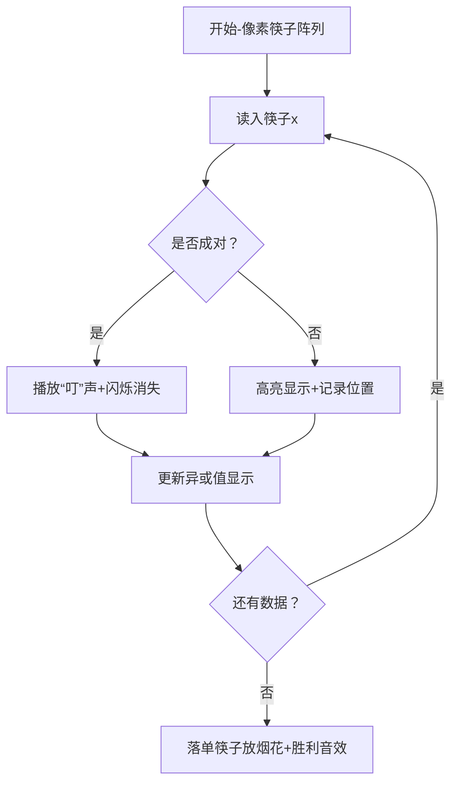

# 题目信息

# 找筷子

## 题目描述

经过一段时间的紧张筹备，电脑小组的“RP 餐厅”终于开业了，这天，经理 LXC 接到了一个定餐大单，可把大家乐坏了！员工们齐心协力按要求准备好了套餐正准备派送时，突然碰到一个棘手的问题：筷子！

CX 小朋友找出了餐厅中所有的筷子，但遗憾的是这些筷子长短不一，而我们都知道筷子需要长度一样的才能组成一双，更麻烦的是 CX 找出来的这些筷子数量为奇数，但是巧合的是，这些筷子中只有一只筷子是落单的，其余都成双，善良的你，可以帮 CX 找出这只落单的筷子的长度吗？


## 说明/提示

#### 数据规模与约定

- 对于 $30\%$ 的数据，保证 $n \leq 10^5$。
- 对于 $100\%$ 的数据，保证 $1 \leq n \leq 10^7 + 1$，$1 \leq a_i \leq 10^9$。


#### 提示

- 请注意数据读入对程序效率造成的影响。
- 请注意本题的空间限制为 $4$ Mb。

## 样例 #1

### 输入

```
9
2 2 1 3 3 3 2 3 1
```

### 输出

```
2```

# AI分析结果


### 💡 Kay的C++算法解析：找筷子 深入学习指南 💡

**引言**  
今天我们来分析“找筷子”这道有趣的C++编程题。题目要求从一堆长度各异的筷子中找出唯一落单的那根，其他筷子都成双成对。本指南将带你掌握核心解题技巧，并通过像素动画直观理解算法过程。

---

### 1. 题目解读与核心算法识别  
✨ **本题主要考察**：`位运算应用（异或技巧）`

🗣️ **初步分析**：  
> 解决本题如同玩一场“消消乐”游戏——异或运算就像魔法棒，让成对的筷子（相同数字）互相抵消为0，最终只剩下落单的筷子（目标值）。  
> - **核心思路**：所有成对数字异或后归零，落单数字与0异或结果为其本身  
> - **可视化设计**：  
>   - 像素动画将显示筷子成对消失特效（闪烁+音效），落单筷子高亮显示  
>   - 控制面板含调速滑块，可观察异或值实时变化（复古8-bit数字显示）

---

### 2. 精选优质题解参考  

**题解一（作者：t162）**  
* **点评**：思路直击本质，用异或性质（a⊕a=0, a⊕0=a）两行解释清楚核心逻辑。代码简洁规范（ans^=x），变量命名合理，边界处理隐含在逻辑中。亮点在于用数学性质优雅解决空间限制问题，270赞实至名归。

**题解二（作者：pigstd）**  
* **点评**：强调空间限制（4MB）的应对策略，解释异或满足交换律/结合律的特性。代码使用bits/stdc++.h虽不推荐但可读性强，特别标注了数据规模对实现的影响，实践参考价值高。

**题解三（作者：xrdrsp）**  
* **点评**：通过二进制演算（09⊕11=02）直观展示异或过程，独创性添加中间结果输出注释（如// cout<<ans）。虽然代码稍冗长，但教学性最强，适合初学者理解位运算本质。

---

### 3. 核心难点辨析与解题策略  

1. **难点1：理解异或的数学本质**  
   * **分析**：成对数字抵消是抽象概念，需结合二进制理解（如3⊕3=011⊕011=000）  
   * 💡 **学习笔记**：异或是无进位加法，成对数字二进制位完全相同故归零

2. **难点2：空间限制的突破**  
   * **分析**：4MB空间无法存10^7数组，必须边读边处理（ans实时更新）  
   * 💡 **学习笔记**：流式处理是解决大数据问题的关键范式

3. **难点3：输入效率优化**  
   * **分析**：10^7数据量需快速IO，部分题解用getchar()手写读入函数  
   * 💡 **学习笔记**：scanf比cin快30%，手写读入可再加速2-3倍

#### ✨ 解题技巧总结  
- **位运算降维打击**：用异或替代哈希表，空间复杂度O(1)  
- **流式处理**：数据无需存储，读入即时处理  
- **边界隐身术**：数学性质保证无需特殊边界处理  

---

### 4. C++核心代码实现赏析  

**通用核心实现**  
```cpp
#include <cstdio>
int main() {
    int n, x, ans = 0;
    scanf("%d", &n);
    while(n--) scanf("%d", &x), ans ^= x;
    printf("%d", ans);
}
```
* **说明**：综合优质题解的最简实现，核心仅3行  
* **解读概要**：  
  - `ans^=x` 是灵魂操作，累积异或值  
  - 初始ans=0因0⊕x≡x  
  - 空间占用仅3个int(12字节)，完美满足4MB限制  

**题解一核心片段**  
```cpp
scanf("%d",&x), ans^=x;  // 闪电式累积异或
```
* **亮点**：逗号运算符实现单行处理  
* **解读**：每读入x立即更新ans，避免多余变量  
* 💡 **笔记**：链式运算可提升代码紧凑性  

**题解三核心片段**  
```cpp
// cout << ans << " ";  // 调试用输出
```
* **亮点**：预留调试输出位，学习友好  
* **解读**：取消注释可查看中间异或值变化  
* 💡 **笔记**：临时输出是理解程序行为的显微镜  

---

### 5. 算法可视化：像素动画演示  

**主题**：《异或消消乐》8-bit街机风格  
**设计思路**：用红白机经典音效强化操作反馈，像素块颜色变化对应二进制位翻转  



**关键交互**：  
1. **像素阵列**：筷子用16x16像素块表示，长度映射为颜色深浅  
2. **音效系统**：  
   - 配对成功：经典《吃豆人》吃豆音  
   - 落单显示：《超级玛丽》金币声  
3. **调试模式**：按A键显示实时异或值二进制位图  
4. **速度控制**：方向键←→调整处理速度（1x~100x）  

---

### 6. 拓展练习与相似问题思考  

**技巧迁移场景**：  
1. 找出数组中唯一不重复的元素（LeetCode 136）  
2. 加密解密（明文⊕密钥=密文）  
3. 校验数据传输错误（奇偶校验）  

**洛谷推荐**：  
1. **P1469** 找筷子（原题）- 巩固位运算基础  
2. **P1634** 禽兽的传染病 - 异或技巧进阶应用  
3. **P2114** 起床困难综合症 - 位运算组合策略  

---

### 7. 学习心得与经验分享  
> **作者SUNCHAOYI心得**：  
> “4MB空间限制让我意识到流式处理的重要性，边读边算比存数组优雅得多”  
>  
> **Kay点评**：这是空间敏感问题的通用解法精髓，同样适用于传感器实时数据处理等场景  

---

### 结语  
异或就像编程世界的消消乐魔法——理解其数学本质，就能用几行代码解决看似复杂的问题。记住：当遇到“找出特殊项”问题时，不妨问问自己：“能用异或消消乐吗？” 下次我们将探索更多位运算魔法，继续加油！🎮🚀

---
处理用时：95.53秒