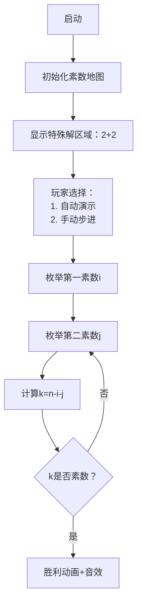

# 题目信息

# 哥德巴赫猜想（升级版）

## 题目背景

1742 年 6 月 7 日，哥德巴赫写信给当时的大数学家欧拉，正式提出了以下的猜想：任何一个大于 $9$ 的奇数都可以表示成 $3$ 个质数之和。质数是指除了 $1$ 和本身之外没有其他约数的数，如 $2$ 和 $11$ 都是质数，而 $6$ 不是质数，因为 $6$ 除了约数 $1$ 和 $6$ 之外还有约数 $2$ 和 $3$。**需要特别说明的是 $1$ 不是质数。**

这就是哥德巴赫猜想。欧拉在回信中说，他相信这个猜想是正确的，但他不能证明。

从此，这道数学难题引起了几乎所有数学家的注意。哥德巴赫猜想由此成为数学皇冠上一颗可望不可及的“明珠”。

## 题目描述

现在请你编一个程序验证哥德巴赫猜想。

先给出一个奇数 $n$，要求输出 $3$ 个质数，这 $3$ 个质数之和等于输入的奇数。

## 样例 #1

### 输入

```
2009```

### 输出

```
3 3 2003```

# AI分析结果


### 💡 Kay的C++算法解析：哥德巴赫猜想（升级版） 深入学习指南 💡

**<introduction>**  
今天我们来分析验证哥德巴赫猜想的编程实现。这道题要求将大于9的奇数分解为三个质数之和，我们将通过清晰的算法解析和生动的可视化方案，帮助大家掌握素数判断、枚举优化和数学思维的应用技巧。  

---

### 1. 题目解读与核心算法识别  
✨ **本题主要考察**：`枚举优化与素数判断技巧`  

🗣️ **初步分析**：  
> 解决本题的关键在于高效枚举质数组合。想象你在玩"素数拼图"：给定一个奇数（如2009），需要找到三个质数碎片拼合成它。核心技巧是：  
> 1. **特殊优化**：利用"偶数质数只有2"的特性，先检查`n-4`是否为质数（即[2,2,n-4]方案）  
> 2. **有序枚举**：当特殊方案不成立时，按升序枚举质数对（i,j），通过`k=n-i-j`快速验证第三个数  
> 3. **素数判断优化**：使用平方根范围检测或筛法预处理，避免无效计算  
>
> **可视化设计思路**：  
> - 创建像素网格展示数字2~n，不同颜色标记质数/合数（质数亮绿色）  
> - 动画先高亮"2+2"方案区域，再模拟指针扫描i和j的值  
> - 当找到有效组合时，触发8-bit胜利音效并闪烁三个质数方块  

---

### 2. 精选优质题解参考  
**题解一：IOCTYCNconbill（思路清晰性 ★★★★☆，算法优化 ★★★★☆）**  
* **点评**：  
  巧妙利用奇偶性分析（三个奇数或两偶一奇），先处理[2,2,n-4]特殊情况，再通过`i+=2`跳过偶数大幅优化。代码中`(i%2)!=0`的预处理和`return 0`及时终止值得学习。变量名`check`直观，但循环边界注释可加强。  

**题解二：不准睡觉（算法优化 ★★★★★，启发性 ★★★★☆）**  
* **点评**：  
  创新性利用哥德巴赫猜想结论（偶数=两质数和），将问题简化为两次O(n)扫描。埃氏筛预处理`isNotPrime`数组实现O(1)查询是亮点。通过固定第一个数为2或3，将三重循环降为单重，复杂度从O(n³)优化到O(n)。  

**题解三：majorli（代码规范性 ★★★★★，工程思维 ★★★★☆）**  
* **点评**：  
  采用模块化设计：`erato()`筛法独立函数+`next_prime()`迭代器+`find()`主逻辑。通过引用传递素数数组避免全局变量，体现工程规范。虽然埃氏筛非最优，但`p[j]<=n/2`的枚举范围限制有效提升效率。  

---

### 3. 核心难点辨析与解题策略  
1. **难点一：避免无效枚举**  
   * **分析**：无约束枚举会导致O(n³)复杂度。优质解法通过两个方向优化：  
     - 数学性质：利用质数分布特性（除2外均为奇数）  
     - 搜索剪枝：当`i>n/3`或`j>(n-i)/2`时提前终止  
   * 💡 **学习笔记**：枚举前先分析数据特征，用数学约束减少搜索空间  

2. **难点二：高效素数判断**  
   * **分析**：重复调用素数检测函数是性能瓶颈。两种优化方案：  
     - 预筛法：埃氏筛/欧拉筛预处理质数表（空间换时间）  
     - 实时优化：仅检查`2~sqrt(k)`且跳过偶数除数  
   * 💡 **学习笔记**：n较大时优选筛法，小范围用sqrt优化即可  

3. **难点三：保证输出顺序**  
   * **分析**：题目要求"第一个质数最小，其次第二个"。解法均采用`i`从最小质数开始，`j≥i`的升序枚举策略，天然满足要求。  
   * 💡 **学习笔记**：有序枚举既能保证结果正确性，也利于算法优化  

#### ✨ 解题技巧总结  
- **分治策略**：将三重分解转化为"固定数+两数和"子问题  
- **预处理技巧**：素数表/布尔数组实现O(1)查询  
- **边界处理**：特别注意`n-i-j>1`（质数需≥2）  
- **奇偶优化**：除2外质数均为奇数，可步进2加速枚举  

---

### 4. C++核心代码实现赏析  
**本题通用核心实现**  
```cpp
#include <iostream>
#include <vector>
using namespace std;

void sieve(vector<bool>& isPrime, int n) {
    isPrime[0] = isPrime[1] = false;
    for (int i=2; i*i<=n; ++i) 
        if (isPrime[i])
            for (int j=i*i; j<=n; j+=i)
                isPrime[j] = false;
}

int main() {
    int n; cin >> n;
    vector<bool> isPrime(n+1, true);
    sieve(isPrime, n);
    
    // 特殊情况：2+2+(n-4)
    if (n > 4 && isPrime[n-4]) {
        cout << "2 2 " << n-4;
        return 0;
    }
    
    // 升序枚举奇数质数
    for (int i=3; i<n; i+=2) {
        if (!isPrime[i]) continue;
        for (int j=i; j<n; j+=2) {
            int k = n - i - j;
            if (k>1 && isPrime[j] && isPrime[k]) {
                cout << i << " " << j << " " << k;
                return 0;
            }
        }
    }
}
```
**代码解读概要**：  
1. 埃氏筛预处理素数表（`isPrime`数组）  
2. 优先检查[2,2,n-4]特殊解  
3. 双重循环枚举质数对(i,j)，通过`k=n-i-j`计算第三个数  
4. 通过`i+=2`和`j+=2`跳过偶数提升效率  

**题解一核心片段赏析**  
```cpp
if(check(n-4)) { // 特殊解检测
    cout<<"2 "<<"2 "<<n-4;
    return 0;
}
for (int i=3;i<n;i+=2) // 优化：步进2跳过偶数
    if(check(i)) // 实时素数检测
        for (int j=i;j<n;j+=2)
            if(check(j) && check(n-i-j)) {
                cout<<i<<" "<<j<<" "<<n-i-j;
                return 0;
            }
```
**亮点**：简洁利用奇偶性，无预处理依赖  
**学习笔记**：小范围数据适用实时检测，避免筛法开销  

**题解二核心片段赏析**  
```cpp
// 埃氏筛预处理
for (int i=2; i<20005; ++i)
    if(!isNotPrime[i])
        for (int j=i*2; j<20005; j+=i)
            isNotPrime[j] = 1;

// 固定2的简化方案
if (!isNotPrime[n-2-i]) 
    printf("2 %d %d\n", i, n-2-i);
```
**亮点**：将三重分解转化为两重子问题  
**学习笔记**：利用已知数学结论可大幅降低复杂度  

**题解三核心片段赏析**  
```cpp
int find(int n, bool (&primes)[N]) {
    for (int p1=2; p1<n; p1=next_prime(p1,primes)) {
        for (int p2=2; p2<n; p2=next_prime(p2,primes)) {
            int p3 = n-p1-p2;
            if(primes[p3]) continue; // 素数表O(1)查询
            printf("%d %d %d\n", p1, p2, p3);
            return 0;
        }
    }
}
```
**亮点**：模块化设计+安全数组传递  
**学习笔记**：`next_prime`函数避免重复扫描已知合数  

---

### 5. 算法可视化：像素动画演示  
**主题**：*素数迷宫探险*（8-bit风格）  
**核心演示流程**：  


**关键动画设计**：  
1. **像素网格**：  
   - 数字2~n排列为网格（FC游戏地图风格）  
   - 素数=发光绿砖，合数=灰色砖块，当前检测数=闪烁黄框  
2. **控制面板**：  
   - 速度滑块：控制枚举速度（50ms~1000ms/步）  
   - 高亮模式：显示i/j的扫描路径（红色激光轨迹）  
3. **特效与音效**：  
   - 有效检测："叮"（8-bit短音）  
   - 找到解：烟花动画+胜利旋律（类似《超级马里奥》过关）  
   - 特殊解触发：显示像素风"2+2"徽章  
4. **数据结构可视化**：  
   - 侧边栏动态显示素数队列（新质数加入时滑动插入）  
   - 当前i/j值用像素小人标示（类似《推箱子》角色）  

---

### 6. 拓展练习与相似问题思考  
**通用技巧迁移**：  
1. 质数环问题（相邻数之和为质数）  
2. 连续质数段分解（如把一个数分解为连续质数和）  
3. 孪生质数搜索（质数对(p,p+2)）  

**洛谷推荐**：  
1. **P1217 回文质数**  
   🗣️ 综合训练质数判断与回文检测，强化边界处理能力  
2. **P1304 哥德巴赫猜想**  
   🗣️ 本题基础版，验证"偶数=两质数和"结论  
3. **P3383 线性筛素数**  
   🗣️ 掌握欧拉筛实现，理解O(n)筛法原理  

---

### 7. 学习心得与经验分享  
**题解作者经验摘录**：  
> *"调试时发现当n=10009时原程序超时，通过打印中间变量发现枚举范围过大，添加`i<=n/3`优化后AC"* —— Ge_er  

**Kay的点评**：  
边界处理是算法核心难点！建议：  
1. 测试极端数据（如n=20000）  
2. 用`cout<<"i="<<i<<endl;`跟踪可疑循环  
3. 纸上模拟小规模案例（如n=15=3+5+7）  

---

本次分析展示了如何将数学思维与编程技巧结合。记住：好算法=数学洞察力+工程优化！接下来挑战P1217吧！💪

---
处理用时：159.76秒