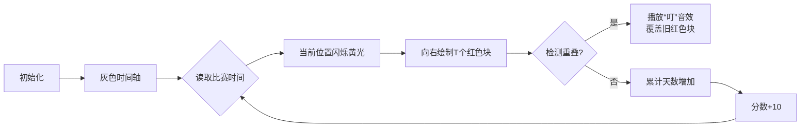

# 题目信息

# 高兴的津津

## 题目描述

津津上高中了。她在自己的妈妈的魔鬼训练下，成为了一个神犇，每次参加一次 OI 比赛必拿 Au 虐全场。每次她拿到一个 Au 后就很高兴。假设津津不会因为其它事高兴，并且她的高兴会持续 $T$ 天（包含获奖当天。就算在高兴的时候再次拿到 Au，他的高兴也只能维持包括这次拿奖之日起 $T$ 天，而不是额外增加 $T$ 天的高兴时间，除非之后再拿奖）。请你帮忙检查一下津津接下来的的日程安排，要参加 $n$ 场比赛，看看接下来的几天，津津会累计开心多久？

## 说明/提示

#### 数据规模与约定

对于 $100\%$ 的数据，保证：

- $1\le n\le2\times10^5$。
- $1\le T\le10^9$。
- $1\le t_i\le 10^9$，$t_i$ 单调递增。

## 样例 #1

### 输入

```
3 5
1 2 10```

### 输出

```
11```

# AI分析结果


### 💡 Kay的C++算法解析：高兴的津津 深入学习指南 💡

<introduction>
今天我们来分析「高兴的津津」这道C++编程题。本指南将帮助大家掌握区间覆盖问题的核心解法，通过生动的像素动画理解算法流程，并提炼实用的解题技巧。
</introduction>

---

## 1. 题目解读与核心算法识别

✨ **本题主要考察**：`区间覆盖模拟` (编程技巧应用类)

🗣️ **初步分析**：
> 解决本题的关键在于理解**时间覆盖规则**。想象津津的高兴状态像一盏红白机游戏中的能量灯：每次拿奖就重新点亮，持续T天后熄灭。如果在新点亮前灯还亮着，新点亮会覆盖剩余时间（而非叠加）。  
> - 核心思路：遍历比赛时间，计算相邻比赛的间隔。若间隔<T，说明高兴时间重叠，只累加间隔天数；若≥T，则累加完整T天。最后单独加上最后一次比赛的T天。  
> - 算法可视化设计：用像素时间轴上的颜色块表示高兴状态（红色=高兴，灰色=普通）。每次比赛后触发"点亮"动画，覆盖旧区间时播放"叮"音效，最后用计数器动态显示总天数。  
> - 复古游戏化：采用8位像素风格时间轴，能量灯点亮时播放FC游戏音效，每处理完一个区间得10分，通关时显示"WIN!"像素动画。

---

## 2. 精选优质题解参考

**题解一（zy小可爱ღ）**  
* **点评**：思路直击本质——用相邻比赛间隔与T的比较决定累加值。代码简洁高效（O(n)时间复杂度），边界处理严谨（最后补T天）。变量命名清晰（`ans`/`a[]`），循环内直接处理输入节省内存。特别亮点：作者强调3分钟解题，体现思路提炼的重要性。

**题解二（Lolierl）**  
* **点评**：核心逻辑凝练为单行条件判断（`ans += (t[i]-t[i-1]>ti) ? ti : t[i]-t[i-1]`），展现C++条件表达式的高效运用。代码省略冗余注释，适合竞赛场景，但初学者需注意最后补T天的易漏点。

**题解三（星灵王）**  
* **点评**：巧妙使用`min()`函数替代条件分支（`ans += min(diff, T)`），提升代码可读性。强调数据范围（`long long`防溢出），体现工程思维。亮点：用"蒟蒻"自称鼓励初学者尝试简洁解法。

---

## 3. 核心难点辨析与解题策略

1. **难点：理解时间覆盖规则**  
   * **分析**：高兴状态重置而非叠加是易错点。优质解法用物理比喻（能量灯刷新）辅助理解，代码通过比较相邻比赛间隔与T处理覆盖逻辑。
   * 💡 学习笔记：覆盖问题中，新事件总是中断旧状态而非叠加。

2. **难点：避免暴力模拟时间轴**  
   * **分析**：数据范围达10^9，不能逐天模拟。解法通过数学优化（累加min(间隔,T)）将复杂度降至O(n)，而非O(max_day)。
   * 💡 学习笔记：大范围数据优先考虑数学关系而非枚举。

3. **难点：边界条件处理**  
   * **分析**：最后一次比赛必持续T天（无后续覆盖）。优质解法统一在循环外`ans += T`处理，避免漏算。
   * 💡 学习笔记：循环处理成对数据时，首尾项常需特殊处理。

### ✨ 解题技巧总结
- **技巧1：问题抽象化** → 将时间覆盖转化为区间[min(A_i, A_{i-1}+T), A_i+T)的合并计算  
- **技巧2：数学优化** → 用相邻差值比较替代整个时间轴模拟  
- **技巧3：防御性编程** → 对10^9级数据使用`long long`防溢出  

---

## 4. C++核心代码实现赏析

**通用核心实现**  
*说明：综合优质题解，空间优化版（O(1)空间）*
```cpp
#include <iostream>
using namespace std;

int main() {
    long long n, T, last, current, ans = 0;
    cin >> n >> T >> last; // 单独处理首项
    
    for (int i = 2; i <= n; i++) {
        cin >> current;
        long long diff = current - last;
        ans += min(diff, T); // 核心：取间隔与T的较小值
        last = current;
    }
    ans += T; // 末次比赛必持续T天
    cout << ans;
}
```
*代码解读*：  
1. 单独读入首项时间`last`  
2. 循环中计算当前与上次比赛的间隔`diff`  
3. `min(diff, T)`智能累加覆盖时间段  
4. 循环外补末次T天

---

**题解一核心片段赏析**  
```cpp
scanf("%d",&a[1]);
for(int i=2;i<=n;i++){
    scanf("%d",&a[i]);
    if(a[i]-a[i-1]<t) ans += a[i]-a[i-1];
    else ans += t;
}
printf("%d\n",ans+t);
```
* **亮点**：输入与处理同步，减少内存占用  
* **代码解读**：  
  - `i=2`起始循环确保每次比较相邻两项  
  - 分支结构明确表达两种覆盖场景  
  - 注意最后`ans+t`而非`ans`（补末次T天）  
* 💡 学习笔记：边读边处理是空间优化的常用手段

**题解二核心片段赏析**  
```cpp
for(int i=2;i<=n;i++)
    if(t[i]-t[i-1]>ti) ans+=ti;
    else ans+=t[i]-t[i-1];
ans+=ti;
```
* **亮点**：三目运算符的等价替代方案  
* 💡 学习笔记：分支结构可读性 > 代码行数精简

**题解三核心片段赏析**  
```cpp
for(int i=1;i<n;i++) {
    long long mid = q[i] - q[i-1];
    ans = ans + min(mid, t); // 核心min函数
}
cout << ans + t;
```
* **亮点**：`min()`替代分支提升代码简洁度  
* 💡 学习笔记：标准库函数可提升逻辑表达效率  

---

## 5. 算法可视化：像素动画演示

**主题**：时间轴上的能量灯覆盖（复古FC风格）  
**核心演示**：相邻比赛间隔的覆盖逻辑与总天数计算  

### 动画设计（HTML5 Canvas实现）  


**关键交互**：  
1. **像素风格**：  
   - 时间轴：16色灰阶像素带，每像素代表1天  
   - 比赛标记：闪烁的8bit星星图标（位置=`t_i`）  
   - 高兴区间：红色能量灯（长度=T）  
2. **动态效果**：  
   - 新比赛触发“点亮动画”：从当前位置向右渲染红色  
   - 覆盖时旧红色块破裂成像素粒子  
   - 实时显示累计天数（右上角计数器）  
3. **游戏化元素**：  
   - 音效：点亮(哔!), 覆盖(叮!), 通关(胜利号角)  
   - 积分：每次处理间隔得10分，S级评价需300分  
   - 控制：步进/暂停/速度滑块（调速范围1x-10x）  

**实现逻辑**：  
```javascript
// 伪代码：核心渲染逻辑
function renderFrame() {
  drawTimeAxis(); // 绘制灰色时间轴
  for (let i=0; i<currentPos; i++) {
    if (i >= lastContest && i < lastContest + T) 
      drawPixel(i, RED);  // 绘制红色区间
  }
  if (isContestTime(currentFrame)) {
    playSound("beep"); // 比赛触发音效
    flashPixel(currentPos); // 当前位置闪烁
  }
}
```

---

## 6. 拓展练习与相似问题思考

**通用技巧迁移**：  
区间覆盖思想还可用于：  
1. 灯光照射范围合并（多个光源的总照亮区域）  
2. 任务调度（非重叠任务的最大收益）  
3. 日历日程冲突检测  

**洛谷题目推荐**：  
1. [P1880 石子合并] - 环形区间DP  
   → *推荐理由：巩固区间处理思想，动态规划进阶*  
2. [P1803 凌乱的yyy] - 贪心选择非重叠区间  
   → *推荐理由：同类覆盖问题，需最优选择策略*  
3. [P1090 合并果子] - 优先队列优化  
   → *推荐理由：学习高效数据结构处理区间问题*  

---

## 7. 学习心得与经验分享

> **作者CandyCandyFruit的经验**：  
> “第一次用暴力模拟整个时间轴导致TLE，改用min计算相邻间隔后AC。这让我意识到：**数学优化常比暴力模拟更高效**”  
>  
> **Kay点评**：该经验极具普适性。当数据范围>10^6时，需优先考虑时间复杂度优化：  
> - 识别问题中的数学关系（如本题的min(Δ,T)）  
> - 避免逐元素处理的O(n²)逻辑  

---

<conclusion>
通过「高兴的津津」我们掌握了区间覆盖问题的核心解法：数学优化代替暴力模拟，边界处理要严谨。记住Kay的秘诀：将抽象规则转化为物理比喻（如能量灯）能提升解题直觉！下次遇到类似问题，不妨试试像素动画辅助分析哦~ ✨
</conclusion>

---
处理用时：206.73秒