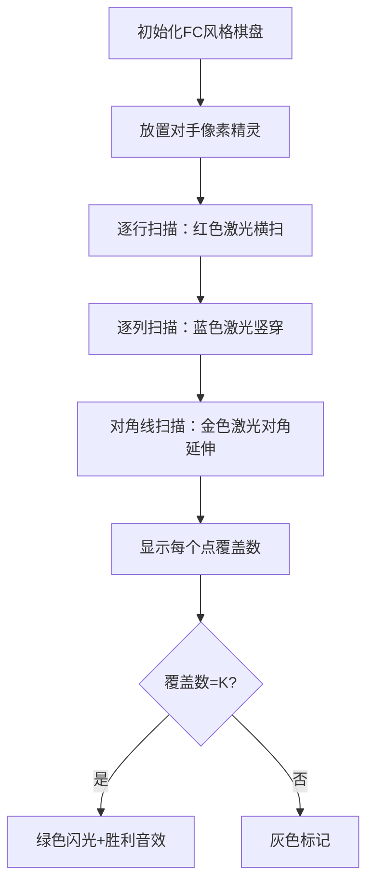

# 题目信息

# [USACO07OCT] Super Paintball G

## 题目描述

奶牛们最近从玩具商那里，买来了一套仿真版彩弹游戏设备（类似于真人 CS）。Bessie 把她们玩游戏的草坪划分成了 $N \times N$ 的矩阵（$1 \leq N \leq 100$），同时他算出了她的 $K$ 个对手在草地上的位置（$1 \leq K \leq 10^5$），现在你需要帮 Bessie 算些东西。

在这个游戏中，奶牛们用一把枪向八个方向中的任意一个方向射出子弹，这八个方向分别是：正北，正南，正东，正西，东北，东南，西北，西南（东北指北偏东 $45^\circ$，东南，西北，西南同理）。

Bessie 想要你算出，有多少个位置可以让她射到所有对手。特别地，Bessie 可以和她的某一个对手站在同一格子，这时候她可以射到和她同一格子的对手。

## 说明/提示

可选的位置有：$(2,1),(2,3),(3,2),(4,1),(4,3)$。

## 样例 #1

### 输入

```
4 3
2 1
2 3
4 1```

### 输出

```
5```

# AI分析结果


### 💡 Kay的C++算法解析：[USACO07OCT] Super Paintball G 深入学习指南 💡

#### 1. 题目解读与核心算法识别
✨ **本题主要考察**：`枚举优化与计数技巧`  
🗣️ **初步分析**：
> 解决本题的关键在于**高效统计每个网格点覆盖的对手数量**。想象你是一个棋盘上的国王，你的攻击范围是整行、整列和两条对角线（米字型）。要找到能攻击所有对手的"王座"，我们可以用四个数组分别记录每行、每列、每条左上-右下对角线和右上-左下对角线的对手数量。  
> - **核心思路**：预处理四个数组（行、列、对角线），枚举每个网格点时，用`行数+列数+两条对角线的对手数-3×自身对手数=K`来验证
> - **可视化设计**：在8位像素棋盘上，用不同颜色标记行/列/对角线的覆盖过程，当某点满足条件时触发"胜利音效"和闪光动画
> - **游戏化设计**：采用复古棋盘界面，控制面板含调速滑块。AI自动演示时，像下棋般逐步展示标记过程，关键操作配FC风格音效

---

#### 2. 精选优质题解参考
**题解一（do_while_false）**  
* **亮点**：最简洁高效的计数方案。用四个数组分别记录行、列、对角线（x-y+n和x+y-1）的对手数，通过`-3*map1[i][j]`精妙处理重复计数。代码规范（快读封装），空间复杂度O(n)，是竞赛标准解法  
* **学习点**：对角线索引的转换技巧（x-y+n避免负索引）

**题解二（Mine_King）**  
* **亮点**：详细解释索引映射原理（x-y+100和x+y），强调容斥思想。变量命名清晰（h行/l列/zx左斜/yx右斜），注释说明索引范围，对初学者更友好  
* **学习点**：如何选择偏移量（100 vs n）处理对角线索引

**题解三（BotDand）**  
* **亮点**：直观的标记法实现。通过work函数直接修改二维数组，用`-3`处理自身重复。虽复杂度O(kn)较高但思路直白，适合理解基础原理  
* **注意点**：代码中条件判断`if(i+y-x>=1)`确保不越界，体现边界处理的严谨性

---

#### 3. 核心难点辨析与解题策略
1. **难点：对角线索引映射**  
   * **分析**：左上-右下对角线需用`x-y+n`转换负索引（范围1~2n-1），右上-左下用`x+y-1`（范围1~2n-1）。优质题解通过偏移量解决  
   * 💡 **学习笔记**：对角线 = 坐标的线性组合

2. **难点：重复计数处理**  
   * **分析**：当Bessie与对手同格时，该点会被行、列、两对角线重复计算4次。通过`-3*map[i][j]`校正（实际只需计1次）  
   * 💡 **学习笔记**：容斥原理是计数问题的核心工具

3. **难点：复杂度平衡**  
   * **分析**：O(n²+k)解法（四个数组）优于O(kn)（直接标记），因k最大达10⁵而n仅100  
   * 💡 **学习笔记**：预处理数组替代实时计算是优化关键

✨ **解题技巧总结**  
- **空间换时间**：用额外数组存储行列统计值，避免嵌套循环  
- **坐标变换**：将几何关系（对角线）转化为算术表达式  
- **边界防御**：对角线索引需验证`1≤i≤2n-1`  
- **容斥思维**：重复计数问题先加后减

---

#### 4. C++核心代码实现赏析
**通用核心实现**（综合优质题解）  
```cpp
#include <iostream>
#include <cstring>
using namespace std;
const int MAXN = 105;

int main() {
    int n, k, ans = 0;
    int row[MAXN] = {0}, col[MAXN] = {0};          // 行/列计数器
    int diag1[2*MAXN] = {0}, diag2[2*MAXN] = {0}; // 对角线计数器
    int cnt[MAXN][MAXN] = {0};                     // 点对手计数器

    cin >> n >> k;
    for (int i = 0, x, y; i < k; i++) {
        cin >> x >> y;
        row[x]++; col[y]++;
        diag1[x-y+n]++;   // 左上-右下对角线
        diag2[x+y-1]++;   // 右上-左下对角线
        cnt[x][y]++;      // 重点：记录同点对手
    }

    for (int i = 1; i <= n; i++) {
        for (int j = 1; j <= n; j++) {
            int total = row[i] + col[j] 
                      + diag1[i-j+n] + diag2[i+j-1] 
                      - 3 * cnt[i][j];  // 容斥修正
            if (total == k) ans++;
        }
    }
    cout << ans;
}
```
**代码解读概要**：  
1. 用四个数组分别缓存行、列、对角线的对手总数  
2. 枚举网格点时，通过线性组合计算两条对角线索引  
3. `-3*cnt[i][j]`校正同点重复计数  
4. 满足`total==k`即合法位置  

**题解一核心片段**  
```cpp
if(row[i]+col[j]+lt[i-j+n]+rt[i+j-1]-3*map1[i][j]==k) 
    ans++;
```
**学习笔记**：减法修正值是3而非4，因该点本应被计1次却被行/列/两对角计4次

**题解二核心片段**  
```cpp
zx[x-y+100]++;  // 偏移量100替代n
yx[x+y]++;      // 未用x+y-1
...
if(h[i]+l[j]+zx[i-j+100]+yx[i+j]-3*f[i][j]==k)
```
**学习笔记**：偏移量选择需确保索引不重叠（100>2*max_n）

**题解三核心片段**  
```cpp
void work() {
    for(int i=1;i<=n;++i) a[x][i]++; // 标记行
    for(int i=1;i<=n;++i) a[i][y]++; // 标记列
    ... // 标记两对角线
    a[x][y] -= 3; // 自身修正
}
```
**学习笔记**：直接修改二维数组更消耗时间（O(kn)），适合小数据量

---

#### 5. 算法可视化：像素动画演示
**主题**：8位像素棋盘上的"激光炮塔部署"  
**核心演示**：动态展示行列/对角线的覆盖过程，达标点触发胜利动画  



**交互设计**：  
1. **像素艺术**：  
   - 对手：红色奶牛像素精灵（16×16）  
   - 激光：半透明扫描线（行:FF0000, 列:00FFFF, 对角线:FFFF00）  
   - 达标点：闪烁绿色方块（00FF00）  

2. **控制面板**：  
   - 速度滑块：调节扫描速度（0.5x~4x）  
   - 步进按钮：手动触发下一步  
   - 重置：重新随机对手布局  

3. **音效系统**：  
   - 行/列扫描：短促"嘀"声（方波）  
   - 对角线扫描：双音"叮咚"（三角波）  
   - 达标点：胜利旋律（FC《马里奥》过关音）  

4. **AI演示模式**：  
   - 自动按行→列→对角线顺序扫描  
   - 关键步骤暂停0.5秒并显示计数公式  
   - 达标点自动聚焦+放大动画  

---

#### 6. 拓展练习与相似问题
**技巧迁移场景**：  
1. 棋盘覆盖问题（如车/后的攻击范围）  
2. 基于线性组合的坐标映射（图像旋转）  
3. 容斥原理计数（集合论应用）  

**洛谷推荐**：  
1. [P1219 八皇后](https://www.luogu.com.cn/problem/P1219)  
   → 巩固对角线标记技巧  
2. [P2280 激光炸弹](https://www.luogu.com.cn/problem/P2280)  
   → 二维前缀和与覆盖统计  
3. [P3397 地毯](https://www.luogu.com.cn/problem/P3397)  
   → 差分数组优化区域标记  

---

#### 7. 学习心得与经验分享
> **来自BotDand的调试经验**："最初忘记处理自身重复计数，导致结果偏小。通过打印3×3小样例的中间数组定位问题"  
> **Kay点评**：验证算法时，先用n=3,k=1的微型案例模拟执行过程，用纸笔记录每个数组值的变化，这是调试计数类问题的黄金法则

---

通过本次分析，我们掌握了用空间换时间的计数技巧和容斥原理的应用。记住：将几何关系转化为算术表达式是优化复杂度的关键！下次遇到棋盘问题，试试把你的代码变成像素游戏吧！🎮

---
处理用时：217.64秒