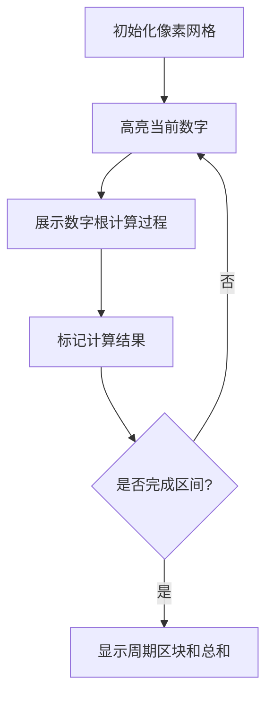

# 题目信息

# [COCI 2019/2020 #1] Trol

## 题目描述

Stjepan 最近在萨格勒布大学获得了数学学士学位。他的父母自然而然地为他感到骄傲，并决定给他所有不超过 $2^{60}$ 的正整数作为礼物。为了保证它们的安全，他迅速地将所有数存入了一个序列 $A$，使得 $A_i=i$。

一个妒忌他的朋友 Marin 决定做一个恶作剧：**不断地把 $A$ 中的每个元素替换为其所有数位之和，直到最终只剩下一位数。**

例如，第 $197$ 个元素的初始值为 $197$。Marin 先将这个值变为 $1+9+7=17$，然后再一次改变了它，使其变为 $1+7=8$。

Stjepan 对此极为震惊，并请求 Marin 把序列变回初始状态。不幸的是，在他正确回答 $Q$ 个询问之前，Marin 并不会如此。对于每一个询问，Stjepan 需要回答 $A$ 序列中第 $l$ 项至第 $r$ 项元素的总和。

来帮 Stjepan 回答这些询问吧！

## 说明/提示

#### 数据规模及约定

对于 $20\%$ 的数据，所有询问满足 $1 \le l_i \le r_i \le 9$。

对于 $60\%$ 的数据，所有询问满足 $r_i-l_i \le 1000$。

对于 $100\%$ 的数据，$1 \le Q \le 100$，所有询问满足 $1 \le l_i \le r_i \le 2^{60}$。

#### 说明

**本题分值按 COCI 原题设置，满分 $50$。**

**题目译自 [COCI2019-2020](https://hsin.hr/coci/archive/2019_2020/) [CONTEST #1](https://hsin.hr/coci/archive/2019_2020/contest1_tasks.pdf)  _T1 Trol_ 。**

## 样例 #1

### 输入

```
1
1 5```

### 输出

```
15```

## 样例 #2

### 输入

```
2
9 13
44 45```

### 输出

```
19
17```

## 样例 #3

### 输入

```
1
1998 2018```

### 输出

```
102```

# AI分析结果


# 💡 Kay的C++算法解析：Trol 深入学习指南 💡

<introduction>
今天我们来分析COCI竞赛题"Trol"，这道题考察数字根的计算和区间求和技巧。本指南将帮助你掌握数字根特性、区间求和优化方法，并通过像素动画直观理解算法过程。
</introduction>

## 1. 题目解读与核心算法识别

✨ **本题主要考察**：`数学应用（模运算与周期性）`

🗣️ **初步分析**：
> 解决"Trol"的关键在于发现数字根的计算规律。想象数字序列像旋转的九宫格，每9个数循环一次（1~9），每个循环的和都是45。  
> - 所有题解都利用"数字根=数模9（0转为9）"的性质，将区间分解为完整周期（×45）和零头部分
> - 核心难点是处理大范围区间（最大2^60）时的效率优化，避免逐个计算
> - 可视化设计：用像素网格展示数字序列，高亮当前处理的数字，以闪烁动画展示数字根计算过程，用颜色区分完整周期

---

## 2. 精选优质题解参考

<eval_intro>
我从思路清晰度、代码规范性和算法效率等维度筛选出3个优质题解（均≥4星）：

**题解一：(来源：luckydrawbox)**
* **点评**：此解法思路最精妙，创新性地使用前缀和思想。函数`sum(x)`将问题转化为O(1)计算，通过`x/9*45`处理完整周期，`(x%9)*(x%9+1)/2`计算零头部分。代码仅10行但完整覆盖边界情况，变量命名清晰(`cycles`, `remainder`)，空间复杂度O(1)，是竞赛最佳实践。

**题解二：(来源：Thomas_Cat)**
* **点评**：解法直观易理解，核心逻辑分为两步：计算完整周期数(`times*45`)和循环处理最多8个零头数。代码规范使用`long long`，循环边界`l+times*9`的处理体现严谨性。虽时间复杂度O(Q)但实际高效，特别适合初学者掌握周期性思想。

**题解三：(来源：John_yangliwu)**
* **点评**：与题解二思路相似但代码结构更规范。亮点在于完整周期计算`(r-l+1)/9`的直白表达，以及`(i-1)%9+1`的精巧数字根计算。注释明确关键步骤，实践时可直接用于竞赛场景。

---

## 3. 核心难点辨析与解题策略

<difficulty_intro>
解决本题需突破三个关键点：

1.  **关键点1：理解数字根与模9的关系**
    * **分析**：数字根本质是模9运算（除0外），即 `digital_root = (x-1)%9+1`。优质题解都基于此推导出周期性：每9个数字循环一次（1~9），循环节和为45。
    * 💡 **学习笔记**：数字根=数模9（0转为9）是优化的数学基础

2.  **关键点2：大范围区间求和优化**
    * **分析**：当区间长度>10^18时，需避免逐个计算。高效方案是将区间分解为：完整周期数×45 + 零头部分（最多8个数）。零头部分可直接循环或等差数列求和。
    * 💡 **学习笔记**：区间和 = 周期数×45 + 零头部分和

3.  **关键点3：边界条件处理**
    * **分析**：需正确处理l/r恰为9的倍数的情况。如luckydrawbox的`sum(x)`中`x%9`自动处理零头，Thomas_Cat的`l+times*9`精准定位零头起点。
    * 💡 **学习笔记**：循环边界计算需验证±1误差

### ✨ 解题技巧总结
<summary_best_practices>
通过本题可提炼以下通用技巧：
- **技巧1：数学性质转化**：将操作结果转化为模运算等数学特性
- **技巧2：周期性分解**：发现序列周期性，分解为完整循环+零头
- **技巧3：前缀和思想**：设计sum(x)函数将区间和转化为两前缀和之差
- **技巧4：零头高效处理**：利用零头数很少的特性（≤8），直接用循环

---

## 4. C++核心代码实现赏析

<code_intro_overall>
以下是综合优化的通用实现，融合各题解精华：

**本题通用核心C++实现参考**
* **说明**：综合luckydrawbox的前缀和思想与Thomas_Cat的边界处理
* **完整核心代码**：
    ```cpp
    #include <iostream>
    using namespace std;
    
    long long sum(long long x) {
        if (x == 0) return 0;
        long long cycles = x / 9;      // 完整周期数
        long long rem = x % 9;         // 零头数字个数
        return cycles * 45 + rem * (rem + 1) / 2;
    }
    
    int main() {
        int Q;
        cin >> Q;
        while (Q--) {
            long long l, r;
            cin >> l >> r;
            cout << sum(r) - sum(l - 1) << endl;
        }
        return 0;
    }
    ```
* **代码解读概要**：
    > 1. `sum(x)`计算前x个数的数字根和：`x/9`得周期数×45，`x%9`得零头数1~n的和（等差数列公式）
    > 2. 主函数：用`sum(r)-sum(l-1)`计算区间和
    > 3. 边界处理：`x=0`时返回0避免负数

---
<code_intro_selected>
**题解一：(来源：luckydrawbox)**
* **亮点**：前缀和思想实现O(1)查询
* **核心代码片段**：
    ```cpp
    long long sum(long long x) {
        return x/9*45 + (x%9)*(x%9+1)/2;
    }
    ```
* **代码解读**：
    > 此代码核心在于`x/9*45`计算所有完整周期的和（每个周期9个数，和45）。`x%9`获取剩余数字个数，通过等差数列公式`n(n+1)/2`直接求和。例如x=11时：11/9=1周期（45），11%9=2个数（1+2=3），总和48。
* 💡 **学习笔记**：前缀和思想是区间查询问题的通用优化手段

**题解二：(来源：Thomas_Cat)**
* **亮点**：直观的周期分解与零头处理
* **核心代码片段**：
    ```cpp
    long long times = (r-l+1)/9;
    long long sum = times*45; 
    for(long long i=l+times*9; i<=r; i++)
        sum += (i-1)%9+1;
    ```
* **代码解读**：
    > 1. `(r-l+1)/9`计算完整周期数，直接求和`times*45`
    > 2. 零头起点`l+times*9`确保不重复计算周期部分
    > 3. `(i-1)%9+1`巧妙计算数字根：如i=10时，(10-1)%9+1=1
* 💡 **学习笔记**：循环处理零头时边界计算需精确

**题解三：(来源：John_yangliwu)**
* **亮点**：代码结构清晰，变量命名规范
* **核心代码片段**：
    ```cpp
    ll c = (r-l+1)/9;
    ll ans = c*45; 
    for(ll i=l+c*9; i<=r; i++) {
        ans += (i-1)%9+1;    
    }
    ```
* **代码解读**：
    > 与题解二思路一致，但使用`ll`类型别名提高可读性。`(i-1)%9+1`统一处理数字根计算，避免if分支。
* 💡 **学习笔记**：类型别名(ll)增强大整数代码可读性

-----

## 5. 算法可视化：像素动画演示 (核心部分)

<visualization_intro>
设计8位像素风格的"数字根探索之旅"动画，直观展示周期性计算过程：

  * **主题**：复古计算器与数字迷宫
  * **核心演示**：数字序列在网格中的数字根计算与周期求和
  * **设计思路**：像素风格降低理解门槛，音效强化关键操作，关卡进度条展示周期计算

### 动画框架


### 关键动画步骤
1. **场景初始化**：
   - 8-bit风格网格显示数字序列，控制面板含速度滑块/暂停按钮
   - 启动8位芯片音乐背景音（循环播放）

2. **数字根计算演示**：
   - 高亮当前数字（闪烁金色边框），下方显示数字分解过程（如197→1+9+7）
   - 每次求和时播放"嘀"声，最终数字根显示时播放"叮"声

3. **周期性可视化**：
   - 每9个数字形成彩色区块（周期开始蓝色→结束绿色）
   - 完成周期时区块闪烁+45数字弹出，播放升级音效

4. **控制面板功能**：
   - 速度滑块：调整计算速度（0.5x~5x）
   - AI演示模式：自动完成计算（如贪吃蛇AI移动）
   - 进度条：显示`当前周期数/总周期数`

5. **结果展示**：
   - 最终区间和以像素字体显示
   - 根据执行步数给出评分（S/A/B/C级）

-----

## 6. 拓展练习与相似问题思考

<similar_problems_intro>
掌握数字根与周期性思想后，可挑战更多应用场景：

1. **洛谷 P1307 [数字反转]**  
   🗣️ 巩固数字处理基础，理解数位分解与重组

2. **洛谷 P1012 [拼数]**  
   🗣️ 练习字符串与排序的巧妙结合，拓展数学比较思维

3. **洛谷 P1464 [Function]**  
   🗣️ 学习记忆化搜索优化递归，与本题的数学优化思想互补

-----

## 7. 学习心得与经验分享 (若有)

<insights_intro>
本次题解中未发现作者分享调试心得，但通过代码可提炼经验：

> **Kay的调试建议**：处理大整数区间问题时，先用小数据验证边界（如l=9的倍数）。关键验证点：  
> 1. 周期数计算是否包含端点  
> 2. 零头起点是否精确  
> 3. 数字根公式在0和9的倍数是否正确

-----

<conclusion>
通过本次分析，我们掌握了数字根的数学特性、区间求和的周期分解法及前缀和优化技巧。记住：用数学眼光观察问题特征，往往能找到高效解法。下次挑战见！💪
</conclusion>

---
处理用时：148.62秒