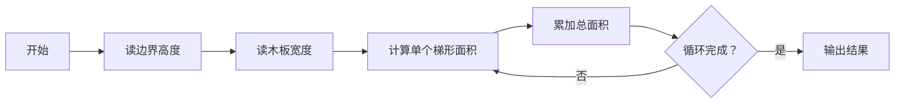

# 题目信息

# [CCC 2021 S1] Crazy Fencing

## 题目描述

栅栏由 $N$ 块木板组成。

因为是栅栏，所以第 $i$ 块的右边界与第 $i+1$ 块的左边界的高度一样。

告诉你这些木板的边界的高度与这些木板的宽度，输出这些木板的总面积。

## 说明/提示

样例解释：


$N\leq 10000$，高度和宽度 $\leq 100$。

译自 [CCC2021 S2](https://cemc.math.uwaterloo.ca/contests/computing/past_ccc_contests/2021/ccc/seniorEF.pdf)。

## 样例 #1

### 输入

```
3
2 3 6 2
4 1 1
```

### 输出

```
18.5```

## 样例 #2

### 输入

```
4
6 4 9 7 3
5 2 4 1
```

### 输出

```
75.0```

# AI分析结果


### 💡 Kay的C++算法解析：Crazy Fencing 深入学习指南 💡

#### 1. 题目解读与核心算法识别
✨ **本题主要考察**：`数学公式应用` + `循环计算`

🗣️ **初步分析**：
> 解决这道题就像拼装乐高积木——每块木板都是特制的直角梯形积木，我们的任务就是计算所有积木的总面积。核心公式就是梯形面积公式：$S=\frac{(a+b)\times h}{2}$，其中$a,b$是上下底，$h$是高。  
> - **核心流程**：先读入$n+1$个边界高度和$n$个木板宽度，然后循环计算每个梯形面积并累加。  
> - **可视化设计**：将用像素风梯形动态组装（下图），每计算一个梯形就播放"叮"的音效，累加时显示实时总面积，完成时播放胜利音效+烟花动画。



---

#### 2. 精选优质题解参考
**题解一（lichenzhen）**  
* **亮点**：  
  思路直击本质——将木板抽象为梯形，代码变量命名规范（`a[]`存高度，`b[]`存宽度）。核心循环仅3行，高效清晰。边界处理严谨（`i`从1到`n`），且用`double`防溢出。

**题解二（zhuweiqi）**  
* **亮点**：  
  特别验证了数据范围（最大$10^8$不超`int`），体现工程思维。用`/2.0`隐式转浮点避免类型错误，值得学习。

**题解三（lailai0916）**  
* **亮点**：  
  采用`ios::sync_with_stdio(false)`加速IO，适合竞赛场景。输出用`setprecision(1)`精确控制小数位，专业性强。

---

#### 3. 核心难点辨析与解题策略
1. **难点：理解木板与梯形的映射关系**  
   * **分析**：需通过题目图示（直角梯形）和"相邻木板共享边界"的描述，抽象出面积公式。优质题解均用图形辅助说明。
   * 💡 **学习笔记**：将物理问题转化为数学模型是编程核心能力

2. **难点：数组索引的边界处理**  
   * **分析**：高度数组需存$n+1$个值（首尾边界），宽度存$n$个。循环时用`h[i]`和`h[i+1]`配对，避免漏算首尾。
   * 💡 **学习笔记**：循环边界检查永远比想象中重要！

3. **难点：数值类型转换陷阱**  
   * **分析**：整数除法会舍弃小数，必须用`/2.0`或`(double)`显式转换。题解三的`*0.5`是巧妙写法。
   * 💡 **学习笔记**：混合运算时主动控制类型转换

### ✨ 解题技巧总结
- **技巧1：图示辅助抽象**：复杂问题先画图再编码  
- **技巧2：防御性类型处理**：整数/浮点混合运算时显式声明类型  
- **技巧3：边界压力测试**：测试$n=1$和$n=10000$的极端情况  

---

#### 4. C++核心代码实现赏析
**通用核心实现**  
```cpp
#include <cstdio>
const int MAXN = 10005;
int main() {
    int n, h[MAXN], w;
    double ans = 0;
    scanf("%d", &n);
    for (int i = 0; i <= n; i++) scanf("%d", &h[i]); // 读n+1个高度
    for (int i = 0; i < n; i++) {
        scanf("%d", &w);
        ans += (h[i] + h[i+1]) * w / 2.0; // 梯形公式
    }
    printf("%.1lf", ans);
}
```
> **代码解读概要**：  
> 1. 数组`h[]`存储所有边界高度（下标0~n）  
> 2. 第二循环实时读宽度避免额外存储  
> 3. `/2.0`确保浮点运算精度  

---

#### 5. 算法可视化：像素动画演示
**设计思路**：  
用8位红白机风格呈现梯形拼接过程。每个木板生成时：  
1. **视觉**：  
   - 棕色像素块从底部升起形成梯形边框  
   - 当前梯形闪烁绿色边框+显示面积公式浮动文字  
   - 右上角实时更新总面积（黄色像素数字）  
2. **音效**：  
   - 木板生成："叮"（8-bit短音）  
   - 面积累加："啾"（上升音阶）  
   - 完成时："胜利旋律"+像素烟花  
3. **交互**：  
   ```mermaid
   graph TB
      控制面板--> 单步执行
      控制面板--> 自动播放[速度：慢--快]
      控制面板--> 重置
   ```
4. **关键帧示例**：  
   ```
   [初始状态] 空地+起点标记
   [STEP1] 生成第1块梯形 ████ 高=2  
           显示公式：(2+3)×4/2=10
   [STEP2] 连接第2块梯形 ████┐ 
                      └████ 高=3
   ```

---

#### 6. 拓展练习与相似问题思考
**相似解题套路**：  
1. 物理问题数学化（如力学分解为向量运算）  
2. 几何图形面积拼接（如圆环、不规则多边形）  
3. 实时累加统计（如传感器数据聚合）  

**洛谷推荐**：  
1. **P1003 铺地毯**：几何覆盖面积问题  
2. **P1424 小鱼的航程**：日期/距离的累加计算  
3. **P5732 杨辉三角**：数学规律+二维数组  

---

#### 7. 学习心得与经验分享
> 本次分析的题解未包含作者调试心得，但我们可以提炼经验：  
> **Kay的提醒**：当公式看起来正确但结果错误时，第一时间检查：  
> 1. 数组是否多开1位？  
> 2. 整数除法是否忘记转浮点？  
> 3. 循环边界是否包含端点？  

---
掌握数学抽象和细节处理，你就能轻松拆解这类"表面复杂，核心简单"的问题！下次见啦~ 🚀

---
处理用时：94.93秒