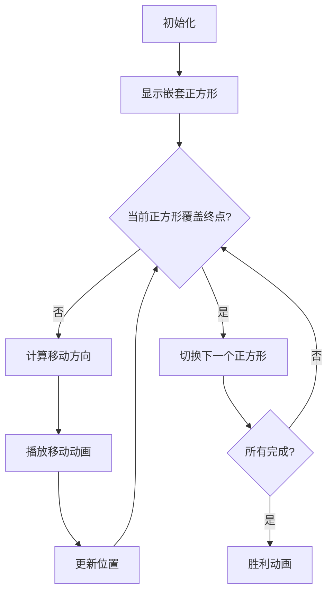

# 题目信息

# 藤原「灭罪寺院伤」

## 题目背景

藤原氏，权倾一时的重臣。凭借着炙手可热的权势，杀害了政敌长屋王而触碰到了最高的权力。

是天谴吗？即使修缮寺庙积德行善，藤原四兄弟最终覆灭在了天花之下。

## 题目描述

环环相扣的因果报应可看成平面上的 $n$ 个小正方形，它们的边长分别为 $1,2,3,\cdots,n$。初始时，编号较小的正方形被编号较大的正方形完全包含：


为了方便记录正方形的位置，我们取正方形左上角的坐标 $(x_i,y_i)$ 为正方形的坐标。此时可以唯一确定该正方形。

现在需要将最小的正方形的位置移动到 $(x_{\rm end},y_{\rm end})$，移动过程满足：

- 每次**最多移动一个**正方形，可以往上下左右四个方向之一移动一个单位长度。
- 在移动过程中，需要保证**较小正方形会被较大的正方形包含**。

请求出最少次数。

## 说明/提示

### 样例 1 解释


### 数据范围及约定

对于全部数据，$1\le n\le 10^5$，$0\le x_i,y_i,x_{\mathrm{end}},y_{\mathrm{end}}\le 10^9$。

## 样例 #1

### 输入

```
3 2 1
1 0
1 0
0 1
```

### 输出

```
3

```

## 样例 #2

### 输入

```
15 8 4
9 0
9 1
9 1
8 1
8 2
8 3
7 3
6 3
5 3
4 3
3 3
2 4
2 5
1 6
0 7
```

### 输出

```
24
```

# AI分析结果


### 💡 Kay的C++算法解析：藤原「灭罪寺院伤」深入学习指南 💡

#### 1. 题目解读与核心算法识别
✨ **本题主要考察**：**坐标模拟与边界计算**  
🗣️ **初步分析**：
> 解决本题的关键在于**精确计算每个正方形的边界范围**。想象正方形如同俄罗斯套娃，大套娃必须完全包裹小套娃。每个正方形的位置由其左上角坐标$(x_i,y_i)$和边长$i$共同决定：
> - **水平覆盖范围**：$[x_i, x_i + i - 1]$
> - **垂直覆盖范围**：$[y_i - i + 1, y_i]$
> 
> **核心策略**：对每个正方形独立计算使其覆盖终点的最小移动步数：
> 1. 若终点在正方形外部，计算到最近边界的距离
> 2. 累加所有正方形的移动步数
> 
> **可视化设计思路**：
> - 用8位像素风格展示嵌套正方形（大正方形用深色，小正方形用浅色）
> - 高亮当前处理的正方形边界
> - 终点标记为闪烁的红色像素点
> - 移动动画：显示箭头方向和步数计数器
> - 音效：移动时播放"滴"声，完成时播放8位胜利音效

---

#### 2. 精选优质题解参考
**题解一（Night_sea_64）**  
* **点评**：  
  思路直击核心——每个正方形独立计算覆盖终点的步数。代码清晰展示了边界计算逻辑（`x+i-1`和`y-i+1`），变量名简洁（`x,y,fx,fy`），边界处理严谨。亮点在于用四组条件判断完美覆盖了终点在正方形外的所有情况。

**题解二（0zhouyq）**  
* **点评**：  
  代码更简洁但同样高效，用单层循环完成计算。亮点在于明确解释了移动顺序无关性（"大正方形先移动不影响小正方形步数"），这对理解问题本质很有帮助。`long long`使用避免了数据溢出风险。

---

#### 3. 核心难点辨析与解题策略
1. **难点：理解正方形实际覆盖范围**  
   * **分析**：正方形坐标$(x_i,y_i)$仅表示左上角位置，实际覆盖区域由边长$i$决定（水平延伸$i-1$单位，垂直向下延伸$i-1$单位）  
   * 💡 **学习笔记**：正方形的有效区域 = $[x_i, x_i+i-1] \times [y_i-i+1, y_i]$

2. **难点：独立移动的可行性证明**  
   * **分析**：优质题解通过反证说明——移动大正方形时小正方形可同步移动，因此总步数等于各正方形独立移动步数之和  
   * 💡 **学习笔记**：嵌套移动问题可分解为独立子问题

3. **难点：边界条件分类处理**  
   * **分析**：终点可能在正方形的左/右/上/下四个外部区域，需要分别计算：  
     ```cpp
     if (终点在左侧) 步数 += x_i - x_end;
     if (终点在右侧) 步数 += x_end - (x_i + i - 1);
     if (终点在上方) 步数 += y_end - y_i;
     if (终点在下方) 步数 += (y_i - i + 1) - y_end;
     ```
   * 💡 **学习笔记**：坐标系处理要同时考虑位置和延伸方向

**✨ 解题技巧总结**  
- **坐标变换法**：将左上角坐标转换为覆盖区间  
- **独立分解策略**：复杂嵌套问题分解为独立子问题  
- **边界枚举法**：系统处理所有可能的越界情况  

---

#### 4. C++核心代码实现赏析
**通用核心实现**  
```cpp
#include <iostream>
using namespace std;

int main() {
    long long n, x_end, y_end, ans = 0;
    cin >> n >> x_end >> y_end;
    
    for (int i = 1; i <= n; i++) {
        long long x, y;
        cin >> x >> y;
        
        // 水平方向检查
        if (x_end < x) ans += x - x_end;
        else if (x_end > x + i - 1) ans += x_end - (x + i - 1);
        
        // 垂直方向检查
        if (y_end > y) ans += y_end - y;
        else if (y_end < y - i + 1) ans += (y - i + 1) - y_end;
    }
    cout << ans << endl;
    return 0;
}
```
**代码解读概要**：  
1. 读取终点坐标和正方形数量  
2. 对每个正方形计算其实际覆盖范围  
3. 累加终点到最近边界的距离  
4. 注意：边长$i$决定范围偏移量（水平`+i-1`，垂直`-i+1`）

---

#### 5. 算法可视化：像素动画演示
**🎮 主题**：*"套娃归位大作战"*（8位像素风格）  
**🎯 核心演示流程**：


**关键交互设计**：
1. **视觉元素**：
   - 正方形：用不同颜色像素块表示（边长越大颜色越深）
   - 终点：闪烁的红色像素点
   - 移动轨迹：蓝色箭头指示移动方向

2. **控制面板**：
   - 单步执行：按方向键逐步移动
   - 自动演示：AI自动完成移动（速度可调）
   - 重置：重新初始化位置

3. **动态效果**：
   - 当前处理的正方形高亮黄色边框
   - 移动时显示步数计数器（像素数字）
   - 完成时播放8-bit胜利音乐

4. **音效系统**：
   - 移动：短促“滴”声（每次移动触发）
   - 错误：低沉“嘟”声（终点已在区域内时）
   - 胜利：经典FC过关旋律

---

#### 6. 拓展练习与相似问题思考
**相似问题模式**：
1. 动态边界计算（如矩形覆盖问题）
2. 嵌套结构移动优化（如汉诺塔变形）
3. 独立操作步数累加问题

**洛谷推荐**：
1. **P1007 独木桥**  
   → 同样需要计算独立移动的最优路径
2. **P1056 排座椅**  
   → 考察坐标边界划分的贪心策略
3. **P1661 扩散**  
   → 图形边界动态扩展问题

---

#### 7. 学习心得与经验分享
**关键调试经验**（来自题解）：  
> *"在验证算法时，务必用边长=1的正方形测试——此时水平和垂直范围退化为单点，容易暴露边界条件错误"*

**Kay的总结**：  
坐标计算类问题需要特别注意**闭区间/开区间**的包含关系。建议：
1. 画图验证边界公式
2. 对小规模数据（n=1,2）手动模拟
3. 使用`long long`防止坐标溢出

---

通过本次分析，我们掌握了坐标边界计算的精髓——将复杂嵌套问题分解为独立子问题，用精确的数学公式解决。下次遇到类似问题时，记得先画图确定有效区域哦！🚀

---
处理用时：142.94秒