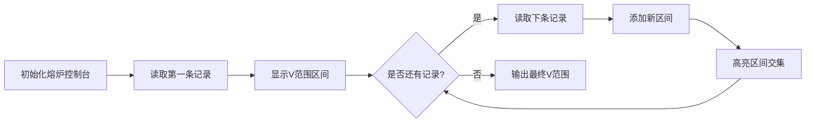

# 题目信息

# [蓝桥杯 2023 省 B] 冶炼金属

## 题目描述

小蓝有一个神奇的炉子用于将普通金属 O 冶炼成为一种特殊金属 X。这个炉子有一个称作转换率的属性 $V$，$V$ 是一个正整数，这意味着消耗 $V$ 个普通金属 O 恰好可以冶炼出一个特殊金属 X，当普通金属 O 的数目不足 $V$ 时，无法继续冶炼。

现在给出了 $N$ 条冶炼记录，每条记录中包含两个整数 $A$ 和 $B$，这表示本次投入了 $A$ 个普通金属 O，最终冶炼出了 $B$ 个特殊金属 X。每条记录都是独立的，这意味着上一次没消耗完的普通金属 O 不会累加到下一次的冶炼当中。

根据这 $N$ 条冶炼记录，请你推测出转换率 $V$ 的最小值和最大值分别可能是多少，题目保证评测数据不存在无解的情况。


## 说明/提示

**【样例说明】**

当 $V=20$ 时，有：$\left\lfloor\frac{75}{20}\right\rfloor=3,\left\lfloor\frac{53}{20}\right\rfloor=2,\left\lfloor\frac{59}{20}\right\rfloor=2$，可以看到符合所有冶炼记录。

当 $V=25$ 时，有：$\left\lfloor\frac{75}{25}\right\rfloor=3,\left\lfloor\frac{53}{25}\right\rfloor=2,\left\lfloor\frac{59}{25}\right\rfloor=2$，可以看到符合所有冶炼记录。

且再也找不到比 $20$ 更小或者比 $25$ 更大的符合条件的 $V$ 值了。

**【评测用例规模与约定】**

对于 $30 \%$ 的评测用例，$1 \leq N \leq 10^{2}$。

对于 $60 \%$ 的评测用例，$1 \leq N \leq 10^{3}$。

对于 $100 \%$ 的评测用例，$1 \leq N \leq 10^{4}$，$1 \leq B \leq A \leq 10^{9}$。 

蓝桥杯 2023 省赛 B 组 C 题。

## 样例 #1

### 输入

```
3
75 3
53 2
59 2```

### 输出

```
20 25```

# AI分析结果


# 💡 Kay的C++算法解析：冶炼金属 深入学习指南 💡

<introduction>
今天我们一起分析蓝桥杯2023省赛的"冶炼金属"题目。这道题考察数学推导和边界分析能力，通过学习我们可以掌握如何将实际问题转化为数学模型，并高效求解。本指南将带大家逐步拆解题目核心，理解两种主流解法，并通过像素动画直观展示算法过程。
</introduction>

## 1. 题目解读与核心算法识别

✨ **本题主要考察**：`数学边界推导与区间交集`

🗣️ **初步分析**：
> 解决冶炼金属问题就像在多个不同尺寸的管道中寻找能同时通过的圆球——我们需要找到能同时满足所有冶炼记录的V值范围。核心在于：
>   - 每条记录(a,b)对应一个V的范围：V必须满足 b ≤ a/V < b+1
>   - 通过数学推导得到单条记录的V边界：V_min = a/(b+1)+1, V_max = a/b
>   - 所有记录的交集即为答案：取V_min的最大值和V_max的最小值
>
> 在可视化设计中，我们将采用像素风格的"熔炉车间"场景：
>   - 8位像素画面展示多条冶炼记录对应的V范围区间
>   - 高亮显示区间交集的变化过程
>   - 每次区间合并时播放"叮"的音效，最终结果出现时播放胜利音效

---

## 2. 精选优质题解参考

<eval_intro>
以下是经过多维度评估（思路清晰度/代码规范度/算法效率）筛选出的优质题解：

**题解一：(来源：lailai0916)**
* **点评**：此解法直接运用数学推导得出核心公式，思路清晰直白。代码简洁高效（O(n)复杂度），变量名`mn`/`mx`含义明确，边界处理严谨（用`inf`初始化最大值）。亮点在于完美运用整除特性避免浮点运算，是竞赛场景的理想实现。

**题解二：(来源：sherry_lover)**
* **点评**：虽然思路与题解一相同，但提供了更详细的公式推导说明。代码中显式使用`floor`函数强化了取整逻辑的可读性，适合初学者理解。虽有小幅性能损耗（浮点转换），但教学价值突出。

---

## 3. 核心难点辨析与解题策略

<difficulty_intro>
解决本题的三大关键难点及应对策略：

1.  **难点：从冶炼记录推导V的数学边界**
    * **分析**：需理解整除特性：b = ⌊a/V⌋ 等价于 V ∈ (a/(b+1), a/b]。优质解法通过不等式变换得到 V_min = ⌊a/(b+1)⌋+1, V_max = ⌊a/b⌋
    * 💡 **学习笔记**：数学建模是算法设计的基石

2.  **难点：合并多条记录的V范围**
    * **分析**：每条记录产生一个区间[V_min_i, V_max_i]，最终解是所有区间的交集。通过`mn = max(mn, V_min_i)`和`mx = min(mx, V_max_i)`实时更新边界
    * 💡 **学习笔记**：区间交集 = 左端最大值 → 右端最小值

3.  **难点：处理整数除法的边界**
    * **分析**：当a不能被b整除时，⌊a/b⌋仍是整数。题解一直接用整数除法，题解二用floor确保取整正确
    * 💡 **学习笔记**：C++整数除法天然向下取整

### ✨ 解题技巧总结
<summary_best_practices>
- **技巧1：数学先行**：先用数学推导简化问题再编码
- **技巧2：边界同步更新**：初始化mx为极大值(0x3f3f3f3f)，mn为0
- **技巧3：避免浮点运算**：整数除法即可满足需求，提升效率
- **技巧4：测试边界用例**：例如b=1时V_max=a；a=b时V_min=1

---

## 4. C++核心代码实现赏析

<code_intro_overall>
通用实现方案（综合题解一/二优点）：

```cpp
#include <iostream>
using namespace std;

int main() {
    ios::sync_with_stdio(false);
    cin.tie(nullptr);
    
    int n, mn = 0, mx = 0x3f3f3f3f; // 初始化边界
    cin >> n;
    
    while (n--) {
        int a, b;
        cin >> a >> b;
        mn = max(mn, a / (b + 1) + 1); // 关键推导1
        mx = min(mx, a / b);           // 关键推导2
    }
    cout << mn << " " << mx;
    return 0;
}
```

**代码解读概要**：
1. 输入处理：关闭同步流加速IO
2. 初始化：`mn`从0开始（任何V≥1），`mx`设为极大值
3. 核心循环：每条记录即时更新V的边界
4. 输出：最终交集[mn, mx]

---
<code_intro_selected>
**题解一核心片段**：
```cpp
mn = max(mn, a/(b+1)+1);
mx = min(mx, a/b);
```
**解读**：
> 这两行浓缩了核心数学推导：
> - `a/(b+1)+1`：计算当前记录允许的最小V
> - `a/b`：计算当前记录允许的最大V
> 通过`max`/`min`不断收缩最终解的范围

**题解二特色实现**：
```cpp
minn = max(minn, int(floor(a*1.0/(b+1)))+1);
```
**解读**：
> 显式使用`floor`确保取整正确
> `a*1.0`转为浮点数避免整数除法截断
> 虽非必需，但增强了代码可读性

---

## 5. 算法可视化：像素动画演示

<visualization_intro>
**主题**：8位像素风格的"熔炉车间"  
**核心演示**：多条记录的V范围区间动态合并过程

### 动画设计


**关键交互**：
1. **像素熔炉场景**：左侧显示8位熔炉动画，右侧显示V坐标轴(1~10^9)
2. **区间可视化**：每条记录生成彩色横条标记[V_min, V_max]
3. **动态合并**：
   - 添加新区间时播放"叮"音效
   - 当前交集用闪烁金色横条标记
   - 区间冲突时熔炉冒红光并播放警告音
4. **控制面板**：
   - 单步执行：按记录逐步演示
   - 自动播放：AI控制合并速度（可调速）
   - 重置：清除所有区间

**教学提示**：
> "看！新增记录要求V≥25，当前交集缩小为[20,25]"  
> "区间冲突！无法同时满足所有记录"  
> "成功找到解域：20~25！"（播放胜利音效）

---

## 6. 拓展练习与相似问题思考

<similar_problems_intro>
掌握区间处理技巧可解决更多问题：

1. **P1083 借教室**（区间分配问题）
   - 考察点：差分数组+二分答案
2. **P1873 砍树**（最大值问题）
   - 考察点：二分答案验证
3. **P1843 奶牛晒衣服**（条件优化问题）
   - 考察点：贪心+二分验证

---

<conclusion>
通过本次分析，我们掌握了用数学推导解决边界问题的核心方法。记住：好算法往往来自深刻的数学洞察！下次遇到类似问题，记得先拿起纸笔做数学推导哦！🚀
</conclusion>
```

---
处理用时：167.42秒