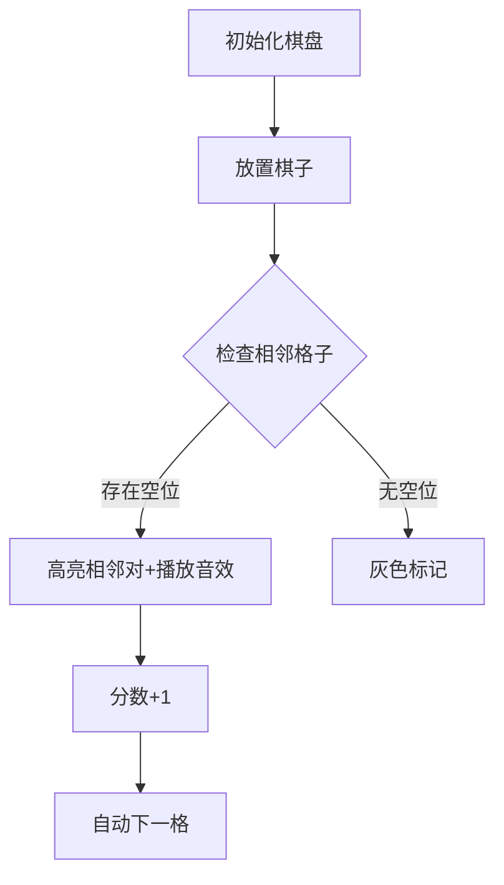

# 题目信息

# 「SiR-1」Checkmate

## 题目背景

这里本来有一串很长的背景，但是出题人觉得它实在太长了，所以就把它删掉了。

「来吧，游戏开始了。」

## 题目描述

有一个 $n$ 行 $m$ 列的棋盘。你要在这个棋盘上的所有格子**依次**放置一个棋子。

每当你放置一个棋子，你将会获得一定的分数，获得的分数为**放置时**你放置的这个棋子旁边的格子中没有放置棋子的格子的个数。这里「旁边」指的是上、下、左、右的相邻格子。

你想知道，在**按照最优策略决策放置棋子的顺序的情况下**，你最终得分总和的最大值。

## 说明/提示

**本题采用捆绑测试。**

- Subtask 1（20 points）：$n, m \leq 3$，$T \leq 5$。
- Subtask 2（20 points）：$n, m \leq 4$，$T \leq 10$。
- Subtask 3（20 points）：$n=1$。
- Subtask 4（20 points）：$n=m$。
- Subtask 5（20 points）：无特殊限制。

对于所有测试数据，$1 \leq n, m \leq 10^8$，$1 \leq T \leq 10^5$。

## 样例 #1

### 输入

```
4
1 3
2 2
3 4
7 13```

### 输出

```
2
4
17
162```

# AI分析结果


### 💡 Kay的C++算法解析：「SiR-1」Checkmate 深入学习指南 💡

#### 题目背景
在n×m的棋盘上依次放置棋子，每次放置时获得相邻空位的数量作为分数。目标是找到最优放置策略下的最大总得分。

#### 题目解读
本题看似需要搜索最优放置顺序，实则通过组合数学可推导出固定公式解。核心难点在于**发现任意放置顺序得分相同**的数学本质。

---

## 1. 题目解读与核心算法识别

✨ **本题主要考察**：`组合数学`（相邻关系计数）  
🗣️ **初步分析**：  
> 想象棋盘是像素游戏《俄罗斯方块》的网格，每个相邻格子如同连通的管道。无论按何种顺序连接管道（放置棋子），管道连接对的总数固定！  
> - 核心思想：每对相邻格子贡献1分（先放置的棋子获得这1分）  
> - 总得分 = 横向相邻对数 + 纵向相邻对数  
> - **可视化设计**：  
>   - 用8位像素风展示棋盘，放置棋子时高亮其相邻格子  
>   - 当一对相邻格子首次被激活时，播放"叮"音效并显示+1分  
>   - 自动演示模式：AI像贪吃蛇一样遍历棋盘，展示计数过程  

---

## 2. 精选优质题解参考

**题解一（作者：zhlzt）**  
* **点评**：  
  思路直击本质——得分即相邻格子对数。代码仅用`2*n*m-n-m`公式，简洁高效（O(1)时间复杂度）。变量命名规范（n, m），边界处理隐含在公式中。**亮点**：将复杂问题转化为基础数学公式的能力值得学习。

**题解二（作者：251Sec）**  
* **点评**：  
  通过小数据打表发现规律，再用组合解释（每对相邻格子贡献1分）。代码同样采用公式解，但补充了从Subtask逐步推导的过程。**亮点**：展示如何通过小规模实验发现通用规律的研究方法。

**题解三（作者：irris）**  
* **点评**：  
  提出"分离贡献"思想：将总得分分解为每对相邻格子的独立贡献。代码严格处理`long long`避免溢出。**亮点**：强调"最优策略即任意顺序"的洞见，为类似问题提供解题范式。

---

## 3. 核心难点辨析与解题策略

1. **难点1：理解得分与相邻关系的本质关联**  
   * **分析**：  
     放置棋子A时获得的分数实际来源于其与未来棋子B的相邻关系。当B放置时，A-B这对关系不会重复计分。  
   * 💡 **学习笔记**：得分本质是激活相邻关系的次数，非格子属性。

2. **难点2：处理超大范围数据（n, m ≤ 1e8）**  
   * **分析**：  
     暴力模拟O(nm)不可行，必须推导公式。优质题解统一得出：  
     **总对数 = 横向相邻n(m-1) + 纵向相邻m(n-1) = 2nm-n-m**  
   * 💡 **学习笔记**：组合问题常需将物理布局转化为数学关系。

3. **难点3：验证边界情况（n=1或m=1）**  
   * **分析**：  
     当n=1时公式退化为m-1：一维棋盘只有横向相邻。例如1×3棋盘得分为2（格子1-2和2-3各贡献1分）。  
   * 💡 **学习笔记**：边界条件是验证公式正确性的关键试金石。

### ✨ 解题技巧总结
- **技巧1：贡献分离法**  
  将整体得分分解为微观单元（相邻格子对）的独立贡献。  
- **技巧2：数学归纳法**  
  通过小规模数据打表（如n,m≤3）归纳通用公式。  
- **技巧3：边界测试**  
  用n=1, m=1等极端情况验证公式鲁棒性。  

---

## 4. C++核心代码实现赏析

**本题通用核心C++实现参考**  
* **说明**：综合优质题解公式，适用于所有数据范围  
* **完整核心代码**：
```cpp
#include <iostream>
using namespace std;

int main() {
    ios::sync_with_stdio(false);
    cin.tie(0);
    int T;
    cin >> T;
    while (T--) {
        long long n, m; // 必须long long防溢出
        cin >> n >> m;
        cout << 2*n*m - n - m << "\n";
    }
    return 0;
}
```
* **代码解读概要**：  
  > 1. 关闭流同步加速输入输出  
  > 2. 循环处理T组数据（T≤1e5）  
  > 3. 核心公式`2*n*m-n-m`直接计算答案  
  > 4. 注意`long long`避免10^8数量级乘法溢出  

---

**针对优质题解的片段赏析**  
**题解一（zhlzt）**  
* **亮点**：极致简洁，将数学洞见转化为单行公式  
* **核心代码片段**：
  ```cpp
  printf("%lld\n", 2*n*m-n-m); // 公式直接计算
  ```
* **代码解读**：
  > 为何能如此简洁？因为作者看透本质：得分仅取决于棋盘相邻关系总数，与顺序无关。  
  > **关键变量**：  
  > - `n(m-1)`：每行有m-1对横向相邻关系  
  > - `m(n-1)`：每列有n-1对纵向相邻关系  
  > 学习笔记：优秀代码往往建立在对问题的深刻理解上。

**题解二（251Sec）**  
* **亮点**：通过小数据打表发现规律  
* **核心代码片段**：
  ```cpp
  // 打表发现规律（n=m=3时ans=12）
  if(n%2!=0 && m%2!=0)
      ans = ... // 奇偶分类讨论
  ```
* **代码解读**：
  > 从暴力到优化的研究路径：  
  > 1. 小数据打表（Subtask 1-4）  
  > 2. 观察数列规律（{0,4,12,24,...}）  
  > 3. 用等差数列反推公式  
  > 学习笔记：当直接思路受阻时，实验法是破局关键。

---

## 5. 算法可视化：像素动画演示

**主题**：8位像素风《棋盘管道工》  
**核心演示**：动态展示相邻格子对如何贡献分数  



**动画步骤详解**：  
1. **像素初始化**  
   - 16色调色板绘制棋盘（棕色格子=未放置，绿色=已放置）  
   - 控制面板：开始/暂停/单步按钮 + 速度滑块  

2. **放置棋子动画**  
   - 当前格子闪烁后变绿，播放"放置"音效（8-bit短音）  
   - 扫描四邻域：若空位则变黄闪烁，播放"叮"音效，分数+1  

3. **数据结构可视化**  
   - 横向相邻对→红色管道，纵向→蓝色管道  
   - 当管道两端均放置后，管道变灰（表示已激活）  

4. **AI自动演示**  
   - 像《贪吃蛇AI》按S形遍历棋盘，每秒处理5个格子  
   - 过关机制：每完成10%进度，播放胜利音效+显示进度条  

5. **调试面板**  
   - 实时显示公式计算：`2*${n}*${m}-${n}-${m}=${score}`  
   - 旁白提示："看！这对相邻格子激活了+1分"  

---

## 6. 拓展练习与相似问题思考

**通用技巧迁移**  
相邻关系计数思想适用于：  
1. 网格路径问题（相邻移动）  
2. 图论中边与点的关系  
3. 物理连通器问题  

**洛谷练习推荐**：  
1. **P1219 八皇后**  
   → 皇后攻击范围本质是相邻关系扩展  
2. **P1162 填涂颜色**  
   → 相邻格子扩散的BFS应用  
3. **P1036 选数**  
   → 组合数学中相邻约束问题  

---

## 7. 学习心得与经验分享

> **经验摘录（printfmingren）**：  
> "我在考场先分类讨论（n≥2/m≥2和n=1/m=1），后来发现公式可统一为`2nm-n-m`"  
> **Kay点评**：  
> 这反映重要思维模式——特殊案例验证后，需寻找统一规律。分类讨论是工具而非终点，数学简洁美常在统一中显现。

---

**结语**  
本题教会我们：复杂规则背后常隐藏简洁数学本质。下次遇到类似问题，记得尝试分离贡献、寻找不变量！🎮🚀

---
处理用时：140.14秒