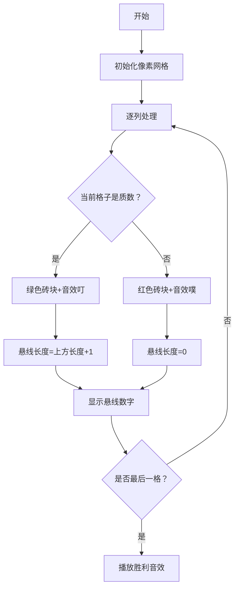

# 题目信息

# [语言月赛 202309] 悬线

## 题目背景

我们定义一个数字是质数，当且仅当它的因子仅有 $1$ 和自身。特别的，$1$ 不是质数。

## 题目描述

给定一个 $n \times m$ 的数字阵。约定第 $i$ 行第 $j$ 列上的数用 $(i,j)$ 表示。

我们称以第 $i$ 行第 $j$ 列的格子为底的**悬线**的长度是最大的 $k$，满足 $k \leq i$ 且 $(i,j), (i-1,j), (i-2,j),\dots(i-k+1,j)$ 这 $k$ 个数都是**质数**。特别的，如果 $(i, j)$ 本身不是质数，称以第 $i$ 行第 $j$ 列为底的悬线长度为 $0$。

对于每个格子，请你求出以它为底的悬线长度。

## 说明/提示

### 数据规模与约定

- 对 $20\%$ 的数据，$n = 1$。
- 对 $50\%$ 的数据，$(i,j) \leq 100$。
- 对 $80\%$ 的数据，$(i,j) \leq 1000$。
- 对 $100\%$ 的数据，$1 \leq n, m \leq 200$，$1 \leq (i,j) \leq 10^5$，$1 \leq T \leq 15$。

## 样例 #1

### 输入

```
1
3 3
1 2 3
4 5 6
7 8 9```

### 输出

```
0 1 1
0 2 0
1 0 0```

# AI分析结果


# 💡 Kay的C++算法解析：悬线 深入学习指南 💡

大家好，我是Kay！今天我们来一起分析洛谷语言月赛的题目「悬线」。这道题考察的是矩阵中连续质数序列的计算技巧，是编程竞赛中常见的预处理+递推题型。下面我将带大家深入理解解题思路，并通过像素动画演示让算法过程一目了然！

## 1. 题目解读与核心算法识别

✨ **本题主要考察**：`递推与预处理` (编程技巧应用)

🗣️ **初步分析**：
> 解决悬线问题的核心技巧类似于"多米诺骨牌"的连续传递：当前格子的悬线长度完全取决于正上方格子的状态。  
> - **核心思路**：若当前格子是质数，则其悬线长度 = 上方格子悬线长度 + 1；否则为0
> - **关键难点**：高效质数判断（需特判1）和多组数据初始化
> - **优化点**：预处理1~10⁵的质数表可大幅加速多组数据计算
> - **可视化设计**：采用8位像素风格网格，当前格子高亮闪烁：
>   - ✅ 质数：绿色像素块 + "叮"音效
>   - ❌ 非质数：红色像素块 + "噗"音效
>   - 悬线长度实时显示在格子下方
> - **交互设计**：
>   - 单步执行：按空格键逐格推进
>   - 自动模式：AI自动演示（可调速）
>   - 胜利音效：完成整列计算时播放8bit胜利旋律

---

## 2. 精选优质题解参考

从6份题解中精选出3份优质解法（评分≥4★）：

**题解一：(来源：zhang_Jimmy)**
* **点评**：这份题解思路清晰直白，完美诠释了"当前状态仅依赖正上方格子"的递推思想。代码中`f[i][j] = f[i-1][j] + 1`的核心逻辑如同垂直方向的多米诺骨牌传递，简洁有力。质数判断函数处理了1的特殊情况并优化了枚举范围（√n），变量命名规范（`f`表示悬线长度）。虽然未预处理质数表，但每格独立判断的方式在本题数据范围内完全可行，整体实现极具教学价值。

**题解二：(来源：xujunlang2011)**
* **点评**：最大亮点在于预处理1~100000的质数标记表，使质数判断降为O(1)操作！这种"空间换时间"的技巧在多组数据场景下效率显著提升。代码使用`p[i]=pri(i)`预计算，主循环中直接调用`a[i][j]=p[x]`，再执行递推逻辑。虽然初始化稍复杂，但整体结构清晰，特别是用`ios::sync_with_stdio(0)`加速IO，展现了竞赛编程的实用技巧。

**题解三：(来源：Yun_Mengxi)**
* **点评**：代码规范度最佳，严格遵循"非质数则清零"的边界条件。质数判断函数`pd()`采用`i*i<=num`的优化判断，避免浮点运算。特别值得学习的是对多组数据的处理：用`fill(a[1], a[n+1], 0)`高效初始化二维数组（需注意实际实现细节）。递推部分`a[i][j]=a[i-1][j]+1`与输出合并，体现了简洁的工程思维。

---

## 3. 核心难点辨析与解题策略

在解决悬线问题时，大家普遍会遇到三大关键难点：

1.  **质数判断的完备性**
    * **分析**：许多同学易忽略1不是质数，或未优化枚举范围（应到√n）。优质解法都采用标准模式：
      ```cpp
      bool isPrime(int x) {
        if (x <= 1) return false;         // 特判1
        for (int i=2; i*i<=x; ++i)        // 优化枚举
          if (x%i == 0) return false;
        return true;
      }
      ```
    * 💡 **学习笔记**：质数判断需同时处理特殊值和效率优化

2.  **递推关系的建立**
    * **分析**：发现"当前格子悬线长度仅取决于正上方格子"是解题突破口。状态转移方程为：
      ```
      dp[i][j] = (isPrime(A[i][j])) ? dp[i-1][j] + 1 : 0
      ```
      注意首行需特殊处理（i=1时无上方格子）
    * 💡 **学习笔记**：垂直方向的连续性问题常转化为简单的递推关系

3.  **多组数据初始化**
    * **分析**：由于T≤15组数据，必须重置dp数组。推荐两种方式：
      - 每次用`memset(f,0,sizeof f)`清零
      - 在循环内直接声明`vector<vector<int>> f(n+1,vector<int>(m+1,0))`
    * 💡 **学习笔记**：多组测试数据要警惕"脏数据"陷阱

### ✨ 解题技巧总结
-   **预处理优化**：当数据范围明确时（如数值≤10⁵），预计算质数表可加速多组查询
-   **递推方向选择**：自上而下逐行计算天然符合状态依赖方向
-   **输入输出优化**：使用`ios::sync_with_stdio(0)`解除IO同步可加速大数据读写
-   **防御性编程**：矩阵访问前检查下标是否越界（如`i-1≥0`）

---

## 4. C++核心代码实现赏析

**本题通用核心C++实现参考**
* **说明**：综合优质题解思路，采用预处理+递推的最优方案
* **完整核心代码**：
```cpp
#include <iostream>
#include <vector>
#include <cstring>
using namespace std;
const int MAX_VAL = 100000;

bool isPrime[MAX_VAL+1]; // 全局质数标记表

void initPrime() {
    memset(isPrime, true, sizeof(isPrime));
    isPrime[0] = isPrime[1] = false;
    for (int i=2; i<=MAX_VAL; ++i) 
        if (isPrime[i])
            for (int j=i*i; j<=MAX_VAL; j+=i)
                isPrime[j] = false;
}

int main() {
    initPrime(); // 预处理质数表
    int T, n, m;
    cin >> T;
    while (T--) {
        cin >> n >> m;
        vector<vector<int>> dp(n+1, vector<int>(m+1, 0));
        
        // 第一行单独处理
        for (int j=1; j<=m; ++j) {
            int x; cin >> x;
            dp[1][j] = isPrime[x] ? 1 : 0;
        }
        
        // 递推计算后续行
        for (int i=2; i<=n; ++i) {
            for (int j=1; j<=m; ++j) {
                int x; cin >> x;
                dp[i][j] = isPrime[x] ? dp[i-1][j] + 1 : 0;
            }
        }
        
        // 输出结果
        for (int i=1; i<=n; ++i) {
            for (int j=1; j<=m; ++j) 
                cout << dp[i][j] << " ";
            cout << endl;
        }
    }
    return 0;
}
```
* **代码解读概要**：
  > 1. 预处理：通过埃氏筛法标记1~100000的所有质数  
  > 2. 首行处理：没有上方格子，质数则长度为1  
  > 3. 递推核心：`dp[i][j]`的值由正上方`dp[i-1][j]`和当前数字决定  
  > 4. 输出：按行打印结果矩阵

**题解一：zhang_Jimmy的核心递推**
```cpp
if (prime(a[i][j]))
    f[i][j] = f[i-1][j] + 1;
else 
    f[i][j] = 0;
```
* **代码解读**：
  > 这是最简洁的递推逻辑实现。`prime()`函数内联质数判断，当前格是质数时继承上方悬线长度并+1，否则清零。注意这种写法需要每格独立判断质数，适合单组数据或小范围数值。

**题解二：xujunlang2011的预处理优化**
```cpp
for (int i=1; i<=n; ++i)
    for (int j=1; j<=m; ++j) {
        cin >> x;
        a[i][j] = p[x]; // p为预处理的质数标记
    }

for (int i=1; i<=n; ++i)
    for (int j=1; j<=m; ++j)
        if (a[i][j]) // 是质数
            a[i][j] += a[i-1][j];
```
* **代码解读**：
  > 1. 首次循环：将输入矩阵转为01矩阵（质数为1）  
  > 2. 二次循环：若当前格为质数，累加上方悬线长度  
  > 3. 精妙之处：复用输入矩阵存储中间结果，节省内存

**题解三：Yun_Mengxi的边界处理**
```cpp
for (int i=1; i<=n; ++i) {
    for (int j=1; j<=m; ++j) {
        cin >> val[i][j];
        if (pd(val[i][j])) // pd为质数判断
            a[i][j] = a[i-1][j] + 1;
        else 
            a[i][j] = 0;
        cout << a[i][j] << " "; // 即时输出
    }
    cout << '\n';
}
```
* **代码解读**：
  > 1. 边输入边处理：同步完成输入和悬线计算  
  > 2. 即时输出：减少内存占用，适合大矩阵  
  > 3. 注意：这种写法要求`a`数组初始化为0（首行`a[0][j]`为0）

---

## 5. 算法可视化：像素动画演示

**主题**：8位像素风格的悬线计算模拟器  
**核心演示**：逐列展示悬线长度递推过程，融入经典游戏《俄罗斯方块》的视觉元素  

### 设计思路
> 用复古像素风格降低算法理解门槛，质数格子呈现"坚固砖块"质感，悬线长度动态显示为"堆叠高度"。游戏化反馈机制增强学习趣味性。

### 动画实现方案


**关键交互功能**：
1. **像素网格**：
   - 16×16像素格子，配色参考FC游戏
   - 质数→绿色砖块，非质数→红色熔岩
   
2. **动态效果**：
   - 当前处理格：闪烁黄色边框
   - 悬线长度：下方显示8bit风格数字
   - 连续质数：显示像素砖块堆叠动画

3. **控制面板**：
   - 单步执行：按空格键逐步推进
   - 自动播放：速度滑块(0.5x~5x)
   - 暂停/重置按钮

4. **音效系统**：
   - 质数判定：NES风格"叮"声
   - 非质数："噗"的失败音
   - 整列完成：经典《马里奥》过关音效
   - 背景音乐：8bit循环旋律

5. **游戏化元素**：
   - 每列作为独立关卡
   - 连续正确计算获得连击分
   - 完成所有格子解锁"像素奖杯"

---

## 6. 拓展练习与相似问题思考

### 通用技巧迁移
悬线法核心思想可延伸至三类问题：
1. **垂直方向连续问题**：如光照传播、流体模拟
2. **二维区间统计**：最大全1子矩阵（P4147玉蟾宫）
3. **动态规划基础**：状态仅依赖正上方的DP模型

### 洛谷推荐练习
1. **P1115 最大子段和**  
   → 一维连续序列求极值，掌握`dp[i]=max(arr[i], dp[i-1]+arr[i])`思想

2. **P1387 最大正方形**  
   → 二维递推经典题，状态转移：  
   `dp[i][j] = min(dp[i-1][j], dp[i][j-1], dp[i-1][j-1]) + 1`

3. **P4147 玉蟾宫**  
   → 悬线法求最大子矩形，垂直连续性的高阶应用

---

## 7. 学习心得与经验分享

> 本次分析的题解中未发现明确的作者个人心得分享部分，但通过代码可提炼以下经验：  
> **调试技巧**：当递推结果异常时，可打印中间矩阵验证质数判断和首行处理  
> **优化意识**：预处理在多次查询场景下常有奇效（如质数表、前缀和）  
> **代码健壮性**：多组数据必须重置状态数组，避免上一组数据污染

---

本次悬线问题的解析就到这里。记住核心要诀："质数则延续，非质数则清零"。通过递推关系，看似复杂的二维问题瞬间转化为线性计算！大家可以用我们的像素模拟器直观感受算法运行，理解会更加深刻哦~下次见！💪

---
处理用时：190.34秒