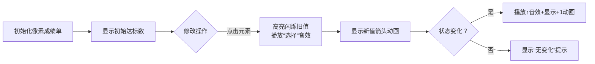

# 题目信息

# [语言月赛 202403] 数数，数数，数数

## 题目背景

请读出题目名称。

## 题目描述

我们的 szm 喜欢大数，她有一个数组 $a$，她还要你进行 $q$ 次操作。

对于第 $i$ 次操作，你需要将数组 $a$ 中的第 $x_i$ 个数修改为 $y_i$。

完成所有操作后，她需要你输出数组中大于等于 $V$ 的数的个数。

## 说明/提示

### 数据规模与约定

对于 $30\%$ 的数据，$q=0$。  
对于另外 $30\%$ 的数据，$V=0$。  
对于 $100\%$ 的数据，$1 \leq n \leq 10^5$，$0 \leq q \leq 10^5$，$1\leq x_i \leq n$，输入的所有数字都为整数，且都不超过 C++ 中 $64$ 位有符号整数可表示的范围。

## 样例 #1

### 输入

```
3 3
6
7 1 6
1 5
3 5
2 6
```

### 输出

```
1
```

# AI分析结果


### 💡 Kay的C++算法解析：[语言月赛 202403] 数数，数数，数数 深入学习指南 💡  
**引言**  
今天我们一起分析这道考察数组动态维护的题目。通过本指南，你将掌握高效统计数组元素的技巧，并直观理解增量更新的核心思想。

---

## 1. 题目解读与核心算法识别  
✨ **本题主要考察**：`编程技巧应用（增量统计维护）`  

🗣️ **初步分析**：  
> 本题核心如同动态更新班级成绩单：当某个学生分数被修改时，我们无需重新统计全班达标人数，只需根据**旧值**和**新值**与分数线（V）的关系调整计数。  
> - **题解对比**：RyanLi的解法通过增量更新实现O(1)单次操作（高效）；chen_zhe的解法每次全扫描数组导致O(nq)复杂度（不适用大数据）。  
> - **可视化设计**：  
>   ① 像素化成绩单界面展示数组元素（绿色≥V/红色<V）  
>   ② 修改元素时高亮闪烁，显示旧值→新值变化箭头  
>   ③ 计数变化时播放音效（+1: 上升音效/-1: 下降音效）  
>   ④ 控制面板支持单步调试和自动演示（复古8-bit音效）

---

## 2. 精选优质题解参考  
**题解一（作者：RyanLi）**  
* **点评**：  
  思路清晰度 ⭐⭐⭐⭐⭐  
  → 提出增量维护思想，避免低效全扫描  
  代码规范性 ⭐⭐⭐⭐  
  → 变量名`ans`/`a[x]`含义明确，布尔表达式简化计数逻辑  
  算法有效性 ⭐⭐⭐⭐⭐  
  → O(1)时间复杂度完成每次修改，完美匹配10⁵数据规模  
  实践价值 ⭐⭐⭐⭐  
  → 可直接用于竞赛，边界处理严谨（注意旧值状态判断）  
  **亮点**：利用布尔表达式隐式转整型（`ans += a[x]<v && y>=v`）大幅简化代码。

---

## 3. 核心难点辨析与解题策略  
1. **难点：动态维护统计值**  
   * **分析**：每次修改需同步更新计数。优质解法通过记录初始达标数，仅关注被修改元素的状态变化（旧值≥V→新值<V则减1，反之加1）  
   💡 **学习笔记**：避免重复计算的关键是关注**变化量**而非整体。  

2. **难点：数据范围与类型选择**  
   * **分析**：输入可能超过int范围，必须使用`long long`存储数组和V值。题解中`long long a[100005]`确保数值安全。  
   💡 **学习笔记**：数据规模隐含变量类型要求（10⁵ → long long）。  

3. **难点：状态转换逻辑**  
   * **分析**：需严格处理四种状态转换（达标→达标/不达标→不达标/达标→不达标/不达标→达标），仅后两种影响计数。  
   💡 **学习笔记**：用真值表梳理状态迁移避免遗漏。  

### ✨ 解题技巧总结  
- **技巧1：增量维护** → 只更新受影响的部分而非整体  
- **技巧2：布尔值算术化** → `true`转1/`false`转0简化计数  
- **技巧3：防御性编程** → 数组大小开100005防越界  

---

## 4. C++核心代码实现赏析  
**通用核心实现**  
```cpp
#include <iostream>
using namespace std;
const int MAXN = 100005;
long long a[MAXN];  // 存储数组元素

int main() {
    int n, q;
    long long V, ans = 0;
    cin >> n >> q >> V;
    
    // 初始统计
    for (int i = 1; i <= n; ++i) {
        cin >> a[i];
        ans += (a[i] >= V);  // 布尔值转整数
    }
    
    // 处理修改
    while (q--) {
        int x; long long y;
        cin >> x >> y;
        // 状态变化判断
        ans += (a[x] < V && y >= V);
        ans -= (a[x] >= V && y < V);
        a[x] = y;  // 更新数组
    }
    cout << ans;
    return 0;
}
```
**代码解读概要**：  
① 读入时直接计算初始达标数（第12行）  
② 修改时通过布尔运算调整`ans`（第18-19行）  
③ 严格同步更新数组值（第20行）  

**题解一（RyanLi）核心片段赏析**  
```cpp
ans += a[x] < v && y >= v;  // 从不达标变为达标
ans -= a[x] >= v && y < v;  // 从达标变为不达标
a[x] = y;                   // 更新数组
```
**代码解读**：  
> - **第1行**：当旧值(`a[x]`)小于V且新值(`y`)≥V时，`a[x]<v && y>=v`返回`true`(即1)，`ans`增加1  
> - **第2行**：旧值≥V且新值<V时返回`true`，`ans`减少1  
> - **第3行**：必须更新数组值，否则下次修改会使用旧值  
> 💡 **学习笔记**：利用编译器自动将布尔值转为整型是C++高效编程技巧。

---

## 5. 算法可视化：像素动画演示  
**主题**：8-bit教室成绩单动态统计  

**核心演示流程**：  


**关键交互设计**：  
1. **视觉标记**：  
   - ≥V：绿色像素块（■）  
   - <V：红色像素块（□）  
   - 当前修改：黄色闪烁边框  
2. **音效系统**：  
   - 计数增加：8-bit上升音阶(do→mi→sol)  
   - 计数减少：下降音阶(sol→mi→do)  
   - 无变化：短促“滴”声  
3. **控制面板**：  
   - 调速滑块：控制自动演示速度  
   - 单步按钮：空格键触发下一步  
   - 重置：重新加载初始数据  

---

## 6. 拓展练习与相似问题思考  
**技巧迁移场景**：  
1. 动态维护前K大元素（堆+增量更新）  
2. 实时统计区间满足条件元素数（树状数组）  
3. 流式数据频率统计（哈希表+计数器）  

**洛谷推荐**：  
1. **P3374 树状数组模板**  
   → 掌握高效动态维护前缀和  
2. **P1908 逆序对**  
   → 练习增量思想在归并排序中的应用  
3. **P1047 校门外的树**  
   → 强化区间标记与统计技巧  

---

## 7. 学习心得与经验分享  
**作者经验（RyanLi）**：  
> “初始实现忘记更新`a[x]=y`，导致后续操作使用旧值——必须保证数据一致性！”  

**Kay点评**：  
> 调试时关注**数据同步**：  
> ① 修改数组值后立即更新  
> ② 用`assert(a[x]==y)`验证一致性  
> ③ 边界测试：V=0/最大值/负数  

---

**结语**  
掌握增量维护技巧能大幅提升数组处理效率！试着用可视化工具观察数据变化，你会更深刻理解“避免重复计算”的精髓。下次挑战见！🚀

---
处理用时：97.18秒